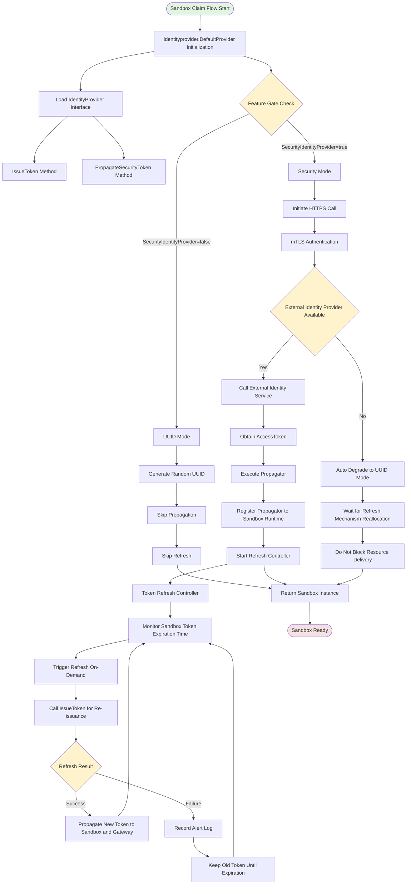
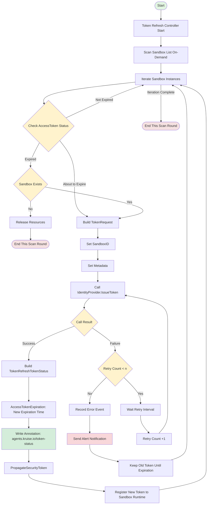

# Sandbox Gateway Identity Provider

| Metadata | Details |
|----------|---------|
| **Author** | jicheng.sk <jicheng.sk@alibaba-inc.com> |
| **Status** | Implementable |
| **Created** | 2026-04-27 |
| **Updated** | 2026-04-27 |
| **Feature Gate** | `SecurityIdentityProvider` (Alpha, disabled by default) |

## Table of Contents

- [Summary](#summary)
- [Motivation](#motivation)
  - [Goals](#goals)
- [Proposal](#proposal)
  - [User Stories](#user-stories)
  - [Architecture Overview](#architecture-overview)
  - [API Design](#api-design)
    - [Core Interfaces](#1-core-interfaces)
    - [Data Structures](#2-data-structures)
    - [Feature Gate](#3-feature-gate)
  - [Implementation Details](#implementation-details)
    - [Integration with Sandbox Claim Flow](#1-integration-with-sandbox-claim-flow)
    - [Token Refresh Controller Design](#2-token-refresh-controller-design)
      - [Applicable Scenarios](#21-applicable-scenarios)
      - [Controller Responsibilities](#22-controller-responsibilities)
      - [Refresh Trigger Timing](#23-refresh-trigger-timing)
      - [Refresh Strategies for Different Scenarios](#24-refresh-strategies-for-different-scenarios)
      - [Refresh Flow](#25-refresh-flow)

## Summary

This proposal introduces a pluggable **Gateway Identity Provider** framework for OpenKruise Agents, providing identity-aware access token issuance and credential replacement capabilities when Sandboxes access services through gateways. This framework is a generic gateway identity management solution applicable to both Ingress and Egress scenarios, with **current priority on solving Egress identity authentication needs**: when a Sandbox needs to access external services, the system obtains security tokens bound to the Sandbox/Agent from an external identity service and performs credential replacement at the gateway layer, enabling identity-based access control and audit tracing. The design simultaneously supports community default mode (UUID-based simple isolation) and enterprise security mode (HTTPS token issuance, mTLS authentication, and automatic credential propagation).

## Motivation

OpenKruise Agents manages AI Agent Sandbox workloads on Kubernetes, providing isolated execution environments. When Sandboxes need to access services through gateways (including both ingress and egress gateways), the current implementation uses random UUIDs as access tokens. While this provides basic isolation capabilities, it has the following shortcomings:

1. **Lack of Identity Awareness**: Gateway access tokens cannot be bound to specific Agents, Sandboxes, or Principals. The default UUID implementation lacks entity semantics and cannot implement identity-based access control.
2. **Missing Credential Lifecycle Management**: Does not support token expiration, refresh, or revocation. Once a Sandbox is created, the token lifecycle cannot be managed, preventing audit tracing and fine-grained access control.
3. **Missing Credential Propagation Mechanism**: Cannot securely propagate issued identity tokens to the gateway layer, preventing credential replacement at the gateway.
4. **Missing Automatic Token Refresh Mechanism**: Token expiration requires manual intervention for updates, unable to achieve seamless token renewal, affecting service access for long-running Sandboxes.
5. **Insufficient Scalability**: Random UUID generation cannot meet enterprise-level security requirements. Support for external identity service providers is needed to enable identity-based service access.

**Current Priority**: This proposal first addresses the identity authentication needs for **Egress** scenarios, i.e., identity issuance and credential replacement when Sandboxes access external services. The framework is designed as a generic solution that can be extended to Ingress scenarios in the future.

### Goals

- Provide pluggable identity provider interfaces for identity-based token issuance for Sandbox gateway access (supporting both UUID default mode and HTTPS enterprise security mode)
- Support secure propagation after token issuance, writing identity credentials to Sandbox runtime and synchronizing to the gateway layer
- Support secure communication with external identity providers using mTLS authentication
- Implement automatic degradation mechanism: when external identity providers are unavailable, automatically fall back to UUID tokens and wait for token timeout before reallocation by the refresh mechanism, without blocking Sandbox resource delivery
- Introduce feature gate `SecurityIdentityProvider` to control feature enablement, ensuring on-demand loading
- Implement automatic credential refresh controller for on-demand AccessToken renewal, preventing long-running Sandboxes from losing gateway service access due to token expiration
- Maintain backward compatibility: community deployments can continue using simple UUID token mode without any configuration changes
- Provide unified interface definition specifications, allowing external identity provider services to implement concrete logic based on the interface definitions


## Proposal

### User Stories

This section illustrates the practical application value of the Gateway Identity Provider feature through typical user scenarios. Current priority supports Egress scenarios:

| Scenario | Role | Requirements | Core Benefits |
|----------|------|--------------|---------------|
| **Enterprise Security Compliance** | Platform Operators | When Sandboxes access services through gateways, centralized identity services issue identity tokens bound to Agent/Sandbox | Enable audit tracing and fine-grained access control for gateway access |
| **Automatic Credential Replacement** | Sandbox Users | Identity tokens are automatically written to Sandbox runtime and synchronized to gateway layer, allowing Agent applications to access services through gateways without manual configuration | Simplify usage flow through automatic credential replacement after identity authentication |
| **Graceful Degradation** | Platform Operators | When external identity providers fail, the system automatically degrades to UUID tokens | Sandbox creation flow is not blocked, ensuring sandbox resource delivery availability |

### Architecture Overview

The Gateway Identity Provider framework consists of the following components:



### API Design

#### 1. Core Interfaces

**IdentityProvider** (Unified Interface):

```go
type IdentityProvider interface {
    // IssueToken generates/refreshes access tokens for the given token request (for gateway identity authentication)
    IssueToken(ctx context.Context, req TokenRequest) (*TokenResponse, error)
	
    // PropagateSecurityToken performs post-processing operations after token issuance (propagate to Sandbox runtime and gateway)
    PropagateSecurityToken(ctx context.Context, sbx *agentsv1alpha1.Sandbox, tokenResp *TokenResponse) error
}
```

**TokenProvider** (Underlying Token Issuance/Refresh Interface):

Token refresh operations are equivalent to token re-issuance operations, so both interfaces remain consistent.

```go
type TokenProvider interface {
    IssueToken(ctx context.Context, req TokenRequest) (*TokenResponse, error)
}
```

**SecurityTokenPropagator** (Token Post-Processing Propagator):

```go
type SecurityTokenPropagator func(ctx context.Context, sbx *agentsv1alpha1.Sandbox, tokenResp *TokenResponse) error
```

#### 2. Data Structures

**TokenRequest** (Token Request):

```go
type TokenRequest struct {
    TokenType TokenType            `json:"tokenType"`           // "Principle" or "Agent"
    Principal *PrincipalInfo       `json:"principal,omitempty"` // Required when TokenType is "Principle"
    Sandbox   *SandboxInfo         `json:"sandbox,omitempty"`   // Sandbox workload metadata
    Metadata  map[string]string    `json:"metadata,omitempty"`  // Additional key-value pairs
}
```

**TokenResponse** (Token Response):

```go
type TokenResponse struct {
    RequestID              string `json:"requestId"`
    AccessToken            string `json:"accessToken"`
    SandboxClientID        string `json:"sandboxClientId,omitempty"`
    AccessTokenExpiration  string `json:"accessTokenExpiration,omitempty"`
}
```

**TokenRefreshTokenStatus** (Token Refresh Status):

Used to record in Sandbox Annotations to track token refresh execution status and results.

```go
type TokenRefreshTokenStatus struct {
    // AccessTokenExpiration is the expiration time of the refreshed access token in RFC3339 format
    AccessTokenExpiration string `json:"accessTokenExpiration,omitempty"`
}
```

**Annotation Key Definition**:

```go
// AnnotationKeyTokenRefreshStatus is the Sandbox Annotation Key,
// used to store the JSON serialized result of TokenRefreshTokenStatus
const AnnotationKeyTokenRefreshStatus = "agents.kruise.io/token-status"
```

Annotation Value Example:
```json
{
  "accessTokenExpiration": "2026-05-09T12:00:00Z"
}
```

**Note**: This Annotation only records the token expiration time. If the field is not updated after reaching the time marked by `accessTokenExpiration`, it indicates that token refresh has failed; under normal circumstances, this field should continuously remain in a future valid time range, continuously updated by the refresh controller.

#### 3. Feature Gate

```go
// SecurityIdentityProviderGate enables issuing Sandbox access tokens through external identity provider services,
// replacing random UUID generation
SecurityIdentityProviderGate featuregate.Feature = "SecurityIdentityProvider"
```

Default value: `false` (Alpha stage)


### Implementation Details

#### 1. Integration with Sandbox Claim Flow

The security token flow is integrated into `TryClaimSandbox()`:

```
Step 1: Select an available Sandbox
   │
   ▼
Step 1.5: Issue Security Token (if feature gate is enabled and token type is UUID)
   │  - Call identityprovider.DefaultProvider.IssueToken()
   │  - Success: Upgrade access token to identity_provider type
   │  - Failure: Keep original UUID token (degraded), wait for refresh mechanism reallocation, 
   │             do not block Sandbox resource delivery flow.
   │
   ▼
Step 2: Modify and Lock Sandbox
   │
   ▼
Step 3: Wait for Sandbox Ready
   │
   ▼
Step 4: Initialize Runtime (using upgraded access token)
   │
   ▼
Step 5: Propagate Security Token (optional, if successfully issued)
   │  - Call identityprovider.DefaultProvider.PropagateSecurityToken()
   │  - Execute all registered propagators (e.g., register credential files)
   │
   ▼
Return Claimed Sandbox
```

#### 2. Token Refresh Controller Design

**2.1 Applicable Scenarios**

The Token refresh mechanism is not only applicable to the Sandbox Claim flow, but also needs to cover all scenarios involving token lifecycle management:

| Scenario | Description | Token Refresh Requirement |
|----------|-------------|---------------------------|
| **Claim Flow** | Normal operation phase after user claims Sandbox | Refresh AccessToken on-demand to prevent long-running Sandboxes from gateway service interruption due to token expiration |
| **Resume from Hibernation** | Sandbox resumes from hibernation state | Check token validity after wake-up, immediately refresh if expired or about to expire |
| **Clone after Checkpoint** | Create new Sandbox from Checkpoint clone | Newly cloned Sandbox needs independent security token, requires re-issuance or refresh |
| **Container Restart Recovery** | Container recovers after CrashLoopBackOff, etc. | Check token validity after restart, immediately refresh if expired or about to expire, ensuring container can access normally after recovery |

**2.2 Controller Responsibilities**

The Token refresh controller runs in sandbox-controller, responsible for managing the lifecycle of issued tokens, with main responsibilities including:

- **Monitor Token Expiration Time**: Monitor the `AccessTokenExpiration` field of Sandbox objects
- **Trigger Refresh On-Demand**: Automatically trigger refresh operations before AccessToken expiration (default: advance by certain time), token validity period defaults to 24 hours
- **Call Refresh API**: Use IssueToken interface to call external identity provider's token issuance interface,实现 token reallocation (refresh and issuance use the same interface)
- **Propagate New Tokens**: After successful refresh, propagate new TokenResponse to Sandbox runtime or other components that need to consume tokens
- **Error Handling and Retry**: Retry on refresh failure, keep old token until expiration
- **Alert Notification**: Record alert logs on refresh failure or impending expiration
- **Scenario Adaptation**: Adopt corresponding refresh strategies for different scenarios (Claim/Resume/Clone)

**2.3 Refresh Trigger Timing**

The controller triggers refresh based on the following strategies:

1. **Scanning Mechanism**: Scan all Sandboxes requiring refresh at fixed intervals or on-demand
2. **Pre-Expiration Refresh**: Trigger refresh before `AccessTokenExpiration` (default: advance by certain time, token validity defaults to 24 hours)
3. **Refresh Window**: Execute refresh before `AccessTokenExpiration`; if Sandbox instance still exists after expiration, continue attempting refresh until Sandbox resources are released

**2.4 Refresh Strategies for Different Scenarios**

| Scenario | Trigger Timing | Refresh Strategy |
|----------|----------------|------------------|
| **Claim Flow** | On-demand scan + pre-expiration refresh | Standard refresh flow, advance by certain time |
| **Resume from Hibernation** | Sandbox state transitions from Pause to Running | Immediately check token validity, immediately refresh if remaining validity < 50% |
| **Checkpoint Clone** | After new Sandbox creation | Re-issue token for new Sandbox |
| **Container Restart Recovery** | Container state transitions from CrashLoopBackOff/Error to Running | Immediately check token validity after restart, immediately refresh if remaining validity < 50% or expired, ensuring container can access external services normally after recovery |

**2.5 Refresh Flow**:


