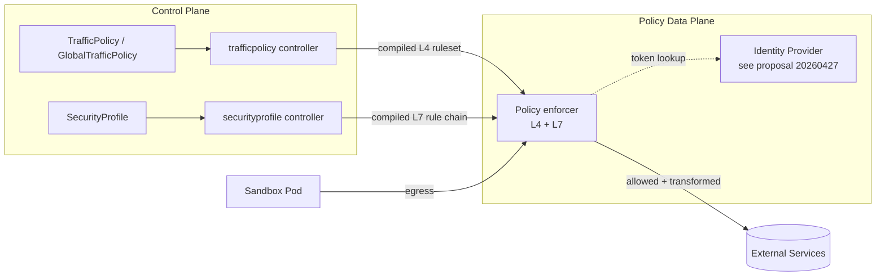

# TrafficPolicy and SecurityProfile for Sandbox L4/L7 Egress Control

| Metadata         | Details                                             |
|------------------|-----------------------------------------------------|
| **Author**       | @l1b0k                                              |
| **Status**       | Provisional                                         |
| **Created**      | 2026-05-21                                          |
| **Updated**      | 2026-05-21                                          |
| **Feature Gate** | `SandboxNetworkPolicy` (Alpha, disabled by default) |

## Table of Contents

- [Glossary](#glossary)
- [Summary](#summary)
- [Motivation](#motivation)
    - [Goals](#goals)
    - [Non-Goals / Future Work](#non-goals--future-work)
- [Proposal](#proposal)
    - [User Stories](#user-stories)
    - [Architecture Overview](#architecture-overview)
    - [API Design](#api-design)
        - [TrafficPolicy / GlobalTrafficPolicy (L3/L4)](#trafficpolicy--globaltrafficpolicy-l3l4)
        - [SecurityProfile (L7)](#securityprofile-l7)
        - [Feature Gate](#feature-gate)
    - [Relationship with Existing CRDs](#relationship-with-existing-crds)
    - [Implementation Details](#implementation-details)
        - [Selector Semantics](#selector-semantics)
        - [Rule Evaluation Order and Conflict Resolution](#rule-evaluation-order-and-conflict-resolution)
        - [L4 Data Plane](#l4-data-plane)
        - [L7 Data Plane](#l7-data-plane)
        - [Status Reporting](#status-reporting)
    - [Risks and Mitigations](#risks-and-mitigations)
- [Alternatives](#alternatives)
- [Upgrade Strategy](#upgrade-strategy)
- [Test Plan](#test-plan)
- [Implementation History](#implementation-history)

## Glossary

- **Sandbox**: a single agent-sandbox instance, pod-backed (CRD `Sandbox`).
- **SandboxSet / SandboxClaim**: pool/claim CRDs already defined in the project.
- **L4 policy**: protocol/IP/port-level allow-deny rules, enforced before the L7 stack.
- **L7 policy**: HTTP-aware rules (host/path/method/headers) plus actions
  (block, identity injection, token transformation, mirroring, rate limit, forwarding).
- **Policy data plane**: the component(s) that enforce TrafficPolicy and
  SecurityProfile decisions on real sandbox traffic. The concrete
  deployment topology is intentionally not fixed by this proposal.
- **Identity Provider**: the framework introduced by
  `20260427-security-identity-provider.md` that issues per-Sandbox identity tokens.
- **IPSet** *(optional implementation concept)*: a named set of IP addresses
  (CIDRs) some data planes use as the compiled form of a non-literal peer
  (`Service`, `Workload`, `FQDN`). Whether an implementation goes through an
  IPSet abstraction at all — and what backend it uses (kernel `ipset`, eBPF
  map, xDS endpoint cluster, etc.) — is a data-plane choice; another
  implementation may evaluate peers directly without ever materializing them
  into a set. The CRD does not mandate IPSet usage; it only reserves status
  fields so that data planes which DO use this abstraction can surface it
  for diagnosability. When the controller uses IPSet, contents are refreshed
  whenever the underlying source changes (Service endpoints, Workload pod
  IPs, FQDN resolution).

## Summary

This proposal first defines the API contract for sandbox traffic governance in
OpenKruise Agents. The initial scope is CRD declaration and validation; concrete
controllers and data-plane enforcement are described as follow-up integration
work so the API can be reviewed independently.

The proposal introduces two new CRD families that give operators a structured,
policy-driven way to declare sandbox egress requirements at both the network
layer and the application layer:

1. **`TrafficPolicy`** (Namespaced) and **`GlobalTrafficPolicy`** (Cluster-scoped)
   — bidirectional L3/L4 rules selected by pod label selector. Supports
   CIDR / FQDN / Service / Workload peers, allow/deny actions, and
   protocol/port restrictions. The cluster-scoped variant carries
   organization-wide guardrails (e.g. "no Sandbox may reach 169.254.169.254").
2. **`SecurityProfile`** (Namespaced only) — L7 (HTTP) rule chain attached to
   selected sandbox pods. In later phases, these rules are compiled into
   data-plane configuration for L7 interception. Each rule produces one or
   more actions: terminal (`block` / `bypass` / `forwarding`) or non-terminal
   (`tokenTransformation` / `identityInjection` / `securityCheck` /
   `mirroring` / `rateLimit`).

Together they form the desired "what is allowed to leave a sandbox, and how"
surface, complementing the existing `SandboxClaim`-time identity-token issuance
flow. The L7 actions explicitly reuse the `SecurityIdentityProvider` framework
for token sourcing so the two proposals compose cleanly.

## Motivation

OpenKruise Agents currently offers no first-class API for declaring what an
agent sandbox is allowed to talk to. Operators today work around this with:

- An ad-hoc `RuntimeConfig` named `egress-control` injected into Sandboxes
  (see `api/v1alpha1/sandbox_types.go`), which is opaque, untyped, and per-pod.
- Plain `NetworkPolicy`, which is L3/L4 only, has no FQDN concept, and cannot
  attach behaviour (rate-limit, identity injection, mirroring) to the same
  rule that decides allow/deny.
- The new gateway identity-provider flow, which knows how to *mint* a token
  but has no surface for operators to say *which requests should carry it*,
  *which should be blocked*, or *which should be mirrored to a SOC*.

Agent workloads in particular have stricter egress requirements than general
pods: they execute LLM-generated tool calls, and their target hosts are often
unbounded. Operators need:

- **Compliance**: a declarative way to allowlist outbound destinations
  (egress allowlist, `*.openai.com` only, etc.).
- **Observability**: stamp every outbound call with sandbox identity headers
  and optionally mirror to a security collector.
- **Cost control**: per-host/per-method rate limits.
- **Multi-tenancy guardrails**: cluster-wide rules the platform enforces even
  if a tenant author misconfigures their own profile.

### Goals

- Provide a typed, namespaced `TrafficPolicy` CRD selecting Sandbox pods by
  label selector, supporting bidirectional ingress/egress L3/L4 rules over
  CIDR / FQDN / Service / Workload peers.
- Provide a cluster-scoped `GlobalTrafficPolicy` CRD with the same `Spec` for
  platform-wide L3/L4 guardrails. Evaluation order is determined by rule
  `priority`, not by object scope.
- Provide a typed, namespaced `SecurityProfile` CRD selecting Sandbox pods by
  label selector, expressing an ordered HTTP rule chain with terminal and
  non-terminal actions enforced by the policy data plane in later phases.
- Cleanly compose with `20260427-security-identity-provider.md`:
  `SecurityProfile` actions like `identityInjection` and `tokenTransformation`
  consume tokens issued by the identity-provider framework, not their own
  parallel mechanism.
- Default-off behind feature gate `SandboxNetworkPolicy`; existing clusters
  see no behavioural change after upgrade.
- Keep the first phase focused on API declaration and schema validation;
  data-plane enforcement is described as follow-up implementation work.

### Non-Goals / Future Work

- A cluster-scoped `GlobalSecurityProfile` is **out of scope for this round**.
  Only `TrafficPolicy` ships a global variant; if cross-namespace L7 controls
  become necessary later they can be added as a follow-up CRD.
- Replacing or wrapping standard `NetworkPolicy` — `TrafficPolicy` is
  additive; `NetworkPolicy` continues to apply where users use it.
- Mutual-TLS termination for sandbox-internal traffic (covered by separate work).
- Egress traffic shaping / bandwidth control beyond request-rate limiting.
- Implementing the concrete controller or L4/L7 data-plane enforcement in
  the first CRD-only phase. Those are follow-up implementation phases based
  on this API.

## Proposal

### User Stories

| # | Role              | Story                                                                                                                                                                                           |
|---|-------------------|-------------------------------------------------------------------------------------------------------------------------------------------------------------------------------------------------|
| 1 | Platform operator | I declare a `GlobalTrafficPolicy` denying all sandbox egress to RFC1918 except a small allowlist, so a misconfigured tenant cannot scan internal services.                                      |
| 2 | Tenant author     | I declare a `TrafficPolicy` allowing my agents to reach `*.api.openai.com:443`, and a `SecurityProfile` that injects sandbox identity headers and rate-limits per host.                         |
| 3 | Security engineer | I add a `SecurityProfile` rule with `mirroring` enabled for `*.thirdparty.com` so all calls to that domain are mirrored to my SOC collector for inspection.                                     |
| 4 | Tenant author     | I configure `tokenTransformation` so my agents call upstream APIs using a placeholder `Bearer __OPENAI__`, and the data plane swaps it for the real token issued by `SecurityIdentityProvider`. |
| 5 | Platform operator | When the security check service is down, requests subject to a `securityCheck` action with `failStrategy: Block` are rejected — verified via metrics and Conditions.                            |

### Architecture Overview

The diagram below shows the intended end-state integration. In the first
CRD-only phase, only the API objects and validation are introduced.



In a later implementation phase, controllers will watch their own CRDs plus
`Sandbox`/`Pod` for selector resolution. The L4 controller will additionally
watch `Service` and workloads needed to keep generated peer sets fresh.

### API Design

Group: `agents.kruise.io/v1alpha1`. The full Go types are inlined below;
they will land in:

- `api/v1alpha1/trafficpolicy_types.go`
- `api/v1alpha1/securityprofile_types.go`

When these API files are implemented, run `make generate manifests` to
regenerate `zz_generated.deepcopy.go`, `client/`, and `config/crd/bases/`.

#### TrafficPolicy / GlobalTrafficPolicy (L3/L4)

Both objects share a single `TrafficPolicySpec`. The namespaced variant scopes
selection to its own namespace; the cluster-scoped variant selects across the
whole cluster. `GlobalTrafficPolicy` is intended for platform-level guardrails,
but it does not automatically take precedence over namespaced `TrafficPolicy`;
rule evaluation is determined by `priority` (see
[Rule Evaluation Order](#rule-evaluation-order-and-conflict-resolution)).

```go
type EgressRuleType string

const (
EgressRuleTypeCIDR     EgressRuleType = "cidr"
EgressRuleTypeService  EgressRuleType = "service"
EgressRuleTypeFQDN     EgressRuleType = "fqdn"
EgressRuleTypeWorkload EgressRuleType = "workload"
)

type EgressRuleAction string

const (
EgressRuleActionAllow EgressRuleAction = "allow"
EgressRuleActionDeny  EgressRuleAction = "deny"
)

type TrafficPolicyServiceRef struct {
Name string `json:"name"`
// +optional
Namespace string `json:"namespace,omitempty"`
}

// TrafficPolicyWorkloadRef selects pods by namespace and label selector.
// The IP addresses of all matching pods are collected into an IPSet.
type TrafficPolicyWorkloadRef struct {
Namespace string            `json:"namespace"`
Selector  map[string]string `json:"selector"`
}

type TrafficPolicyPeer struct {
// +optional
CIDR string `json:"cidr,omitempty"`
// +optional
FQDN string `json:"fqdn,omitempty"`
// +optional
Service *TrafficPolicyServiceRef `json:"service,omitempty"`
// +optional
Workload *TrafficPolicyWorkloadRef `json:"workload,omitempty"`
}

// TrafficPolicyPort restricts a rule to specific protocol/port combinations.
type TrafficPolicyPort struct {
// +optional
// +kubebuilder:validation:Enum=TCP;UDP;ICMP;SCTP
Protocol string `json:"protocol,omitempty"`
// +optional
// +kubebuilder:validation:Minimum=1
// +kubebuilder:validation:Maximum=65535
Port *int32 `json:"port,omitempty"`
// +optional
// +kubebuilder:validation:Minimum=1
// +kubebuilder:validation:Maximum=65535
EndPort *int32 `json:"endPort,omitempty"`
}

type TrafficPolicyRule struct {
// +kubebuilder:validation:Enum=allow;deny
Action EgressRuleAction    `json:"action"`
// +optional
From []TrafficPolicyPeer  `json:"from,omitempty"`
// +optional
To []TrafficPolicyPeer    `json:"to,omitempty"`
// +optional
Ports []TrafficPolicyPort `json:"ports,omitempty"`
}

type TrafficPolicyDirection struct {
// +optional
Rules []TrafficPolicyRule `json:"rules,omitempty"`
}

// TrafficPolicySpec defines bidirectional policy state on selected pods.
type TrafficPolicySpec struct {
// +optional
// +kubebuilder:default:=1000
// +kubebuilder:validation:Minimum=0
Priority int32 `json:"priority,omitempty"`

Selector metav1.LabelSelector `json:"selector"`

// +optional
Ingress *TrafficPolicyDirection `json:"ingress,omitempty"`
// +optional
Egress *TrafficPolicyDirection `json:"egress,omitempty"`
}

// IPSetBinding is an OPTIONAL diagnostic record populated only by data
// planes that compile peers through an IPSet abstraction (see Glossary).
// Implementations that evaluate peers directly may leave
// `IPSetBindings` empty without affecting enforcement; in that case
// operators rely on `Conditions` and metrics for diagnosability.
//
// When populated, each entry records one IPSet referenced by a rule, along
// with its direction, action, rule index, and optional port restrictions.
// The IPSet is owned by the controller; its contents are refreshed whenever
// the underlying peer source changes (Service endpoints, Workload pod IPs,
// FQDN resolution). Sandbox pod IPs participate via Workload peers — when a
// sandbox is created/deleted or its pod IP changes, every IPSet whose
// Workload selector matches that pod is updated, and the data plane reloads
// the affected rule. The Selector side (which sandboxes the policy is
// attached to) is tracked separately and not represented here.
type IPSetBinding struct {
IPSetName string             `json:"ipsetName"`
IPSetID   string             `json:"ipsetID"`
Direction string             `json:"direction"` // "egress" | "ingress"
Action    EgressRuleAction   `json:"action"`
RuleIndex int32              `json:"ruleIndex"`
// +optional
Ports []TrafficPolicyPort    `json:"ports,omitempty"`
}

type TrafficPolicyStatus struct {
// +optional
IPSetBindings []IPSetBinding     `json:"ipsetBindings,omitempty"`
// +optional
Conditions    []metav1.Condition `json:"conditions,omitempty"`
}

// +kubebuilder:object:root=true
// +kubebuilder:subresource:status
// +kubebuilder:resource:scope=Namespaced,shortName=tp
type TrafficPolicy struct {
metav1.TypeMeta   `json:",inline"`
metav1.ObjectMeta `json:"metadata,omitempty"`
Spec              TrafficPolicySpec   `json:"spec,omitempty"`
Status            TrafficPolicyStatus `json:"status,omitempty"`
}

// +kubebuilder:object:root=true
type TrafficPolicyList struct {
metav1.TypeMeta `json:",inline"`
metav1.ListMeta `json:"metadata,omitempty"`
Items           []TrafficPolicy `json:"items"`
}

// +kubebuilder:object:root=true
// +kubebuilder:subresource:status
// +kubebuilder:resource:scope=Cluster,shortName=gtp
type GlobalTrafficPolicy struct {
metav1.TypeMeta   `json:",inline"`
metav1.ObjectMeta `json:"metadata,omitempty"`
Spec              TrafficPolicySpec   `json:"spec,omitempty"`
Status            TrafficPolicyStatus `json:"status,omitempty"`
}

// +kubebuilder:object:root=true
type GlobalTrafficPolicyList struct {
metav1.TypeMeta `json:",inline"`
metav1.ListMeta `json:"metadata,omitempty"`
Items           []GlobalTrafficPolicy `json:"items"`
}
```

#### SecurityProfile (L7)

`SecurityProfile` is namespaced only; cluster-wide L7 controls are deferred.
Rule evaluation is **Default Continue**: every matching rule's actions run in
declared order until a terminal action (`block` / `bypass` / `forwarding`)
short-circuits the chain. Already-executed non-terminal actions are not
rolled back.

```go
// PathMatchType enumerates URL path matching strategies.
// +kubebuilder:validation:Enum=Prefix;Exact;Regex
type PathMatchType string

const (
PathMatchTypePrefix PathMatchType = "Prefix"
PathMatchTypeExact  PathMatchType = "Exact"
PathMatchTypeRegex  PathMatchType = "Regex"
)

// FailStrategy controls behaviour when an external call or action errors.
// +kubebuilder:validation:Enum=Allow;Block;Ignore
type FailStrategy string

const (
FailStrategyAllow  FailStrategy = "Allow"
FailStrategyBlock  FailStrategy = "Block"
FailStrategyIgnore FailStrategy = "Ignore"
)

type PathMatch struct {
// +kubebuilder:default:=Prefix
Type PathMatchType `json:"type"`
// +kubebuilder:validation:MinLength=1
// +kubebuilder:validation:MaxLength=256
Value string `json:"value"`
}

// StringMatchType enumerates value matching strategies shared by header
// and query-parameter matchers.
// +kubebuilder:validation:Enum=Exact;Prefix;Regex
type StringMatchType string

const (
StringMatchTypeExact  StringMatchType = "Exact"
StringMatchTypePrefix StringMatchType = "Prefix"
StringMatchTypeRegex  StringMatchType = "Regex"
)

type HeaderMatch struct {
Name  string          `json:"name"`
// +optional
// +kubebuilder:default:=Exact
Type  StringMatchType `json:"type,omitempty"`
Value string          `json:"value"`
}

// QueryParamMatch filters a request by a single URL query-parameter value.
// Multiple QueryParamMatch entries in one RuleMatch are ANDed. When the
// same key appears multiple times in a URL, only the first occurrence is
// matched.
type QueryParamMatch struct {
Name  string          `json:"name"`
// +optional
// +kubebuilder:default:=Exact
Type  StringMatchType `json:"type,omitempty"`
Value string          `json:"value"`
}

// RuleMatch is a conjunctive match condition. Multiple RuleMatch entries in
// one rule's match list are ORed; fields inside one RuleMatch are ANDed.
// Methods MUST appear together with Paths.
type RuleMatch struct {
// Domains supports "*" and "*.example.com" wildcards.
// +kubebuilder:validation:MinItems=1
Domains []string `json:"domains"`
// +optional
Paths []PathMatch `json:"paths,omitempty"`
// +optional
// +kubebuilder:validation:items:Enum=GET;HEAD;POST;PUT;PATCH;DELETE;OPTIONS;CONNECT;TRACE
Methods []string `json:"methods,omitempty"`
// Ports filters by the upstream port the client targeted. When the
// request authority spells out a port, that port is used directly;
// otherwise the scheme default (80 for http, 443 for https) is inferred.
// +optional
Ports []int32 `json:"ports,omitempty"`
// +optional
Headers []HeaderMatch `json:"headers,omitempty"`
// +optional
QueryParams []QueryParamMatch `json:"queryParams,omitempty"`
}

type BlockAction struct {
// +kubebuilder:default:=403
// +kubebuilder:validation:Minimum=100
// +kubebuilder:validation:Maximum=599
StatusCode int32   `json:"statusCode,omitempty"`
// +optional
Body       *string `json:"body,omitempty"`
}

type ActionCondition struct {
// +kubebuilder:validation:Pattern=`^[A-Za-z0-9!#$%&'*+\-.^_|~]+$`
Header  string `json:"header"`
// +kubebuilder:validation:MaxLength=512
Pattern string `json:"pattern"`
}

// TokenTransformationAction sources a token from the SecurityIdentityProvider
// framework (see proposal 20260427) and rewrites a request header. Non-terminal.
type TokenTransformationAction struct {
// +optional
// +kubebuilder:default:=false
Disabled         bool             `json:"disabled,omitempty"`
// +optional
// +kubebuilder:default:=Block
FailStrategy     FailStrategy     `json:"failStrategy,omitempty"`
// +optional
When             *ActionCondition `json:"when,omitempty"`
// +kubebuilder:default:="Authorization"
TargetHeader     string           `json:"targetHeader,omitempty"`
// +kubebuilder:validation:MaxLength=1024
ValueTemplate    string           `json:"valueTemplate"`
// References a TokenProvider object served by the SecurityIdentityProvider
// framework. Group/Kind constraints are validated by the webhook.
// +optional
TokenProviderRef *corev1.TypedLocalObjectReference `json:"tokenProviderRef,omitempty"`
}

type HeaderValueSource struct {
// PodField pulls a value from the matched pod's metadata
// (e.g. "metadata.name", "metadata.namespace",
// "metadata.labels['agents.kruise.io/sandbox-template']").
// +optional
PodField string `json:"podField,omitempty"`
}

type IdentityHeader struct {
// +kubebuilder:validation:Pattern=`^[A-Za-z0-9!#$%&'*+\-.^_|~]+$`
Name      string            `json:"name"`
ValueFrom HeaderValueSource `json:"valueFrom"`
}

// IdentityInjectionAction stamps sandbox identity headers onto every matched
// request unconditionally (no When clause, by design). Non-terminal.
type IdentityInjectionAction struct {
// +optional
// +kubebuilder:default:=false
Disabled     bool             `json:"disabled,omitempty"`
// +optional
// +kubebuilder:default:=Block
FailStrategy FailStrategy     `json:"failStrategy,omitempty"`
// +kubebuilder:validation:MinItems=1
Headers      []IdentityHeader `json:"headers"`
}

// SecurityCheckAction calls an external security inspection service for each
// matched request and lets that service decide whether the request may
// proceed. Typical use cases include prompt-injection / jailbreak detection,
// PII or secret-leak scanning, and policy-engine evaluation against the
// agent's pending tool call. The data plane forwards the request (or a
// summarized form of it — headers, method, path, body excerpt) to the
// configured inspection service over the project's standard auth check
// transport; a non-allow response causes the request to fail according to
// `FailStrategy`. The concrete inspection backend and its address are
// configured at the data-plane layer, not on this CRD. Non-terminal: a
// pass verdict lets the rule chain continue with the remaining actions.
type SecurityCheckAction struct {
// +optional
// +kubebuilder:default:=false
Disabled     bool         `json:"disabled,omitempty"`
// FailStrategy controls behaviour when the inspection service is
// unreachable, times out, or returns a non-decision error. `Block`
// rejects the request; `Allow` lets it through; `Ignore` treats it as
// a pass for this action only.
// +kubebuilder:default:=Block
FailStrategy FailStrategy `json:"failStrategy,omitempty"`
}

type MirroringAction struct {
// +optional
// +kubebuilder:default:=false
Disabled bool `json:"disabled,omitempty"`
}

type TokenBucketRate struct {
// +kubebuilder:validation:Minimum=1
RequestsPerSecond int32  `json:"requestsPerSecond"`
// +optional
// +kubebuilder:validation:Minimum=1
Burst             *int32 `json:"burst,omitempty"`
}

type RateLimitAction struct {
// +optional
// +kubebuilder:default:=false
Disabled    bool             `json:"disabled,omitempty"`
// +optional
RequestRate *TokenBucketRate `json:"requestRate,omitempty"`
}

type ForwardingAction struct {
TargetHost   string `json:"targetHost"`
// +optional
// +kubebuilder:default:=80
// +kubebuilder:validation:Minimum=1
// +kubebuilder:validation:Maximum=65535
TargetPort   int32  `json:"targetPort,omitempty"`
// +kubebuilder:default:=false
PreserveHost bool   `json:"preserveHost,omitempty"`
}

// SecurityRuleActions is a map-style struct, not an ordered array: each
// action runs at most once per rule, and the execution order is fixed.
//
// Within a rule, populated non-terminal actions run first in this order:
// SecurityCheck → IdentityInjection → TokenTransformation → RateLimit →
// Mirroring. Then at most one terminal action fires and ends the rule
// chain; when multiple terminals are populated on the same rule,
// precedence is Bypass > Block > Forwarding.
// AuditWebhook describes an HTTP(S) webhook target for an audit action.
type AuditWebhook struct {
// URL is the absolute HTTP(S) URL. Supports Go text/template expressions
// over AuditContext (see "Template Rendering" section below).
// +kubebuilder:validation:MinLength=1
// +kubebuilder:validation:MaxLength=2048
URL string `json:"url"`
// Request describes the HTTP request shape (method, headers, body).
// +optional
Request *AuditRequest `json:"request,omitempty"`
// Timeout caps each HTTP attempt. Defaults to 2s, max 30s.
// +optional
// +kubebuilder:default:="2s"
Timeout *metav1.Duration `json:"timeout,omitempty"`
}

// AuditAction is a named, conditional audit fan-out entry. Audit is
// non-terminal: dispatched asynchronously after the request resolves.
type AuditAction struct {
// Name uniquely identifies this audit entry.
// +kubebuilder:validation:Pattern=`^[a-z0-9]([-a-z0-9]*[a-z0-9])?$`
Name string `json:"name"`
// When is a CEL expression evaluated against AuditContext at resolution
// time. Empty means "always fire". See "CEL Expression Evaluation" below.
// +optional
// +kubebuilder:validation:MaxLength=1024
When string `json:"when,omitempty"`
// Webhook is the HTTP webhook target.
Webhook *AuditWebhook `json:"webhook"`
}

type SecurityRuleActions struct {
// +optional
Block *BlockAction `json:"block,omitempty"`
// +optional
Bypass bool `json:"bypass,omitempty"`
// +optional
TokenTransformation *TokenTransformationAction `json:"tokenTransformation,omitempty"`
// +optional
IdentityInjection *IdentityInjectionAction `json:"identityInjection,omitempty"`
// +optional
SecurityCheck *SecurityCheckAction `json:"securityCheck,omitempty"`
// +optional
Mirroring *MirroringAction `json:"mirroring,omitempty"`
// +optional
RateLimit *RateLimitAction `json:"rateLimit,omitempty"`
// +optional
Forwarding *ForwardingAction `json:"forwarding,omitempty"`
// Audit lists per-rule audit entries. When non-empty, replaces the
// profile-level Audit list for this rule's matches (override semantics).
// +optional
// +listType=map
// +listMapKey=name
Audit []AuditAction `json:"audit,omitempty"`
}

type SecurityRule struct {
Name string `json:"name"`
// +kubebuilder:validation:MinItems=1
Match []RuleMatch `json:"match"`
Actions *SecurityRuleActions `json:"actions"`
}

type SecurityProfileSpec struct {
Selector metav1.LabelSelector `json:"selector"`
// +optional
// +listType=map
// +listMapKey=name
Rules []SecurityRule `json:"rules,omitempty"`
// Audit declares profile-wide audit entries. They fire for every matched
// rule (subject to each entry's When CEL expression). A SecurityRule may
// override this list via SecurityRuleActions.Audit.
// +optional
// +listType=map
// +listMapKey=name
Audit []AuditAction `json:"audit,omitempty"`
}

const (
SecurityProfileConditionAccepted = "Accepted"
SecurityProfileConditionProgrammed = "Programmed"
)

type SecurityProfileStatus struct {
// +optional
ObservedGeneration int64 `json:"observedGeneration,omitempty"`
// +optional
// +listType=map
// +listMapKey=type
Conditions []metav1.Condition `json:"conditions,omitempty"`
}

// +kubebuilder:object:root=true
// +kubebuilder:subresource:status
// +kubebuilder:resource:scope=Namespaced,shortName=sp
type SecurityProfile struct {
metav1.TypeMeta   `json:",inline"`
metav1.ObjectMeta `json:"metadata,omitempty"`
Spec              SecurityProfileSpec   `json:"spec,omitempty"`
Status            SecurityProfileStatus `json:"status,omitempty"`
}

// +kubebuilder:object:root=true
type SecurityProfileList struct {
metav1.TypeMeta `json:",inline"`
metav1.ListMeta `json:"metadata,omitempty"`
Items           []SecurityProfile `json:"items"`
}
```

#### Feature Gate

A new `SandboxNetworkPolicy` feature gate (Alpha, default off) controls:

- Registration of `TrafficPolicy`, `GlobalTrafficPolicy`, and
  `SecurityProfile` API types and validation webhooks in the CRD-only phase.
- Registration of controllers and data-plane enforcement in the later
  implementation phase.

When disabled, CRDs may still be installed but no controller reconciles them
and no data-plane enforcement occurs. This matches the pattern used by
`SecurityIdentityProvider`.

### Relationship with Existing CRDs

| Existing                              | New                                                                                                                                                        | Interaction                                                                                                                                             |
|---------------------------------------|------------------------------------------------------------------------------------------------------------------------------------------------------------|---------------------------------------------------------------------------------------------------------------------------------------------------------|
| `Sandbox`                             | `TrafficPolicy` / `SecurityProfile` selectors match sandbox pod labels                                                                                     | CRDs provide typed policy declarations; data-plane enforcement is follow-up implementation work.                                                        |
| `SandboxClaim`                        | Identity headers injected by `SecurityProfile.identityInjection` are sourced from sandbox metadata stamped during the claim flow.                          | No CRD changes to `SandboxClaim`.                                                                                                                       |
| `SandboxSet` / `SandboxTemplate`      | Both selector-driven, so a single `TrafficPolicy` / `SecurityProfile` naturally covers all pods produced by a set/template that share the selector labels. | None.                                                                                                                                                   |
| Identity Provider (proposal 20260427) | `SecurityProfile` actions reference token providers managed by that framework.                                                                             | Hard dependency: enabling `SandboxNetworkPolicy` without `SecurityIdentityProvider` disables the `tokenTransformation` action with a warning Condition. |

### Implementation Details

#### Selector Semantics

- `TrafficPolicy.spec.selector` selects pods in the same namespace as the
  policy.
- `GlobalTrafficPolicy.spec.selector` selects pods cluster-wide.
- A pod may be matched by multiple policies; each contributes rules that are
  unioned at the data plane.
- Selectors are resolved through `Sandbox` objects and their owned pods rather
  than arbitrary pods. This keeps the policy surface scoped to this project
  even when label selectors are loose.

#### Rule Evaluation Order and Conflict Resolution

L4 (`TrafficPolicy` / `GlobalTrafficPolicy`):

1. Rules from all matching `TrafficPolicy` and `GlobalTrafficPolicy` objects
   are grouped by `priority` and evaluated by `priority` ASC.
2. Rules with the same `priority` have no guaranteed evaluation order,
   including rules from the same policy object. Operators MUST NOT rely on
   same-priority ordering to resolve conflicts.
3. The first matching `allow` or `deny` decides; default action is `deny`
   (closed-by-default) if any policy selects the pod for that direction.

L7 (`SecurityProfile`):

- A pod matched by multiple profiles has its rule chains concatenated in
  `(creationTimestamp ASC, name ASC)` order. The `SecurityProfile`
  validating admission webhook is **optional**: when deployed, it emits a
  warning admission response on overlap so the operator sees the issue at
  `kubectl apply` time; when not deployed (or the gate is disabled), the
  controller is still authoritative — it surfaces the same overlap as a
  warning reason on the `Accepted` condition during reconciliation.
  Either way, admission of the profile is not blocked; operators are
  encouraged to consolidate.
- Within a chain: Default Continue. Terminal action wins, non-terminal
  actions stack.

#### L4 Data Plane

The first phase only declares the CRDs. In the later enforcement phase, the
controller programs the data plane to allow/deny according to each rule's
peers. Whether the controller compiles peers into a reusable IPSet
abstraction (and surfaces them via `TrafficPolicyStatus.ipsetBindings`) or
hands peers directly to the data plane is **an implementation choice** —
the API does not mandate IPSet usage. When IPSet is used, FQDN peers are
resolved with TTL-based refresh; IPSet contents are refreshed on
`Endpoints` / `Pod` IP changes for `Service` / `Workload` peers. The
concrete data-plane topology (per-pod, per-node, or centralized) is
intentionally left to implementation.

#### L7 Data Plane

The first phase only declares the `SecurityProfile` API. In the later
enforcement phase, the controller compiles each profile into data-plane
configuration covering:

- HTTP match rules (domains, paths, methods, ports, headers, query parameters).
- Per-rule actions in the fixed execution order declared on
  `SecurityRuleActions` (non-terminal stack, then a single terminal).
- Token lookup wiring to the `SecurityIdentityProvider` framework for actions
  that need issued identity tokens.

#### Audit Webhook, Template Rendering, and CEL

**Audit Action** is a non-terminal action that asynchronously dispatches HTTP
webhooks after a request resolves. It does NOT influence the request response.
Two new mechanisms are introduced:

**Template Rendering (Go `text/template`)**

Several `AuditWebhook` fields (`URL`, header values, body text) are rendered
through Go `text/template` against an `AuditContext` struct at dispatch time.
The context exposes four variables:

| Variable          | Type / Access                      | Description                                       |
|-------------------|------------------------------------|---------------------------------------------------|
| `.Pod.Name`       | `string`                           | Sandbox pod name                                  |
| `.Pod.Namespace`  | `string`                           | Sandbox pod namespace                             |
| `.Pod.IP`         | `string`                           | Sandbox pod IP                                    |
| `.Pod.Labels`     | `map[string]string`                | Pod labels; also `.Pod.Label(key)` helper         |
| `.Request.Host`   | `string`                           | Request authority host                            |
| `.Request.Port`   | `int32`                            | Request authority port                            |
| `.Request.Path`   | `string`                           | URL path                                          |
| `.Request.Method` | `string`                           | HTTP method                                       |
| `.Request.Scheme` | `string`                           | `:scheme` pseudo-header                           |
| `.Request.Header(name)` | method → `string`           | Case-insensitive header lookup (headers are unexported) |
| `.Request.Query`  | `map[string][]string`              | Multi-valued query params; `.Request.QueryParam(name)` returns first value |
| `.Profile`        | `{Name, Namespace}`                | The SecurityProfile that matched                  |
| `.Rule`           | `{Name}`                           | The rule that fired                               |
| `.Result`         | `string`                           | One of `passthrough`, `mutated`, `blocked`, `bypassed`, `error` |
| `.MatchedCriteria`| `{Host, Method, Path, Port, Headers, QueryParams}` | Only populated for dimensions the rule constrained |

Rendering constraints:

- No `sprig` functions are registered. Two minimal helpers are provided:
  `default(fallback, v)` (returns fallback if v is empty) and `json(v)`
  (marshals to JSON string). This eliminates `env`, `expandenv`, file I/O,
  and shell execution vectors.
- Rendered body output is capped at 64 KB (`MaxRenderedBodyBytes`). Exceeding
  the cap triggers truncation and increments `WebhookBodyTruncatedTotal`.
- Template parse errors are detected at SecurityProfile load time; the
  profile is excluded from the in-memory store with an error log. Runtime
  rendering errors are counted under
  `traffix_extension_audit_webhook_dropped_total{reason="render_*"}`.
- `AuditBody.JSON` renders only string-typed leaf values; non-string scalars,
  nested objects, and arrays pass through verbatim. This prevents template
  expansion from altering the JSON structure.

**CEL Expression Evaluation (`When` field)**

The `AuditAction.When` field is a CEL (Common Expression Language) expression
that gates whether an audit entry fires. It is compiled once at profile load
time and evaluated per matched request:

- **Compilation**: the expression is parsed, type-checked against five
  declared variables (`result`, `request`, `pod`, `profile`, `rule`), and
  compiled to a `cel.Program` with `cel.OptOptimize`. Any parse or
  type-check error, or a non-`bool` output type, causes the profile to be
  excluded from the in-memory store at load time.
- **Evaluation**: the expression must return `bool`. A runtime error
  (e.g. absent map key indexing) drops the event and increments
  `traffix_extension_audit_eval_dropped_total{reason="when_eval"}`. No
  explicit CEL cost budget is configured; expressions are bounded
  indirectly by the `MaxLength=1024` constraint on the `When` field.
- **No side effects**: CEL is a pure expression language. It cannot modify
  state, call external services, or allocate unbounded memory.

**Security Considerations**

| Threat                         | Mitigation                                                                                                                                               |
|--------------------------------|----------------------------------------------------------------------------------------------------------------------------------------------------------|
| **SSRF via template-rendered URL** | Rendered URL must parse as valid HTTP/HTTPS; non-HTTP schemes are rejected. Internal-network targets are the operator's responsibility to restrict via `NetworkPolicy` on the traffic-extension pod. URL `MaxLength=2048` bounds expansion. |
| **CEL injection**              | CEL expressions are authored by cluster operators (RBAC-protected), not by sandboxed agents. The CEL compiler runs type-checking at load time; only the five declared variables are in scope. No custom functions or host access. |
| **Template injection**         | Go `text/template` is not HTML-aware — no XSS vector. Only `default` and `json` helper functions are registered (no sprig, no OS-level functions). `MaxLength` constraints on template fields and 64 KB body cap bound output size. |
| **Webhook amplification**      | Async dispatch uses a bounded channel (default 8192). Overflow drops events with `DroppedTotal{reason="buffer_full"}` metric, preventing OOM from a burst of matched requests. |

#### Status Reporting

Once controllers are implemented, both CRDs use standard `metav1.Condition`
arrays under `status.conditions`:

- `Accepted` — spec passed validation and compiled.
- `Programmed` — compiled config delivered to the data plane.

`TrafficPolicyStatus` additionally surfaces `ipsetBindings` for diagnosability
(operators can map a denial back to which rule produced it).

### Risks and Mitigations

| Risk                                                                | Impact                  | Mitigation                                                                                                                                                       |
|---------------------------------------------------------------------|-------------------------|------------------------------------------------------------------------------------------------------------------------------------------------------------------|
| Closed-by-default semantics break existing sandboxes on upgrade     | Outages                 | Feature gate off by default; when enabled, only pods that match at least one policy go through enforcement (open-by-default until first matching policy exists). |
| Multiple overlapping policies produce surprising behaviour          | Subtle bugs             | Webhook emits warning conditions; documentation includes a "policy debugging" section; status surfaces compiled IP sets and rule ordering.                       |
| FQDN resolution drift (TTL races)                                   | Brief allow/deny errors | Cache with explicit TTL refresh; on stale FQDN, fail closed for `deny` rules and fail according to last-known-good for `allow` rules.                            |
| L7 actions amplify per-request latency (especially `securityCheck`) | Throughput regression   | All external-call actions support `failStrategy` and `disabled` knobs; metrics expose per-action P99 latency.                                                    |
| `GlobalTrafficPolicy` misuse by tenants                             | Privilege escalation    | RBAC: only platform admins can create/update `GlobalTrafficPolicy`; cluster-scoped resource simplifies this.                                                     |
| Audit webhook SSRF via template-rendered URL                        | Internal-network access | Rendered URL must be HTTP/HTTPS; internal targets guarded by NetworkPolicy on traffic-extension pod; URL MaxLength=2048.                                         |
| CEL / template injection in audit expressions                       | Code execution          | CEL is pure + type-checked at load time; `text/template` has no sprig/custom functions; all fields have MaxLength constraints.                                   |

## Alternatives

1. **Reuse Kubernetes `NetworkPolicy` + `AdminNetworkPolicy`**.
   Pros: standard, familiar. Cons: no FQDN, no L7 actions, no per-rule
   priority, and no sandbox-aware semantics. Ruled out for both reasons.
2. **Reuse Gateway API `HTTPRoute` + filter extensions**.
   Pros: standard L7 surface. Cons: HTTPRoute is parent-route-centric, not
   selector-centric; mapping "all egress from these sandboxes" onto it
   requires synthetic Gateways. We reconsider this once Gateway API supports
   selector-driven egress filtering.
3. **One combined CRD**. Pros: single object per sandbox group. Cons:
   conflates L4 (kernel-level) and L7 (HTTP interception) lifecycles, makes RBAC
   harder (different teams own each layer).
4. **Cluster-scoped `SecurityProfile`** alongside `GlobalTrafficPolicy`.
   Deferred to a follow-up to keep this proposal small; no current user story
   requires it.

## Upgrade Strategy

- New CRDs are additive; installing them on an existing cluster is a no-op until
  the feature gate and follow-up controllers are enabled.
- `TrafficPolicy` and `SecurityProfile` provide typed declarations that compile
  into data-plane configuration in the follow-up enforcement phase.
- Webhook conversion is not required at v1alpha1.

## Test Plan

- **API**: round-trip / defaulting / validation tests under `api/v1alpha1/`.
- **Controllers**: later-phase table-driven unit tests under
  `pkg/controller/trafficpolicy/` and `pkg/controller/securityprofile/`,
  using `expectError string` per project convention; targeted ≥80% coverage.
- **Webhook**: unit tests for selector validity, FQDN/CIDR parsing,
  `methods requires paths` CEL rule, mutually-exclusive peer fields.
- **L4 data plane**: later-phase integration test exercising allow/deny on a
  synthetic sandbox network namespace.
- **L7 data plane**: later-phase tests covering Default Continue semantics,
  terminal short-circuit, and `failStrategy` matrices.
- **E2E**: a Ginkgo suite under `test/e2e/` (separate from L4 unit
  packages) that creates a `Sandbox` + `TrafficPolicy` + `SecurityProfile`
  and exercises a real egress allowlist plus identity injection round-trip.
  Per `AGENTS.md`, agents must not run E2E themselves; this is for CI.

## Implementation History

- [ ] 2026-05-21: Proposal drafted.
- [ ] TBD: First round of community feedback.
- [ ] TBD: API types merged behind `SandboxNetworkPolicy` feature gate.
- [ ] TBD: L4 controller + data-plane integration.
- [ ] TBD: L7 controller + data-plane integration.
- [ ] TBD: E2E suite green; promotion to Beta.
