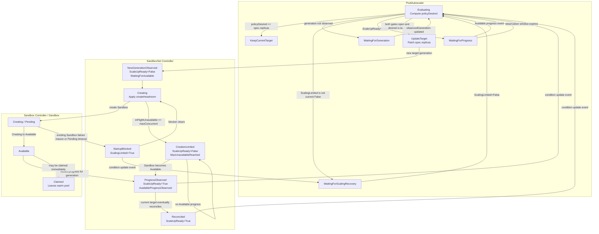

# SandboxSet supports autoscaler

## Table of Contents
- [Title](#title)
    - [Table of Contents](#table-of-contents)
    - [Summary](#summary)
    - [Motivation](#motivation)
        - [Goals](#goals)
        - [Non-Goals/Future Work](#non-goalsfuture-work)
    - [Proposal](#proposal)
        - [User Stories](#user-stories)
            - [Conversational Agent](#conversational-agent)
            - [Workflow Agent](#workflow-agent)
            - [Agent Fan-out](#agent-fan-out)
            - [RL](#RL)
        - [Design Details](#design-details)
            - [API](#API)
                - [Pool Capacity Control](#pool-capacity-control)
                - [Pool Scaling Policy](#pool-scaling-policy)
                    - [Cron-based Policy](#cron-based-policy)
                    - [Capacity Availability Policy](#capacity-availability-policy)
                - [Status](#Status)
                - [SandboxSet Lifecycle Status and Scale Safety](#sandboxset-lifecycle-status-and-scale-safety)
            - [Metrics](#Metrics)
                - [Reconciliation Metrics](#reconciliation-metrics)
            - [User Configuration Examples](#user-configuration-examples)
                - [Bounds Enforcer](#bounds-enforcer)
                - [Cron-Based Scaling](#cron-based-scaling)
                - [Capacity-Based Scaling with Watermarks](#capacity-based-scaling-with-watermarks)
                    - [Absolute Value Watermark Configuration](#absolute-value-watermark-configuration)
                    - [Percentage-Based Watermark Configuration](#percentage-based-watermark-configuration)
        - [Implementation Details/Notes/Constraints](#implementation-detailsnotesconstraints)
            - [Policy Combination and Precedence](#policy-combination-and-precedence)
            - [Observation Window and Sampling Configuration](#observation-window-and-sampling-configuration)
            - [Lifecycle-Aware Scale-Up Flow Control](#lifecycle-aware-scale-up-flow-control)
                - [Component Interaction State Machine](#component-interaction-state-machine)
            - [SandboxSet Scale-Up Readiness](#sandboxset-scale-up-readiness)
            - [SandboxSet Scaling Limitation](#sandboxset-scaling-limitation)
            - [Cron Policy Maintenance Window Support](#cron-policy-maintenance-window-support)
            - [One-to-One Relationship Between Warm Pool and Autoscaler](#one-to-one-relationship-between-warm-pool-and-autoscaler)
        - [Risks and Mitigations](#risks-and-mitigations)
            - [Controller Computational Complexity and Resource Consumption](#controller-computational-complexity-and-resource-consumption)
            - [Frequent Scaling Due to Misconfiguration](#frequent-scaling-due-to-misconfiguration)
            - [Extreme Behavior from Invalid Configuration Combinations](#extreme-behavior-from-invalid-configuration-combinations)
            - [Observability and Debugging Challenges](#observability-and-debugging-challenges)
    - [Alternatives](#alternatives)
        - [Extend Existing HPA for SandboxSet](#extend-existing-hpa-for-sandboxSet)
        - [Use External Autoscaling Tools](#use-external-autoscaling-tools)
    - [Upgrade Strategy](#upgrade-strategy)
        - [API Versioning](#api-versioning)
        - [Backward Compatibility](#backward-compatibility)
        - [Upgrade Path](#upgrade-path)
            - [From No Autoscaler to PoolAutoscaler](#from-no-autoscaler-to-poolAutoscaler)
            - [Upgrading Autoscaler Configuration](#upgrading-autoscaler-configuration)
            - [Controller Upgrade](#controller-upgrade)
        - [Downgrade Strategy](#downgrade-strategy)
            - [Downgrading Controller Version](#downgrading-controller-version)
            - [Removing Autoscaler](#removing-autoscaler)
        - [Version Skew Strategy](#version-skew-strategy)
            - [API Server and Controller Version Skew](#api-server-and-controller-version-skew)
    - [Additional Details](#additional-details)
    - [Test Plan](#test-plan-optional)
        - [Unit Tests](#unit-tests)
        - [Integration Tests](#integration-tests)
        - [Performance Tests](#performance-tests)
    - [Implementation History](#implementation-history)

## Summary

This enhancement proposes providing autoscaler capabilities for `SandboxSet`,
enabling intelligent and dynamic management of pre-warmed sandbox resource pools.
Currently, `SandboxSet` provides sandbox pre-warming capabilities with fixed-size resource pools.
This enhancement adds two complementary autoscaling policy types:

1. **Cron-based policies**: Enable time-driven scaling based on recurring schedules
(e.g., scale up during business hours, scale down during off-peak periods)
2. **Capacity-based policies**: Enable demand-driven scaling based on available resource watermarks,
ensuring sufficient idle capacity while preventing over-provisioning

The autoscaler integrates seamlessly with `SandboxSet`, providing operators with fine-grained
control over resource pool capacity while reducing operational overhead. PoolAutoscaler decides the
desired target without interpreting `maxUnavailable`; SandboxSet independently limits actual creation
concurrency and publishes whether the current scale-up generation has made Available progress. This
allows healthy high-throughput replenishment to continue without repeatedly increasing the target
while execution is stalled.
This enhancement addresses critical requirements for latency-sensitive agent workloads that require
predictable startup performance and efficient resource utilization.

## Motivation

Agents are often part of latency-sensitive execution paths and operate under highly dynamic workloads.
As a result, they have strong requirements around startup performance. By pre-warming sandbox objects
that provide the agent runtime environment through SandboxSet, agents can achieve near-real-time startup
and stable startup latency. However, SandboxSet currently supports only a fixed-size pre-warmed resource
pool, which cannot handle batch agent startup scenarios nor support predictable startup behavior.
Agents frequently create multiple sandboxes in parallel due to task decomposition or fan-out execution.
The system must support launching many sandboxes concurrently without linear degradation.
Startup latency should be correlated with load and capacity rather than exhibiting random jitter.
Predictability is critical for planners and schedulers that make execution decisions based on expected
availability.

Enabling autoscaler for `SandboxSet` addresses these challenges by providing:

- **Intelligent and dynamic resource pool management**: Operators can configure intelligent pre-warmed
pool management policies based on workload concurrency demands. This helps prevent unpredictable
startup latency, excessive request queuing during peak traffic, and situations where the planner
is forced into serial execution. The autoscaler automatically adjusts pool capacity based on
configured policies, ensuring optimal resource availability.
- **Improved resource utilization**: By dynamically adjusting the capacity of the resource pre-warming pool,
the cluster can more efficiently handle fluctuations in overall resource usage, thereby reducing
over-reservation and over-provisioning. The capacity-based policy maintains optimal idle resource
levels, scaling up during demand surges and scaling down during low-utilization periods.
- **Reduced operational overhead**: By eliminating the need for frequent manual adjustments to the
pre-warmed pool capacity, operational overhead is significantly reduced. Operators can define policies
once and let the autoscaler handle routine scaling decisions, freeing up time for higher-value tasks.

### Goals

This proposal aims to:

- **Provide periodic autoscaling capabilities**: Enable the pre-warming pool to scale up or down on a
recurring basis using cron-based policies. This supports predictable, time-driven scaling patterns
(e.g., scale up before business hours, scale down during off-peak periods).
- **Support capacity-based autoscaling**: Maintain a target range of idle resources in the pre-warming pool
through watermark-based policies. This ensures timely replenishment of available resources while
preventing excessive pre-warming that could increase costs.
- **Ensure predictable scaling behavior**: Provide clear, interpretable scaling policies with
configurable bounds, stabilization windows, and tolerance values. Operators should be able to
reason about and predict autoscaler behavior.
- **Maintain system stability**: Prevent scaling conflicts, oscillations, and resource exhaustion
through proper validation, bounds enforcement, and stabilization mechanisms.

### Non-Goals/Future Work

- **Complex machine learning algorithms**: This enhancement focuses on interpretable,
rule-based scaling strategies rather than complex ML-driven algorithms.
Future enhancements may explore predictive scaling based on historical patterns.
- **Cluster-level resource scaling**: This proposal focuses on sandbox-level resource pool management.
Cluster-level node scaling is handled by the cluster autoscaler and is out of scope.
- **HPA policy coordination**: There may be HPA policies configured for pods within the cluster
that could conflict with `SandboxSet` scaling policies. This proposal does not address coordination
between HPA and `PoolAutoscaler` for now and will be extended in the future based on usage scenarios
and user feedback.
- **Policy precedence**: Capacity and cron policies may coexist. A cron policy that triggers for the current schedule takes precedence over the capacity recommendation.
- **Maintenance window support**: Cron-based policies do not currently support maintenance window configuration.
This will be added based on user requirements and feedback.

## Proposal

### User Stories

#### Conversational Agent

Conversational agents are interactive and highly sensitive to latency, with users having little tolerance
for delays. Consequently, sandbox startup is expected to be effectively instantaneous, which requires
maintaining a steady pool of idle sandboxes to reliably absorb high levels of concurrent demand.

#### Workflow Agent

Workflow agents typically handle complex, multi-step workflows that involve invoking multiple tools
and running across multiple sandboxes. The underlying platform must therefore support parallel startup
of multiple sandboxes, as startup latency directly impacts overall task completion time. Pre-warming
management must be able to dynamically adjust the size of the pre-warmed pool based on task scale,
enabling rapid capacity expansion during peak periods.

#### Agent Fan-out

In data analytics scenarios, a single agent may fan-out into multiple sub-agents, resulting in a
sudden surge in sandbox demand. To prevent task queuing, the environment must be able to provide
a large number of ready sandboxes within a very short time. The pre-warming pool must therefore
be designed to immediately absorb peak fan-out traffic.

#### RL

During RL training, a large number of short-lived sandboxes are created, which demands extremely
low creation overhead and highly efficient batch startup. This makes it essential for the system
to maintain a large, steady pre-warmed sandbox pool.

### Design Details

#### API

Provide autoscaler configurations for the warming pool, supporting both cron-based
and watermark-based capacity control policies.

The `PoolAutoscaler` API provides comprehensive autoscaler configurations for the warming pool,
supporting both cron-based and capacity-based (watermark) scaling policies.
The API is designed following Kubernetes best practices, with clear separation between spec
(desired state) and status (observed state).

**Key Design Principles**:
- **One autoscaler per target**: Each `SandboxSet` can be managed by at most one `PoolAutoscaler`
to prevent conflicts
- **Policy precedence**: When cron and capacity policies coexist, a cron policy triggered for the current schedule overrides the capacity recommendation
- **Bounds enforcement**: All scaling operations respect `minReplicas` and `maxReplicas` constraints
- **Status transparency**: Rich status information enables observability and debugging

```go
// PoolAutoscaler is the configuration for a warming pool autoscaler,
// which automatically manages the replica count of the warming pool
// based on the policies specified.
type PoolAutoscaler struct {
	metav1.TypeMeta
	// Metadata is the standard object metadata.
	// +optional
	metav1.ObjectMeta

	// spec is the specification for the behavior of the autoscaler.
	// +optional
	Spec PoolAutoscalerSpec

	// status is the current information about the autoscaler.
	// +optional
	Status PoolAutoscalerStatus
}

// PoolAutoscalerSpec describes the desired functionality of the PoolAutoscaler.
type PoolAutoscalerSpec struct {
	// ScaleTargetRef points to the target warming pool to scale, and is used to select the pods for which instance status
	// should be collected, as well as to actually change the replica count.
	// +required
	ScaleTargetRef CrossVersionObjectReference
	// MaxReplicas is the upper limit for the number of replicas to which the autoscaler can scale up.
	// It cannot be less than minReplicas.
	// +required
	MaxReplicas int32
	// MinReplicas is the lower limit for the number of replicas to which the autoscaler
	// can scale down.
	// It defaults to 0 pods.
	MinReplicas int32

	// CronPolicies is a list of potential cron scaling policies which can be used during scaling.
	// +optional
	CronPolicies []CronScalingPolicy

	// CapacityPolicy defines the capacity configuration of the target resource pool.
	// +optional
	CapacityPolicy *CapacityPolicy

	// Suspend tells the controller to suspend subsequent executions.
	// Defaults to false.
	// +optional
	Suspend *bool
}

// CronScalingPolicy defines the cron-based scaling configuration for the resource pool.
type CronScalingPolicy struct {
	// Name is used to specify the scaling policy.
	// +required
	Name string
	// The time zone name for the given schedule.
	// If not specified, this will default to the time zone of the autoscaler controller manager process.
	// The set of valid time zone names and the time zone offset is loaded from the system-wide time zone
	// database by the webhook during PoolAutoscaler validation and the controller manager during execution.
	// If no system-wide time zone database can be found a bundled version of the database is used instead.
	// If the time zone name becomes invalid during the lifetime of a PoolAutoscaler or due to a change in host
	// configuration, the controller will stop syncing the warming pool and will create a system event with the
	// reason UnknownTimeZone.
	// +optional
	TimeZone *string
	// Schedule is a cron expression that defines when this policy should be executed.
	// Supports standard cron format with 5 fields (minute hour day month weekday)
	// Example:
	// "0 8 * * *"     - Every day at 8:00 AM
	// "0 0 * * 1-5"   - Every weekday at midnight
	// "0 */2 * * *"   - Every 2 hours
	// "30 0 * * *"    - Every day at 00:30
	// "0 0 1 * *"     - First day of every month at midnight
	// +required
	Schedule string
	// TargetReplicas is the desired replicas.
	// +required
	TargetReplicas int32
}

// CapacityPolicy defines the capacity configuration of the target resource pool.
type CapacityPolicy struct {
	// TargetAvailable is the desired available replicas.
	// It can be an absolute number or a percentage of the observed unclaimed
	// pool capacity. Percentage targets require minReplicas >= 1.
	// +required
	TargetAvailable intstr.IntOrString
	// Tolerance is the tolerance between the watermark and desired
	// value under which no updates are made to the desired number of
	// replicas (e.g. 0.01 for 1%). Must be greater than or equal to zero. If not
	// set, the default cluster-wide tolerance is applied (by default 10%).
	// +optional
	Tolerance *intstr.IntOrString
	// ScaleUp is the scaling rule for scaling up.
	// +optional
	ScaleUp *CapacityScalingRules
	// ScaleDown is the scaling rule for scaling down.
	// +optional
	ScaleDown *CapacityScalingRules
}

type CapacityScalingRules struct {
	// StabilizationWindowSeconds is the cooldown period after any scale action before
	// a scale in this direction is allowed.
	// StabilizationWindowSeconds must be greater than or equal to zero and less than or equal to 3600 (one hour).
	// If not set, use the default values:
	// - For scale up: 0 (i.e. no cooldown is applied).
	// - For scale down: 300 (i.e. the cooldown is 300 seconds long).
	// +optional
	StabilizationWindowSeconds *int32
}

// PoolAutoscalerStatus describes the current status of a pool autoscaler.
type PoolAutoscalerStatus struct {
	// ObservedGeneration is the most recent generation observed by this autoscaler.
	// +optional
	ObservedGeneration *int64

	// LastScaleTime is the last time the PoolAutoscaler scaled the number of pods,
	// used by the autoscaler to control how often the number of pods is changed.
	// +optional
	LastScaleTime *metav1.Time

	// CurrentReplicas is current number of replicas of pods managed by this autoscaler,
	// as last seen by the autoscaler.
	// +optional
	CurrentReplicas int32

	// DesiredReplicas is the desired number of replicas of pods managed by this autoscaler,
	// as last calculated by the autoscaler.
	// +optional
	DesiredReplicas int32

	// Suspended indicates whether the autoscaler is currently suspended.
	// Defaults to false.
	// +optional
	Suspended bool

	// AppliedCronPolicies is the execution status of cron policies.
	// +optional
	AppliedCronPolicies []CronScalingPolicyStatus

	// CurrentCapacity is the last read state of the capacity used by this autoscaler.
	// +optional
	CurrentCapacity CapacityStatus

	// Conditions is the set of conditions required for this autoscaler to scale its target,
	// and indicates whether those conditions are met.
	// +optional
	Conditions []metav1.Condition
}

type CronScalingPolicyStatus struct {
	// Name is used to specify the scaling policy.
	// +required
	Name string
	// Information when was the last time the policy was successfully scheduled.
	// +optional
	LastScheduleTime *metav1.Time
}

type CapacityStatus struct {
	// Available is current number of available pods managed by this autoscaler,
	// as last seen by the autoscaler.
	Available int32
}

// PoolAutoscalerCondition describes the state of
// a PoolAutoscaler at a certain point.
type PoolAutoscalerCondition struct {
	// Type describes the current condition
	Type PoolAutoscalerConditionType
	// Status is the status of the condition (True, False, Unknown)
	Status ConditionStatus
	// LastTransitionTime is the last time the condition transitioned from
	// one status to another
	// +optional
	LastTransitionTime metav1.Time
	// Reason is the reason for the condition's last transition.
	// +optional
	Reason string
	// Message is a human-readable explanation containing details about
	// the transition
	// +optional
	Message string
}

// PoolAutoscalerConditionType are the valid conditions of
// a PoolAutoscaler.
type PoolAutoscalerConditionType string
```

##### Pool Capacity Control

To ensure cost control and avoid runaway scaling due to misconfiguration, users need the ability
to cap the total capacity of the resource pool. At the same time, a minimum level of capacity is
required during off-peak periods to serve baseline workloads. To support these requirements, the
pool autoscaler introduces configurable upper and lower capacity limits.

| Field           | Description                                                                                                                                                                                                        | Use Cases                                                                                                                                                                                                                                                                                                                                                                                             | Validation Rules                                                                                                                                   |
|-----------------|--------------------------------------------------------------------------------------------------------------------------------------------------------------------------------------------------------------------|-------------------------------------------------------------------------------------------------------------------------------------------------------------------------------------------------------------------------------------------------------------------------------------------------------------------------------------------------------------------------------------------------------|----------------------------------------------------------------------------------------------------------------------------------------------------|
| **maxReplicas** | The upper limit for the number of replicas to which the autoscaler can scale up.                                                                                                                                   | 1. *Limit scaling up*: Prevents autoscaler from scaling beyond the specified maximum, protecting cluster resources and controlling costs. Prevents infinite scaling that could exhaust cluster resources.<br/>2. *Immediate scale down*: When current replicas exceed `maxReplicas` (e.g., manual scaling or autoscaler config update), autoscaler immediately scales down to the maximum limit.<br/> | 1. *Required field*: Must be specified in the autoscaler spec.<br/>2. *Must be greater than 0.*<br/>3. *Must be >= `minReplicas`.*                 |
| **minReplicas** | The lower limit for the number of replicas to which the autoscaler can scale down.                                                                                                                                 | 1. *Prevent excessive scale down*: Ensures a minimum number of pods are always available, maintaining service availability and handling baseline traffic.<br/> 2. *Default behavior*: If not specified, defaults to 0 pods.                                                                                                                                                                              | 1. *Optional field*: Can be omitted, in which case it defaults to 0.<br/>2. *Relationship with maxReplicas*: `maxReplicas` must be >= `minReplicas`. |
| **suspend**     | A boolean flag that controls whether the autoscaler controller should suspend subsequent policy executions. When set to `true`, the controller will not sync the policy. When `false`, the policy is synced normally. | 1. *Temporary suspension*: Temporarily pause policy execution during maintenance, debugging, or troubleshooting without deleting the autoscaler object.<br/> 2. *Conditional execution*: Use suspend flag to enable/disable autoscaler based on external conditions or feature flags.                                                                                                                 | 1. *Optional field*: Can be omitted.                                                                                                               |

All policy behaviors are governed by the pool capacity control.

##### Pool Scaling Policy

The autoscaler supports dynamic management of both the total resource pool size and the available
capacity, balancing user's requirements for overall resource limits and capacity availability.

###### Cron-based Policy

Cron-based scaling policies are provided to support planned resource management and recurring
resource consumption patterns.

| Field              | Description                                                                                                                                                                                                                                                                 | Use Cases                                                                                                                                                                                                                                                                                                                           | Validation                                                                                                                                                                                |
|--------------------|-----------------------------------------------------------------------------------------------------------------------------------------------------------------------------------------------------------------------------------------------------------------------------|-------------------------------------------------------------------------------------------------------------------------------------------------------------------------------------------------------------------------------------------------------------------------------------------------------------------------------------|-------------------------------------------------------------------------------------------------------------------------------------------------------------------------------------------|
| **name**           | A unique identifier for the scaling policy. Used to track and manage individual scaling policy in the status conditions. The name helps distinguish between multiple policies and provides a reference for monitoring and debugging.                                        | 1. *Policy identification*: Uniquely identify each scaling policy in a cron autoscaler, enabling clear tracking of which policy executed and its result.<br/>2. *Status tracking*: Map policy execution results to specific policies in the `status.conditions` array, where each condition uses the policy name as the identifier. | 1. *Required field*: Must be specified, cannot be empty or omitted.                                                                                                                       |
| **timezone**       | The time zone name for interpreting the schedule. Specifies the IANA time zone database name (e.g., "Asia/Shanghai", "UTC") that should be used when evaluating the cron schedule. If not specified, defaults to the time zone of the autoscale controller manager process. | 1. *Global deployments*: Ensure consistent scheduling across clusters in different geographic regions by explicitly setting timezones.                                                                                                                                                                                              | 1. *Optional field*: Can be omitted. If not specified, defaults to the autoscale controller manager process.<br/>2. *IANA timezone format*: Must be a valid IANA time zone database name. |
| **schedule**       | A cron expression that defines when the scaling policy should be executed. Specifies the exact time pattern (minute, hour, day, month, weekday) when the target workload should be scaled to the `targetReplicas`.                                                     | 1. *Time-based scaling*: Define specific time for scaling operation.                                                                                                                                                                                                                                                               | 1. *Required field*: Must be specified, cannot be empty or omitted.<br/>2. *Cron expression format*: Must be a valid cron expression.                                                     |
| **targetReplicas** | The desired number of replicas that the target pool should be scaled to when this policy executes. Represents the exact replica count that will be set on the target pool when the policy's schedule matches.                                                               | 1. *Fixed scaling targets*: Set specific replica counts for different times (e.g., 10 replicas during business hours, 2 replicas during off-hours).                                                                                                                                                                                 | 1. *Required field*: Must be specified, cannot be omitted.<br/>2. *Non-negative constraint*: Must be non-negative integer (>=0).                                                          |

###### Capacity Availability Policy

To support rapid resource provisioning during sustained traffic peaks, the capacity policy ensures
that the cluster maintains a safe level of available resources.

| Field               | Description                                                                                                                                                                                                                                     | Use Cases                                                                                                                                       | Validation                                                                                                                                     |
|---------------------|-------------------------------------------------------------------------------------------------------------------------------------------------------------------------------------------------------------------------------------------------|-------------------------------------------------------------------------------------------------------------------------------------------------|------------------------------------------------------------------------------------------------------------------------------------------------|
| **targetAvailable** | Used to specify the usable idle capacity of the resource pool.                                                                                                                                                                                  | 1. *Available capacity management*: To manage resource pool capacity while balancing cost efficiency and resource provisioning speed.           | 1. *Required field*: Must be specified, cannot be empty or omitted.                                                                            |
| **tolerance**       | The tolerance on the difference between the current and desired available capacity under which no updates are made to the desired number of replicas. This prevents scaling for small value variations that are within the tolerance threshold. | 1. *Reduce unnecessary scaling*: Prevent scaling actions for small available fluctuations that don't warrant replicas count changes.            | 1. *Optional field*: Can be omitted.<br/>2. *Non-negative constraint*: Must be >=0.                                                            |
| **scaleUp**         | Configures the scaling behavior for scaling up (increasing the number of replicas). Defines the minimum amount of available resources that must be retained in the resource pool.                                                               | 1. *Handle sustained traffic surges*: Ensure sufficient resources are available to serve applications and prevent request latency fluctuations. | 1. *Optional field*: Can be omitted. If not configured, no external guarantees are provided for the available capacity of the resource pool.   |
| **scaleDown**       | Configures the scaling behavior for scaling down (decreasing the number of replicas). Defines the upper bound of available resources that the policy resource pool can retain.                                                                  | 1. *Cost optimization*: Restrict the maximum capacity of the resource pool to keep resource costs under control.                                | 1. *Optional field*: Can be omitted. If not configured, no additional limits are imposed on the total available capacity of the resource pool. |

| Field                          | Description                                                                                                                                                                                                                                                                                                                                                                                                                            | Use Cases                                                                                                                                                                                                                                                                                                                                                                                                                    | Validation                                                                                                                                                                                                                           |
|--------------------------------|----------------------------------------------------------------------------------------------------------------------------------------------------------------------------------------------------------------------------------------------------------------------------------------------------------------------------------------------------------------------------------------------------------------------------------------|------------------------------------------------------------------------------------------------------------------------------------------------------------------------------------------------------------------------------------------------------------------------------------------------------------------------------------------------------------------------------------------------------------------------------|--------------------------------------------------------------------------------------------------------------------------------------------------------------------------------------------------------------------------------------|
| **stabilizationWindowSeconds** | Cooldown period for a scaling direction. The first scaling action is immediate; after any scale action, a subsequent action in this direction must wait until the configured period has elapsed. | 1. *Prevent flapping*: Delay repeated or opposite-direction scaling after a recent action.<br/>2. *Conservative scale-down*: Use a longer scale-down cooldown to avoid premature reduction.<br/>3. *Responsive scale-up*: Use zero or a short scale-up cooldown. | 1. *Optional field*: defaults to 0 seconds for scale-up and 300 seconds for scale-down.<br/>2. *Range*: 0 through 3600 seconds. |

Available capacity can be configured using an absolute value or a percentage.
For percentage policies, the base is the observed unclaimed pool capacity (`avgReplicas`).
Claimed Sandboxes leave the warm pool and are outside the scope of this proposal; they are not
tracked for percentage calculation or later pool reuse.

##### Status

| Field                   | Description                                                                                                                                                                                                                                                                                                                |
|-------------------------|----------------------------------------------------------------------------------------------------------------------------------------------------------------------------------------------------------------------------------------------------------------------------------------------------------------------------|
| **observedGeneration**  | The most recent generation observed by this autoscaler. This field is used to track which version of the autoscaler spec the controller has processed. It helps prevent the controller from acting on stale configuration when the autoscaler spec is updated while the controller is processing a previous version.       |
| **lastScaleTime**       | The last time the autoscaler scaled the number of pods. This timestamp is used by the autoscaler to control how often the number of pods is changed, helping to prevent rapid scaling oscillations and ensuring scaling actions are spaced appropriately.                                                                  |
| **currentReplicas**     | Current number of replicas of pods managed by this autoscaler, as last seen by the autoscaler. This represents the actual current replica count of the target warming pool that the autoscaler is managing.                                                                                                                |
| **desiredReplicas**     | The desired number of the replicas of pods managed by this autoscaler, as last calculated by the autoscaler. This represents the target replica count that the autoscaler controller has calculated based on policies, but may differ from the actual currentReplicas due to rate limiting, stabilization, or constraints. |
| **suspended**           | Whether the autoscaler controller has suspend subsequent policy executions. When `true`, the controller will not sync the policy. when `false`, the policy synced normally.                                                                                                                                                |
| **appliedCronPolicies** | Cron policy execution status.                                                                                                                                                                                                                                                                                              |
| **currentCapacity**     | The current number of available capacity managed by this autoscaler, as last seen by the autoscaler. This represents the actual current available capacity of the target warming pool that the autoscaler is managing.                                                                                                     |
| **conditions**          | The set of conditions required for this autoscaler to scale its target, including whether scaling is active, possible, or limited. |

`currentReplicas` and `desiredReplicas` remain optional in the CRD schema so status can be
published incrementally during initial reconciliation.

##### SandboxSet Lifecycle Status and Scale Safety

`SandboxSet.spec.replicas` remains the desired number of **unclaimed** Sandboxes. Responsibilities
are split across three logical controllers without adding a replica-count API field:

- Sandbox controller manages one Sandbox and reports its lifecycle state.
- SandboxSet controller executes `spec.replicas`, owns `maxUnavailable`, and publishes execution
  progress through the existing `status.conditions` field.
- PoolAutoscaler computes desired capacity and consumes SandboxSet status; it does not list
  Sandboxes or interpret `maxUnavailable`.

SandboxSet retains its existing in-flight calculation:

```
inFlightUnavailable = max(status.replicas - status.availableReplicas, 0)
```

`status.replicas` includes Creating and Available Sandboxes. Existing expectation accounting also
includes successful create requests that are not visible through the informer yet (`dirtyCreate`).
Consequently, `inFlightUnavailable` represents observed Creating Sandboxes plus `dirtyCreate`.
SandboxSet resolves `spec.scaleStrategy.maxUnavailable` and uses the result solely to limit physical
create operations. An absent value preserves the existing unlimited scale-up behavior; absolute
values are used directly, percentages are rounded up, and invalid values are rejected by admission.

To prevent a large desired-target jump from immediately enlarging percentage-based creation
concurrency, SandboxSet resolves percentage `maxUnavailable` against observed pool size rather than
the new desired target:

```
executionBase = max(status.replicas, 1)
maxConcurrent = resolve(spec.scaleStrategy.maxUnavailable,
                        executionBase, default=unlimited)
createHeadroom = max(maxConcurrent - inFlightUnavailable, 0)
```

SandboxSet publishes two orthogonal conditions. `ScaleUpReady` is the per-generation execution
handshake: after a desired-target increase, it remains `False` until SandboxSet observes at least one
owned Sandbox become Available. The Available transition is recorded by the Sandbox event handler,
so a Sandbox that is claimed immediately after becoming Available still counts as progress even when
the net `availableReplicas` value does not increase. The condition is reset for the next target
generation.

`ScalingLimited` reports whether one or more owned Sandboxes are currently blocked from starting.
It becomes `True` immediately when an owned Sandbox reports an existing startup-failure reason, or
when an otherwise inconclusive Pending Sandbox exceeds the controller-wide startup timeout. It is
not sticky and returns to `False` when no blocker remains. This reuses
`SandboxSet.status.conditions`; blocker counts and object lists are derived during reconciliation and
are not persisted as new status fields.

PoolAutoscaler uses `status.observedGeneration`, `ScaleUpReady`, and `ScalingLimited` as the execution
handshake. It does not inspect claims, Pending age, Pod status, or per-Sandbox UIDs itself. Sampling
history, cooldown timestamps, and the short-lived Available-transition observation stay in controller
memory; only the aggregate conditions are persisted.

When a Sandbox is claimed, it leaves the warm pool. SandboxSet replenishes the unclaimed pool
according to `spec.replicas`, but PoolAutoscaler does not continue tracking the claimed Sandbox and
does not support returning it to the pool in this version.

#### Metrics

The autoscaler exposes comprehensive metrics to enable monitoring, alerting, and performance analysis.
Metrics follow Prometheus conventions and are compatible with standard Kubernetes monitoring tools.

##### Reconciliation Metrics

`reconciliations_total`

**Type**: Counter

**Description**: Total number of autoscaler reconciliation operation performed by the controller.

**Labels**:
- `action`: The scaling action taken during reconciliation
  - Values: `scale_up`, `scale_down`, `none`
- `error`: Error type encountered during reconciliation
  - Values: `internal`, `none`

**Use Cases**:
- Monitor reconciliation frequency
- Track scaling action distribution
- Identify error rates by type
- Alert on high error rates

`reconciliation_duration_total`

**Type**: Histogram

**Description**: Time taken by the autoscaler controller to complete one reconciliation operation.

**Labels**:
- `action`: The scaling action taken during reconciliation
  - Values: `scale_up`, `scale_down`, `none`
- `error`: Error type encountered during reconciliation
  - Values: `internal`, `none`

**Use Cases**:
- Monitor reconciliation performance
- Identify slow reconciliations
- Track performance degradation
- Set SLOs for reconciliation latency

#### User Configuration Examples

The following sections provide practical configuration examples demonstrating common use cases
and best practices for `PoolAutoscaler`.

##### Bounds Enforcer

An autoscaler with only `minReplicas` and `maxReplicas` (and no scaling policies)
acts as a replica count guardrail rather than an active autoscaler.
This configuration enforces hard bounds on the `SandboxSet` replica count
while leaving scaling decisions to external actors (e.g., manual scaling, other controllers).

```yaml
spec:
  minReplicas: 5
  maxReplicas: 10
```

If the current number of replicas is below `minReplicas`, it is increased to `minReplicas`.
If it exceeds `maxReplicas`, it is reduced to `maxReplicas`. Otherwise, the replica count
remains unchanged.

##### Cron-Based Scaling

When using cron-based policies, the desired replica count specified by each
policy's `targetReplicas` is subject to the `minReplicas` and `maxReplicas`
constraints defined in the `spec`. The final replica count is always
clamped within these bounds, ensuring that cron policies cannot violate capacity limits.

$$
\text{finalReplicas} = \max\left(\text{minReplicas}, \min\left(\text{cronDesiredReplicas}, \text{maxReplicas}\right)\right)
$$

```yaml
spec:
  cronPolicies:
    - name: scale-up
      schedule: "0 8 * * *"
      targetReplicas: 100
    - name: scale-down
      schedule: "0 20 * * *"
      targetReplicas: 20
```

The warming pool will be scaled up to 100 replicas at 8:00 AM.
At 8:00 PM, the warming pool will be scaled down to 20 replicas.

```yaml
spec:
  minReplicas: 30
  maxReplicas: 50
  cronPolicies:
    - name: scale-up
      schedule: "0 8 * * *"
      targetReplicas: 100
    - name: scale-down
      schedule: "0 20 * * *"
      targetReplicas: 20
```

The warming pool will be scaled up to 50 replicas at 8:00 AM. This is constrained by
the configured maximum number of replicas.
At 8:00 PM, the warming pool will be scaled down to 30 replicas. This is constrained by
the configured minimum number of replicas.

##### Capacity-Based Scaling with Watermarks

The capacity-based policy maintains the idle warming pool size within predefined bounds
using watermarks. This approach ensures sufficient available resources for
rapid scaling while preventing over-provisioning during low-demand periods.

The watermark mechanism uses a target available capacity (`targetAvailable`)
as the desired idle resource level, with tolerance zones for scale-up and scale-down operations.
This creates a "dead zone" around the target, preventing frequent oscillations while ensuring
the pool maintains adequate idle capacity.

###### Absolute Value Watermark Configuration

The simplest configuration uses absolute values for watermarks,
providing fixed capacity targets regardless of pool size.

**Configuration Example**:
```yaml
spec:
  capacityPolicy:
    targetAvailable: 10  # Target: maintain 10 idle sandboxes
    tolerance: 5  # Scale up when available < 10 - 5 = 5. Scale down when available > 10 + 5 = 15
```
**Watermark Calculation**:
- **Lower Watermark (Scale-Up Trigger)**: `targetAvailable - tolerance = 10 - 5 = 5`
    - When available resources fall below 5, the autoscaler scales up to restore the target
- **Upper Watermark (Scale-Down Trigger)**: `targetAvailable + tolerance = 10 + 5 = 15`
    - When available resources exceed 15, the autoscaler scales down to optimize resource usage
- **Dead Zone**: Between 5 and 15, no scaling occurs (prevents oscillation)

**Mixed Configuration (Absolute Target with Percentage Tolerance)**:

When `targetAvailable` is an absolute number and `tolerance` is a percentage
(including the default `10%`), the percentage tolerance is resolved against the
resolved target, not the pool size:

```
target = targetAvailable                    (e.g. 5)
tol    = ceil(target * tolerancePercent / 100)   (e.g. ceil(5 * 10 / 100) = 1)
lower  = max(target - tol, 0)               (e.g. 4)
upper  = target + tol                       (e.g. 6)
```

Anchoring the percentage tolerance to the target keeps the dead zone
proportional to the configured capacity target. Anchoring it to the pool size
instead would widen the dead zone as the pool grows and, whenever the resolved
tolerance exceeded the target, clamp the lower watermark to 0 and make the
scale-up condition unreachable.

**Scaling Examples**:

- With one unclaimed and available Sandbox, `targetAvailable=10`, and `tolerance=5`,
  available capacity is below the lower watermark. The policy recommendation is
  `1 + (10 - 1) = 10`. PoolAutoscaler may publish that target, while SandboxSet applies its own
  creation concurrency and reports Available progress through `ScaleUpReady`.
- Claiming a Sandbox removes it from the unclaimed pool and SandboxSet replenishes toward
  `spec.replicas`. Absolute targets remain fixed; claimed Sandboxes do not change the
  configured target value.
- With 30 unclaimed and available Sandboxes and a full observation window, available capacity
  exceeds the upper watermark. The policy recommendation is `30 - (30 - 10) = 10`.

Scale-up is deliberately separated into recommendation and execution: CapacityPolicy computes the
desired target, while SandboxSet independently bounds physical creation and publishes progress.
Scale-down uses the averaged observation window and waits for the previous reduction to converge.

###### Percentage-Based Watermark Configuration

For dynamic workloads where pool size varies significantly, percentage-based watermarks maintain
available capacity as a proportion of the observed unclaimed pool:

```
base   = avgReplicas
target = ceil(base × targetPercent)
lower  = ceil(base × (targetPercent - tolerancePercent))
upper  = ceil(base × (targetPercent + tolerancePercent))
```

`avgReplicas` is the observed unclaimed pool (`Creating + Available`). Claimed Sandboxes are
outside this version's autoscaling model. Combining the percentages before rounding avoids
different results caused by independently rounded target and tolerance values.

**Configuration Example**:
```yaml
spec:
  capacityPolicy:
    targetAvailable: "70%"  # Target: maintain 70% of replicas as idle
    tolerance: "10%"  # Scale up when available < 70% - 10% = 60% of replicas. Scale down when available > 70% + 10% = 80% of replicas
```

**Watermark Calculation (Dynamic)**:
- **Target Available**: `ceil(avgReplicas × 70%)`
- **Lower Watermark (Scale-Up Trigger)**: `ceil(avgReplicas × 60%)`
- **Upper Watermark (Scale-Down Trigger)**: `ceil(avgReplicas × 80%)`
- **Dead Zone**: No scaling occurs while average available capacity is within `[lower, upper]`

**Empty-Pool Prevention**: For percentage-based `targetAvailable`, `minReplicas` must be at
least 1 (enforced by webhook). Bounds enforcement seeds the first unclaimed Sandbox; percentage
watermarks are then calculated from observed capacity. The autoscaler does not use
`maxReplicas` as the bootstrap base.

**Scale Calculation**:

```
scale up:   desired = avgReplicas + max(target - avgAvailable, 1)
scale down: desired = avgReplicas - (avgAvailable - target)
final:      desired is clamped to [minReplicas, maxReplicas]
```

A percentage target is self-relative. If every unclaimed Sandbox is idle, repeated scale-down
may continue as the base shrinks until the upper watermark is no longer exceeded or
`minReplicas` is reached. For example, with `targetAvailable: "30%"`, default `10%` tolerance,
and `minReplicas: 1`, an idle pool can move from 8 to 3 and then from 3 to 1:

| Step | `avgReplicas` | `avgAvailable` | Target | Upper | Decision |
|------|----------------|----------------|--------|-------|----------|
| Initial | 8 | 8 | `ceil(8×30%)=3` | `ceil(8×40%)=4` | Scale to `8-(8-3)=3` |
| After convergence | 3 | 3 | `ceil(3×30%)=1` | `ceil(3×40%)=2` | Scale to `3-(3-1)=1` |
| Steady state | 1 | 1 | 1 | 1 | No action |

This behavior is appropriate for proportional idle capacity. An operator that requires a fixed
number of idle Sandboxes should configure an absolute `targetAvailable` instead.

Claimed Sandboxes are intentionally outside the percentage base. A claim reduces the observed
unclaimed pool, and SandboxSet replenishes toward `spec.replicas`; PoolAutoscaler does not retain
per-claim history or model reuse of claimed Sandboxes.

### Implementation Details/Notes/Constraints

#### Policy Combination and Precedence

Cron and capacity policies may be configured together. Capacity policy provides the normal
continuous recommendation. When a cron schedule triggers, its explicit target takes precedence
for that reconciliation. Every result is still clamped to `minReplicas` and `maxReplicas`.

#### Observation Window and Sampling Configuration

The autoscaler uses an **observation window** mechanism to collect resource state samples
over time before making scaling decisions. This approach prevents reacting to transient
fluctuations and ensures scaling decisions are based on sustained trends rather than momentary spikes.

**Core Concepts**:

1. **Observation Window**: The time period over which resource state samples are collected and
analyzed to determine scaling actions. This represents the historical data period
considered for each scaling decision.
2. **Sampling Interval**: The time interval between consecutive sampling points.
This controls how frequently the autoscaler queries the current resource state.
3. **Metric Aggregation**: The method used to determine the final metric value from
multiple samples collected within the observation window.

**Configuration Parameters**:

The controller exposes the observation window and sampling interval as process flags:

- `--poolautoscaler-observation-window-seconds` defaults to 30 seconds.
- `--poolautoscaler-sampling-interval-seconds` defaults to 5 seconds.

Both values must be positive and the observation window must not be shorter than the sampling
interval. Invalid combinations fall back to the defaults.

**Metric Value Determination Within Observation Window**:

The autoscaler collects samples of available and unclaimed replicas and averages each
value over the observation window:

```
avgAvailable = sum(availableReplicas) / sampleCount
avgReplicas  = sum(status.replicas) / sampleCount
```

Scale-up can act on the current sample immediately. Scale-down requires a full observation window
to avoid reducing capacity from incomplete history after startup or controller restart. After a
capacity-driven target increase, the same observation window is also the maximum quiet period before
PoolAutoscaler re-evaluates scale-up. An owned Sandbox becoming Available triggers earlier
re-evaluation. Window expiry is only a timer signal: it does not classify the scale-up or any Sandbox
as failed.

**Integration with Scaling Cooldowns**:

The observation window smooths raw lifecycle status. The direction-specific
`stabilizationWindowSeconds` fields implement cooldowns rather than recommendation history:

- The first scaling action is immediate.
- After any scale action, a scale in a direction is blocked until that direction's cooldown expires.
- Cron-triggered targets bypass the cooldown because they represent explicit scheduled intent.

#### Lifecycle-Aware Scale-Up Flow Control

Target selection and target execution belong to different layers. PoolAutoscaler computes
`policyDesired`; SandboxSet controller owns `maxUnavailable`, actual create concurrency, and
execution progress. PoolAutoscaler therefore never resolves `maxUnavailable`, counts Pending
Sandboxes, or derives target-growth headroom.

For each SandboxSet generation, SandboxSet controller performs the following flow:

1. Observe the new desired target and set `ScaleUpReady=False` with reason `WaitingForAvailable`.
2. Continue creating toward `spec.replicas` while `createHeadroom > 0`.
3. When `inFlightUnavailable >= maxConcurrent`, stop issuing create requests and set reason
   `MaxUnavailableReached`. This is normal flow control, not a failure.
4. When any owned Sandbox transitions from Creating to Available, set `ScaleUpReady=True` with reason
   `AvailableProgressObserved` for that generation. This `True` result is sticky for the generation;
   immediately refilling the released create slot and reaching `maxUnavailable` again does not erase
   the observed progress. When no scale-up is outstanding, publish `ScaleUpReady=True` with reason
   `Reconciled`.
5. Independently aggregate existing Sandbox startup-failure reasons and publish
   `ScalingLimited=True/StartupBlocked` when at least one owned Sandbox reports one of them or exceeds
   the Pending startup timeout. SandboxSet may continue reconciling the already-declared target within
   `maxUnavailable`, but the condition prevents PoolAutoscaler from raising the target again until all
   blockers clear.

```yaml
status:
  conditions:
    - type: ScaleUpReady
      status: "False"
      reason: MaxUnavailableReached
      observedGeneration: 12
      message: "Waiting for in-flight Sandboxes to become Available"
```

After progress:

```yaml
status:
  conditions:
    - type: ScaleUpReady
      status: "True"
      reason: AvailableProgressObserved
      observedGeneration: 12
      message: "Available progress was observed for the current scale-up generation"
```

`LastTransitionTime` changes only when condition status changes. `reason` and `message` are for
observability; PoolAutoscaler does not parse them. Its admission check uses only condition type,
status, and `observedGeneration`.

##### Component Interaction State Machine



The key handshake is per SandboxSet generation:

```text
PoolAutoscaler updates target
→ SandboxSet observes the generation and sets ScaleUpReady=False
→ SandboxSet creates within maxUnavailable
→ one Sandbox becomes Available
→ SandboxSet sets ScaleUpReady=True for that generation
→ PoolAutoscaler may evaluate the next capacity-driven increase
```

An observation-window expiry returns PoolAutoscaler to `Evaluating`, but it does not change
`ScaleUpReady` or clear `ScalingLimited`; therefore it cannot bypass a stalled or explicitly blocked
execution layer. A Sandbox that is claimed immediately follows the `Available` transition first, so
the progress signal is preserved.

Before a capacity-driven increase, PoolAutoscaler requires:

1. `SandboxSet.status.observedGeneration >= SandboxSet.metadata.generation`.
2. `ScalingLimited=False` for the current SandboxSet generation.
3. `ScaleUpReady=True` for the current SandboxSet generation.
4. A freshly recomputed Capacity recommendation greater than current `spec.replicas`.
5. The scale-up cooldown, when configured, to have elapsed.

The initial bounds-enforcement action may bootstrap `minReplicas` without prior Available progress or
prior `ScalingLimited=False`, so an empty pool can establish observable startup state. Cron targets
represent explicit scheduled intent and bypass the Available-progress wait and capacity cooldown, but
not `ScalingLimited=True`; SandboxSet always applies its physical creation limit. Capacity-driven
increases use both aggregate conditions.

After PoolAutoscaler updates the target, it waits until an Available transition, a condition change,
or the observation window requests another reconciliation. It then reads fresh SandboxSet status and
recomputes the Capacity recommendation. Window expiry does not open either gate by itself: if
`ScaleUpReady` remains `False` or current-generation `ScalingLimited=False` is not present,
PoolAutoscaler keeps the target unchanged. If progress is observed but available capacity has already
recovered, the fresh recommendation also keeps the target unchanged.

This separates two cases without tracking claims:

- Sustained demand: a Sandbox may become Available and be claimed immediately; the transition opens
  the execution handshake even if net `availableReplicas` remains unchanged.
- No demand: newly created Sandboxes remain Available, so the current sample recovers toward the
  configured watermark and CapacityPolicy stops recommending further growth.

No failure budget, claim sequence, pending target, or persisted blocker counter is introduced.
Pending age is evaluated only by SandboxSet for the aggregate `ScalingLimited` condition;
PoolAutoscaler never calculates a timed-out Pending count. Controller restart may lose an unpersisted
Available transition before the condition update; the conservative result is to wait for later
progress rather than over-scale. The target patch continues to use optimistic locking and is
recalculated after conflicts.

#### SandboxSet Scale-Up Readiness

`ScaleUpReady` describes whether the execution layer has demonstrated progress for the current
generation. It does not declare success or failure of individual Sandboxes. In particular, reaching
`maxUnavailable` or waiting longer than one observation window is not a failure condition.

SandboxSet continues reconciling and refreshing the condition whenever Sandbox lifecycle events,
expectation observations, or target-generation changes occur. When no watch event arrives,
PoolAutoscaler's observation-window requeue provides periodic re-evaluation, but it does not classify
startup timeout or clear either condition.

The condition uses the existing `SandboxSet.status.conditions` field, so no new status counter is
required. Operators can observe a long-lived `ScaleUpReady=False` and its `LastTransitionTime`, while
automation relies on the structured condition fields rather than parsing the human-readable message.

#### SandboxSet Scaling Limitation

`ScalingLimited` is an orthogonal, current-state condition. It reports that one or more owned
Sandboxes cannot currently complete startup; unlike `ScaleUpReady`, it is not a sticky progress
record. SandboxSet derives it only from existing owned Sandbox state and does not watch or interpret
Pod lifecycle directly. This version recognizes only failure reasons already published by the
Sandbox controller:

- `Timeout`: an owned Sandbox remains `ResourcePending` longer than the controller-wide
  `--sandboxset-pending-timeout`, which defaults to one minute.
- `Failed`: an owned Sandbox already reports a startup failure through its existing `Ready=False`
  condition. Current `PodCreateFailed` and `StartContainerFailed` reasons both contribute to this one
  aggregate category; SandboxSet does not expose separate counts for them.

This design does not change Sandbox controller behavior and does not add `PodUnschedulable`,
`ContainerStartupBlocked`, a Pod waiting-reason allowlist, or any other Sandbox condition reason.
SandboxSet consumes existing startup-failure reasons exactly as they are currently published, but
maps all of them to the single aggregate category `Failed`. States not already classified as failures
by Sandbox controller remain ordinary Creating/Pending states and are reported only after the Pending
timeout. Terminal Sandbox handling remains unchanged and is not reimplemented by this condition.

When one or more blockers exist, SandboxSet publishes:

```yaml
status:
  conditions:
    - type: ScalingLimited
      status: "True"
      reason: StartupBlocked
      observedGeneration: 12
      message: "3 Sandboxes are blocked from starting: Timeout=2, Failed=1"
```

When all blockers clear, it publishes `ScalingLimited=False/ScalingAllowed`. Counts and a bounded
summary of reasons belong only in `message`, Events, logs, and metrics; no UID list or counter is
added to the API. `LastTransitionTime` changes only when status changes. The earliest incomplete
Pending deadline supplies `RequeueAfter`, so timeout detection works without Pod events and is
reconstructed from `creationTimestamp` after restart. A Warning Event is emitted only on transition
to `True`.

`ScalingLimited=True` does not delete or replace Sandboxes and does not stop SandboxSet from
reconciling its already-declared target within `maxUnavailable`. It only prevents PoolAutoscaler from
publishing another scale-up target. Scale-down remains allowed. Capacity and Cron scale-up both honor
this condition; the initial `minReplicas` bootstrap may still establish the first target so startup
state can be observed.

#### Cron Policy Maintenance Window Support

For cron-based policy configurations, the system currently does not support configuring
maintenance windows. Maintenance windows are time periods during which scheduled scaling
operations should be skipped or deferred, typically used for system maintenance,
updates, or other planned activities.

*Current Behavior*: All cron-based scaling jobs will execute according to their schedules
regardless of maintenance activities, which may cause conflicts during system maintenance periods.

*Future Enhancement*: Support for maintenance window configuration will be added based on
user requirements and feedback. This enhancement may allow users to:

- Define maintenance window periods using cron expressions or time ranges
- Specify behavior during maintenance windows (skip, defer, or override)
- Configure multiple maintenance windows for different scenarios

The implementation timeline will be determined based on user demand.

#### One-to-One Relationship Between Warm Pool and Autoscaler

Each warm pool can only be associated with a single autoscaler instance. This one-to-one
relationship is enforced to ensure predictable and consistent scaling behavior,
prevent conflicts, and maintain system stability.

### Risks and Mitigations

#### Controller Computational Complexity and Resource Consumption

*Risk*: The introduction of multiple scaling policies (cron-based and capacity-based) increases
the computational complexity of the autoscaler controller. The controller needs to evaluate
multiple policy types, calculate scaling recommendations, maintain in-memory historical state for
observation windows, and process cron schedules. This requires additional CPU and memory,
which can be amplified in large-scale clusters with many autoscaler instances.

*Impact*:
- Increased CPU usage for policy evaluation and calculation
- Higher memory consumption for storing historical recommendations and cron schedule state
- Potential performance degradation in clusters with hundreds or thousands of autoscaler resources
- Increased latency in scaling decisions due to complex calculations

*Mitigation*:
- *Configurable Parameters*: Provide system-level configuration options to limit the complexity
  of policy evaluation, such as:
    - Configurable observation windows and sampling intervals to reduce evaluation frequency
- *Policy Configuration Limits*: Enforce reasonable limits on policy configurations:
    - Limit the number of cron policy per autoscaler
- *Optimized Algorithms*: Implement efficient algorithms that avoid unnecessary recalculations:
    - Cache cron schedule evaluations
    - Bound and prune capacity samples to the configured observation window
    - Optimize memory usage through efficient data structures
- *Resource Monitoring*: Provide metrics to monitor controller resource consumption and
  alert when thresholds are exceeded

#### Frequent Scaling Due to Misconfiguration

**Risk**: Users may misconfigure autoscaler policies, leading to frequent and unnecessary
scaling operations. This can occur due to:
- Overly sensitive thresholds that react to minor resource usage fluctuations
- Conflicting policies that cause oscillation between scale-up and scale-down
- Missing stabilization mechanisms that allow rapid scaling changes
- Incorrect tolerance values that trigger scaling on insignificant changes

*Impact*:
- Unnecessary pod churn and resource waste
- Increased API server load from frequent scaling operations
- Application instability due to constant replica count changes
- Higher operational costs from unnecessary resource provisioning

*Mitigation*:
- *Tolerance Configuration*: Provide configurable tolerance values to prevent
  scaling on minor resources changes:
    - Default tolerance values that require meaningful changes before scaling
    - Per-autoscaler tolerance configuration for fine-grained control
    - Separate tolerance values for scale-up and scale-down operations
- *Cooldown Periods*: Implement cooldown mechanisms to prevent rapid successive scaling operations:
    - Minimum time between scaling operations
    - Separate cooldown periods for scale-up and scale-down
    - Configurable cooldown duration based on workload characteristics
- *Watermark Configuration*: Support high and low watermarks to create buffer zones:
    - High watermark: Threshold that must be exceeded before scaling down
    - Low watermark: Threshold that must be crossed before scaling up
    - Prevents oscillation around a single threshold value
- **Scaling Cooldowns**: Apply direction-specific cooldowns after scale actions:
    - Default to immediate scale-up and a 300-second scale-down cooldown
    - Requeue when the relevant cooldown expires
    - Let explicit cron targets bypass capacity-policy cooldowns

#### Extreme Behavior from Invalid Configuration Combinations

**Risk**: Invalid configuration or unavailable Sandbox infrastructure can lead to extreme scaling behavior, such as:
- Ambiguous precedence when cron and capacity policies are combined
- Parameter values that result in excessive scaling
- Missing bounds that allow scaling beyond cluster capacity
- Repeated scale-up while existing Sandbox creation is still in flight

*Impact*:
- Unpredictable scaling behavior that violates user expectations
- Resource exhaustion from excessive scaling
- Application downtime from scaling to zero or beyond capacity
- Difficult troubleshooting due to unexpected parameter interactions

*Mitigation*:
- *API Validation*: Implement comprehensive API validation to prevent invalid configurations:
    - Validate cron expression syntax at API admission time
    - Validate parameter ranges, including replica bounds and percentages
    - Check for logical inconsistencies such as `minReplicas > maxReplicas`
    - Require `minReplicas >= 1` for percentage capacity targets
- *Explicit Policy Precedence*: Triggered cron targets take precedence when cron and capacity policies coexist
- *Separated Responsibilities*: Let SandboxSet resolve `maxUnavailable`, account for `dirtyCreate`, limit actual create concurrency, and publish `ScaleUpReady` plus `ScalingLimited`; let PoolAutoscaler consume only those aggregate conditions
- *Progress-Gated Capacity Scaling*: Require Available progress for the current SandboxSet generation before another capacity-driven target increase, and use the observation window only to schedule re-evaluation
- *Blocked-Startup Gate*: Aggregate all existing Sandbox startup-failure reasons into one `Failed` category immediately, and inconclusive Pending stalls after the one-minute controller timeout; block further target growth without introducing new Sandbox failure types
- *Reasonable Default Values*: Provide sensible defaults that prevent extreme behavior:
    - Default stabilization windows and cooldown periods
    - Default tolerance values that prevent over-reaction
- *Documentation and Examples*: Provide clear documentation with:
    - Best practices for policy configuration
    - Examples of valid and invalid configurations
    - Warnings about common misconfiguration patterns

#### Observability and Debugging Challenges

*Risk*: The complexity of multiple policy types and configuration options makes it
difficult for users to understand why the autoscaler made specific scaling decisions.
Without proper observability, users cannot:
- Understand the reasoning behind scaling actions
- Debug why expected scaling did not occur
- Identify which policy triggered a scaling operation
- Troubleshoot conflicts between different policies

*Impact*:
- Increased support burden due to troubleshooting difficulties
- Delayed incident resolution when scaling issues occur
- Difficulty in optimizing autoscaler configurations

*Mitigation*:
- *Status Field Enhancements*: Expose detailed decision-making information in the autoscaler status:
    - Current active policy (cron or capacity-based)
    - Last scaling decision and reasoning
    - Policy evaluation results (which policies were considered, which triggered)
    - Conditions indicating the current state
- *Event Logging*: Provide detailed events for scaling operations:
    - Events for each scaling action with reason and policy source
    - Events for errors or warnings during policy evaluation
    - Events for skipped scaling operations (e.g., due to cooldown)
- *Metrics Exposure*: Implement comprehensive metrics to track autoscaler behavior:
    - Metrics for scaling operations (scale-up/down counts, rates)
    - Metrics for observation cycles (observation window frequency, decision duration)
    - Metrics for controller performance (CPU usage, memory consumption)
- *Logging Enhancements*: Provide structured logging with appropriate verbosity levels:
    - Decision logs explaining why scaling actions were taken or skipped
    - Policy evaluation logs showing the evaluation process
    - Configuration validation logs
    - Error logs with sufficient context for debugging
- *Documentation*: Create comprehensive documentation covering:
    - How to interpret status fields and conditions
    - How to read and understand events
    - How to use metrics for monitoring and alerting
    - Troubleshooting guides for common scenarios
    - Examples of interpreting autoscaler behavior

## Alternatives

### Extend Existing HPA for SandboxSet

**Approach**: Extend Kubernetes HPA to support `SandboxSet` workloads by
implementing custom metrics adapters that expose SandboxSet-specific metrics
(e.g., available sandbox count, idle pool capacity).

**Pros**:
- Leverages existing, well-tested HPA infrastructure
- Consistent API and behavior with standard Kubernetes autoscaling
- Benefits from ongoing HPA improvements and community support

**Cons**:
- HPA is designed for pod-level metrics and may not fit warm pool management semantics
- Requires custom metrics adapter development and maintenance
- Limited support for cron-based scheduling (would require external tools like KEDA)
- Complex integration with SandboxSet's unique resource model (available vs. total replicas)
- HPA's stabilization windows and tolerance mechanisms may not align with warm pool requirements

**Rejection Rationale**: While HPA is excellent for pod-level autoscaling,
warm pool management requires different semantics (maintaining idle capacity vs. scaling based on utilization).
The proposed solution provides a more natural fit for SandboxSet's use cases with direct
support for cron-based policies and capacity-based watermarks.

### Use External Autoscaling Tools

**Approach**: Integrate with existing external autoscaling solutions like
KEDA (for cron-based scaling) or Alibaba's CronHPA controller.

**Pros**:
- Leverages mature, production-tested solutions
- Reduces development and maintenance burden
- Benefits from community contributions and bug fixes

**Cons**:
- Requires additional components and dependencies in the cluster
- May not fully support SandboxSet's unique resource model
- Limited control over scaling behavior specific to warm pool semantics
- Potential version compatibility issues and upgrade complexity
- Less integrated with SandboxSet's lifecycle and status management

**Rejection Rationale**: While external tools provide valuable functionality,
a native autoscaler integrated directly with `SandboxSet` offers better control,
tighter integration, and a more cohesive user experience.
The proposed solution is designed specifically for SandboxSet's warm pool management needs.

## Upgrade Strategy

### API Versioning

The `PoolAutoscaler` resource will be introduced as `v1alpha1` API version,
following Kubernetes API versioning best practices. This allows for future API evolution
based on user feedback and requirements.

### Backward Compatibility

Since this is a new feature with no existing autoscaler resources, there are no
backward compatibility concerns for initial release.
However, future API changes will maintain backward compatibility through:

- **Additive Changes**: New optional fields can be added without breaking existing configurations
- **API Version Conversion**: When promoting to `v1beta1` or `v1`,
conversion logic will ensure existing `v1alpha1` resources continue to work
- **Field Deprecation**: Deprecated fields will be supported for at least two API versions before removal

### Upgrade Path

#### From No Autoscaler to PoolAutoscaler

**Scenario**: Users currently managing SandboxSet replicas manually want to adopt PoolAutoscaler.

**Steps**:
1. Create `PoolAutoscaler` resource targeting existing `SandboxSet`
2. Configure appropriate policies (cron-based or capacity-based)
3. Set `minReplicas` and `maxReplicas` to match current replica count or desired bounds
4. Monitor autoscaler behavior and adjust policies as needed

**Rollback**: Delete the `PoolAutoscaler` resource. The `SandboxSet` will retain its current replica count,
allowing manual management to resume.

#### Upgrading Autoscaler Configuration

**Scenario**: Users need to update autoscaler policies or bounds.

**Steps**:
1. Update `PoolAutoscaler` spec with new configuration
2. Controller reconciles changes during next sync cycle
3. Scaling behavior adjusts according to new policies

**Rollback**: Revert `PoolAutoscaler` spec to previous configuration.
The controller will reconcile to the previous state.

#### Controller Upgrade

**Scenario**: Upgrading the autoscaler controller to a new version.

**Behavior**:
- Existing `PoolAutoscaler` resources continue to work without modification
- New controller features may require updating autoscaler configurations to opt-in
- Controller maintains backward compatibility with existing API versions

### Downgrade Strategy

#### Downgrading Controller Version

**Scenario**: Rolling back to a previous controller version.

**Considerations**:
- Ensure all `PoolAutoscaler` resources use supported API versions
- If new API fields were used, they will be ignored by older controller versions
- Autoscaler will continue operating with supported features only

**Recommendation**: Before downgrading, review `PoolAutoscaler` resources
to ensure they don't rely on features only available in the newer controller version.

#### Removing Autoscaler

**Scenario**: Completely removing autoscaler functionality from a cluster.

**Steps**:
1. Delete all `PoolAutoscaler` resources
2. `SandboxSet` resources retain their current replica counts
3. Resume manual replica management if needed

**Note**: The `SandboxSet` resources themselves are not affected by autoscaler removal.

### Version Skew Strategy

#### API Server and Controller Version Skew

**Scenario**: Since `PoolAutoscaler` is implemented as a CustomResourceDefinition (CRD),
the version skew considerations differ from built-in Kubernetes APIs.
Once the CRD is installed in the cluster, the Kubernetes API server immediately
supports the `PoolAutoscaler` API for that version. Version skew primarily occurs between
the CRD definition and the controller implementation.

## Additional Details

## Test Plan [optional]

### Unit Tests

**API Validation Tests**:
- Validate `PoolAutoscaler` spec fields (minReplicas, maxReplicas, policies)
- Test cron expression parsing and validation
- Verify capacity policy validation (targetAvailable, tolerance, stabilization windows)
- Test one-to-one relationship enforcement (rejecting multiple autoscalers for same target)
- Validate cron and capacity policy precedence

**Controller Logic Tests**:
- Test cron policy evaluation and scheduling
- Test capacity policy calculation (absolute and percentage-based)
- Test stabilization window logic for scale-up and scale-down
- Test tolerance calculation and application
- Test bounds enforcement (minReplicas, maxReplicas)
- Test SandboxSet resolves `maxUnavailable` and limits creation with `inFlightUnavailable`, including expectation-accounted `dirtyCreate`
- Test percentage `maxUnavailable` uses observed pool size as the execution base, not a newly enlarged desired target
- Test `ScaleUpReady=False` while waiting for Available progress and when `maxUnavailable` is reached
- Test a Creating-to-Available transition sets `ScaleUpReady=True` for the current generation
- Test an immediately claimed Sandbox still records Available progress even when net `availableReplicas` does not increase
- Test `ScalingLimited=True/StartupBlocked` aggregation into exactly two categories: `Failed` for all existing Sandbox startup-failure reasons and `Timeout` for Pending beyond the deadline
- Test other Creating/Pending states remain unclassified before the timeout and the condition clears when all blockers resolve
- Test timeout requeue, restart reconstruction from `creationTimestamp`, aggregate reason messages, and transition-only Warning Events
- Test PoolAutoscaler does not inspect `maxUnavailable`, Pending counts, Pod status, or Sandbox objects, and SandboxSet does not interpret Pod lifecycle directly
- Test Capacity scale-up requires current-generation `ScaleUpReady=True`, current-generation `ScalingLimited=False`, and a freshly recomputed recommendation
- Test Capacity and Cron scale-up stop while `ScalingLimited` is True, Unknown, missing, or stale, while scale-down and initial `minReplicas` bootstrap retain their defined behavior
- Test observation-window expiry re-evaluates scale-up but does not mark failure, bypass `ScaleUpReady=False`, or clear `ScalingLimited=True`
- Test Cron targets bypass Available-progress waiting and cooldown but require current-generation `ScalingLimited=False`; test that initial bounds bootstrap can establish `minReplicas` while SandboxSet retains physical creation limits
- Test in-memory sampling, cooldown, and Available-transition observation within one controller process
- Test PoolAutoscaler ignores claimed Sandboxes after they leave the warm pool

**Reconciliation Tests**:
- Test reconciliation with various policy configurations
- Test error handling and retry logic
- Test status condition updates
- Test event recording

### Integration Tests

**End-to-End Scaling Tests**:
- Test cron-based scaling with multiple policies
- Test capacity-based scaling with various watermarks
- Test scaling within min/max bounds
- Test scaling when bounds are exceeded

**Policy Interaction Tests**:
- Test cron policy execution timing
- Test capacity policy evaluation during resource consumption/release
- Test policy precedence when cron and capacity policies are both configured

**Status and Observability Tests**:
- Verify status fields are updated correctly
- Test condition transitions
- Verify event generation for scaling operations
- Test metrics exposure

**Error Handling Tests**:
- Test behavior when target SandboxSet doesn't exist
- Test behavior when target SandboxSet is deleted
- Test behavior with invalid cron expressions
- Test behavior with invalid capacity configurations
- Test recovery from transient errors

### Performance Tests

**Scalability Tests**:
- Test controller performance with 100+ PoolAutoscaler resources
- Test reconciliation latency under load
- Test memory consumption with large observation windows
- Test cron schedule evaluation performance

**Stress Tests**:
- Test rapid policy changes
- Test concurrent scaling operations
- Test controller restart and recovery

## Implementation History

- [x] 06/01/2026: Initial proposal draft created
- [x] 26/08/2026: Lifecycle-aware scale-up design refined to reuse existing API status and in-memory sampling
- [x] 27/08/2026: Separated PoolAutoscaler target decisions from SandboxSet creation control through an Available-progress handshake
- [x] 27/08/2026: Added the orthogonal `ScalingLimited` condition with `Failed` and `Timeout` aggregate categories
