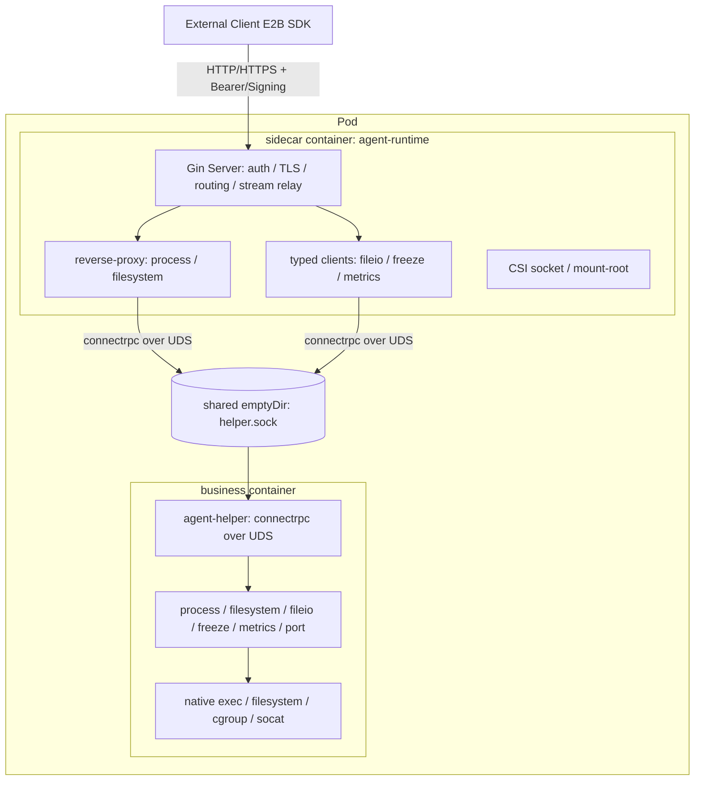

# Agent Runtime Helper Mode (in-container helper over socket)

## Table of Contents

- [Agent Runtime Helper Mode (in-container helper over socket)](#agent-runtime-helper-mode-in-container-helper-over-socket)
  - [Table of Contents](#table-of-contents)
  - [Glossary](#glossary)
  - [Summary](#summary)
  - [Motivation](#motivation)
    - [Goals](#goals)
    - [Non-Goals/Future Work](#non-goalsfuture-work)
  - [Current State](#current-state)
    - [Mode Selection](#mode-selection)
    - [Executor Abstraction and Sidecar Delegation](#executor-abstraction-and-sidecar-delegation)
  - [Proposal](#proposal)
    - [Architecture Overview](#architecture-overview)
    - [User Stories](#user-stories)
    - [Design Decisions](#design-decisions)
      - [D1. Transport: UNIX Domain Socket over shared emptyDir](#d1-transport-unix-domain-socket-over-shared-emptydir)
      - [D2. Protocol: reuse connectrpc](#d2-protocol-reuse-connectrpc)
      - [D3. State ownership: Fat Helper + sidecar relay](#d3-state-ownership-fat-helper--sidecar-relay)
      - [D4. Mode selection: explicit `--runtime-mode` (local | helper)](#d4-mode-selection-explicit---runtime-mode-local--helper)
      - [D5. Helper delivery and lifecycle](#d5-helper-delivery-and-lifecycle)
      - [D6. cgroup: native placement](#d6-cgroup-native-placement)
      - [D7. Security](#d7-security)
      - [D8. Helper interface scope](#d8-helper-interface-scope)
    - [Component Changes](#component-changes)
    - [Requirements](#requirements)
      - [Functional Requirements](#functional-requirements)
      - [Non-Functional Requirements](#non-functional-requirements)
    - [Risks and Mitigations](#risks-and-mitigations)
  - [Alternatives](#alternatives)
  - [Upgrade Strategy](#upgrade-strategy)
  - [Test Plan](#test-plan)
  - [Implementation Plan (Phased)](#implementation-plan-phased)
  - [Implementation History](#implementation-history)

## Glossary

- **agent-runtime**: The runtime service that exposes E2B/envd-compatible OpenAPI, process, and filesystem
  capabilities. Located at `pkg/agent-runtime`.
- **Local mode**: agent-runtime runs directly inside the business container and executes operations natively.
- **Helper mode**: agent-runtime runs as a sidecar (control plane) while a lightweight `agent-helper` process runs
  inside the business container (data plane). They communicate over a UNIX domain socket.
- **agent-helper**: The lightweight in-container data-plane binary used only in helper mode
  (`cmd/agent-helper`, `pkg/agent-runtime/helper`).
- **Executor**: A per-service abstraction (`ProcessExecutor`, `FilesystemExecutor`, `MountExecutor`) that isolates the
  deployment-mode-specific execution strategy.

## Summary

agent-runtime supports a Local mode, where it runs directly inside the business container and executes every operation
natively. Local mode has the best execution fidelity but mixes the control plane with the workload and is intrusive to
the user image.

This proposal introduces **Helper mode**, the second supported mode alongside Local. The agent-runtime control plane
(HTTP/HTTPS serving, auth, TLS, routing, streaming relay) stays in the sidecar, while a lightweight `agent-helper` binary
runs inside the business container and performs the actual process / filesystem / file-transfer / cgroup / metrics /
port-forward operations natively. The sidecar and the helper communicate over a UNIX domain socket placed on a shared
`emptyDir` volume, using the existing connectrpc service specs.

Helper mode combines the **execution fidelity of Local mode** (native `os/exec`, native cgroup FD placement, native
user DB and filesystem view) with the **control-plane isolation of a sidecar**: the control plane runs in a
non-privileged sidecar while user workloads still execute with native fidelity in the business container, with no need
for `CAP_SYS_ADMIN` or host PID visibility.

## Motivation

Local mode runs the full agent-runtime inside the business container. It executes with native fidelity but has
structural drawbacks:

- It is intrusive to the user image: the runtime control plane (HTTP serving, auth, TLS) is co-located with the user's
  workload, enlarging the trust and failure surface inside the business container.
- It couples the control plane with the workload lifecycle, so runtime upgrades and workload changes cannot evolve
  independently.

Helper mode resolves this by keeping the control plane in a **non-privileged sidecar** while running a small native
**data-plane** process (`agent-helper`) inside the business container. This preserves local-mode execution fidelity
(native `os/exec`, native cgroup FD placement, native filesystem/user view — hence gzip/Range file transfer, race-free
cgroup placement, and atomic freeze) while isolating the control plane, and without granting the sidecar any elevated
privileges. The executor interfaces already anticipate a future executor (the code comments mention
`(Future) CRIExecutor: execution via CRI API (DaemonSet)`), so the abstraction cost is low.

## Current State

### Mode Selection

Mode is selected by the `--runtime-mode` flag (`cmd/agent-runtime/options/flag.go`, `parser.go`):

- `local` (default) → agent-runtime executes the data plane natively in this container.
- `helper` → agent-runtime delegates the data plane to the in-container helper over the UDS at `--helper-socket`.

The related flags are `--helper-socket` (default `/var/run/agent-helper/helper.sock`) and `--helper-ready-timeout`
(default `120s`). `ServerConfig` (`pkg/agent-runtime/server.go`) carries `RuntimeMode`, `HelperSocket`,
`HelperReadyTimeout`, and exposes `IsHelperMode()`. There are exactly two modes: `local` and `helper`.

### Executor Abstraction and Sidecar Delegation

Data-plane services keep a consistent executor abstraction so mode selection is a wiring decision:

- Process: `ProcessExecutor` → `LocalExecutor` (`pkg/agent-runtime/services/process/executor.go`).
- Filesystem: `FilesystemExecutor` → `LocalFilesystemExecutor` (`pkg/agent-runtime/services/filesystem/executor.go`).
- Mount: `MountExecutor` → `LocalMountExecutor` / `HelperMountExecutor`
  (`pkg/agent-runtime/openapi/extendedapi/mount_executor.go`).

In helper mode the sidecar wires the delegation in `pkg/agent-runtime/routers.go` and reaches the helper through
`pkg/agent-runtime/helperclient`. Rather than one typed executor per service, delegation takes two shapes:

- **Process and Filesystem** are relayed with a **transparent connectrpc reverse-proxy** (`helperclient.NewReverseProxy`,
  mounted at the spec path prefixes in `mountHelperProxy`). Both sides serve the identical specs, so unary and streaming
  RPCs relay unchanged.
- **FileIO, Freeze, and Metrics** are reached through **typed connectrpc clients** on `helperclient.Client`; the native
  API handlers and `pickFreezer` consume them (`FileIOClient`, `Freezer()`, `MetricsProvider()`).

cgroup management uses `Cgroup2Manager` (with a `NoopManager` fallback), wired in `cmd/agent-runtime/main.go` (local) and
`cmd/agent-helper/main.go` (helper).

## Proposal

### Architecture Overview



- The sidecar keeps: HTTP/HTTPS serving, auth (Bearer/Signing), CORS, routing, streaming relay, the `/init` state
  machine, and the CSI mount socket + mount-root discovery.
- The helper performs: process spawn/signal/stdin/PTY, filesystem operations, file byte read/write (fileio), cgroup
  placement and freeze/thaw, metrics sampling, and port-forward socat — all natively inside the business container.
- The transport is a UNIX domain socket on an `emptyDir` volume shared by both containers. The helper also serves a
  plain `GET /health` on the same socket for readiness and exec-probe use.

### User Stories

- As a platform operator, I want to run the runtime control plane in a non-privileged sidecar while still executing
  user workloads with native fidelity, so I can avoid granting `CAP_SYS_ADMIN` to the sidecar.
- As a sandbox user, I want file upload/download to support gzip and Range and processes to be placed into the correct
  cgroup without races, even when the runtime is deployed as a sidecar.

### Design Decisions

#### D1. Transport: UNIX Domain Socket over shared emptyDir

Use a UNIX domain socket (default `/var/run/agent-helper/helper.sock`) on an `emptyDir` volume mounted into both the
sidecar and the business container. The helper creates the socket directory with mode `0700` and the socket file with
mode `0600` (`pkg/agent-runtime/helper/server.go`).

- Pros: filesystem-permission based access control, no port conflicts, naturally scoped to the Pod.
- Alternative: loopback TCP (Pod containers share the network namespace). Simpler but any process in the business
  container can reach the port, weaker security, and requires port management. Kept as an optional fallback.

#### D2. Protocol: reuse connectrpc

The helper implements the existing connectrpc service specs over the UDS, served via `h2c` (cleartext HTTP/2) so
client- and server-streaming work. The sidecar reaches them either as connectrpc clients (fileio/freeze/metrics) or via
a transparent reverse-proxy (process/filesystem).

- Reuses existing protobuf specs; no new wire protocol.
- Native support for server-streaming (`ConnectToProcess`, `WatchDir`) and client-streaming (`StreamInput`, fileio
  `WriteFile`) that relays transparently (the reverse-proxy sets `FlushInterval = -1`).
- Lets the helper reuse the existing local service implementations almost verbatim.

#### D3. State ownership: Fat Helper + sidecar relay

The helper owns the process map, PTY, and streaming state (it is effectively a minimal agent-runtime running the
process + filesystem + fileio + freeze + metrics + port services in "local" execution mode, exposed over the UDS). For
process and filesystem the sidecar is a transparent reverse-proxy; for fileio/freeze/metrics it uses typed clients.

- Rejected alternative "Thin Helper" (helper exposes low-level primitives, sidecar holds the process map): would
  require tunneling stdout/stderr streams back to the sidecar, which is complex and error prone.

#### D4. Mode selection: explicit `--runtime-mode` (local | helper)

The mode is a two-state flag:

```
--runtime-mode = local | helper        (default: local)
--helper-socket = /var/run/agent-helper/helper.sock
--helper-ready-timeout = 120s
```

`ServerConfig` carries `RuntimeMode`, `HelperSocket`, `HelperReadyTimeout` and `IsHelperMode()`. Service wiring branches
on helper mode in `routers.go` (reverse-proxy + typed clients). There are exactly two modes, `local` and `helper`.

#### D5. Helper delivery and lifecycle

The helper runs as a process inside the business container. Delivery and launch:

- Binary delivery + launch: the container image entrypoint (`cmd/agent-runtime/entrypoint.sh` and its internal
  counterpart `entrypoint_inner.sh`) selects a topology via `RUNTIME_MODE` (`envd` | `local` | `helper`, default
  `envd`). In `helper` mode it stages `agent-helper` (and `envd-run.sh`) into the shared `ENVD_DIR` for the business
  container, then `exec`s agent-runtime as the sidecar control plane with `--runtime-mode=helper`.
- Readiness: at startup the sidecar blocks on `helperclient.WaitReady`, which probes `GET /health` over the UDS with
  exponential backoff until the socket serves or `--helper-ready-timeout` elapses (`cmd/agent-runtime/main.go`).
- Crash/restart: process state lives in the helper; a helper restart loses it (equivalent to a container restart and
  acceptable). The reverse-proxy returns `502 Bad Gateway` on a broken relay; freeze returns `503` when no freezer is
  available, so callers see a clear error instead of hanging.
- Injection (future): automated injection of the shared `emptyDir`, the helper launch (postStart or `envd-run.sh`), the
  exec-probe wiring, and RBAC via the controller/webhook is not yet implemented and is tracked as a separate phase.

#### D6. cgroup: native placement

Because the helper runs natively in the business container, it uses `Cgroup2Manager` with `CLONE_INTO_CGROUP` FD
placement directly, falling back to `NoopManager` when cgroup v2 is unavailable. The same manager satisfies the
`Freezer` contract, so the Freeze service drives `cgroup.freeze` on exactly the cgroups the helper placed processes
into. Placement is atomic (no `echo $$ > cgroup.procs` race) and freeze is applied without per-type races. Freeze/thaw
and metrics are read/written natively by the helper.

#### D7. Security

The helper's goal is that it can only be invoked by the agent-runtime sidecar in the same Pod. Because the business
container's main process may run under the same uid as the sidecar, UDS file permissions alone cannot block a same-uid
impostor, so a layered defense is used:

- Auth stays terminated at the sidecar (Bearer/Signing unchanged); the helper trusts only the UDS peer.
- Transport: the helper listens only on the UDS and exposes no network port; the socket lives on a private path, dir
  mode `0700`, socket mode `0600`.
- Peer verification: on accept, the helper reads the peer uid via `SO_PEERCRED` (`peercred_linux.go`) and rejects
  connections whose uid is not in the `--allowed-peer-uid` allowlist. The check is **uid-only** by design — the kernel
  fills the uid at connect time and it cannot be forged, and it is stable across restarts; pid is intentionally not
  pinned because pids are recycled and would break legitimate reconnection after an agent-runtime restart.
- Fail-open where enforcement is impossible: when the allowlist is empty (not yet wired by the controller) or the
  platform cannot read peer credentials (non-Linux; `peercred_other.go`), the connection is allowed but logged so the
  gap stays observable.
- Capability boundary: the helper strictly inherits the business container's runtime identity and never elevates
  privileges; over-privileged operations fail natively (EPERM) and are propagated faithfully, without fallback or
  simulation.
- Application-layer shared secret (future/optional): an internal token between sidecar and helper to further defend
  against same-uid impersonation is not implemented yet.

#### D8. Helper interface scope

The helper is primarily a data plane (connectrpc over UDS). It hosts no HTTP business endpoints (auth/signing/TLS/CORS/
routing all stay in the sidecar), with one exception: a plain `GET /health` used purely for reachability. The decision
criterion is "must the real execution behind an endpoint happen inside the business container".

The helper implements (native data-plane capabilities inside the business container):

- connectrpc Process service: List / Start / Connect / Update / StreamInput / SendInput / SendSignal.
- connectrpc Filesystem service: Stat / MakeDir / Move / ListDir / Remove / WatchDir / CreateWatcher /
  GetWatcherEvents / RemoveWatcher.
- connectrpc FileIO service: byte read/write (ranged `ReadFile`, streamed `WriteFile`), `Compose`, and `CreateSymlink`
  — backing `GET /files`, `POST /files`, `POST /files/compose`, and the mount symlink (signing stays in the sidecar).
- connectrpc Freeze service: native cgroup freeze/unfreeze backing `/freeze`, `/unfreeze`, and `/init` deferred thaw.
- connectrpc Metrics service: native metrics reading backing `/metrics`.
- connectrpc PortForward control service (`ListPorts`/`WatchPorts`/`OpenPort`/`ClosePort`) plus the autonomous port
  scanner+forwarder; the socat data plane never crosses the UDS. It is mounted only when port scanning is enabled.
- Plain `GET /health` for readiness/exec-probe reachability (not a connectrpc method).

The helper does not implement (all stay in the sidecar):

- `POST /init`: auth/token/env/user/workdir are control-plane responsibilities; only its freeze/unfreeze side effects
  are delegated to the helper.
- `GET /envs`: data comes from the sidecar's in-memory `Defaults.EnvVars`, unrelated to the business container.
- Auth (Bearer/Signing), TLS, CORS, routing, and the HTTP-level file transfer (gzip/Range/multipart) which the sidecar
  rebuilds on top of the helper's identity byte stream.

In one line: the helper is a minimal agent-runtime running the process + filesystem + fileio + freeze + metrics + port
connectrpc services in "local" mode (plus a bare health endpoint), exposed over the UDS; the sidecar degenerates into a
transparent proxy (process/filesystem) and typed client (fileio/freeze/metrics) for these services.

### Component Changes

| Component | Change | Status |
|---|---|---|
| `cmd/agent-runtime/options` | Add `--runtime-mode` (local\|helper), `--helper-socket`, `--helper-ready-timeout`. | done |
| `pkg/agent-runtime/server.go` (`ServerConfig`) | Add `RuntimeMode`, `HelperSocket`, `HelperReadyTimeout`, `IsHelperMode()`. | done |
| `pkg/agent-runtime/routers.go` | Helper-mode wiring: reverse-proxy process/filesystem; `pickFreezer`/`pickMountExecutor`; typed fileio/metrics clients. | done |
| **new** `pkg/agent-runtime/helperclient` | UDS-dialing connectrpc clients (FileIO/Freeze/Metrics), reverse-proxy, freezer/metrics adapters, `WaitReady`. | done |
| **new** `pkg/agent-runtime/services/fileio` | Native byte transfer service (ReadFile/WriteFile/Compose/CreateSymlink). | done |
| **new** `pkg/agent-runtime/services/freeze` | Native cgroup freeze/thaw service with serialization lock. | done |
| **new** `pkg/agent-runtime/services/metrics` | Native CPU/memory/disk sampling service. | done |
| `pkg/agent-runtime/services/port` | Autonomous scanner+forwarder and PortForward control service. | done |
| `pkg/agent-runtime/openapi/extendedapi` (mount) | CSI socket + mount-root stay in the sidecar; symlink delegated via `HelperMountExecutor` → helper FileIO. | done |
| `pkg/agent-runtime/openapi/nativeapi` | `/files*` byte transfer via `FileIOClient`; `/metrics` via helper `MetricsProvider`; freeze via helper `Freezer`. | done |
| **new** `cmd/agent-helper/main.go` + `pkg/agent-runtime/helper/` | Helper server on the UDS (process/filesystem/fileio/freeze/metrics/port + `GET /health`), SO_PEERCRED uid allowlist, `health` exec-probe subcommand. | done |
| `cmd/agent-runtime/entrypoint*.sh` | `RUNTIME_MODE` staging/launch for envd\|local\|helper. | done |
| **new (later phase)** `pkg/controller`, `pkg/webhook`, deploy manifests | Inject and launch the helper; add the shared `emptyDir` volume, exec probe, and RBAC. | future |

### Requirements

#### Functional Requirements

- FR1: A `helper` runtime mode is selectable via `--runtime-mode=helper`.
- FR2: In helper mode, process, filesystem, file transfer, freeze, metrics, mount symlink, and port-forward operations
  execute inside the business container namespaces via the helper.
- FR3: The sidecar terminates auth/TLS and relays streaming RPCs to the helper transparently.
- FR4: Existing Local behavior is unchanged when `--runtime-mode` is not set to `helper`.

#### Non-Functional Requirements

- NFR1: The sidecar requires no elevated privileges (no `CAP_SYS_ADMIN`, no host PID visibility) in helper mode.
- NFR2: File transfer supports gzip and HTTP Range in both modes; the helper streams identity bytes and the sidecar
  rebuilds encoding/Range/Content-Length on top.
- NFR3: The sidecar handles helper unavailability gracefully (bounded readiness wait, reverse-proxy `502`, freeze `503`).
- NFR4: The helper never elevates privileges and only serves the authorized sidecar uid (SO_PEERCRED allowlist).

### Risks and Mitigations

- Helper injection ownership (controller/webhook vs `envd-run.sh`) is a cross-component concern; align with the
  controller owners before implementing the injection phase.
- The SO_PEERCRED allowlist currently fails open when unset; until the controller wires `--allowed-peer-uid`, same-uid
  isolation relies on socket permissions only. Track wiring the allowlist as part of the injection phase.
- Shared `emptyDir` + UDS permissions must match the business container's runtime user; validate uid/gid mapping.
- PTY/streaming over UDS: verify connectrpc server-streaming backpressure and keepalive behavior end to end.
- Mount boundary: the CSI socket + mount-root live in the sidecar while the symlink is created in the business container
  via the helper; keep this split explicit as mount features evolve.

## Alternatives

- **Local mode only**: retains the intrusiveness and control/data-plane coupling that motivate this proposal.
- **Thin Helper (primitives only)**: rejected in D3 due to stream-tunneling complexity.
- **Loopback TCP transport**: rejected as the default in D1 for security; retained as an optional fallback.
- **Typed HelperExecutor per service** (original design): superseded for process/filesystem by the transparent
  reverse-proxy, which avoids re-implementing streaming relay; typed clients are retained for fileio/freeze/metrics.

## Upgrade Strategy

- The default `--runtime-mode` is `local` and the default `RUNTIME_MODE` is `envd`, so existing deployments require no
  change.
- Opting in requires `RUNTIME_MODE=helper` (entrypoint) / `--runtime-mode=helper` (server), adding the shared
  `emptyDir` volume, and launching `agent-helper` in the business container.
- The external port and API contract are unchanged across modes, so clients (SDK, gateway, sandbox-manager) need no
  changes.

## Test Plan

- Unit tests for the helper server endpoints (`pkg/agent-runtime/helper`), the SO_PEERCRED listener (with an injected
  `peerUID`), the health handler/`CheckHealth`, and the helperclient (reverse-proxy, freezer/metrics adapters,
  `WaitReady`) against a fake UDS connectrpc server. Table-driven per repo convention.
- Unit tests for mode selection and config (`IsHelperMode`) and the mount executor helper branch.
- Integration test: sidecar + helper over a real UDS covering process start/connect/signal/stdin/PTY resize, filesystem
  CRUD + watch, file upload/download (gzip/Range), compose, freeze/unfreeze, metrics, and port forward.
- E2E test extending `test/e2e` to cover the helper deployment topology.

## Implementation Plan (Phased)

- PR1 (done): `--runtime-mode` (local|helper) + `ServerConfig` fields + `helperclient` UDS client/readiness wait.
- PR2 (done): `cmd/agent-helper` + `pkg/agent-runtime/helper` connectrpc server (process/filesystem) reusing the local
  implementations.
- PR3 (done): process/filesystem transparent reverse-proxy relay + end-to-end wiring (including PTY/streaming).
- PR4 (done): fileio/freeze/metrics services + typed helper clients + native API delegation.
- PR5 (done): mount symlink helper branch, port scanner/forwarder + PortForward control service, health endpoint +
  `agent-helper health` exec probe, SO_PEERCRED uid allowlist.
- PR6 (future, cross-component): controller/webhook injection of helper delivery and launch, shared `emptyDir`, exec
  probe, RBAC + deploy manifests; wire `--allowed-peer-uid`.

## Implementation History

- [ ] 2026-07-08: Initial draft.
- [x] 2026-07-20: Updated to reflect the implemented design — `local|helper` two-state mode, transparent reverse-proxy
  for process/filesystem plus typed fileio/freeze/metrics clients, helper fileio/freeze/metrics/port services, plain
  `GET /health` + `agent-helper health` exec probe, and uid-only SO_PEERCRED allowlist with fail-open. Controller/webhook
  injection remains the outstanding phase.
