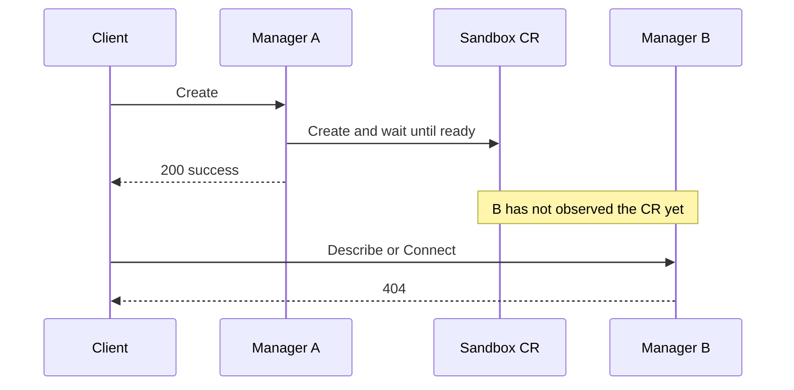
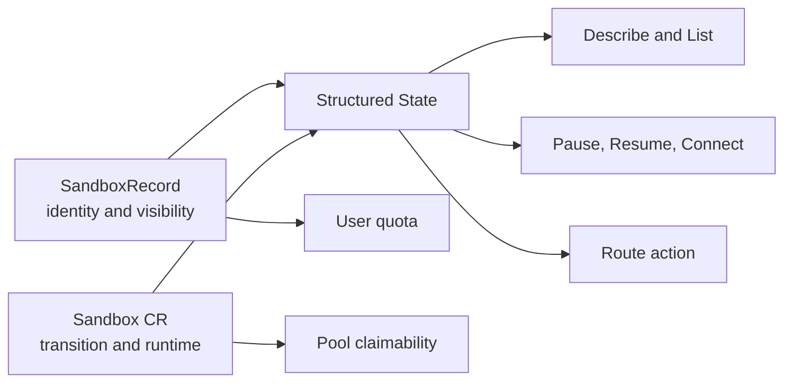
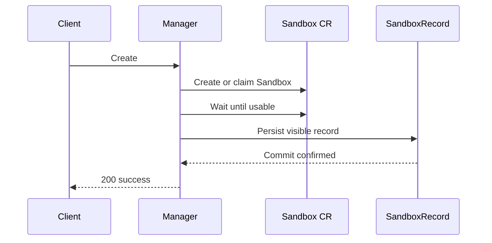
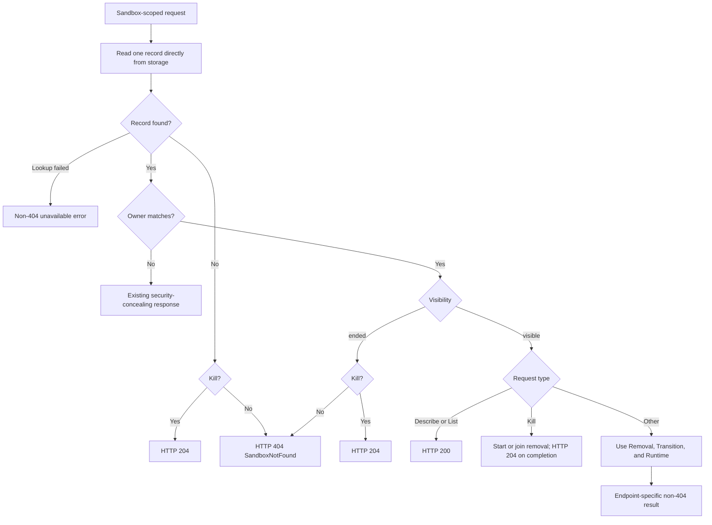
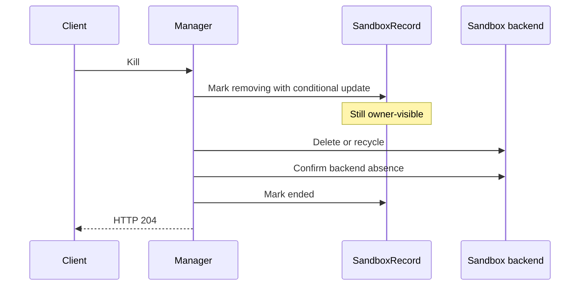

# Sandbox-manager Internal State Model

## Summary

This proposal gives sandbox-manager one simple visibility promise:

> After Create or Clone returns success, the correct owner does not receive HTTP 404 for that
> Sandbox until removal is complete. Kill returns HTTP 204 for the correct owner and also when the
> Sandbox is already absent.

The promise covers temporary unready workloads, paused workloads, completed workloads, deletion in
progress, stale informer caches, and a missing Sandbox CR during removal. Those situations may make
an operation fail, but they must not be reported as “Sandbox not found”.

Two changes are required together:

1. Replace the flat lifecycle enum with a structured state. Visibility, removal, transition, and
   runtime answer different questions and no longer overwrite one another.
2. Add a small persistent visibility record. A Sandbox CR and a Route are not sufficient evidence
   that a successfully delivered Sandbox exists: either can disappear or arrive late. The record is
   written before Create succeeds and is ended only after removal is confirmed.

The public E2B model does not change. It still exposes only `running` and `paused`.

## Why is the current model unsafe?

Today, one value such as `running`, `paused`, or `dead` is asked to answer several unrelated
questions:

- Does this Sandbox belong to a user?
- Has it been successfully delivered?
- Is deletion in progress?
- Is Pause or Resume in progress?
- Can the workload serve traffic now?

The current `dead` value can mean deletion, completion, an expired deadline, or a temporarily false
Ready condition. Once these facts are collapsed, callers cannot distinguish “the Sandbox does not
exist” from “the Sandbox exists but cannot perform this operation”. That causes false HTTP 404,
removes routes too early, and can leave a user paying quota for a Sandbox that Describe cannot see.

The following failure is possible even with a better in-memory enum:



Changing `dead` to more names does not close this gap. An authoritative record must survive cache
delay and the removal interval.

## Was the earlier eight-state model reasonable?

It was a useful diagnosis, but it should not be the final model. The eight values were not eight
peers; they described three different kinds of fact, plus pool selection.

| Earlier state | What it actually described | Decision |
|---|---|---|
| `claimable` | Whether a pool object can be selected | Keep a separate pool predicate. It is not an owner lifecycle state. |
| `running` | Runtime is ready | Keep as `Runtime=ready`. |
| `pausing` | Pause direction | Keep as `Transition=pausing`. |
| `paused` | Runtime is paused | Keep as `Runtime=paused`. |
| `resuming` | Resume direction | Keep as `Transition=resuming`. |
| `unready` | Runtime cannot safely serve | Keep as `Runtime=unready`, but never use it as proof of absence. |
| `terminating` | Removal has started | Rename to `Removal=removing`; keep the Sandbox owner-visible until removal completes. |
| `completed` | Workload reached Succeeded or Failed | Keep as `Runtime=completed`; completion alone does not end visibility. |

A flat enum forces a global priority. For example, a Sandbox can be both `completed` and
`removing`; a pause can be in progress while the workload is still `ready`. A structured state
keeps both facts instead of discarding one.

## What changes?

### 1. A structured observation

The provider returns one read-only structure derived from the visibility record and the latest
Sandbox CR observation:

```text
State {
    Visibility: hidden | visible | ended
    Removal:    none | removing | complete
    Transition: none | pausing | resuming
    Runtime:    ready | paused | unready | completed
}
```

Each field answers one question:

| Field | Question |
|---|---|
| Visibility | May the correct owner still resolve and list this Sandbox? |
| Removal | Has removal started, and has it been confirmed complete? |
| Transition | Is an ordinary Pause or Resume request in progress? |
| Runtime | What can the workload do now? |

Pool claimability and quota are not fields in State. They have separate rules described below.

Only these visibility/removal combinations are valid:

| Visibility | Removal | Meaning |
|---|---|---|
| hidden | none or removing | Internal pool or failed pre-delivery object; never returned successfully to a user. |
| visible | none | Successfully delivered and not being removed. |
| visible | removing | Removal is in progress; owner APIs still resolve it. |
| ended | complete | Removal is confirmed; non-Kill owner APIs may now return 404. |

Transition and Runtime cannot change Visibility. This is the central invariant.

### 2. A persistent visibility record

Every Sandbox that may be returned by Create or Clone has a manager-owned `SandboxRecord`. This is
a small catalog entry, not a second copy of the Sandbox CR.

It stores only the information needed to keep identity and visibility stable:

- final Sandbox ID;
- owner identity;
- Sandbox namespace, name, and UID;
- `hidden`, `visible`, or `ended` visibility;
- whether removal is in progress;
- the last public description needed to answer Describe while the CR is temporarily unavailable;
- a version used for conditional updates.

The record does not store Ready conditions, pause conditions, controller phases, or route policy.
Those facts continue to come from the Sandbox CR.



The catalog is owned by sandbox-manager, not by E2B handlers and not by the Sandbox Controller.
Manager exposes lookup and lifecycle operations that do not mention HTTP or E2B. E2B maps their
outcomes to HTTP.
A Kubernetes-backed implementation, if selected, belongs behind that Manager contract and must not
create an API-to-Infra shortcut.

## How is State derived?

### Visibility and removal

Visibility comes from `SandboxRecord`, not from Ready, phase, Route presence, or wall-clock time.

| Record fact | State |
|---|---|
| Record has not been delivered | hidden; removal is none or removing |
| Create or Clone delivery was committed | visible + none |
| A user Kill or automatic cleanup was durably accepted | visible + removing |
| Backend absence and quota release were confirmed | ended + complete |

A deletion timestamp, Recycling phase, Terminating phase, or persisted cleanup request starts
removal work, but does not hide a delivered Sandbox. The Manager records `removing` and keeps
Visibility visible.

An expired `ShutdownTime` also does not directly end visibility. It asks the Controller or Manager
to start cleanup. Visibility changes to ended only after cleanup is confirmed.

Unexpected CR absence without a recorded removal request does not end visibility. The Sandbox
becomes `Runtime=unready`, owner requests receive a non-404 unavailable response where necessary,
and recovery reports or repairs the orphaned record.

### Transition

Completed phases always use `Transition=none`. Otherwise, use the first matching rule:

| Value | Rule |
|---|---|
| resuming | Phase is Resuming; or phase is Paused, Paused is true, and `spec.paused=false`; or phase is Running, Resumed is true, and RuntimeInitialized exists but is not true. |
| pausing | Phase is Running with `spec.paused=true`; or phase is Paused before Paused becomes true. |
| none | No ordinary user-facing Pause or Resume is in progress. |

The exact post-resume initialization case wins over a newly requested pause. This prevents an
opposite-direction operation from interrupting unfinished resume initialization.

An Upgrading phase remains `Transition=none`, even when the Controller internally wakes a paused
workload during an upgrade. That work is not an ordinary Resume request.

### Runtime

Use the first matching rule:

| Value | Rule |
|---|---|
| completed | Phase is Succeeded or Failed. |
| paused | Phase is Paused and the Paused condition is true. |
| ready | Phase is Running, Ready is true, a route address exists, and no known unsafe in-place update is active. |
| unready | Every other observation, including Pending, Upgrading, a missing CR, missing Ready or address, an unsafe in-place update, empty phase, and unknown future phases. |

Runtime is deliberately conservative: unknown observations become unready and traffic is denied.
They do not become absent.

## How does Create establish the guarantee?

Create and Clone use the following order:



The ordering creates a hard boundary:

- If record persistence fails, Create does not return success.
- If the record is committed but the response is lost, later requests may see an extra Sandbox;
  they do not see a successful Sandbox disappear.
- Every Sandbox-scoped request reads the source record directly from storage before deciding
  identity, ownership, or HTTP 404. A cache may speed up other work, but it cannot make that final
  decision. If storage is unavailable, Manager returns an unavailable error, not 404.

An informer-only implementation cannot meet the contract. An informer may still contain an ended
record after a same-name Sandbox has been recreated, or an old visible record with the previous
owner. If the catalog is backed by Kubernetes, each Sandbox-scoped request therefore needs an
explicitly approved direct-Get exception. Direct List is not required and remains prohibited.

## How does an ordinary request work?

Lookup and owner checking happen before runtime policy:



Only confirmed catalog absence or `Visibility=ended` means “not found” for the correct owner.
Runtime, Transition, a missing Route, and a missing Sandbox CR never do.

List uses the catalog cache and includes visible records, including removal in progress. It may be
eventually consistent across Managers; the strict contract in this proposal concerns false HTTP
404 on Sandbox-scoped requests. A later proposal would be required if List itself must be globally
linearizable.

## How does Kill work?

Kill remains idempotent: “already absent” is success.



The exact rules are:

1. No record or an ended record returns HTTP 204. A backend NotFound confirms absence; Manager
   marks an existing record ended before returning HTTP 204.
2. The first Kill marks the record removing before deleting the backend.
3. Concurrent and repeated Kill requests join the same removal instead of failing.
4. Describe and List keep returning the Sandbox while removal is in progress. Other operations use
   non-404 conflict or unavailable responses.
5. The record becomes ended only after backend absence is confirmed and the Sandbox no longer
   counts against user quota.
6. If deletion times out or Manager crashes, the record remains visible + removing. A recovery
   reconciler resumes confirmation. It must not convert uncertainty into 404.
7. The durable transition to ended is the completion point of Kill. Kill returns HTTP 204 after
   that transition.

Wrong-owner behavior remains security-concealing and is outside the correct-owner visibility
contract. Authorization failures must never delete another owner's Sandbox.

## What does each E2B API return?

Public projection has one rule:

- visible + no removal + no transition + ready becomes `running`;
- every other visible combination becomes `paused`.

The public body never contains `dead`, `completed`, `removing`, `unready`, or a diagnostic reason.

| E2B API | Accepted structured state | Result for other owner-visible states |
|---|---|---|
| Create / Clone | Commit `visible + none + none + ready` before returning success. | Preserve existing pre-delivery errors. |
| List | Every `Visibility=visible` record, regardless of Removal, Transition, or Runtime. | Return `running` only for `visible + none + none + ready`; every other included record is `paused`. |
| Describe | Every `Visibility=visible` record, regardless of Removal, Transition, or Runtime. | HTTP 200 with `running` or `paused`, even if the CR is temporarily missing. |
| Pause | `Visibility=visible + Removal=none`: start from `Transition=none + Runtime=ready`, join `Transition=pausing` with its current Runtime, or skip `Transition=none + Runtime=paused`. | resuming or removing: HTTP 409; `Transition=none + Runtime=unready/completed`: HTTP 409. |
| Resume | `Visibility=visible + Removal=none`: start from `Transition=none + Runtime=paused`, join `Transition=resuming` with its current Runtime, or skip `Transition=none + Runtime=ready`. | pausing or removing: HTTP 409; `Transition=none + Runtime=unready/completed`: HTTP 409. |
| Connect | `Visibility=visible + Removal=none`: return `Transition=none + Runtime=ready`, or start/join Resume from `Transition=none + Runtime=paused` or `Transition=resuming` with its current Runtime. | pausing or removing: HTTP 409; `Transition=none + Runtime=completed`: HTTP 400; `Transition=none + Runtime=unready`: HTTP 503. |
| Snapshot | `Visibility=visible + Removal=none + Transition=none + Runtime=ready`. | HTTP 400; do not modify the Sandbox. |
| Set timeout | `Visibility=visible + Removal=none + Transition=none + Runtime=ready`. | HTTP 500; do not modify the deadline. |
| Update network | `Visibility=visible + Removal=none + Transition=none + Runtime=ready`. | HTTP 409; do not modify the Sandbox. |
| Browser use | `Visibility=visible + Removal=none + Transition=none + Runtime=ready`. | HTTP 500. |
| Kill | Correct owner with `Visibility=visible` in every Removal, Transition, and Runtime combination; also confirmed absence and concurrent backend NotFound. | Return HTTP 204. |

The Set timeout accepted state is exactly the public `running` projection. Direct Set timeout uses
`UpdatePolicyAlways`, so it may replace the current deadline. Pause owns the paused-retention
deadline, while Resume first writes a temporary deadline for timed Sandboxes and then finishes with
`UpdatePolicyExtendOnly`. Allowing direct Set timeout during pausing or resuming would race with
those writes.

Paused remains rejected for SDK compatibility: an old SDK calls Set timeout first and calls Resume
only after that request fails. Returning HTTP 204 for a paused Sandbox would make the SDK believe
that resume had completed. Connect and Resume may update timeout internally as part of recovery,
but that does not make the direct timeout endpoint valid for paused or transitional states.

Set timeout therefore continues to return HTTP 500 for paused, unready, pausing, resuming,
completed, or removing Sandboxes. Lookup must still resolve every visible Sandbox before applying
this running-only gate, so these rejections cannot be reported as HTTP 404.

E2B performs only protocol mapping. It does not inspect raw CR phase, conditions, routes, cleanup
annotations, or deadlines.

## How does routing work?

Routes carry an action, not lifecycle state:

| Structured state | Route action |
|---|---|
| ended, removing, or informer deletion | Delete |
| visible + no removal + no transition + ready | Allow |
| Every other combination, including hidden, paused, unready, and completed | Deny |

Only Allow forwards traffic. Deny keeps a non-forwarding route. Delete removes the data-plane route,
but does not remove the owner-visible catalog record. A completed Sandbox therefore keeps a Deny
route until removal starts.

For the same Sandbox UID and resource version, the safe order remains
`Delete > Deny > Allow`. Unknown actions fail closed. Route presence or absence is never proof that
the Sandbox exists or belongs to the caller.

During a mixed-version rollout, route messages temporarily carry both action and legacy state. The
compatibility conversion encodes Allow as `running`, Deny as `paused`, and Delete as `dead`. New
peers prefer the action; unknown input always denies traffic.

## How does quota remain consistent?

User quota follows the visibility record:

| Record state | User active-Sandbox quota |
|---|---|
| hidden pre-delivery artifact | Does not count as a delivered user Sandbox. Resource-leak capacity is guarded separately. |
| visible + none | Counts and Describe returns HTTP 200. |
| visible + removing | Counts until backend removal is confirmed; Describe still returns HTTP 200. |
| ended + complete | Does not count; non-Kill APIs may return HTTP 404. |

This creates a directly testable invariant:

> If a Sandbox counts against a user's active-Sandbox quota, that same user can Describe it with
> HTTP 200.

Hidden failed Create or Clone artifacts cannot silently consume user quota. They remain visible to
operator leak accounting and cleanup, so excluding them from user quota does not remove capacity
protection.

## Failure handling

Uncertainty fails toward visibility, not absence:

| Failure | Required behavior |
|---|---|
| Record cache hit or miss | Read that one record directly from storage before deciding identity, owner, or 404. |
| Record storage unavailable | Return 5xx/503, never 404. |
| Sandbox CR missing but visible record remains | Describe 200 as paused; operations return a non-404 unavailable or conflict response. |
| Route missing | Rebuild or deny traffic; never use it as existence evidence. |
| Delete or recycle times out | Keep visible + removing and retry recovery. |
| Manager crashes during Kill | Another Manager or reconciler resumes from the durable removing record. |
| Unknown phase or condition | Runtime unready and Route Deny; visibility unchanged. |
| Unexpected backend disappearance | Keep the record visible and report unready until an authorized removal is confirmed. |

This proposal prefers a temporarily stale HTTP 200 or an explicit 5xx over a false HTTP 404. That
choice is intentional: 404 tells clients that identity is gone and often triggers irreversible
cleanup or recreation.

## Rollout

The change is delivered in five steps, but the owner-visible contract is enabled only after all
required readers understand it:

1. Add the manager-owned record schema and store. An update succeeds only when the stored version
   has not changed, and a recovery loop finishes interrupted removals.
2. Write hidden records for new attempts, commit visible before Create or Clone success, and make
   Kill follow the removing-to-ended sequence.
3. Move Manager lookup, quota, Describe, List, and all Sandbox-scoped operations to the record. A
   request reads its record directly from storage and storage failure maps to non-404.
4. Replace the flat lifecycle value with structured State and migrate Manager and Gateway route
   decisions atomically.
5. Migrate E2B protocol mapping, enable the guarantee, then remove legacy route state after every
   supported peer understands Route action.

During steps 1–4, the old behavior remains authoritative. Do not claim the no-false-404 guarantee
until Create, lookup, Kill, quota, recovery, and E2B mapping have all moved together.

The existing eight-state OpenSpec material is superseded by this proposal and must be updated before
implementation. The new record is persistent, so this is no longer a “no migration” state-only
change. Its schema, cleanup policy, upgrade behavior, and rollback behavior must be specified with
the implementation.

## Verification

### State rules

1. Test each field independently and in useful combinations: pausing + ready, resuming + paused,
   completed + removing, and unknown phase + unready.
2. Verify Ready false, Succeeded, Failed, Upgrading, an expired ShutdownTime, and a missing CR do not
   change a visible record to hidden or ended.
3. Verify completed maps to Route Deny and removing maps to Route Delete.

### Visibility contract

1. After every successful Create or Clone, send Describe and Connect through a different Manager
   before its Sandbox informer catches up. Describe must be 200; Connect may succeed or return a
   non-404 unavailable response.
2. Repeat the same check for ready, paused, pausing, resuming, unready, completed, and removing
   observations. None may produce a state-driven 404.
3. Remove the Route and temporarily hide the Sandbox CR from the reader. A visible record must still
   produce Describe 200.
4. Make the record store unavailable. The result must be 5xx/503, not 404.

### Kill and recovery

1. Verify Kill returns HTTP 204 before, during, and after removal, including record absence and
   concurrent backend NotFound.
2. While Kill is blocked after backend deletion but before the ended commit, verify Describe remains
   HTTP 200 from the record.
3. Crash the Manager after marking removing and after deleting the backend. Recovery must finish the
   same removal without a false 404.
4. Verify the record becomes ended only after backend absence is confirmed.

### Quota and compatibility

1. For every quota-counted record, assert owner Describe returns HTTP 200.
2. Verify hidden failed delivery attempts do not consume user active-Sandbox quota and remain in
   operator leak accounting.
3. Cover every E2B table row and assert successful bodies contain only `running` or `paused`.
4. Preserve pool, claim, waiter, and SandboxSet behavior with their purpose-specific tests.
5. Compare Manager and Gateway Route results and preserve same-version
   `Delete > Deny > Allow` ordering.

## Alternatives considered

- **Keep eight or seven flat states:** rejected because visibility, removal, transition, and runtime
  overlap and still require a global priority.
- **Change only the HTTP mapping:** rejected because another Manager can still miss the CR and Route,
  and removal can delete both before Kill completes.
- **Use Route as the visibility record:** rejected because Route is a data-plane cache, may be
  intentionally deleted during removal, and is not an ownership authority.
- **Use only the Sandbox CR:** rejected because informer delay and deletion leave a window in which
  a successfully delivered Sandbox cannot be resolved.
- **Treat store failure as absence:** rejected because it recreates the false-404 bug at a different
  layer.
- **Make every Manager observe List changes at exactly the same time:** deferred because the stated
  contract is no false 404 for Sandbox-scoped requests. It would require a stronger catalog List
  path and a separate cost review.

## Implementation history

- 2026-07-15: Initial lifecycle-state exploration created a broader shared model.
- 2026-07-16: The design was narrowed to a sandbox-manager-oriented eight-state model.
- 2026-07-17: The design adopted the shared Sandbox provider and one canonical route path.
- 2026-07-28: Simplified the proposal and documented per-API E2B behavior.
- 2026-08-17: Replaced the flat model with structured state, added the persistent visibility record,
  made Kill idempotent, and prohibited false HTTP 404 from successful delivery through confirmed
  removal.
- 2026-08-18: Clarified four-dimensional E2B operation gates and kept direct Set timeout
  running-only.
