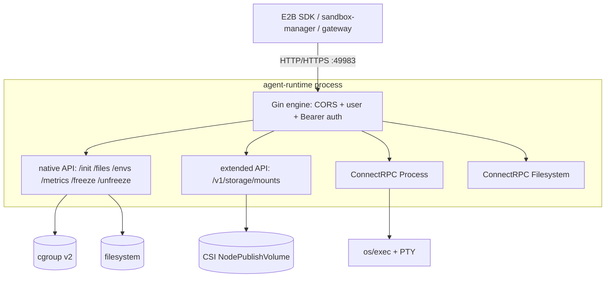

# Agent Runtime (envd-compatible in-sandbox runtime)

## Table of Contents

- [Agent Runtime (envd-compatible in-sandbox runtime)](#agent-runtime-envd-compatible-in-sandbox-runtime)
  - [Table of Contents](#table-of-contents)
  - [Glossary](#glossary)
  - [Summary](#summary)
  - [Motivation](#motivation)
    - [Goals](#goals)
    - [Non-Goals/Future Work](#non-goalsfuture-work)
  - [Proposal](#proposal)
    - [Architecture Overview](#architecture-overview)
    - [Control Plane vs Data Plane](#control-plane-vs-data-plane)
    - [HTTP API Surface](#http-api-surface)
      - [Native (E2B/envd-compatible) API](#native-e2benvd-compatible-api)
      - [Extended API (CSI mount)](#extended-api-csi-mount)
      - [ConnectRPC services](#connectrpc-services)
    - [Data-plane Services](#data-plane-services)
    - [Cross-cutting Concerns](#cross-cutting-concerns)
      - [Authentication and signing](#authentication-and-signing)
      - [User and path resolution](#user-and-path-resolution)
      - [cgroup v2, freeze/thaw and pause/resume](#cgroup-v2-freezethaw-and-pauseresume)
      - [`/init` lifecycle and idempotency](#init-lifecycle-and-idempotency)
      - [Metadata (MMDS) and metrics](#metadata-mmds-and-metrics)
      - [Logging and observability](#logging-and-observability)
      - [TLS/mTLS](#tlsmtls)
    - [Deployment Modes](#deployment-modes)
      - [D1. `envd` mode](#d1-envd-mode)
      - [D2. `local` mode](#d2-local-mode)
      - [D3. `helper` mode (agent-helper sub-module)](#d3-helper-mode-agent-helper-sub-module)
    - [Sub-module: agent-helper](#sub-module-agent-helper)
    - [Startup and staging](#startup-and-staging)
    - [Requirements](#requirements)
      - [Functional Requirements](#functional-requirements)
      - [Non-Functional Requirements](#non-functional-requirements)
    - [Risks and Mitigations](#risks-and-mitigations)
  - [Alternatives](#alternatives)
  - [Upgrade Strategy](#upgrade-strategy)
  - [Test Plan](#test-plan)
  - [Implementation Plan (Phased)](#implementation-plan-phased)
  - [Implementation History](#implementation-history)

## Glossary

- **agent-runtime**: The in-sandbox runtime service that exposes an E2B/envd-compatible HTTP API plus ConnectRPC
  process/filesystem services, extended with CSI mounting, cgroup freeze/thaw, and port forwarding. Code lives under
  `pkg/agent-runtime/` and `cmd/agent-runtime/`.
- **agent-helper**: A lightweight in-container data-plane binary used only in helper mode. It serves the process,
  filesystem, fileio, freeze, metrics and port-forward ConnectRPC services over a UNIX domain socket. Code lives under
  `pkg/agent-runtime/helper/` and `cmd/agent-helper/`.
- **envd**: The E2B community sandbox daemon whose HTTP/RPC contract agent-runtime is compatible with, so the E2B SDK and
  the sandbox-manager/gateway can talk to it unchanged.
- **Control plane**: HTTP/HTTPS serving, auth/signing, TLS, CORS, routing, `/init` state, and streaming relay.
- **Data plane**: The native execution behind an endpoint — process spawn/PTY/signal, filesystem CRUD/watch, file byte
  read/write, cgroup placement/freeze, metrics sampling, and port forwarding.
- **UDS**: UNIX domain socket used as the sidecar↔helper transport in helper mode.
- **Executor**: A per-service abstraction (`ProcessExecutor`, `FilesystemExecutor`, `MountExecutor`) that isolates the
  deployment-mode-specific execution strategy.

## Summary

`agent-runtime` is the process that runs inside (or beside) every sandbox Pod and gives the outside world a uniform,
E2B/envd-compatible way to drive that sandbox: start and attach to processes, read and write files, mount storage,
sample metrics, freeze/thaw the workload around pause/resume, and forward listening ports to the Pod gateway. It is one
of the five OpenKruise Agents components and is the single API endpoint the sandbox-manager, sandbox-gateway and the E2B
SDK talk to on the standard port `49983`.

This proposal documents the agent-runtime component as a whole: its control-plane/data-plane split, its HTTP and
ConnectRPC surface, the cross-cutting concerns (auth/signing, cgroup freeze, `/init` lifecycle, TLS, metrics), and — as a
first-class sub-module — the three deployment modes it supports (`envd`, `local`, `helper`). Helper mode (the
`agent-helper` binary) is treated here as a data-plane sub-module of agent-runtime rather than a standalone component,
because it exists only to serve agent-runtime's sidecar over a UDS and shares the same service implementations. The
detailed helper-mode design is captured separately in
[20260708-agent-runtime-helper-mode.md](./20260708-agent-runtime-helper-mode.md); this document is the umbrella that
places it in the context of the whole runtime.

## Motivation

agent-runtime has grown organically alongside the controller, sandbox-manager and gateway, and now carries a broad
surface: E2B compatibility, CSI mounting, cgroup freeze semantics for pause/resume, and a sidecar/helper split. That
breadth is spread across many packages (`openapi/`, `services/`, `auth/`, `host/`, `helper/`, `helperclient/`), and the
only existing design record is the narrow helper-mode proposal. There is no single document that:

- states the component's responsibilities and the invariants that keep it E2B-compatible,
- names the control-plane/data-plane boundary that every deployment mode must preserve,
- enumerates the API surface and which parts are backed natively vs delegated to the helper, and
- explains how the three deployment modes relate, so contributors can reason about where new behavior belongs.

Writing this down reduces onboarding cost, prevents accidental control-plane/data-plane coupling, and gives a stable
reference for future work (CRI executor, CA bundle install, richer metrics).

### Goals

- Provide a component-level design record for agent-runtime that is faithful to the current implementation.
- Define the control-plane/data-plane boundary and the executor abstraction as an explicit invariant.
- Document the full HTTP and ConnectRPC surface and its E2B/envd-compatibility guarantees.
- Position `agent-helper` as a data-plane sub-module of agent-runtime and cross-reference the helper-mode proposal.
- Capture the deployment modes (`envd`/`local`/`helper`) and how a single image and entrypoint select between them.

### Non-Goals/Future Work

- The full helper-mode design detail (transport, peer verification, per-service delegation) — owned by
  [20260708-agent-runtime-helper-mode.md](./20260708-agent-runtime-helper-mode.md).
- Controller/webhook injection of the helper (shared `emptyDir`, postStart launch, exec-probe wiring, RBAC/manifests)
  remains future work and is only sketched here.
- A CRI/DaemonSet-based executor is anticipated by the interfaces but out of scope.
- Changing the external E2B/envd contract is a non-goal; compatibility is an invariant.

## Proposal

### Architecture Overview

agent-runtime is a Gin HTTP(S) server that fronts a set of ConnectRPC services and native OS operations. It binds
`0.0.0.0:49983` (aligned with community envd, see `cmd/agent-runtime/options/flag.go`) and optionally an HTTPS listener
that shares the same `gin.Engine` and routes.

The same binary supports three deployment topologies, selected by `--runtime-mode` and the entrypoint's `RUNTIME_MODE`
(see [Deployment Modes](#deployment-modes)). In helper mode the process/filesystem routes and the file/metric/freeze
data plane are relayed to the `agent-helper` sub-module over a UDS, while everything else stays in the sidecar.

### Control Plane vs Data Plane

The central invariant is a clean split:

- **Control plane (always in agent-runtime):** HTTP/HTTPS serving, CORS, Bearer auth and file signing, TLS/mTLS
  termination, route composition, the `/init` state machine (token, default user/workdir, env vars, idempotency gate),
  server-/client-streaming relay, and the CSI driver socket + mount-root discovery.
- **Data plane (native, mode-dependent placement):** process spawn/PTY/signal/stdin, filesystem CRUD/watch, file byte
  read/write (fileio), cgroup placement and freeze/thaw, metrics sampling, and port forwarding via socat.

Each data-plane service is reached through an executor interface so the deployment mode is a wiring decision, not a
behavior change:

- Process: `ProcessExecutor` (`pkg/agent-runtime/services/process/executor.go`), local executor in
  `executor_local.go`; the interface already anticipates a future `CRIExecutor`.
- Filesystem: `FilesystemExecutor` (`pkg/agent-runtime/services/filesystem/executor.go`) with `LocalFilesystemExecutor`.
- Mount: `MountExecutor` (`pkg/agent-runtime/openapi/extendedapi/mount_executor.go`) with `LocalMountExecutor` and
  `HelperMountExecutor`.

Mode-specific wiring is concentrated in `pkg/agent-runtime/routers.go` via `pickFreezer` and `pickMountExecutor`, and by
mounting either the local process/filesystem services or a transparent reverse-proxy to the helper.

### HTTP API Surface

#### Native (E2B/envd-compatible) API

Registered in `pkg/agent-runtime/openapi/nativeapi/api_def.go` (`WrapOpenAPIAsNativeE2BRoutes`):

| Method + Path | Responsibility |
|---|---|
| `GET /health` | Public liveness probe; returns `204 No Content` with `Cache-Control: no-store`. Registered in `routers.go`, excluded from auth and access logging. |
| `GET /envs` | Returns the runtime's default env vars (from in-memory `Defaults.EnvVars`). |
| `GET /files` | File download. Supports `Accept-Encoding: gzip`, HTTP `Range` (`206`), conditional `If-Modified-Since`/`If-None-Match`/`If-Range` (`304`), and `Content-Disposition`. Uses `http.ServeContent` locally. |
| `POST /files` | File upload. Supports `multipart/form-data` and raw `application/octet-stream`, `Content-Encoding: gzip`, parent-dir creation, and ownership by resolved user. |
| `POST /files/compose` | Concatenate an ordered list of source files into a destination and remove sources; local path uses temp-file + atomic rename (`copy_file_range` via `ReadFrom`). |
| `POST /init` | Sandbox lifecycle init: set access token, default user/workdir, env vars, and (deferred) thaw on resume. Idempotent via a timestamp gate. |
| `POST /freeze`, `POST /unfreeze` | Orchestrator-driven cgroup freeze/thaw around pause/resume. |
| `GET /metrics` | Point-in-time CPU/memory/disk sample. |

E2B/envd compatibility (status codes, headers, gzip/Range semantics, `/init` token rules) is an invariant; deviations
are called out in code comments (e.g. no MMDS-gated token reset in the K8s sidecar).

#### Extended API (CSI mount)

Registered in `pkg/agent-runtime/openapi/extendedapi/`:

| Method + Path | Responsibility |
|---|---|
| `POST /v1/storage/mounts` | Mount a CSI volume: resolve a `MountProvider` by driver, find the mount-root from `/proc/mounts`, run CSI `NodePublishVolume`, then create a user-facing symlink. Retries with exponential backoff. |

Providers self-register into a global registry (`registry.go`) from `init()`; the built-in `CSIMountProvider` supports
Alibaba Cloud NAS/OSS/CustomFuse drivers and injects `sandboxId` for OSS `agent-identity` auth from the token dir. See
[20260608-dynamic-csi-mount.md](./20260608-dynamic-csi-mount.md) for the mount design.

#### ConnectRPC services

Process and Filesystem are exposed as ConnectRPC services at their spec path prefixes (e.g. `/process.Process/Start`),
mounted onto the Gin engine in `routers.go`. Protobuf specs live under `pkg/agent-runtime/services/spec/`.

### Data-plane Services

Under `pkg/agent-runtime/services/`, each service is a native implementation that can run either in-process (local) or
inside the helper:

- **process**: process lifecycle and I/O — `List`/`Start`/`Connect`/`Update`/`StreamInput`/`SendInput`/`SendSignal`,
  including PTY allocation, TTY resize, and a persistent stdin proxy. Native cgroup FD placement via
  `clone3(CLONE_INTO_CGROUP)` when a manager is present.
- **filesystem**: metadata operations — `Stat`/`MakeDir`/`Move`/`ListDir`/`Remove` plus recursive `WatchDir`/watcher
  registry.
- **fileio**: byte transfer backing `GET`/`POST /files` and `/files/compose` — ranged `ReadFile` (returns metadata then
  ordered chunks), streamed `WriteFile`, `Compose`, and `CreateSymlink` (used by the helper mount executor). Provides
  full gzip/Range fidelity for file transfer.
- **freeze**: cgroup `freeze`/`unfreeze` over the `user`/`pty`/`socat` process-type set, with a context-cancellable
  serialization lock so a resume thaw can never be stranded.
- **metrics**: CPU/memory/disk sampling via `host.MetricsProvider` (gopsutil), sampled from the local host — which, in
  helper mode, is the business container itself.
- **port**: an autonomous scanner discovers listening TCP ports and a forwarder runs socat to the Pod gateway; a
  `PortForward` control service exposes `ListPorts`/`WatchPorts`/`OpenPort`/`ClosePort`. The socat data plane never
  crosses the UDS.
- **cgroups**: `Cgroup2Manager` (FD placement + `Freezer`) and a `NoopManager` fallback for cgroup-less environments.
- **symlink**: shared symlink creation with target-visibility waiting used by fileio/mount.

### Cross-cutting Concerns

#### Authentication and signing

`auth.BearerAuthMiddleware` validates `X-Access-Token` against configured tokens; `GET /health`, `GET /files`,
`POST /files` are allow-listed. When no tokens are configured, auth is a pass-through. For file endpoints,
`auth.ValidateSigning` supports signed URLs: `v1_base64(sha256(path:operation:username:accessToken[:expiration]))`,
allowing time-bounded download/upload without sending the token. The access token is established via `/init`.

#### User and path resolution

`permissions.GetUser` resolves named users from `/etc/passwd`, and for numeric UIDs falls back to a uid lookup or a
synthesized minimal identity — important for distroless/`runAsUser`-numeric images. `permissions.ExpandAndResolve`
expands `~`, resolves relative paths against the workdir, and `EnsureDirs` creates parent dirs with correct uid/gid.
This logic is shared by the local handlers and the helper's fileio/filesystem services so behavior is identical across
modes.

#### cgroup v2, freeze/thaw and pause/resume

Processes are placed into per-type cgroups (`user`/`pty`/`socat`) via `Cgroup2Manager` FDs; `ProcessTypeSystem` is
reserved for agent-runtime's own processes and is never frozen. Freeze/thaw writes `cgroup.freeze`, which survives VM
snapshots, so the orchestrator freezes just before snapshot and the matching thaw runs on `/init` (resume). This gives
atomic, race-free freeze semantics (no `echo $$ > cgroup.procs` race, no per-type freeze races).

#### `/init` lifecycle and idempotency

`POST /init` (`nativeapi/init_api_impl.go`) validates the token outside the idempotency gate, then applies env
vars/user/workdir/token under a lock guarded by a strictly increasing `Timestamp` (`lastSetTime`), skipping stale
replays. It always defers an unfreeze of the user cgroups (even on a skipped write) so a freshly snapshotted sandbox is
never left frozen, writes an initialized marker, and starts a Downward-API file watcher for token auto-recovery across
container restarts. `CaBundle` is accepted but not yet installed (logged as a TODO).

#### Metadata (MMDS) and metrics

`host/mmds.go` polls an AWS-compatible metadata endpoint (`169.254.169.254`) with a short-lived token to learn the
sandbox ID, template ID, and logs-collector address, writing `.E2B_SANDBOX_ID`/`.E2B_TEMPLATE_ID` under `/run/e2b`.
`host/metrics.go` provides CPU/memory/disk via a swappable `MetricsProvider` (real gopsutil provider by default; in
helper mode the sidecar swaps in one that samples via the helper's Metrics RPC).

#### Logging and observability

Logging uses klog via `logs.NewLoggerContext`/`NewNamedLogger`, with per-component named loggers and a monotonic
`operation_id` attached by a ConnectRPC unary interceptor and the streaming log wrappers. This complements the OTEL
tracing work in [20260702-sandbox-otel-distributed-tracing-en.md](./20260702-sandbox-otel-distributed-tracing-en.md).

#### TLS/mTLS

When enabled, an HTTPS server shares the same `gin.Engine`; `buildTLSConfig` loads the cert/key (TLS 1.2+) and, when a CA
file is provided, enables `VerifyClientCertIfGiven` for mutual TLS. Both HTTP and HTTPS are shut down gracefully on
SIGINT/SIGTERM.

### Deployment Modes

A single image (built from `dockerfiles/agent-runtime.Dockerfile`) supports three topologies. The entrypoint scripts
`cmd/agent-runtime/entrypoint.sh` and `entrypoint_inner.sh` stage binaries into `ENVD_DIR` and pick a mode from
`RUNTIME_MODE` (default `envd` for backward compatibility). The Go server itself selects `local` vs `helper` via
`--runtime-mode` (`ServerConfig.RuntimeMode`, `IsHelperMode()`).

#### D1. `envd` mode

Backward-compatible topology: the entrypoint stages the community `envd` binary and `envd-run.sh` and the business
container launches envd. agent-runtime's own server is not the data plane here; this mode exists for images that still
run upstream envd.

#### D2. `local` mode

agent-runtime runs directly inside the business container and executes every operation natively (native `os/exec`,
native cgroup FD placement, native filesystem/user view). This has the best execution fidelity but mixes the control
plane with the workload and is intrusive to the user image. `ServerConfig.RuntimeMode == "local"` (the default).

#### D3. `helper` mode (agent-helper sub-module)

agent-runtime runs as a **sidecar control plane**; a lightweight `agent-helper` runs inside the **business container**
as the data plane, and the two communicate over a UDS on a shared `emptyDir`. This combines local-mode execution
fidelity with sidecar isolation, without requiring `CAP_SYS_ADMIN` or host PID visibility. The full design (transport,
peer verification, per-service delegation) is in
[20260708-agent-runtime-helper-mode.md](./20260708-agent-runtime-helper-mode.md). At startup the sidecar blocks on
`helperclient.WaitReady` (exponential backoff on `GET /health` over the UDS) before serving traffic.

### Sub-module: agent-helper

`agent-helper` (`cmd/agent-helper/main.go`, `pkg/agent-runtime/helper/`) is the in-container data-plane counterpart used
only in helper mode. It is intentionally a **sub-module of agent-runtime**, not a separate component: it reuses the exact
same service implementations (process, filesystem, fileio, freeze, metrics, port) that local mode uses, exposed over a
UDS instead of TCP.

- **Transport & serving**: listens on a UDS (default `/var/run/agent-helper/helper.sock`, mode `0600`, dir `0700`),
  serves connectrpc over `h2c` so client-/server-streaming work, plus a plain `GET /health` for the readiness probe.
- **Services**: mounts process + filesystem + fileio + freeze + metrics, and (when port scanning is enabled) the
  `PortForward` control service, all in local execution mode.
- **Security boundary**: an `SO_PEERCRED` peer-uid allowlist restricts which local peer (the sidecar uid) may connect;
  the helper never elevates privileges and propagates native EPERM faithfully.
- **cgroup/metrics**: uses a real `Cgroup2Manager` for native FD placement/freeze and samples metrics from its own host
  (the business container), which is more faithful than the sidecar probing across namespaces.
- **Identity**: resolves the default user from `--default-user` or its own effective uid, mirroring the business
  container's `runAsUser` (including numeric/distroless cases).
- **Health subcommand**: `agent-helper health` performs a one-shot probe of the UDS for use as a Kubernetes exec probe,
  since kubelet cannot HTTP-probe a UDS-only server directly.

On the sidecar side, `pkg/agent-runtime/helperclient/` provides the UDS-dialing connectrpc clients (`FileIO`, `Freeze`,
`Metrics`), a transparent connectrpc reverse-proxy for process/filesystem (`FlushInterval = -1` so streaming relays
unbuffered), a `Freezer`/`MetricsProvider` adapter, and the readiness wait.

### Startup and staging

`cmd/agent-runtime/main.go` initializes flags, the cgroup manager, and the `ServerConfig`, waits for helper readiness in
helper mode, builds the HTTP server, optionally runs a start command and the local port forwarder (skipped in helper
mode, since the helper owns port forwarding), then serves. The entrypoint scripts stage the correct binary set per
`RUNTIME_MODE`; `entrypoint_inner.sh` additionally delivers internal-only artifacts (the `sandbox-runtime-storage`
binary and optional `run_with_envs.sh`).

### Requirements

#### Functional Requirements

- FR1: agent-runtime MUST expose the E2B/envd-compatible native API (`/health`, `/envs`, `/files`, `/files/compose`,
  `/init`, `/freeze`, `/unfreeze`, `/metrics`) on port 49983 with the documented status codes and headers.
- FR2: It MUST expose the extended CSI mount API (`POST /v1/storage/mounts`) with a pluggable provider registry.
- FR3: It MUST expose the Process and Filesystem ConnectRPC services (including PTY and streaming).
- FR4: `/init` MUST be idempotent under a timestamp gate and MUST always be able to thaw on resume.
- FR5: The data plane MUST be reachable identically in `local` and `helper` modes via the executor/relay abstraction,
  without changing the external contract.

#### Non-Functional Requirements

- NFR1: In helper mode the sidecar MUST require no elevated privileges (no `CAP_SYS_ADMIN`, no host PID visibility).
- NFR2: File transfer MUST support gzip and HTTP Range in every mode.
- NFR3: Freeze/thaw MUST be atomic (no `echo $$` race) and survive VM snapshots.
- NFR4: The sidecar MUST handle helper unavailability gracefully (bounded readiness wait, reverse-proxy `502`,
  freeze `503` when no freezer).
- NFR5: Cyclomatic complexity stays within the repo limit (gocyclo max 32) and all code carries the Apache header.

### Risks and Mitigations

- **Control/data-plane coupling drift**: new endpoints might execute business-container work in the sidecar. Mitigation:
  route every data-plane operation through an executor or the helper relay; keep `pickFreezer`/`pickMountExecutor` the
  single wiring point.
- **E2B compatibility regressions**: subtle header/status differences break the SDK. Mitigation: keep the E2B contract
  as an invariant, cover it with the E2B pytest suite under `test/e2b`.
- **Helper injection is unowned**: automated injection of the helper (shared `emptyDir`, postStart launch, exec probe,
  RBAC) is not yet implemented and spans controller/webhook. Mitigation: track as a dedicated phase; align with
  controller owners.
- **CA bundle not installed**: `/init` accepts `CaBundle` but does not install it. Mitigation: document as a known gap
  and implement for mTLS-to-egress scenarios.

## Alternatives

- **Keep only local mode**: simplest, but forces the full runtime into the user image and couples control plane with the
  workload. Rejected for multi-tenant isolation needs.
- **Make agent-helper a separate top-level component**: rejected — it shares agent-runtime's service implementations and
  exists solely to serve the sidecar; treating it as a sub-module keeps the code and the contract unified.

## Upgrade Strategy

- The default `RUNTIME_MODE` is `envd` and the default `--runtime-mode` is `local`, so existing deployments are
  unaffected.
- Opting into helper mode requires setting `RUNTIME_MODE=helper` (entrypoint) / `--runtime-mode=helper` (server), adding
  the shared `emptyDir` volume, and launching `agent-helper` in the business container.
- Port and API contract are unchanged across modes, so clients (SDK, gateway, sandbox-manager) need no changes.

## Test Plan

- Unit tests per package (target ≥80%): auth/signing, encoding/Range, upload/download/compose, `/init` idempotency,
  freeze/metrics services, mount executors, helper server endpoints, peercred, and helperclient (with a fake UDS
  connectrpc server). Table-driven per repo convention.
- E2B compatibility: the `test/e2b` pytest suite exercises the external contract.
- E2E: `test/e2e` covers the local and helper deployment topologies end to end (out of scope to run here).

## Implementation Plan (Phased)

Most of the component is already implemented; the remaining work is the helper injection phase.

- P1 (done): native + extended HTTP API, process/filesystem ConnectRPC, auth/signing, TLS, cgroup freeze, `/init`.
- P2 (done): fileio/freeze/metrics/port services and the `local`/`helper` executor split + reverse-proxy relay.
- P3 (done): `agent-helper` binary, UDS serving, SO_PEERCRED, health exec probe, helperclient + readiness.
- P4 (future): controller/webhook injection of the helper (shared `emptyDir`, postStart launch, exec-probe wiring,
  RBAC/manifests).
- P5 (future): `CaBundle` install; richer metrics; anticipated `CRIExecutor`.

## Implementation History

- [ ] 2026-07-20: Initial component-level draft; positions agent-helper as a sub-module and references the helper-mode
  proposal.
