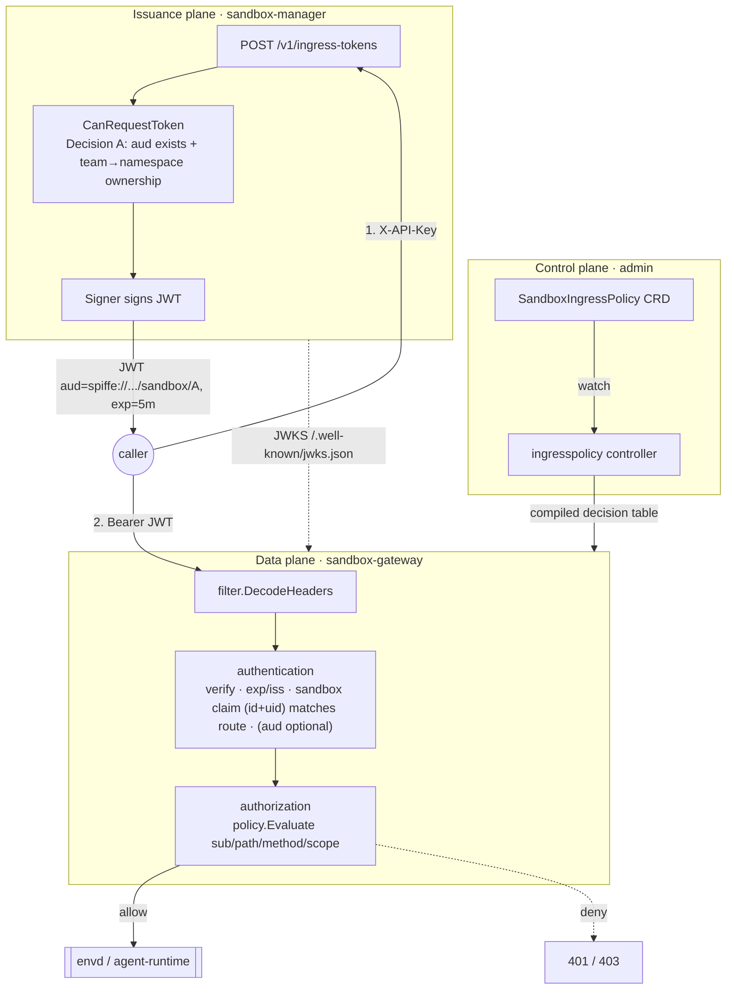
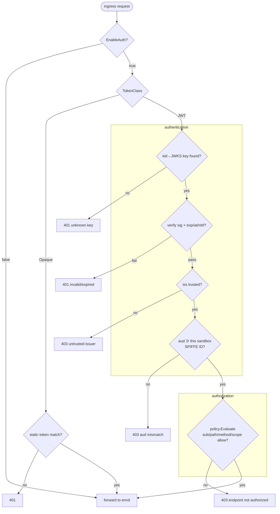
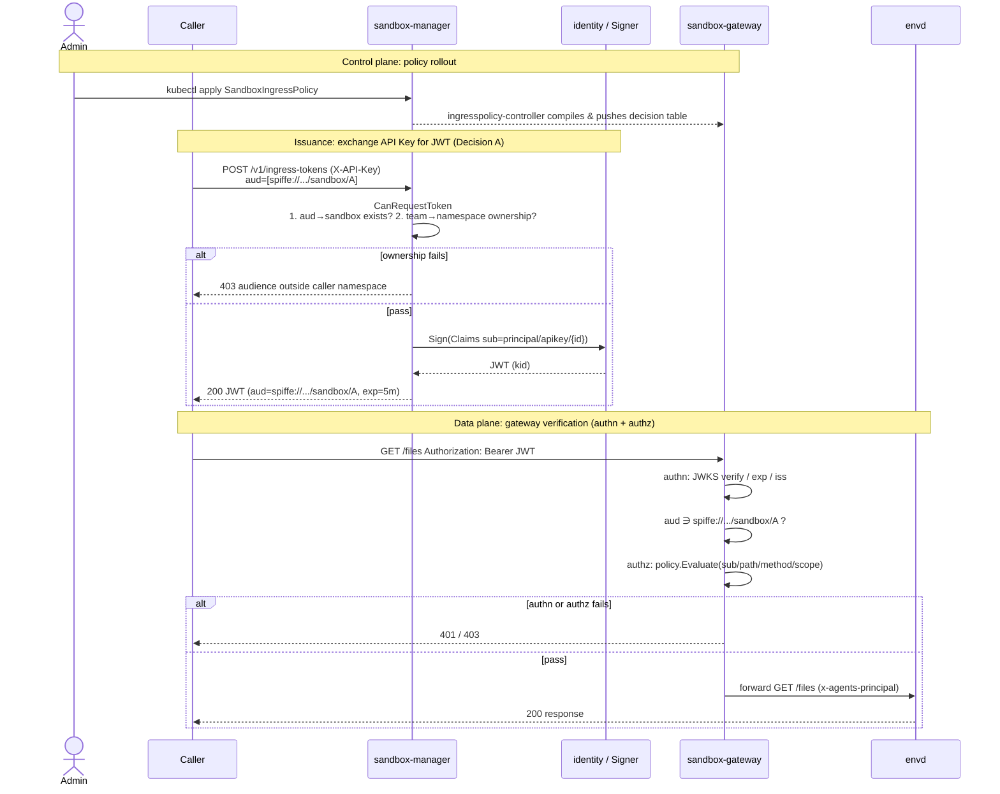

# Sandbox Ingress (envd) Token Authentication and aud Authorization

> Feature gate: `SandboxIngressJWTAuth` (gateway + manager, Alpha, disabled by default).

## Table of Contents

- [Summary](#summary)
- [Motivation](#motivation)
- [Glossary](#glossary)
- [Baseline (Current State)](#baseline-current-state)
- [Proposal](#proposal)
    - [Architecture: three planes](#architecture-three-planes)
    - [Identity and aud semantics (SPIFFE)](#identity-and-aud-semantics-spiffe)
    - [Token structure](#token-structure)
    - [Issuance flow (sandbox-manager + identity)](#issuance-flow-sandbox-manager--identity)
        - [Issuance credential: reuse the existing Team API Key](#issuance-credential-reuse-the-existing-team-api-key)
        - [Issuer-side authorization: CanRequestToken (Decision A)](#issuer-side-authorization-canrequesttoken-decision-a)
        - [Pluggable Signer detailed design](#pluggable-signer-detailed-design)
        - [Issuer-side SDK design (extending the E2B SDK)](#issuer-side-sdk-design-extending-the-e2b-sdk)
    - [Verification flow (sandbox-gateway filter)](#verification-flow-sandbox-gateway-filter)
        - [JWKS retrieval and caching](#jwks-retrieval-and-caching)
        - [Verification chain: authentication + authorization](#verification-chain-authentication--authorization)
    - [Admin authorization: SandboxIngressPolicy CRD](#admin-authorization-sandboxingresspolicy-crd)
    - [Two-sided enforcement and consistency](#two-sided-enforcement-and-consistency)
    - [Revocation and key rotation](#revocation-and-key-rotation)
    - [End-to-end sequence](#end-to-end-sequence)
- [User Stories](#user-stories)
- [Requirements](#requirements)
- [Risks and Mitigations](#risks-and-mitigations)
- [Alternatives](#alternatives)
- [Upgrade Strategy](#upgrade-strategy)
- [Test Plan](#test-plan)
- [Implementation History](#implementation-history)

## Summary

This proposal introduces JWT-based authentication and **audience (aud)
authorization** for the **ingress direction** of a sandbox (client →
sandbox-gateway → envd/agent-runtime). Only a token whose `aud` explicitly
contains the target sandbox's SPIFFE ID — and that passes signature, expiry,
and admin policy checks — may reach that sandbox's envd ingress interfaces.

Three parts:

1. **Issuance plane** (sandbox-manager + `pkg/identity`): exchange an existing
   Team API Key for a short-lived JWT carrying `aud`.
2. **Authorization control plane**: a new namespaced CRD `SandboxIngressPolicy`
   (symmetric to the egress `SecurityProfile`).
3. **Verification data plane** (sandbox-gateway): upgrade the current static
   `x-access-token` comparison into a tiered verification chain.

envd itself is unchanged. The whole feature is guarded by the
`SandboxIngressJWTAuth` feature gate (gateway + manager, Alpha, **disabled by
default**); when disabled, the gateway reverts to the current static-token
behavior and the `SandboxIngressPolicy` CRD is inert. It is fully backward
compatible (`TokenClass=Opaque` preserves the legacy path). See
[Upgrade Strategy](#upgrade-strategy) for rollout and rollback.

## Motivation

Today ingress auth is only a static `x-access-token` constant-time comparison
per sandbox in the gateway. Problems:

- **No audience isolation**: the token is a per-sandbox shared secret; a leak
  cannot be scoped.
- **No fine-grained authorization**: cannot restrict a caller to a subset of
  envd interfaces.
- **No standard lifecycle**: no `exp`, no stable subject, not revocable, no audit.

This maps to roadmap → Runtime → *more secure access token and auditing*.

### Goals

- envd ingress accepts only tokens whose **aud contains the target sandbox
  SPIFFE ID**; a missing aud yields 403.
- Admins authorize "subject × sandbox × interface/capability" declaratively.
- Short TTL (5min default) JWT + local signature verification; key rotation.
- Reuse the existing Team API Key as the issuance credential, the
  `SecurityProfile` authorization paradigm, and the gateway filter architecture.
- Off by default, backward compatible, gradual rollout.

### Non-Goals / Future Work

- No authorization inside envd (Future).
- No proof-of-possession / DPoP (strong non-transferability → X.509 + mTLS, Future).
- **The first version performs only ownership checks on the issuer side
  (Decision A)**; all fine-grained scope/interface authorization is enforced by
  the gateway.

## Glossary

| Term | Meaning |
|------|---------|
| ingress | client → sandbox-gateway → envd/agent-runtime direction |
| envd | agent-runtime sidecar inside a sandbox pod exposing E2B-compatible APIs |
| **sandbox binding claim** | custom `sandbox` claim `{sandboxId, sandboxUid}` — the **primary** authorization anchor, aligned with the merged verifier and #772 |
| **sandbox SPIFFE ID** | `spiffe://<trust-domain>/ns/{namespace}/sandbox/{name}` — a readable identity label; also usable as `aud` for defense-in-depth |
| **caller SPIFFE ID (sub)** | `spiffe://<trust-domain>/principal/apikey/{user.ID}` — derived from the Team API Key |
| aud | JWT audience (RFC 7519 §4.1.3): the intended recipient. **Optional, defense-in-depth only** — sandbox scoping is done by the `sandbox` claim, not `aud` |
| scope | envd interface-level capability, e.g. `envd:fs:read` |
| TokenClass | token format: `JWT` (new) or `Opaque` (legacy static token) |
| Role A / Role B | A = issuance credential (Team API Key, admission ticket); B = ingress token (newly issued JWT) |

## Baseline (Current State)

> All facts are from the current codebase.

| Aspect | Current implementation | Location |
|--------|------------------------|----------|
| Ingress auth | static `x-access-token` constant-time compare, `EnableAuth` defaults false | `pkg/sandbox-gateway/filter/filter.go:116` |
| Route carrier | `Route{IP,ID,UID,Owner,State,ResourceVersion,AccessToken}`, `AccessToken` from annotation `agents.kruise.io/runtime-access-token` | `pkg/utils/proxyutils/route.go:39,45` |
| Sandbox lookup | `adapter.Map` derives sandboxID, port from authority/path | `filter.go:74` |
| Issuance credential | Team API Key (`X-API-Key`) → `CheckApiKey` → `*models.CreatedTeamAPIKey` (has `ID`, `Team.Name`) | `pkg/servers/e2b/routes.go:100`, `models/api_key.go` |
| Identity granularity | team name → namespace (`getNamespaceOfUser`), admin team is cluster-scoped | `pkg/servers/e2b/routes.go:207` |
| Token issuance API | `IdentityProvider.IssueToken(ctx,sbx,claim)→TokenResponse{AccessToken}`, `TokenType`=Agent/Principal | `pkg/identity/{interface,types}.go` |
| Enterprise transport | `identityProviderClient.Invoke(action,req,resp)` generic action router, `ValidateToken/RevokeToken` reserved | `pkg/identity/inner/security_provider.go:513,86` |
| Material distribution template | `GetProxyCABundle` action + `CABundleSpec` registry + lazy provider three-state layering | `pkg/identity/inner/proxy_ca_bundle.go` |
| Egress authorization paradigm | `SecurityProfile` CRD: Selector + ordered Rules + Accepted/Programmed | `api/v1alpha1/securityprofile_types.go` |

## Proposal

### Architecture: three planes

```
                 ┌────────────── Control plane (admin) ──────────────┐
                 │  kubectl apply SandboxIngressPolicy (new CRD)      │
                 │        │ watch                                     │
                 │        ▼                                           │
                 │  ingresspolicy-controller ─► compile ─► gateway registry
                 └───────────────────────┬────────────────────────────┘
                                         │ policy + JWKS
 [Issuance]                              ▼
 caller ─POST /v1/ingress-tokens(X-API-Key)─► sandbox-manager
              │ CanRequestToken(Decision A: aud exists + team→namespace ownership)
              ▼
        identity.IssueToken → Signer signs JWT(aud=spiffe://.../sandbox/A, exp=5m)
              │
 [Data plane]  ▼ Authorization: Bearer <jwt>
 caller ───────────► sandbox-gateway.filter.DecodeHeaders
                        1. adapter.Map resolves sandboxID (existing)
                        --- authentication ---
                        2. JWKS verify (kid, RS256/ES256)
                        3. exp/iat/nbf + iss
                        4. sandbox.sandboxId == route.ID
                           && sandbox.sandboxUid == route.UID   ◄── core (aligned with #772 / merged verifier)
                        4b. (optional) aud ∋ sandbox SPIFFE ID  ── defense-in-depth
                        --- authorization ---
                        5. SandboxIngressPolicy(sub/path/method/scope)
                        6. allow → forward to envd ; else 401/403
```



**Important boundary**: **issuance happens in sandbox-manager, verification in
the gateway. The gateway never issues.** "Two-sided enforcement" means the same
`SandboxIngressPolicy` is evaluated once on each side (see
[Two-sided enforcement](#two-sided-enforcement-and-consistency)); in the first
version the issuer side only does ownership checks (Decision A).

### Identity and sandbox-binding semantics (SPIFFE)

**Decision: the primary sandbox binding is a custom `sandbox` claim
(`{sandboxId, sandboxUid}`), not `aud`.** `aud` retains its RFC 7519 meaning
(the intended recipient) and is an **optional defense-in-depth** signal only.

> **Why the `sandbox` claim, not `aud`.** Per [RFC 7519 §4.1.3](https://datatracker.ietf.org/doc/html/rfc7519#section-4.1.3),
> `aud` "identifies the recipients that the JWT is intended for" — each principal
> processing the token must identify itself in `aud`. Using `aud` to name the
> *target sandbox* conflates "who receives the token" with "what the token is
> scoped to access". More importantly, the companion outbound proposal
> ([`20260727-agent-dynamic-identity-spiffe-token-exchange.md`](./20260727-agent-dynamic-identity-spiffe-token-exchange.md))
> uses `aud` for the **external service** the agent calls — the opposite
> direction. A single claim cannot mean "the target sandbox" here and "the
> external API" there. So sandbox scoping moves to a dedicated claim, and `aud`
> keeps one consistent meaning (recipient) across both documents.

This also aligns with what the merged data plane already does. The
`sandbox-gateway` binds on the `sandbox` claim and compares both `sandboxId`
and `sandboxUid` against the selected route (`filter.go`), and the traffic
access token issuer in [#772](https://github.com/openkruise/agents/pull/772)
mints exactly this shape (`iss/sub/exp/iat/nbf` + `sandbox{sandboxId,
sandboxUid}`, no `aud`). Keeping this proposal on the same claim removes a
second, competing mechanism.

**Binding claim:**

```jsonc
"sandbox": {
  "sandboxId":  "default/sbx-abc",   // namespace/name, human-readable
  "sandboxUid": "8f3c9e2a-..."        // Kubernetes object UID, the strong key
}
```

The gateway authorizes a request only when **both** `sandboxId` and
`sandboxUid` match the route it selected, so a token minted for one sandbox
cannot be replayed against another — including a same-name sandbox in another
cluster (see [Multi-cluster considerations](#multi-cluster-considerations)).

**Sandbox SPIFFE ID (`spiffe://<trust-domain>/ns/{namespace}/sandbox/{name}`)**
remains as a readable identity label and MAY be populated into `aud` as a
defense-in-depth layer; it is never the sole authorization key. When present,
`aud` is an array, supporting one token that names a small set of recipients
(e.g. sandboxes from the same batch SandboxClaim).

**Caller subject `sub` = `spiffe://agents.kruise.io/principal/apikey/{user.ID}`**
(key-granularity, derived from `CreatedTeamAPIKey.ID`, zero data-model change).

### Token structure

```jsonc
{
  "iss": "https://identity.<cluster-id>.agents.kruise.io",     // trusted issuer, per-cluster
  "sub": "spiffe://<cluster-id>.agents.kruise.io/principal/apikey/8f3c...", // caller
  "sandbox": {                                                 // PRIMARY binding (aligned with #772 / merged verifier)
    "sandboxId":  "default/sbx-abc",                           //   namespace/name
    "sandboxUid": "8f3c9e2a-..."                               //   K8s object UID — the strong key
  },
  "aud": ["spiffe://<cluster-id>.agents.kruise.io/ns/default/sandbox/sbx-abc"], // OPTIONAL, defense-in-depth
  "exp": 1750000300,                                           // 5min default
  "iat": 1750000000,
  "nbf": 1750000000,
  "jti": "req-uuid",                                           // revocation / audit
  "scope": ["envd:fs:read", "envd:cmd:exec"]                   // optional
}
```

> **Authorization rests on the `sandbox` claim** (`sandboxId` + `sandboxUid`
> both matched against the route). `aud`, when present, is an additional check,
> not the primary gate. This matches the merged verifier and #772.

Signing algorithm restricted to `RS256` / `ES256` (asymmetric; verifiers need
only the public key).

### Issuance flow (sandbox-manager + identity)

#### Issuance credential: reuse the existing Team API Key

The issuance endpoint introduces **no new credential**. Callers present the
existing Team API Key (`X-API-Key`) and reuse the existing `CheckApiKey`
middleware. The API Key plays only the "admission ticket (Role A)" role — it is
exchanged for the ingress JWT and is never used to access envd directly.

> **Why the API Key is not the ingress token (Role B)**: the API Key is a
> team-granularity, long-lived, opaque shared pass — no `aud` (cannot be scoped
> to a single sandbox), no `exp` (unbounded leak window), granularity only at
> team level, and verification requires a KeyStorage lookup (undesirable in the
> gateway data plane). So the API Key only "admits", and the short-lived JWT
> "travels".

**Issuance API — extend `TokenOptions`, do not reintroduce `TokenRequest`.**

The merged `IssueToken` signature is `IssueToken(ctx, sbx *Sandbox, kind
TokenKind)`; the pre-built `TokenRequest` parameter was deliberately removed
(#632) so that each provider derives the wire request from `sbx` itself.
[#742](https://github.com/openkruise/agents/pull/742) is replacing the `kind`
parameter with a `TokenOptions{Kind, RequestedValidity}` struct, where
sandbox-manager normalizes caller-requested values before use.
`RequestedAudience` and `Scope` are the same kind of value — caller-requested,
issuer-normalized — so this proposal **adds them to `TokenOptions`** rather
than introducing a second request shape:

```go
// Extends #742's TokenOptions; caller-requested, issuer-normalized.
type TokenOptions struct {
    Kind              TokenKind
    RequestedValidity time.Duration // from #742
    RequestedAudience []string      // new: optional defense-in-depth recipients (sandbox SPIFFE IDs)
    Scope             []string      // new: requested envd capabilities
}

// Usage: providers still derive the sandbox binding (sandboxId/sandboxUid)
// directly from sbx; TokenOptions only carries what the caller may request.
IssueToken(ctx, sbx, TokenOptions{
    Kind:              TokenKindAccessToken,
    RequestedValidity: 5 * time.Minute,
    Scope:             []string{"envd:fs:read"},
})
```

`TokenResponse` extensions remain backward-compatible:

```go
type TokenResponse struct {
    RequestID             string `json:"requestId"`
    AccessToken           string `json:"accessToken"`
    SandboxClientID       string `json:"sandboxClientId,omitempty"`
    AccessTokenExpiration string `json:"accessTokenExpiration,omitempty"`
    Audience   []string `json:"audience,omitempty"`   // new: granted aud (defense-in-depth, optional)
    TokenClass string   `json:"tokenClass,omitempty"` // new: JWT|Opaque
    KeyID      string   `json:"kid,omitempty"`        // new: JWT signing kid
}
```

Issuance API:

```
POST /v1/ingress-tokens
X-API-Key: <existing Team API Key>       // Role A: admission ticket
{
  "audience":   ["spiffe://agents.kruise.io/ns/default/sandbox/sbx-abc"],
  "scope":      ["envd:fs:read"],
  "ttlSeconds": 300
}
──►
200 {
  "accessToken": "<jwt>",                // Role B: sub = principal/apikey/{user.ID}
  "audience":    ["...sbx-abc"],
  "expiresAt":   "2026-07-25T12:05:00Z",
  "tokenClass":  "JWT"
}
```

#### Issuer-side authorization: CanRequestToken (Decision A)

**Core question**: the API Key only carries team identity (→namespace); how does
it decide whether a given aud/scope may be issued? Answer — **the API Key alone
cannot decide it; it provides "who you are", and the decision is a joint lookup
of that identity against the admin-declared policy.**

**Decision A**: the first version does **only the first two steps** (ownership
checks) on the issuer side; all fine-grained scope/interface authorization is
delegated to the gateway.

```go
// pkg/servers/e2b/... new handler (pseudocode)
func (h *IngressTokenHandler) Issue(ctx, req) (*identity.TokenResponse, *web.ApiError) {
    user := userFromContext(ctx)                                    // injected by CheckApiKey
    subject := fmt.Sprintf("spiffe://agents.kruise.io/principal/apikey/%s", user.ID)

    for _, aud := range req.Audience {
        ns, name, ok := parseSandboxSpiffeID(aud)                   // spiffe://.../ns/{ns}/sandbox/{name}
        if !ok { return nil, badRequest("invalid audience: "+aud) }

        // Step 1: aud → sandbox existence
        if !h.sandboxExists(ctx, ns, name) {
            return nil, forbidden("sandbox not found for audience: "+aud)
        }
        // Step 2: ownership check (pure API Key identity; admin exempt).
        //   A non-admin caller's requested aud namespace must equal the
        //   namespace mapped from its team. This is the strongest first gate,
        //   reusing existing multi-tenant isolation, reading no policy.
        if user.Team.Name != models.AdminTeamName && ns != h.sc.getNamespaceOfUser(user) {
            return nil, forbidden("audience outside caller namespace: "+aud)
        }
        // Decision A: the issuer side stops here. scope/interface authorization
        // is left to the gateway (policy.Evaluate).
    }

    return identity.IssueToken(ctx, nil, nil, identity.TokenRequest{
        TokenType:         identity.TokenTypePrincipal,
        Principal:         &identity.PrincipalInfo{PrincipalName: subject},
        RequestedAudience: req.Audience,
        Scope:             req.Scope,   // signed as-is; interface narrowing done by gateway
    })
}
```

**This answers the core question**:
- **Ownership (whether an aud may be issued to you)** is fully decided by the
  API Key's `team → namespace`: alice's key belongs to `team-a`, so she can
  never mint a token for a `team-b` sandbox (namespace mismatch). Zero extra
  policy.
- **Fine granularity (scope/interface)** cannot come from the API Key and would
  otherwise require `SandboxIngressPolicy`; **under Decision A the first version
  does not do it on the issuer side** — it is delegated to the gateway, keeping
  the issuer side simple and low-risk.

#### Pluggable Signer detailed design

> **Aligned with the existing `GetProxyCABundle` pattern**
> (`pkg/identity/inner/proxy_ca_bundle.go`): same `identityProviderClient.Invoke`
> transport, same "community baseline / enterprise secure / failing" three-state
> layering, same lazy provider singleton. The signing-key Secret reuses the
> gateway Secret naming family.

**(1) Signer abstraction (`pkg/identity/signer.go`)**

```go
type Claims struct {
    Issuer    string
    Subject   string    // spiffe://.../principal/apikey/{user.ID}
    Audience  []string  // sandbox SPIFFE IDs
    Scope     []string
    IssuedAt  time.Time
    ExpiresAt time.Time
    JWTID     string
}
type Signer interface {
    Sign(ctx context.Context, c Claims) (token, kid string, err error)
    Algorithm() string   // RS256 / ES256
}
func RegisterSigner(s Signer)   // mirrors RegisterProvider init registration
func getSigner() Signer         // unset → failingSigner (mirrors failingProvider)
```

`TokenClass=Opaque` (legacy) does not go through the Signer.

**(2) Community default: sandbox-manager local self-signing**

- Signing-key Secret `sandbox-ingress-jwt-signer` (gateway Secret naming family,
  in `sandbox-system`):
  ```
  data:
    <kid>.key    # PEM private key (current signing key)
    <kid>.pub    # PEM public key
    active-kid   # current signing kid
  ```
  `kid` = public-key fingerprint (SHA-256 prefix), one-to-one with the key and
  naturally distinct across rotations.
- `localSigner` reads the private key from the Secret and signs by `active-kid`.
- The manager exposes `GET /.well-known/jwks.json` with all non-expired public
  keys (current + grace-period old kids).
- **Multi-replica consistency**: replicas share one Secret; key material uses
  LoadOrCreate + informer sync (mirroring the `secretKeyStorage` semantics in
  the keys package); **no leader election required**.

**(3) Enterprise deployment: remote Signer**

- New inner actions `ActionSignJWT` / `ActionGetJWKS` reuse
  `identityProviderClient.Invoke` (same endpoint/mTLS/timeout as
  `ActionIssueToken`, `ActionGetProxyCABundle`).
- `enterpriseSigner` sends `Claims` to the identity provider for signing; the
  private key never leaves that service.

**(4) Three-state layering (mirrors GetProxyCABundle)**

| Mode | Signer | JWKS source | Failure semantics |
|------|--------|-------------|-------------------|
| Community baseline | `localSigner` | manager `/.well-known/jwks.json` | key Secret unavailable → fail-closed, 5xx on issuance |
| Enterprise (configured) | `enterpriseSigner` | provider JWKS / manager proxy | provider unreachable → error, no degradation |
| Enterprise (misconfigured) | `failingSigner` | — | surfaces the construction error every call, never silently degrades |
| legacy opaque | none | none | backward compat, **no aud** |

**(5) Key rotation**

1. Append a new key pair `<kid2>` to the Secret without switching `active-kid`.
2. After the gateway JWKS refreshes, kid2 can **verify** but does not yet **sign**.
3. Switch `active-kid=kid2`; new tokens use kid2; existing kid1 tokens (≤5min)
   still verify.
4. After one TTL grace period, delete `<kid1>`; JWKS drops kid1; old tokens fail.

Short TTL keeps the rotation window tiny — no online revocation needed. All
three modes are transparent to the gateway/CRD; the gateway only knows
`kid → public key`.

#### Issuer-side SDK design (extending the E2B SDK)

> **Aligned with the existing SDK convention**: the repo's
> `sdk/customized_e2b/kruise_agents` extends the official e2b SDK via
> **monkey-patching** (`patch_e2b`) and already ships `keys.py` (API-key encoding,
> kept in sync with `keys/compat.go` constants). The ingress-token issuance/rotation
> extension **follows the same pattern**: a new `kruise_agents/ingress_token.py`,
> no fork of e2b, no change to existing behavior of official classes — only new
> capabilities are attached.

**(1) Principles**

- **Reuse E2B auth and connection config**: the SDK uses the existing
  `E2B_API_KEY` (Role A) as the issuance credential and the existing `E2B_DOMAIN`
    + kruise private protocol (`/kruise/api`) as the endpoint — the user configures
      nothing new.
- **Non-invasive**: issuance is a *new* capability on a new `IngressTokenClient`;
  it may *optionally* auto-inject the signed token into `Sandbox` requests (see (4))
  for a zero-touch experience.
- **Sync/async parity**: provide `IngressTokenClient` / `AsyncIngressTokenClient`,
  matching e2b.

**(2) Public API (`kruise_agents/ingress_token.py`)**

```python
from dataclasses import dataclass
from datetime import datetime, timezone

@dataclass
class IngressToken:
    access_token: str          # JWT
    audience: list[str]        # granted aud, SPIFFE IDs
    expires_at: datetime       # expiry (UTC)
    token_class: str = "JWT"   # JWT | Opaque

    @property
    def is_expired(self) -> bool:
        return datetime.now(timezone.utc) >= self.expires_at

    def expires_within(self, seconds: float) -> bool:
        """Whether it expires within `seconds` — used for rotation decisions."""
        return (self.expires_at - datetime.now(timezone.utc)).total_seconds() <= seconds


class IngressTokenClient:
    """Ingress-token issuance/rotation client. Reuses E2B api_key and domain."""

    def __init__(self, api_key: str | None = None, domain: str | None = None,
                 https: bool = True):
        # Defaults from E2B_API_KEY / E2B_DOMAIN, consistent with patch_e2b.
        ...

    def issue(self, audience: list[str], scope: list[str] | None = None,
              ttl_seconds: int = 300) -> IngressToken:
        """POST /v1/ingress-tokens. `audience` is a list of sandbox SPIFFE IDs
        (spiffe://.../ns/{ns}/sandbox/{name}).

        Maps to backend CanRequestToken (Decision A): the issuer side only
        checks aud existence + team→namespace ownership; ownership failure
        raises IngressAuthzError(403).
        """

    def refresh(self, token: IngressToken) -> IngressToken:
        """Rotation: re-issue a fresh token using the original audience/scope.

        Semantics = issue again with the same request params (the backend is
        stateless; under the short-TTL model 'refresh' == 're-sign'). Does not
        depend on the backend storing old-token state.
        """
        return self.issue(audience=token.audience, scope=token.scope,
                          ttl_seconds=token.default_ttl)

    def auto_refresh(self, audience: list[str], scope: list[str] | None = None,
                     ttl_seconds: int = 300,
                     refresh_margin: float = 60) -> "TokenProvider":
        """Return a lazy TokenProvider that re-signs on access when the token
        will expire within `refresh_margin` seconds. Consumed by Sandbox on
        connect to always carry a fresh token."""
```

**(3) Rotation semantics (key point)**

Because ingress tokens are **short-lived, stateless** JWTs, the SDK's `refresh`
does **not** renew an existing token on the backend; it **re-issues with the same
audience/scope** (`POST /v1/ingress-tokens` is side-effect-free and repeatable).
This matches the backend: revocation is "stop refreshing + natural expiry", not
mutating a single token's state. Three rotation styles:

- **Manual**: `token = client.refresh(token)`.
- **Expiry check**: `token.expires_within(60)` lets the caller decide when to re-sign.
- **Auto/lazy**: `provider = client.auto_refresh(aud, ...)`; each `provider.get()`
  re-signs near expiry, thread-safe (internal lock + singleflight to avoid
  concurrent duplicate issuance).

**(4) Integration with Sandbox (optional, zero-touch)**

An `attach_ingress_token` patch auto-injects the token into the sandbox's ingress
request headers (`Authorization: Bearer <jwt>`), so the `Sandbox` the user holds
is authenticated transparently:

```python
from kruise_agents.patch_e2b import patch_e2b
from kruise_agents.ingress_token import IngressTokenClient, attach_ingress_token
from e2b_code_interpreter import Sandbox

patch_e2b(https=False)
client = IngressTokenClient()

sbx = Sandbox.create(template="code-interpreter")
# Issue an ingress token for this sandbox and auto-inject into its requests (with auto-rotation)
attach_ingress_token(sbx, client, scope=["envd:fs:read", "envd:cmd:exec"])

sbx.run_code("print('hello')")   # requests carry a valid JWT, auto re-signed near expiry
```

Internally `attach_ingress_token`:
1. Derives the audience from `sbx.sandbox_id` (SPIFFE ID
   `spiffe://.../ns/{ns}/sandbox/{name}`, consistent with the backend).
2. Builds a lazy provider via `client.auto_refresh(...)`.
3. Monkey-patches this sandbox instance's request origin (mirroring how
   `patch_e2b` patches `get_host`), injecting `provider.get().access_token` before
   each ingress request.

**(5) Error model**

Aligned with e2b's exception hierarchy:

```python
class IngressAuthzError(Exception):   # 403: ownership/authorization failure (backend CanRequestToken deny)
    ...
class IngressTokenError(Exception):   # other issuance failures (4xx/5xx, network, JWKS, ...)
    ...
```

**(6) Constant sync with the backend contract**

`ingress_token.py` defines shared constants at the top (endpoint path
`/v1/ingress-tokens`, header names, default TTL, audience format), each annotated
with the corresponding backend source file, following the "SDK constants stay in
sync with the backend" convention already established by `keys.py`, to avoid
protocol drift.

**(7) Resolving the audience from a sandbox ID (SPIFFE-specific)**

The SPIFFE aud is `spiffe://<trust-domain>/ns/{namespace}/sandbox/{name}`, so the
SDK needs three pieces: **trust-domain**, **namespace**, **name**. Only the
sandbox ID is guaranteed on the client. How much of the aud the SDK can derive
locally depends on the ID form:

- **kruise / customized-E2B deployment (SDK can derive locally)**: the e2b
  `sandbox_id` equals the backend `GetSandboxID` = `{namespace}--{name}`
  (`--` separator, see `pkg/utils/utils.go:289`; it is also the ID embedded in
  the private-protocol URL `/kruise/{sandbox_id}/{port}` that `patch_e2b`
  produces). The SDK can split on the first `--` to obtain `namespace` and
  `name`, then format the SPIFFE aud with a configured trust-domain. **No extra
  round-trip.**
- **native-E2B-style / opaque ID (SDK cannot derive locally)**: when the ID is
  an opaque token (e.g. native e2b `i37sc83s...`), `{namespace}--{name}` cannot
  be recovered from the string. The SDK must obtain the namespace another way
  (below).

Because the client cannot assume which form it holds, the SDK resolves the
audience through a **tiered strategy**, failing closed if none succeeds:

```python
class AudienceResolver:
    """Resolve a SPIFFE audience for a sandbox_id, most-local-first."""

    def __init__(self, trust_domain: str, namespace: str | None = None):
        self._trust_domain = trust_domain     # e.g. "agents.kruise.io"
        self._namespace = namespace           # optional explicit override

    def resolve(self, sandbox_id: str, client: "IngressTokenClient") -> str:
        ns, name = self._resolve_ns_name(sandbox_id, client)
        return f"spiffe://{self._trust_domain}/ns/{ns}/sandbox/{name}"

    def _resolve_ns_name(self, sandbox_id, client) -> tuple[str, str]:
        # 1. explicit namespace supplied by the caller (highest precedence)
        if self._namespace:
            return self._namespace, sandbox_id
        # 2. kruise ID form: split "{namespace}--{name}" locally, no round-trip
        if "--" in sandbox_id:
            ns, name = sandbox_id.split("--", 1)
            return ns, name
        # 3. opaque ID: ask the backend once (GET sandbox detail returns
        #    namespace + the canonical aud); cached per sandbox_id
        detail = client.get_sandbox_identity(sandbox_id)   # -> {namespace, name, audience}
        return detail.namespace, detail.name
```

Strategy precedence and rationale:

1. **Explicit `namespace`** — caller passes it (e.g. from their team config); zero
   ambiguity, zero round-trip. Recommended when the app already knows its namespace.
2. **Local split of `{namespace}--{name}`** — the common kruise/customized case;
   no round-trip. This mirrors the backend `GetSandboxID` contract exactly.
3. **Backend lookup** — for opaque IDs, one authenticated call (reusing the same
   `E2B_API_KEY`) to a small identity endpoint that returns the sandbox's
   `namespace` (and ideally the canonical `audience` string, so the SDK does not
   re-derive it). The result is cached per `sandbox_id` for the process lifetime,
   so the cost is one lookup per sandbox, not per token issuance.

To make strategy 3 robust and avoid the SDK guessing the aud format at all, the
**recommended backend enhancement** is: have `POST /v1/ingress-tokens` **accept a
raw `sandbox_id` in addition to a fully-formed `audience`**, and let the backend
(which authoritatively knows the sandbox's namespace) expand it into the
canonical SPIFFE aud and echo the granted `audience` back in the response. Then
the SDK's default path becomes "send `sandbox_id`, read back `audience`", and the
client never needs to know the trust-domain or namespace at all:

```python
# Preferred: let the backend expand sandbox_id -> canonical SPIFFE aud
token = client.issue(sandbox_ids=[sbx.sandbox_id], scope=["envd:fs:read"])
# token.audience is the canonical aud echoed by the backend
```

`attach_ingress_token` uses this `sandbox_ids` form by default (fully backend-
authoritative, no client-side SPIFFE assembly), and falls back to the local
`AudienceResolver` only when the caller explicitly opts into client-side
resolution (e.g. air-gapped or latency-sensitive paths that want to avoid the
extra lookup).

> **Note for the internal-product variant**: the internal product uses
> `{namespace}--{name}` as the aud directly, which is exactly the `sandbox_id`,
> so strategies 2 always applies and no lookup is ever needed. The tiered
> resolver and the `sandbox_ids` backend expansion above are only necessary for
> the community SPIFFE format when opaque IDs are in play.

### Verification flow (sandbox-gateway filter)

#### Route extension (`pkg/utils/proxyutils/route.go`)

```go
type Route struct {
    // ... existing fields ...
    AccessToken string `json:"accessToken,omitempty"` // kept: Opaque compat
    TokenClass  string `json:"tokenClass,omitempty"`  // new: JWT|Opaque
    SpiffeID    string `json:"spiffeId,omitempty"`    // new: this sandbox's aud SPIFFE ID
}
```

`SpiffeID` is derived from `ns/name`. `Route.String()` already masks
`AccessToken`; new sensitive fields must be masked too.

#### JWKS retrieval and caching

The gateway needs a local `kid → public key` view behind one `JWKSProvider`
interface (source differences are encapsulated inside the implementation):

```go
type JWKSProvider interface {
    KeyByID(ctx context.Context, kid string) (crypto.PublicKey, error)
}
```

**Source** (gateway config `jwksSource`):
- Community `manager`: HTTP fetch of sandbox-manager `/.well-known/jwks.json`
  (in-cluster Service).
- Enterprise `provider`: `identityProviderClient.Invoke` `ActionGetJWKS` direct;
  or still via manager proxy to reduce the gateway's direct dependency.

**Caching and refresh**:
- In-memory `map[kid]publicKey` + background periodic refresh (5min default).
- **On-demand refresh**: an unknown kid (typically freshly rotated) triggers a
  throttled forced refresh (singleflight to avoid thundering herd), then one
  retry; only a still-miss is rejected.
- **Stale-while-error**: on refresh failure keep the old cache serving, expose
  `ingress_jwks_refresh_failed_total` + alert; fail-closed only when the cache
  was never established. This keeps manager/provider blips from 401-ing all
  ingress.
- Accept only JWKS keys declared `RS256`/`ES256`, `use=sig`.

#### Verification chain: authentication + authorization

The gateway verification decision flow (any failing step fails closed):



The existing route-resolution logic (`filter.go:74-112`) is unchanged; the
static comparison is replaced:

```go
if f.config.EnableAuth {
    switch route.TokenClass {
    case "JWT", "":
        if st := f.authenticateAndAuthorize(header, sandboxID, route); st != api.Continue {
            return st                     // already 401/403 inside
        }
    case "Opaque":                        // backward-compatible legacy path
        requestToken, _ := header.Get(accessTokenHeader)
        if subtle.ConstantTimeCompare([]byte(requestToken), []byte(route.AccessToken)) != 1 {
            return f.reply(401, "unauthorized")
        }
    }
}
```

`authenticateAndAuthorize`, two phases (any failure rejects, fail-closed):

```go
func (f *sandboxFilter) authenticateAndAuthorize(header api.RequestHeaderMap, sandboxID string, route Route) api.StatusType {
    // ===== authentication: is the token real, and is it for THIS sandbox =====
    raw := bearer(header)
    if raw == "" { return f.reply(401, "missing token") }
    parsed, _ := jwt.ParseUnverified(raw)
    key, err := f.jwks.KeyByID(ctx, parsed.Header["kid"])
    if err != nil { return f.reply(401, "unknown signing key") }
    claims, err := jwt.Verify(raw, key, jwt.WithValidMethods([]string{"RS256", "ES256"}))
    if err != nil { return f.reply(401, "invalid signature or expired") }
    if !f.policy.TrustedIssuer(sandboxID, claims.Issuer) { return f.reply(403, "untrusted issuer") }
    // ★ core: aud must contain this sandbox's SPIFFE ID ★
    if !contains(claims.Audience, route.SpiffeID) {
        return f.reply(403, "token audience does not include this sandbox")
    }

    // ===== authorization: may this token hit this endpoint now (the sole
    // fine-grained enforcement point under Decision A) =====
    d := ingressauthz.Evaluate(f.policy.Snapshot(sandboxID), ingressauthz.Input{
        Subject: claims.Subject,
        Scope:   claims.Scope,
        Path:    reqPath(header),      // request-time attribute, gateway-only
        Method:  reqMethod(header),
    })
    if !d.Allow { return f.reply(403, "not authorized for endpoint: "+d.Reason) }

    header.Set("x-agents-principal", claims.Subject)  // propagate subject for envd audit
    return api.Continue
}
```

**Step 4 (aud check) is the enforcement point for "envd ingress only allows a
specific aud"**; **the authorization phase is the only place scope/interface
limits are enforced under Decision A** (the issuer side does not).

### Admin authorization: SandboxIngressPolicy CRD

Symmetric to `SecurityProfile` (egress), a new namespaced CRD for ingress. Under
Decision A it is consumed mainly by the **gateway** (the issuer side only does
ownership checks).

```go
// +kubebuilder:object:root=true
// +kubebuilder:subresource:status
// +kubebuilder:resource:scope=Namespaced,shortName=sip
type SandboxIngressPolicy struct {
    metav1.TypeMeta   `json:",inline"`
    metav1.ObjectMeta `json:"metadata,omitempty"`
    Spec   SandboxIngressPolicySpec   `json:"spec,omitempty"`
    Status SandboxIngressPolicyStatus `json:"status,omitempty"`
}

type SandboxIngressPolicySpec struct {
    // Selector chooses target sandboxes. Empty selector = all in the namespace
    // (consistent with SecurityProfile).
    Selector metav1.LabelSelector `json:"selector"`
    // Issuers trusted iss values. The gateway only accepts tokens from these.
    // +kubebuilder:validation:MinItems=1
    Issuers []string `json:"issuers"`
    // Rules ordered chain. Default Deny (whitelist).
    // +optional
    // +listType=map
    // +listMapKey=name
    Rules []IngressRule `json:"rules,omitempty"`
    // DefaultAction when no rule matches. Default Deny.
    // +kubebuilder:validation:Enum=Allow;Deny
    // +kubebuilder:default:=Deny
    DefaultAction string `json:"defaultAction,omitempty"`
}

type IngressRule struct {
    Name string `json:"name"`
    // Subjects allowed caller subjects (token sub, SPIFFE ID). Empty = any verified sub.
    // +optional
    Subjects []SubjectMatch `json:"subjects,omitempty"`
    // Paths/Methods restrict envd interfaces (reuse SecurityProfile PathMatch).
    // +optional
    Paths []PathMatch `json:"paths,omitempty"`
    // +optional
    Methods []string `json:"methods,omitempty"`
    // RequiredScopes token.scope must include these.
    // +optional
    RequiredScopes []string `json:"requiredScopes,omitempty"`
    // +kubebuilder:validation:Enum=Allow;Deny
    Action string `json:"action"`
}

type SubjectMatch struct {
    // +kubebuilder:validation:Enum=Exact;SpiffePrefix
    // +kubebuilder:default:=Exact
    Type  string `json:"type,omitempty"`
    // e.g. spiffe://agents.kruise.io/principal/team-fraud/*
    Value string `json:"value"`
}
```

Example (allow the `team-fraud` principals read-only file access to `app=analyzer` sandboxes):

```yaml
apiVersion: agents.kruise.io/v1alpha1
kind: SandboxIngressPolicy
metadata:
  name: analyzer-readonly
  namespace: default
spec:
  selector:
    matchLabels:
      app: analyzer
  issuers: ["https://identity.agents.kruise.io"]
  defaultAction: Deny
  rules:
    - name: fraud-team-read-files
      subjects:
        - {type: SpiffePrefix, value: "spiffe://agents.kruise.io/principal/team-fraud/"}
      paths:
        - {type: Prefix, value: /files}
      methods: [GET, HEAD]
      requiredScopes: [envd:fs:read]
      action: Allow
```

**Controller `pkg/controller/ingresspolicy`**: watch CRD → validate → set
`Accepted` → compile into a compact decision table pushed to the gateway
registry (same mechanism as existing Route push) → set `Programmed`.

### Two-sided enforcement and consistency

**Boundary restated: issuance is in sandbox-manager, verification in the
gateway; the gateway never issues.**

| | Issuer side (sandbox-manager) | Verifier side (sandbox-gateway) |
|---|---|---|
| Trigger | before signing in `POST /v1/ingress-tokens` | every ingress request |
| Credential | Team API Key (Role A) | issued JWT |
| **Under Decision A** | ownership only (aud exists + team→namespace) | authentication (verify/aud) **+ all fine-grained authorization** (sub/path/method/scope) |
| Reads policy | no (not in v1) | yes (`SandboxIngressPolicy`) |

Under Decision A this is not strict "two-sided", but a split: **coarse on the
issuer side (ownership) + fine on the gateway (policy)**:
- The issuer side blocks cross-tenant escalation via the API Key's
  team→namespace — simple and reliable.
- The gateway is the sole arbiter of scope/interface authorization and the final
  runtime gate.

**Reserved for future full two-sided enforcement**: the authorization core is a
pure-function library `pkg/identity/ingressauthz` (no K8s dependency: input a
compiled policy + request attributes, output allow/deny + reason). Only the
gateway calls it today; if fine-grained authorization is later added to the
issuer side (upgrading to full two-sided), the issuer side simply calls the same
function with empty `Path/Method` (wildcard) — inherently consistent, no drift.

```go
package ingressauthz
type Input struct { Subject string; Scope []string; Path string; Method string }
type Decision struct { Allow bool; Reason string }
func Evaluate(policies []CompiledPolicy, in Input) Decision   // pure, deterministic, centrally tested
```

### Revocation and key rotation

- Short TTL (5min) primary: revocation via "stop refreshing + natural expiry".
- Key rotation per [Signer (5)]; rotation + short TTL rotate keys without online
  revocation.
- Active revocation (Future): reuse the reserved `RevokeToken` + a gateway `jti`
  short-lived blacklist for emergencies.

### End-to-end sequence



## User Stories

- **Audience isolation**: alice holds a token with `aud=[.../sandbox/sbx-abc]`
  and mistakenly uses it against `sbx-def`; the gateway 403s at the aud check.
- **Interface least-privilege**: policy allows only `GET /files`; even with a
  valid token and correct aud, `POST /process` is 403'd by the gateway
  authorization phase.
- **Cross-tenant block**: a team-a API Key requests a token for a team-b
  sandbox; the issuer-side ownership check rejects it.
- **Short-window containment after a leak**: an ingress token is accidentally
  captured in a log and leaked. Because the default TTL is only 5 minutes and
  the caller stops refreshing, the token expires on its own within minutes with
  no online revocation needed; even during that window it can only hit the one
  sandbox in its `aud` (the leak surface is already narrowed by aud).
- **Zero-downtime key rotation**: an operator appends a new key pair `kid2` to
  the signer Secret — first letting the gateway JWKS *verify* with it but not
  yet *sign* — then switches `active-kid=kid2`. During the switch, in-flight
  tokens signed with `kid1` (≤5min) still verify, new tokens use `kid2`; after
  one TTL grace period `kid1` is deleted. The whole process is transparent to
  callers and the gateway, with no 401 flapping.
- **Fine-grained per-interface authorization of envd in multi-tenant
  scenarios**: in enterprise multi-tenant settings, admins and operators may
  need different levels of envd-interface access; `SandboxIngressPolicy` enables
  interface-dimension fine-grained authorization.
- **Decoupling ingress-token issuance**: today ingress-token issuance is bound
  to the sandbox creation flow; by implementing the issuance and rotation
  interfaces, ingress-token issuance can be removed from the sandbox creation
  flow and used flexibly on the client side.
- **Single token for a batch of sandboxes**: a caller requests, in one shot, a
  token whose `aud` is an array covering several sandboxes from the same
  SandboxClaim batch (`aud=[.../sandbox/A, .../sandbox/B]`), and uses that one
  token to reach any sandbox in the group, while sandboxes outside the group
  still return 403.
- **Zero-touch auth and auto-rotation via the SDK**: a developer calls
  `attach_ingress_token(sbx, client)` to bind an ingress token to a `Sandbox`
  instance; thereafter every request such as `sbx.run_code(...)` automatically
  carries a valid JWT, lazily re-signed by the SDK near expiry, with no manual
  token-lifecycle management.
- **Auditability**: after a request passes authentication, the gateway
  propagates the verified `sub`
  (`spiffe://.../principal/apikey/{user.ID}`) to envd via the
  `x-agents-principal` header, so runtime audit logs can trace "which principal
  accessed which interface of this sandbox".

## Requirements

- **FR1 (MUST)**: gateway verifies JWT, checks exp/iat/nbf/iss/aud; missing aud → 403.
- **FR2 (MUST)**: issuer side authorizes via the Team API Key; v1 does aud
  existence + team→namespace ownership (Decision A).
- **FR3 (MUST)**: `SandboxIngressPolicy` CRD supports selector + ordered rules +
  Default Deny; consumed by the gateway.
- **FR4 (SHOULD)**: scope expresses envd interface capabilities; local
  self-signing Signer + JWKS rotation.
- **FR5 (COULD)**: `RevokeToken` + jti blacklist; issuer-side fine-grained
  authorization (upgrade to full two-sided).

### Non-Functional

- **NFR1 performance**: gateway verification uses in-memory public keys +
  compiled decision table; per-request auth P99 < 1ms, no synchronous outbound call.
- **NFR2 compatibility**: `EnableAuth=false` unchanged; `TokenClass=Opaque` legacy path kept.
- **NFR3 security**: fail-closed; asymmetric algorithms only; sensitive fields masked.

## Risks and Mitigations

| Risk | Mitigation |
|------|------------|
| gateway cannot fetch JWKS (manager/provider blip) | local cache + stale-while-error; fail-closed only if never established; metric alert |
| misconfigured `DefaultAction: Allow` | CRD defaults Deny; webhook validation; docs stress whitelist |
| `alg:none` / algorithm confusion | explicit `WithValidMethods([RS256,ES256])` |
| bearer token replay outside cluster | short TTL + aud narrowing; strong need → X.509+mTLS (Future) |
| Decision A: issuer does not gate scope, more useless tokens | gateway is the final arbiter; useless tokens still fail runtime authorization |

## Alternatives

- **Full two-sided (issuer also reads policy)**: stronger defense-in-depth but
  the issuer side must add policy watch/cache. Decision A defers this;
  `ingressauthz` reserves the upgrade path.
- **Authorization inside envd**: stronger isolation but requires runtime changes
  and per-sandbox JWKS/policy distribution; Future.
- **`aud` = target sandbox as the primary binding**: rejected. It conflicts
  with RFC 7519 (`aud` = recipient), collides with the outbound proposal's use
  of `aud` for the external service, and duplicates the merged `sandbox`-claim
  mechanism. Sandbox binding uses the `sandbox` claim; `aud` is optional
  defense-in-depth only.
- **Keep static opaque token**: no exp/sub/revocation/audit; does not meet goals.

## Multi-cluster considerations

The `sandbox` SPIFFE ID alone is **not** globally unique across clusters if the
trust domain names the product (e.g. `agents.kruise.io`): two clusters both
running `default/my-sandbox` would produce identical SPIFFE IDs, so a token
minted for one could be accepted by the other. Uniqueness must not rest on any
single mechanism. This proposal uses **two independent layers** (defense in
depth):

1. **Per-cluster trust domain (hard requirement).** Each installation MUST use
   a distinct trust domain, e.g. `spiffe://<cluster-id>.agents.kruise.io/...`,
   where `<cluster-id>` is unique per cluster. The product name alone
   (`agents.kruise.io`) MUST NOT be used as a shared trust domain across
   clusters. This scopes issuer (`iss`), `sub`, and any `aud` to one cluster.

2. **`sandboxUid` in the `sandbox` claim (primary binding).** The gateway
   compares `sandbox.sandboxUid` (the Kubernetes object UID) against the route
   it selected. Even if namespace and name collide across clusters, the UID
   comparison fails for a replayed token.

## Upgrade Strategy

- feature gate `SandboxIngressJWTAuth` (gateway + manager), off by default.
- Per-sandbox opt-in: only sandboxes annotated `TokenClass=JWT` take the new
  path; others keep Opaque.
- Rollout: push CRD + enable gate in a test namespace, watch reject/verify-failure
  rates, then expand.
- Rollback: disabling the gate reverts to static-token behavior; the CRD is inert.

## Test Plan

- **Unit**: `ingressauthz` table-driven (sub/path/method/scope × allow/deny ×
  default); JWKS refresh/rotation/miss/stale; filter authn and authz failure
  branches; issuer-side ownership checks (same/cross namespace, admin). Follow
  AGENTS.md: table-driven, `expectError string`, changed packages only.
- **E2E (Ginkgo)**: issue→carry→allow/deny full path; aud mismatch 403;
  cross-tenant issuance rejection.
- **Compatibility**: `EnableAuth=false` and `TokenClass=Opaque` regression.

## Implementation History

- [ ] 2026-07-25: First draft (community design, Decision A)
- [ ] TBD: `api/v1alpha1` + `make generate manifests`
- [ ] TBD: `ingressauthz` pure-function library + unit tests
- [ ] TBD: local self-signing Signer + `/.well-known/jwks.json`
- [ ] TBD: sandbox-manager issuance API + ownership checks
- [ ] TBD: gateway filter authn+authz phases + JWKS
- [ ] TBD: ingresspolicy-controller
- [ ] TBD: E2E + gradual rollout