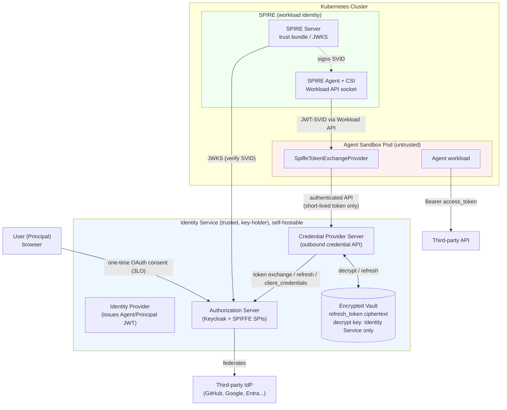
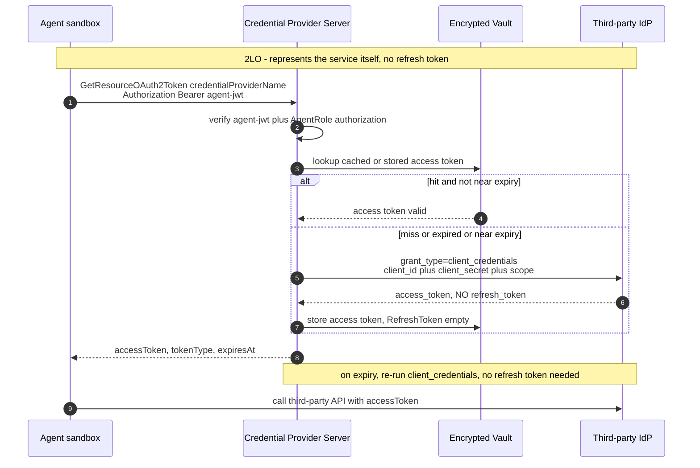
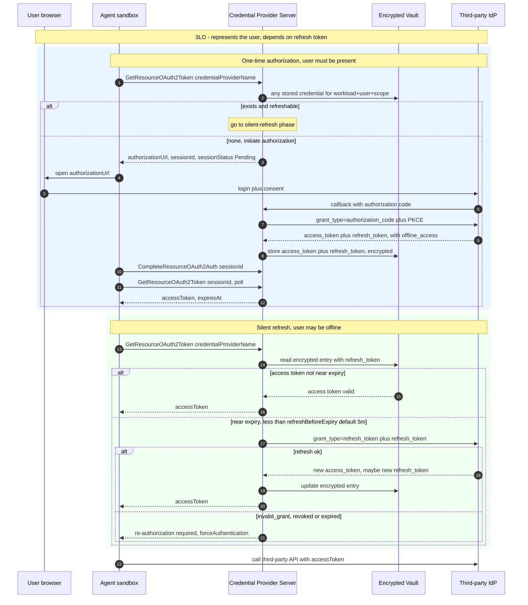
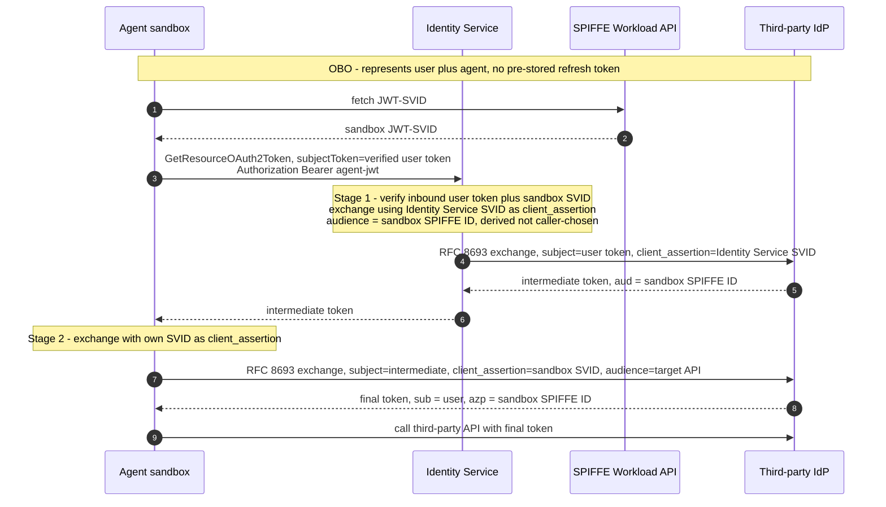

# Agent Dynamic Identity: SPIFFE Workload Identity and OAuth 2.0 Token Exchange

> Feature gate: `SecurityIdentityProvider` (Alpha, disabled by default).

## Table of Contents

- [Summary](#summary)
- [Motivation](#motivation)
  - [Goals](#goals)
  - [Non-Goals/Future Work](#non-goalsfuture-work)
- [Proposal](#proposal)
  - [User Stories](#user-stories)
  - [Architecture Overview](#architecture-overview)
  - [Protocol Standards](#protocol-standards)
  - [Implementation Details](#implementation-details)
    - [Core Components](#core-components)
    - [SPIFFE Client](#spiffe-client)
    - [Token Exchanger (RFC 8693)](#token-exchanger-rfc-8693)
    - [Trusted Principal Derivation](#trusted-principal-derivation)
    - [Two-Stage Token Exchange](#two-stage-token-exchange)
    - [Outbound Credential Flows (2LO / 3LO / OBO)](#outbound-credential-flows-2lo--3lo--obo)
    - [Delegation Store (Encrypted Vault)](#delegation-store-encrypted-vault)
    - [Inbound Validator](#inbound-validator)
    - [Keycloak SPIFFE SPI](#keycloak-spiffe-spi)
  - [Integration with Existing Identity Framework](#integration-with-existing-identity-framework)
  - [Deployment Modes](#deployment-modes)
  - [Sandbox Annotations](#sandbox-annotations)
  - [Security Model](#security-model)
  - [Risks and Mitigations](#risks-and-mitigations)
- [Alternatives](#alternatives)
- [Test Plan](#test-plan)
- [Implementation History](#implementation-history)

## Summary

This proposal introduces a concrete `IdentityProvider` implementation that enables Sandbox Agents to securely call third-party APIs (e.g., GitHub, cloud services) on behalf of users. It builds on the pluggable identity framework defined in [20260427-security-identity-provider.md](./20260427-security-identity-provider.md) and implements it using two industry-standard protocols:

1. **SPIFFE/SPIRE** (CNCF Graduated) for cryptographic workload identity -- proving which specific Pod is making a request.
2. **RFC 8693 OAuth 2.0 Token Exchange** for delegated credential acquisition -- converting a user-authorized refresh token into a short-lived third-party access token.

The combination provides a complete inbound/outbound credential flow: the Agent proves its identity via a SPIFFE JWT-SVID, then exchanges a user-delegated refresh token for a scoped third-party access token through an OAuth 2.0 Authorization Server (e.g., Keycloak).

## Motivation

The existing `IdentityProvider` interface (`pkg/identity/interface.go`) has only a default UUID-based implementation. While the framework supports pluggable providers via `RegisterProvider()`, there is no open-source implementation that:

1. Provides **cryptographic workload identity** (the current UUID token can be copied and replayed).
2. Enables **delegated access to third-party APIs** (Agents cannot call GitHub/cloud APIs on behalf of users).
3. Supports **revocable, time-bounded, scope-limited** credentials.
4. Aligns with **community standards** (SPIFFE, OAuth 2.0, OIDC).

### Goals

- Implement a `SpiffeTokenExchangeProvider` that satisfies the `IdentityProvider` interface.
- Support both SPIFFE mode (production, with SPIRE DaemonSet) and client-secret mode (serverless/dev fallback).
- Enable Agents to obtain delegated third-party API tokens via standard RFC 8693 Token Exchange.
- Provide inbound JWT-SVID validation for verifying caller identity at the gateway.
- Maintain backward compatibility: disabled by default behind `SecurityIdentityProviderGate`.
- Provide a reference Authorization Server integration using Keycloak with custom SPIs.

### Non-Goals/Future Work

- Defining a new Agent identity protocol (we adopt existing standards: SPIFFE + OAuth 2.0).
- Replacing the existing gateway UUID auth mechanism (JWT gateway auth is covered by PR #648).
- Multi-tenancy across trust domains (future SPIFFE Federation work).
- Automatic key rotation for mTLS certificates (requires separate proposal).
- User-facing Portal UI for delegation management (application-layer concern).

## Proposal

### User Stories

#### Story 1: Agent Calls GitHub on Behalf of User

A developer deploys a coding Agent in a Sandbox. The Agent needs to create PRs on the user's GitHub repositories. The user pre-authorizes the Agent via an OAuth consent flow. At runtime, the Agent obtains a short-lived GitHub token scoped to `repo` and bound to its specific SPIFFE identity, then creates the PR. The token expires in 8 hours and is automatically refreshed by the token refresh controller.

#### Story 2: Revoking Agent Access

A user decides to revoke an Agent's access to their GitHub account. They do so through the authorization portal. The next time the Agent attempts a Token Exchange, the Authorization Server rejects the request because the delegation grant is revoked. The Agent receives a clear error and stops attempting API calls.

#### Story 3: Multi-Agent Isolation

Two Agents (research-agent and writer-agent) run in the same namespace but with different ServiceAccounts. Each has a distinct SPIFFE ID. Even if research-agent's refresh token is accidentally exposed to writer-agent, the Token Exchange fails because the delegation scope is bound to research-agent's exact SPIFFE ID.

### Architecture Overview

```
                        +-----------------------+
                        |   User (Principal)    |
                        +-----------+-----------+
                                    |
                     Phase 1: OAuth consent + delegation scope
                                    |
                                    v
+----------------+     +------------------------+     +------------------+
|   Portal       |---->|  Authorization Server  |---->|  Third-party IdP |
| (consent flow) |     |  (Keycloak + SPIs)     |     |  (GitHub, etc.)  |
+----------------+     +--------+---+-----------+     +------------------+
                                |   ^
          Phase 2: Token Exchange   |   JWKS verification
          (refresh_token + JWT-SVID)|   |
                                |   |
                                v   |
+-------------------------------+---+----------------------------------+
|                         Kubernetes Cluster                            |
|                                                                      |
|  +------------------+    +-------------+    +-----------+            |
|  | SPIRE Server     |    | SPIRE Agent |    | CSI Driver|            |
|  | (trust bundle,   |    | (DaemonSet, |    | (mounts   |            |
|  |  SVID signing)   |    |  attestation|    |  workload |            |
|  +--------+---------+    +------+------+    |  API sock)|            |
|           |                     |           +-----------+            |
|           | JWKS                | Workload API                       |
|           v                     v                                    |
|  +--------+---------------------+--------+                          |
|  |          Agent Sandbox Pod            |                          |
|  |                                       |                          |
|  |  [SpiffeTokenExchangeProvider]        |                          |
|  |    1. FetchJWTSVID() from SPIRE       |                          |
|  |    2. Read refresh_token from Secret  |                          |
|  |    3. Token Exchange with AuthZ Server|                          |
|  |    4. Cache + return access_token     |                          |
|  |                                       |    Phase 3: API call     |
|  |  [Agent workload] ------------------->+---> Third-party API      |
|  +---------------------------------------+                          |
+----------------------------------------------------------------------+
```

#### Architecture (rendered)



### Protocol Standards

| Layer | Standard | RFC/Spec | Purpose |
|-------|----------|----------|---------|
| Workload Identity | SPIFFE | [spiffe.io](https://spiffe.io) | Cryptographic Pod identity |
| Identity Document | JWT-SVID | [SPIFFE JWT-SVID](https://github.com/spiffe/spiffe/blob/main/standards/JWT-SVID.md) | Short-lived signed identity assertion |
| Client Authentication | RFC 7523 | [JWT Bearer Assertion](https://datatracker.ietf.org/doc/html/rfc7523) | JWT-SVID as `client_assertion` |
| Token Exchange | RFC 8693 | [OAuth 2.0 Token Exchange](https://datatracker.ietf.org/doc/html/rfc8693) | OBO: exchange a verified user token for a third-party token |
| Authorization Code + PKCE | RFC 6749 §4.1 / RFC 7636 | [OAuth 2.0](https://datatracker.ietf.org/doc/html/rfc6749) / [PKCE](https://datatracker.ietf.org/doc/html/rfc7636) | 3LO: user consent → code → access + refresh token |
| Client Credentials | RFC 6749 §4.4 | [OAuth 2.0](https://datatracker.ietf.org/doc/html/rfc6749) | 2LO: service-to-service token (no user, no refresh token) |
| Resource Indicators | RFC 8707 | [Resource Indicators](https://datatracker.ietf.org/doc/html/rfc8707) | Target audience specification |
| Discovery | OIDC Discovery | [OpenID Connect](https://openid.net/specs/openid-connect-discovery-1_0.html) | JWKS endpoint discovery |
| Workload Identity (IETF) | WIMSE | [IETF WIMSE WG](https://datatracker.ietf.org/group/wimse/about/) | Workload Identity in Multi-System Environments |

#### `aud` semantics (outbound / egress — standards-first)

**This document is about the agent's *outbound* (egress) token identity — the
token the agent presents to third-party / external services — not the inbound
client token that reaches envd** (that is the companion ingress proposal,
[`20260725-sandbox-ingress-authn.md`](./20260725-sandbox-ingress-authn.md)).
Because these tokens leave the cluster and are validated by **external
authorization systems** we do not control, this direction follows the OAuth /
OIDC standards to the letter, so `aud` interoperates with any standard resource
server or IdP.

Per [RFC 7519 §4.1.3](https://datatracker.ietf.org/doc/html/rfc7519#section-4.1.3),
`aud` names the **intended recipient** of a token, and per
[RFC 8707 (Resource Indicators)](https://datatracker.ietf.org/doc/html/rfc8707)
the audience identifies the **target resource server**. On the outbound path
`aud` is therefore authoritative and takes priority — it is exactly what the
external verifier checks:

| Token (this document, outbound) | `aud` = recipient (authoritative) | Acting party |
|---|---|---|
| Stage-1 intermediate token | the **sandbox's own SPIFFE ID** (only that sandbox may present it), derived from the verified SVID subject — not caller-chosen | — |
| Stage-2 final token | the **external target API** (the resource server that validates it, RFC 8707) | sandbox appears as `azp` / authorized-party (RFC 8693) |

Key point for the outbound direction: **`aud` is the primary, standards-defined
audience so the token interoperates with external authorization systems; the
sandbox is carried as `azp` (the authorized party performing the exchange),
following RFC 8693, rather than by overloading `aud`.**

> **Relationship to the ingress proposal.** The two documents address opposite
> directions and are intentionally scoped differently:
> - **Outbound (this doc):** `aud` = the external service, standards-first, so
>   the token is accepted by external IdPs/resource servers unchanged.
> - **Inbound (ingress doc):** the recipient is the sandbox itself; the primary
>   authorization anchor is the internal `sandbox` claim (`sandboxId`+`sandboxUid`,
>   aligned with the merged verifier and #772), with `aud` available as an
>   optional defense-in-depth signal.
>
> The invariant that keeps them consistent: **`aud` always names who is expected
> to accept the token** — the external service on egress, the sandbox on ingress
> — and is never overloaded to mean something else. This resolves the earlier
> inconsistency where `aud` appeared to point in opposite directions.

### Implementation Details

#### Core Components

```
pkg/identity/
├── spiffe/                         # New package
│   ├── provider.go                 # SpiffeTokenExchangeProvider
│   ├── provider_options.go         # Functional options
│   ├── spiffe_client.go            # SPIRE Workload API client
│   ├── token_exchanger.go          # RFC 8693 Token Exchange client
│   ├── delegation_store.go         # K8s Secret reader for refresh tokens
│   ├── token_cache.go              # TTL-based token cache
│   ├── inbound_validator.go        # Inbound JWT-SVID verification
│   └── spiffe_test.go              # Unit tests
│
├── propagator/                     # New package
│   ├── credential_file.go          # Write token to sandbox filesystem
│   └── env_injector.go             # Inject token into Pod env
```

#### SPIFFE Client

The SPIFFE Client wraps the SPIRE Workload API to fetch JWT-SVIDs:

```go
type SpiffeClient struct {
    socketPath string         // unix:///run/spire/sockets/agent.sock
    authMode   ClientAuthMode // "spiffe" or "client_secret"
}

type ClientAuthMode string
const (
    AuthModeSpiffe       ClientAuthMode = "spiffe"
    AuthModeClientSecret ClientAuthMode = "client_secret"
)

// FetchJWTSVID obtains a JWT-SVID from SPIRE Agent with the given audience.
// The audience MUST be the Authorization Server's realm issuer URL.
func (c *SpiffeClient) FetchJWTSVID(ctx context.Context, audience string) (*JWTSVID, error)
```

The SPIFFE ID format follows the SPIRE Kubernetes attestation template:
```
spiffe://<trust-domain>/ns/<namespace>/sa/<service-account>
```

#### Token Exchanger (RFC 8693)

The Token Exchanger performs the standard OAuth 2.0 Token Exchange:

```
POST /realms/{realm}/protocol/openid-connect/token
Content-Type: application/x-www-form-urlencoded

grant_type=urn:ietf:params:oauth:grant-type:token-exchange
&subject_token={user_refresh_token}
&subject_token_type=urn:ietf:params:oauth:token-type:refresh_token
&requested_token_type=urn:ietf:params:oauth:token-type:access_token
&requested_issuer={target_idp}      (e.g., "github")
&scope={requested_scope}            (e.g., "repo")
&client_assertion_type=urn:ietf:params:oauth:client-assertion-type:jwt-bearer
&client_assertion={JWT-SVID}
```

Response:
```json
{
  "access_token": "<third-party-access-token>",
  "token_type": "Bearer",
  "expires_in": 28800,
  "scope": "repo"
}
```

#### Trusted Principal Derivation

> **Threat model note.** The `PrincipalInfo.PrincipalName` field on `TokenRequest` MUST NOT be treated as a trusted input. A user identity that a caller can freely populate is an *assertion*, not an *authentication*: any component able to invoke `IssueToken()` could otherwise claim to act on behalf of an arbitrary user and obtain that user's delegated third-party credentials. The user identity that seeds a delegation exchange MUST be **derived from a cryptographically verified inbound credential**, never from a caller-supplied string.

**Rule: the `Principal` is derived, not passed.** The `IdentityProvider` accepts a principal value only after the caller has been authenticated at an inbound boundary, and the principal value MUST equal the `sub` claim of the verified inbound credential.

Trust sources for the two identities that participate in a delegated exchange:

| Identity | Trusted source | How it is verified | Never |
|----------|----------------|--------------------|-------|
| **User (Principal)** | Inbound OIDC/OAuth access token presented by the user | JWKS signature + `iss` + `aud` + `exp`; `Principal` = verified `sub` | A raw `PrincipalName` string set by the caller/SDK/sandbox |
| **Workload (Sandbox/Agent)** | SPIFFE JWT-SVID from SPIRE Workload API | SPIRE trust-bundle signature + `sub` (SPIFFE ID) + trust-domain match | A `sandboxId` value chosen by the request |

**Who is allowed to set the Principal.** Only the trusted Identity Service (the component that holds the signing/decryption keys — a self-hosted Deployment, not a cloud-managed control plane) may bind a principal, and only after it has itself validated the inbound OIDC token:

```go
// TRUSTED: the gateway validated the inbound OIDC token first, and the
// principal is the verified subject of that token — not a request field.
claims, err := inboundValidator.VerifyOIDC(ctx, inboundBearerToken) // JWKS + iss/aud/exp
if err != nil {
    return nil, fmt.Errorf("inbound authentication failed: %w", err)
}
req := TokenRequest{
    TokenType: TokenTypePrincipal,
    Principal: &PrincipalInfo{PrincipalName: claims.Subject}, // == verified `sub`
    Sandbox:   sbxInfo,
}
resp, err := provider.IssueToken(ctx, sbx, TokenKindIDToken /* principal-bound */)
```

```go
// UNTRUSTED (rejected): principal taken directly from an unauthenticated field.
// The provider MUST reject a principal that is not backed by a verified inbound
// credential in the current call context.
req := TokenRequest{ Principal: &PrincipalInfo{PrincipalName: userInput} } // ✗ forgeable
```

**Enforcement points.**

1. `IssueToken()` with `TokenType == Principal` MUST fail closed when no verified inbound credential is present in the call context (no silent fallback to a passed-in name).
2. The delegation grant stored for a user (see [Delegation Store](#delegation-store)) is bound to a specific SPIFFE ID via the `delegation:<spiffe-id>` scope; the Authorization Server performs an **exact match** at exchange time, so even a correctly-named principal cannot be exercised by the wrong workload.
3. The intermediate-token audience in the two-stage flow is **derived from the verified Sandbox SVID subject**, never from a request parameter, so one sandbox cannot mint a delegation token scoped to another sandbox.

**Design invariant (aligned with established delegation practice).**

- The user identity always originates from an **inbound OIDC/JWT login that is verified** (signature via JWKS, issuer, and audience) before it is used; the verified token — never an application-level field — becomes the `subject_token` for the exchange.
- The workload identity is a **SPIFFE JWT-SVID verified against the SPIRE trust bundle**.
- The design **does not** hand the sandbox the user's raw OIDC token, and **does not** let the caller request an arbitrary intermediate audience: the intermediate audience is derived from the verified workload SVID subject so a workload cannot mint a token scoped to another identity.

Invariant: **user identity = a verified inbound credential's subject; workload identity = a verified SVID's subject; the exchange audience is derived from the verified workload identity.**

#### Two-Stage Token Exchange

To keep user-delegated credentials out of the (untrusted) sandbox while still producing a token that carries *both* the user subject and the sandbox as authorized party, the exchange is split into two stages across the trust boundary.

```
                    ┌──────────────── TRUST BOUNDARY ────────────────┐
  User (OIDC)       │  Identity Service (trusted, key-holder)        │   Sandbox (untrusted)
      │             │                                               │
      │ inbound OIDC │  ① VerifyOIDC(inbound token)  ── JWKS/iss/aud │
      └─────────────┼─► Principal = verified `sub`                   │
                    │                                               │
                    │  ② verify Sandbox SVID (SPIRE JWKS,           │◄── SVID (SPIFFE Workload API)
                    │     trust-domain match)                       │
                    │                                               │
                    │  ③ STAGE 1 exchange (RFC 8693):               │
                    │     subject_token   = verified user token     │
                    │     client_assertion= GATEWAY JWT-SVID        │
                    │     audience        = <derived from verified  │
                    │                        Sandbox SVID subject>  │
                    │            │                                  │
                    │            ▼                                  │
                    │     intermediate token (aud = sandbox SPIFFE) ├──► returned to sandbox
                    │                                               │
                    └───────────────────────────────────────────────┘
                                                                    │  ④ STAGE 2 exchange (RFC 8693):
                                                                    │     subject_token   = intermediate token
                                                                    │     client_assertion= SANDBOX JWT-SVID
                                                                    │     audience/scope  = target API
                                                                    │            │
                                                                    │            ▼
                                                                    │     final token
                                                                    │     (sub = user, azp = sandbox SPIFFE)
                                                                    │  ⑤ inject Authorization: Bearer → target API
```

**Why two stages (and why the user token never enters the sandbox):**

- The **user's delegated credential is held encrypted (envelope encryption), and the decryption key is held only by the trusted Identity Service**, which is the only component that decrypts-and-uses it as `subject_token` inside Stage 1. The sandbox never sees the refresh token — it only receives short-lived tokens through an authenticated API (see [Delegation Store](#delegation-store-encrypted-vault)). This closes the risk of a user `refresh_token` being readable inside the sandbox, and note the guarantee comes from **decryption-key custody, not namespace placement or any cloud-managed control plane** (the vault Secret may share the sandbox's namespace, and the Identity Service is a self-hostable workload).
- Stage 1 produces an **intermediate token whose audience is the sandbox's own SPIFFE ID**, so it is only usable by that specific sandbox. The audience is derived from the *verified* SVID subject (enforcement point 3 above), not chosen by the caller.
- Stage 2 is a **standard RFC 8693 exchange performed by the sandbox** using its own SVID as `client_assertion` and the intermediate token as `subject_token`, yielding a final token where `sub` = user and `azp`/authorized-party = sandbox SPIFFE ID.

**Deployment variant — bind-at-injection (single runtime hop).** Because openkruise/agents injects the outbound `IDToken` into the sandbox from a trusted operator/Identity Service (written into the runtime, kept off the CR), Stage 1 MAY be performed at **injection time** by that trusted component after it has verified the user's inbound OIDC identity. In that variant the sandbox receives an already-user-bound `IDToken` and only performs the single Stage-2 exchange at runtime. Security is equivalent to the two-hop flow — the user credential still never enters the sandbox and the binding is still done by a trusted key-holding component that verified the user identity — while avoiding a per-request round-trip. The choice between "runtime two-hop" and "bind-at-injection one-hop" is a deployment-mode decision, not a change to the trust model.

> **Guardrail for the injection variant:** the component that *triggers* injection MUST itself have verified the user's inbound OIDC identity before requesting a principal-bound `IDToken`; otherwise the forgery risk simply moves from the `Principal` field to the injection trigger.

#### Outbound Credential Flows (2LO / 3LO / OBO)

The system exposes three OAuth 2.0 grant flows for agents to obtain third-party credentials. They differ in **who the token represents** and **whether a refresh token is involved**.

| Flow | Grant | Represents | User interaction | Refresh token | On expiry |
|------|-------|-----------|------------------|---------------|-----------|
| **2LO** | `client_credentials` | the service itself | none | **not used** | re-fetch with client secret (stateless) |
| **3LO** | `authorization_code` (+ PKCE) | the **user** (delegated) | one-time browser consent | **required** (with `offline_access`) | silent refresh; fall back to re-consent |
| **OBO** | RFC 8693 token-exchange | **user + agent** (combined) | none (uses inbound token) | not pre-stored | re-exchange from the inbound `subject_token` |

In all flows: the agent authenticates to the Credential Provider Server with its Agent JWT (`Authorization: Bearer`), is authorized by AgentRole/AgentRoleBinding, and receives **only a short-lived access token** — long-lived material (client secret, refresh token) is held encrypted by the Identity Service (see [Delegation Store](#delegation-store-encrypted-vault)).

##### 2LO — Client Credentials (no refresh token)



##### 3LO — Authorization Code + PKCE (refresh token required)



##### OBO — On-Behalf-Of Token Exchange (RFC 8693, combined identity)

This is the [Two-Stage Token Exchange](#two-stage-token-exchange) flow, shown here in the same notation for comparison. It carries **user + agent** identity in the final token without any pre-stored refresh token.



**Choosing a flow:** use **2LO** when the agent acts as itself (service-to-service, no user); use **3LO** when the agent must act for a user who authorizes once and may then go offline (background/long-running work — the refresh token in the vault keeps it going); use **OBO** when a verified user token is already present in the request and the downstream service must see both the user (`sub`) and the acting agent (`azp`) in one token.

#### Delegation Store (Encrypted Vault)

User-delegated refresh tokens are **long-lived credentials** and MUST NOT be readable by the (untrusted) sandbox. The trust boundary here is **not** drawn on the Kubernetes namespace, and it does **not** depend on any cloud-managed control plane — it is drawn on **who holds the decryption key**. The store is an envelope-encrypted abstraction ("vault") backed by Kubernetes Secrets.

> **Terminology.** In this document the key-holding trusted component is called the **Identity Service** — the workload(s) that hold the signing/decryption keys and expose the credential API (in the reference implementation, the identity-provider and credential-provider servers). It is an ordinary, **self-hostable Kubernetes Deployment**; the term does not imply a cloud vendor's managed control plane. The security properties below follow from *key custody by this component*, wherever it runs.

**Storage model (as implemented in the reference Identity Service):**

1. **Envelope encryption before write.** The refresh token is encrypted with an asymmetric key pair before it is written into a Secret. The Secret therefore contains ciphertext, never a base64 plaintext token.

   ```yaml
   apiVersion: v1
   kind: Secret
   metadata:
     # Name derived from a vault key that binds workload + user + scope, e.g.
     #   SHA256(namespace, credentialProvider, grantType, workloadHash, userHash, scopeHash)
     name: <vault-name-prefix>-<hash>
     # Namespace follows the CredentialProvider CR's namespace (typically the
     # user/business namespace) — it is NOT a dedicated/privileged namespace.
     namespace: <credentialprovider-cr-namespace>
     ownerReferences:
       - kind: CredentialProvider
         name: <cr-name>            # GC-bound to the CR
   type: agentidentity.alibabacloud.com/oauth2-vault-entry
   data:
     payload: <envelope-encrypted-refresh-token-and-metadata>   # ciphertext
   ```

2. **Decryption key lives only in the Identity Service.** The encryption key pair is loaded from files mounted only into the Identity Service workloads (identity/credential provider servers), e.g. `/etc/agent-identity/token/token-encrypt-key.pem` (private) and `token-encrypt-pub-key.pem` (public). **No sandbox/agent code path loads the private key.** Even if a sandbox shares the CR's namespace and can `get secret` the vault entry, it retrieves only ciphertext it cannot decrypt. (The key is a file mount, so the private key can be sourced from an RBAC-restricted Secret, a CSI secret driver, or a KMS/HSM — none of which require a cloud-managed control plane.)

3. **The agent never touches the refresh token.** The sandbox obtains outbound credentials exclusively through an authenticated HTTP API on the Identity Service (`POST /api/v1/credentials` with `x-api-action-name: GetResourceOAuth2Token` and `Authorization: Bearer <agent-jwt>`). The service authenticates the caller, decrypts the vault entry, performs the refresh/exchange, and returns **only a short-lived access token** (the response view never includes the refresh token). Refresh tokens are never present in API responses, logs, or metrics.

4. **Silent refresh by the Identity Service.** When an access token nears expiry (`RefreshBeforeExpiry`), the Identity Service uses the stored refresh token to obtain a new access token (concurrency-collapsed via singleflight). This is what enables the offline-delegation scenario (see below): the user can be offline while the agent keeps operating, because the long-lived credential and its refresh cycle live entirely inside the Identity Service.

**Binding.** The refresh token carries a `delegation:<spiffe-id>` scope, enforced by the Authorization Server via **exact match** at exchange time; additionally the vault key itself binds the entry to `(workload, user, scope)`, so a leaked ciphertext is useless to a different workload even before decryption is attempted.

> **Correct security statement (do not paraphrase as "stored in a control-plane namespace" or "secured by the cloud control plane"):** the refresh token is stored as **envelope-encrypted ciphertext in a Kubernetes Secret (namespace follows the CredentialProvider CR)**; the **decryption key is held only by the trusted Identity Service (a self-hostable workload)**; and the **agent can only obtain a short-lived access token through an authenticated API and never sees the refresh token**. Security derives from **decryption-key custody + encryption + API-only access** — not from namespace isolation and not from any cloud-vendor-managed control plane.

**Delegation models (two complementary paradigms).** This design supports both:

| Model | When user is | Credential | How |
|-------|--------------|------------|-----|
| **Online / request-time (OBO)** | Present (token in request) | Verified inbound user token used as `subject_token` at request time | RFC 8693 token exchange, nothing pre-stored |
| **Offline / pre-stored delegation** | Absent (offline) | Long-lived refresh token pre-authorized once (3LO consent + `offline_access`), stored encrypted in vault | Identity Service silently refreshes; agent gets short-lived tokens on demand |

The **offline model** lets an agent act on a user's behalf while the user is offline (Story 1's auto-refreshing GitHub token; long-running background agents), which a purely request-time (online) model cannot do. The cost is a long-lived credential, which is precisely why it is held encrypted under a key custodied by the Identity Service, never in the sandbox.

#### Inbound Validator

For verifying incoming requests at the gateway/traffic-extension level:

1. Parse JWT header, extract `kid`
2. Fetch public key from SPIRE Server JWKS endpoint (cached)
3. Verify RSA/ECDSA signature
4. Validate `sub` (SPIFFE ID) matches allowed patterns
5. Validate `aud` includes the target service
6. Check `exp` for token expiration

#### Keycloak SPIFFE SPI

The Authorization Server requires custom extensions to bridge SPIFFE and standard OAuth 2.0. For Keycloak, this involves three custom SPIs:

| SPI                           | Purpose                                                                                                            | Gap Addressed                                            |
| ----------------------------- | ------------------------------------------------------------------------------------------------------------------ | -------------------------------------------------------- |
| `SpiffeClientAuthenticator`   | Validates JWT-SVID as `client_assertion`; maps SPIFFE ID to Keycloak client via `spiffe.id.pattern` attribute      | Gap 1: SVID format differs from standard JWT client auth |
| `SpiffeIdDelegationValidator` | Extracts `delegation:<spiffe-id>` scope from subject_token; performs **exact match** against requester's SPIFFE ID | Gap 5: Delegation scope SPIFFE ID validation             |
| `AudienceEnforcerMapper`      | Injects `audience` into token `aud` claim (workaround until Keycloak 26.8 implements RFC 8707)                     | Gap 4: Missing Resource Indicators                       |

Additional operational configurations:
- **Gap 2** (SPIFFE ID to Client mapping): Solved by storing `spiffe.id.pattern` glob in Keycloak client attributes.
- **Gap 3** (SPIRE Trust Bundle sync): Solved by configuring Keycloak's JWKS URL to point to SPIRE Server's `/keys` endpoint.
- **Gap 6** (Token revocation): Optional `TokenRevocationMapper` blocks token issuance for revoked delegation grants.

### Integration with Existing Identity Framework

The implementation integrates with zero changes to existing callers:

```go
// Registration at startup (gated by SecurityIdentityProviderGate)
func init() {
    if features.DefaultFeatureGate.Enabled(features.SecurityIdentityProviderGate) {
        provider, _ := spiffe.NewSpiffeTokenExchangeProvider(
            spiffe.WithTokenEndpoint(os.Getenv("TOKEN_EXCHANGE_ENDPOINT")),
            spiffe.WithRealmIssuer(os.Getenv("REALM_ISSUER")),
            spiffe.WithSpireSocketPath(os.Getenv("SPIFFE_ENDPOINT_SOCKET")),
            spiffe.WithAuthMode(spiffe.ClientAuthMode(os.Getenv("CLIENT_AUTH_MODE"))),
        )
        identity.RegisterProvider(provider)
    }
}
```

Existing call sites compile and are invoked without signature changes:

- **`identity.IssueToken()`** — used as-is; the SPIFFE provider builds its wire
  request from `sbx` like any other provider.
- **`identity.PropagateSecurityToken()`** — the *call site* is unchanged, but
  note that in community mode `defaultTokenProvider.PropagateSecurityToken` is a
  **no-op** and no propagator is registered, so a token issued by a registered
  SPIFFE provider does **not** reach the sandbox on its own. Delivering the
  token to the workload is a required, separate piece — it is **not** implied by
  "works without modification".

  **Design principle: the credential must not land inside the untrusted
  sandbox as a long-lived secret.** Propagation is therefore intentionally left
  to the forthcoming envd architecture split (a trusted in-pod component that
  brokers short-lived tokens to the agent process), rather than writing the
  credential into the sandbox filesystem/environment. Work on this propagation
  path is already in progress — see
  [#787](https://github.com/openkruise/agents/pull/787) — and this proposal
  simply notes it as related work rather than claiming the path already exists.

### Deployment Modes

| Mode | SPIRE Required | Client Authentication | Use Case |
|------|----------------|----------------------|----------|
| `spiffe` (default) | Yes (DaemonSet + CSI) | JWT-SVID from SPIRE Workload API | Production Kubernetes |
| `client_secret` | No | `client_id` + `client_secret` from K8s Secret | ACK Serverless (ECI), dev, CI |

### Sandbox Annotations

```yaml
metadata:
  annotations:
    security.agents.kruise.io/delegation-secret: "user-alice-delegation"
    security.agents.kruise.io/target-issuer: "github"
    security.agents.kruise.io/target-scope: "repo"
    security.agents.kruise.io/auth-mode: "spiffe"
```

### Security Model

| Property | Mechanism |
|----------|-----------|
| **User identity unforgeable** | `Principal` is derived from a verified inbound OIDC token's `sub` claim (JWKS + `iss`/`aud`/`exp`), never from a caller-supplied field (see [Trusted Principal Derivation](#trusted-principal-derivation)) |
| **User credential never enters sandbox** | User token stays inside the trusted Identity Service (key-holder) and is used only as Stage-1 `subject_token`; the sandbox only ever holds a sandbox-scoped intermediate/ID token (see [Two-Stage Token Exchange](#two-stage-token-exchange)) |
| **Intermediate audience non-forgeable** | Stage-1 intermediate audience is derived from the *verified* Sandbox SVID subject, not from a request parameter, so a sandbox cannot mint a delegation token for another sandbox |
| **Workload identity unforgeable** | SPIFFE JWT-SVID issued by SPIRE via kernel-level Pod attestation (k8s_psat) |
| **Delegation binding** | `delegation:<spiffe-id>` scope in refresh_token; Authorization Server performs **exact match** (not glob) |
| **Cross-agent isolation** | SPIFFE ID encodes `ns/{namespace}/sa/{serviceAccount}`; different Agents have different IDs |
| **Least privilege** | Scope downgrading enforced; Agent cannot request broader scope than user authorized |
| **Revocable** | User revokes delegation -> Authorization Server rejects subsequent Token Exchange |
| **Audit trail** | Exchanged token contains `act.sub` claim recording which Agent acted on behalf of user |
| **Time-bounded** | Short-lived tokens (default 8h); automatic refresh via `securitytokenrefresh` controller |
| **Fail-closed** | Missing SPIRE socket, missing Secret, unverified inbound identity, or failed Token Exchange -> error propagated, no silent fallback |

### Risks and Mitigations

| Risk | Impact | Mitigation |
|------|--------|------------|
| **Forged `Principal` (user impersonation)** | A caller sets an arbitrary `PrincipalName` and obtains another user's delegated credentials | `Principal` MUST be derived from a verified inbound OIDC token's `sub`; `IssueToken(TokenType=Principal)` fails closed if no verified inbound credential is in the call context; only the trusted Identity Service (post inbound verification) may bind a principal — see [Trusted Principal Derivation](#trusted-principal-derivation) |
| **Intermediate-token audience forgery** | A sandbox requests an intermediate token scoped to a *different* sandbox | Stage-1 audience is derived from the verified Sandbox SVID subject, not from any request field; Stage-2 verifies the intermediate token's audience matches its own SVID |
| SPIRE Server unavailable | Agent cannot obtain JWT-SVID; token issuance fails | Retry with backoff; client_secret fallback mode for non-DaemonSet environments |
| Vault Secret read by a co-located sandbox (same namespace) | Sandbox could try to read the stored refresh token | Vault entries are **envelope-encrypted**; the **decryption key is mounted only into the Identity Service workloads** (no sandbox code path loads the private key), so a co-located sandbox reads only ciphertext. Agents obtain credentials only via an authenticated API that returns short-lived access tokens; the refresh token never appears in responses/logs/metrics (see [Delegation Store](#delegation-store-encrypted-vault)). Guarantee is from **key custody**, not namespace isolation. |
| Decryption key compromise | Attacker could decrypt all vault entries | Private key mounted only to the Identity Service pods via file (`/etc/agent-identity/token/token-encrypt-key.pem`), restricted by pod/Secret RBAC; the key source is pluggable (RBAC-restricted Secret, CSI secret driver, or KMS/HSM) and self-hostable; future: KMS/HSM-backed key, rotation |
| Authorization Server unavailable | Token Exchange fails | Cached tokens remain valid until expiry; retry with backoff |
| JWKS key rotation | Inbound validator rejects new tokens | Lazy refresh on unknown `kid`; configurable JWKS cache TTL |
| Long-lived refresh_token in Secret | Exposure window if Secret compromised | Future: integrate with external secret stores (Vault, ESO); short TTL + rotation |

## Alternatives

| Alternative                      | Why Not Chosen                                                                               |
| -------------------------------- | -------------------------------------------------------------------------------------------- |
| **AgentID (agentscope-ai)**      | Agent self-manages private keys; no workload attestation; no delegation mechanism            |
| **Pure K8s SA Token projection** | No third-party API delegation; limited to GCP/AWS federation only                            |
| **E2B-style API Key per team**   | No per-user delegation; no workload identity; no revocation                                  |
| **Custom proprietary protocol**  | Not interoperable; community standards preferred                                             |
| **Direct GitHub OAuth in Agent** | Agent holds long-lived user credentials; violates least-privilege; no centralized revocation |

## Test Plan

### Unit Tests
- `SpiffeClient`: Mock SPIRE Workload API; verify JWT-SVID fetch and caching.
- `TokenExchanger`: Mock HTTP server; verify RFC 8693 request format and response parsing.
- `DelegationStore`: Mock K8s client; verify Secret reading and error handling.
- `TokenCache`: Verify TTL expiration, sandbox isolation, and eviction.
- `InboundValidator`: Verify signature validation, audience check, expiration check, and SPIFFE ID pattern matching.

### Integration Tests (E2E)

| Phase | Scenarios | What is Validated |
|-------|-----------|-------------------|
| Phase 1 (Pre-auth) | User consent flow, delegation scope issuance, refresh_token storage | OIDC flow correctness, scope binding |
| Phase 2 (Token Exchange) | SPIFFE auth, Token Exchange, third-party token acquisition | RFC 8693 compliance, delegation validation |
| Failure scenarios | Invalid refresh_token, revoked delegation, SPIFFE ID mismatch, Authorization Server unavailable | Error handling, fail-closed behavior |
| Security scenarios | Cross-agent token reuse attempt, scope escalation attempt | Isolation and least-privilege enforcement |
| Principal trust scenarios | Forged/caller-supplied `Principal` with no inbound token, `Principal` mismatching the verified inbound `sub`, sandbox requesting an intermediate token for another sandbox's audience, user token absent from sandbox filesystem after two-stage exchange | Trusted principal derivation, fail-closed on unverified inbound identity, intermediate-audience binding, user-credential confinement |
| Outbound flow coverage | 2LO client_credentials re-fetch on expiry (no refresh token); 3LO consent → code → refresh, silent refresh before expiry, re-consent on `invalid_grant`; OBO two-stage exchange | Correct grant per flow, refresh-token presence only in 3LO, short-lived-token-only to agent |

### E2E Infrastructure
- Docker-compose environment: Keycloak + PostgreSQL + SPIRE Server/Agent + Mock third-party IdP
- Python pytest framework for flow validation
- Mock third-party server simulating OAuth authorization code flow and API authentication

## Implementation History

- 2026-07-25: Initial proposal drafted
- 2026-07-25: Added Trusted Principal Derivation and Two-Stage Token Exchange sections — established that `Principal` must be derived from a verified inbound OIDC credential (not a caller-supplied field), that the user credential stays inside the trusted Identity Service and never enters the untrusted sandbox, and that the Stage-1 intermediate audience is derived from the verified Sandbox SVID. Added the bind-at-injection single-hop deployment variant.
- 2026-07-25: Corrected the Delegation Store security model to match the verified reference implementation — the refresh token is **envelope-encrypted ciphertext in a K8s Secret whose namespace follows the CredentialProvider CR (may co-locate with the sandbox)**, and the trust guarantee comes from **decryption-key custody by the Identity Service + API-only access returning short-lived tokens**, NOT from namespace isolation. Added the two complementary delegation models (online/OBO request pass-through vs offline/pre-stored vault refresh).
- 2026-07-25: Terminology — replaced "control plane" with **Identity Service** (a self-hostable, key-holding Kubernetes Deployment) throughout, to make explicit that the refresh-token security model depends on **decryption-key custody**, not on any cloud-vendor-managed control plane. Clarified the private-key source is pluggable (RBAC-restricted Secret / CSI / KMS / HSM).
- 2026-07-27: Added a rendered Mermaid **architecture diagram** and a new **Outbound Credential Flows (2LO / 3LO / OBO)** section with three Mermaid sequence diagrams and a flow-comparison table. Clarified that **refresh tokens are used only in 3LO** (2LO re-fetches via client_credentials; OBO re-exchanges the inbound subject token). Added `authorization_code`+PKCE and `client_credentials` to Protocol Standards and an outbound-flow-coverage row to the E2E test plan.
- [Pending]: Community review
- [Pending]: Implementation of `pkg/identity/spiffe/` package
- [Pending]: Keycloak SPI reference implementation
- [Pending]: E2E test suite
