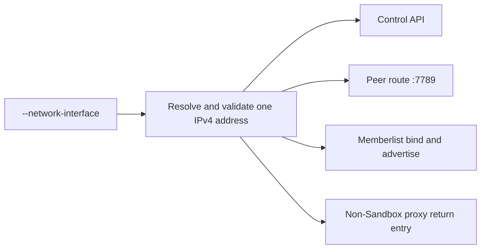
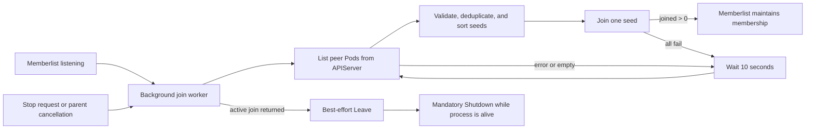

# Sandbox Manager Network Interface Binding and Reliable Peer Discovery

## Summary

Sandbox Manager accepts an optional `--network-interface` flag. When it is set,
one validated IPv4 address from that interface becomes the process-wide
sandbox-cluster address for the control API, peer route service, memberlist, and
the local return entry used by non-Sandbox proxy requests. When it is empty, the
existing non-hosted network behavior is preserved. A second optional flag,
`--disable-envoy-ext-proc`, skips the Envoy ext-proc gRPC listener on port
`9002` for deployments whose data plane does not consume ext-proc; the peer
route service starts regardless.

Peer discovery lists selector-matching Pods through a live, uncached Kubernetes
client built from the process `rest.Config`. Sandbox Manager and Sandbox Gateway
share that bounded listing contract: namespace and selector are required at
startup, each retry cycle performs at most one List while unjoined, and listing
stops after a successful join. After memberlist begins listening, seed
discovery and joining run in the background with retry. Shutdown stops new
discovery and retries; an active join returns under its network deadlines. One
lifecycle owner runs Leave and Shutdown exactly once. This keeps temporary peer
absence from blocking the control API without creating competing cleanup paths.

## Background

A hosted Sandbox Manager is a Sandbox Manager deployed outside the sandbox
cluster, meaning the cluster that runs sandbox orchestration. That Pod has both
a platform network and a sandbox-cluster network. Endpoints that serve or
advertise sandbox-cluster traffic must consistently use the sandbox-cluster
network; selecting different local addresses can make a process reachable
through one protocol but isolated through another.

Peer Pods also start and stop independently. A one-time Kubernetes list or a
single synchronous join turns ordinary startup ordering into permanent
isolation. Reliable discovery therefore retries a namespace- and
selector-scoped live Pod list until a join succeeds, then hands membership to
memberlist. That retry is independent of API readiness.

## Target Design

### One sandbox-cluster address

`--network-interface` has the following contract:

- An empty value preserves the established non-hosted behavior. The control
  API and peer route service listen on all local addresses. Memberlist uses
  `POD_IP` when present, otherwise the first non-loopback IPv4 address. The
  non-Sandbox proxy return entry remains on loopback.
- A non-empty value is an exact operating-system interface name. The interface
  must exist, be up, and have exactly one global-unicast IPv4 address. Missing,
  down, addressless, or multi-address interfaces make startup fail. The process
  never falls back to another interface.
- The address is resolved and validated once during startup. Address changes
  take effect after a process restart.
- The same address is used by the control API listener, the peer route listener
  on port `7789`, and memberlist's bind and advertised address. The non-Sandbox
  proxy return entry uses this address as well, so return traffic does not
  silently switch to loopback after the listeners move to the sandbox-cluster
  network.
- Interface selection controls local listeners and advertised peer identity. It
  does not use `SO_BINDTODEVICE`, select outbound routes, or change DNS policy.

The ext-proc listener on port `9002`, pprof, metrics, and other observability
listeners are outside this address contract. Their exposure is a separate
concern; only ext-proc enablement is covered below.

### Optional ext-proc listener

`--disable-envoy-ext-proc` has the following contract:

- The default keeps the established behavior: the Envoy ext-proc gRPC server
  and its gRPC health service listen on port `9002` on all local addresses.
- When set, neither the port `9002` listener nor the gRPC server is created.
  The peer route service on port `7789`, route ingestion, and route
  distribution are unaffected, so the replica still participates in route
  synchronization.
- The flag does not change the ext-proc address or protocol. An Envoy that is
  configured to call ext-proc must not target a replica started with this
  flag; that pairing is a deployment configuration error.
- Both listeners bind synchronously during startup. A bind failure of either
  enabled listener fails startup before the process serves requests.

### Bounded peer listing

The Sandbox Manager builder constructs an uncached controller-runtime client
from the same `rest.Config` already supplied to the process. It does not add a
Pod informer to the shared sandbox cache, and it does not list through
`APIReader`. Peer code receives that client as a reader; it does not import or
read the cache, and it does not read through Infra.

Listing is restricted by both of these required inputs:

- a non-empty system namespace; and
- a non-empty, syntactically valid peer label selector.

Invalid or absent scope is a startup error rather than an unfiltered Pod list.
Sandbox Manager also requires a non-nil `rest.Config` so assembly can build the
live client.

Sandbox Manager and Sandbox Gateway share this listing contract. Gateway builds
the same kind of live client from in-cluster configuration. While unjoined,
each retry cycle performs at most one live Pod list and stops listing after a
successful join. API availability therefore affects peer convergence, not
control-API or Gateway readiness.

### Trusted seed addresses

Each listed, selector-matching Pod can contribute at most one seed:

- Without a `memberlist-url` annotation, the seed is the Pod's `status.podIP`
  plus the configured memberlist port.
- With the annotation, its host must be the same valid IP as
  `status.podIP`; only the port may differ. An annotation cannot redirect peer
  traffic to another Pod, tenant, or external address.
- Pods with an empty or invalid PodIP, invalid annotated address, the local
  memberlist address, or a duplicate address are excluded.
- Pods in the terminal `Succeeded` or `Failed` phase are excluded: no container
  remains to accept memberlist traffic, so each would only cost a dial timeout
  per retry cycle.

**Warning:** A Sandbox Manager started with `--network-interface` must not be a
memberlist seed. Seed addresses are always derived from `status.podIP`, which
can differ from the selected interface address that memberlist actually binds
and advertises. If the peer selector matches that Manager Pod, other members
join `status.podIP` and never reach the listener. The peer selector must not
select those Pods.

This constraint belongs to the deployment that owns the peer selector. Sandbox
Manager deliberately adds no in-process guard: the process knows only its own
flag value and bound address, while the unreachable join happens in other
members, so a local check could pass while the topology stays wrong. A
misconfigured selector therefore keeps this process starting normally and
surfaces as the affected members repeatedly logging join failures against the
hosted Manager's PodIP. Correcting it is an orchestration change to the peer
selector, not a code change.

Those Managers still join memberlist by contacting a seed that listens on its
PodIP, typically a Sandbox Gateway or a Sandbox Manager started without
`--network-interface`. After a successful join, gossip advertises the selected
interface address, so later members discover the hosted Manager that way
rather than through Kubernetes seed listing.

The Kubernetes seed set is therefore only the selector-matching Pods that
listen on `status.podIP`. Sandbox Gateway and non-hosted Sandbox Manager
replicas remain valid seeds. Hosted Managers may appear in memberlist
membership after they join, but they are not seed sources. The local member is
excluded. A Kubernetes Service and its mirrored or selected backends are
routing objects, not peer membership or seed sources.

Pod readiness and non-terminal phases do not filter the seed set. They are not
reliable membership signals: a newly starting peer may already accept
memberlist traffic, while memberlist itself owns ongoing liveness after a join.

Seeds are sorted into a stable order and joined one at a time. Per-seed joining
keeps one unreachable address from delaying attempts against every remaining
seed in the same memberlist call.

### Non-blocking join lifecycle

The peer route listener on port `7789` starts before memberlist begins
listening, so a replica never advertises itself to peers before it can accept
their route refreshes. Memberlist then begins listening before seed discovery
starts, and Sandbox Manager runs the following lifecycle in the background:

1. List eligible peer Pods from the API server and derive trusted seed
   addresses.
2. Try seeds individually in stable order.
3. Stop discovery after any join reports `joined > 0`.
4. If the list fails, no seeds exist, or every join fails, wait 10 seconds
   after the attempt finishes and retry.

Joining is not a readiness condition and does not delay control API startup. A
replica may temporarily operate as a single member; successful joining hands
ongoing membership changes to memberlist, so periodic Kubernetes rediscovery is
unnecessary. A replica whose selector never yields a seed, such as a
single-replica deployment, keeps listing once per retry interval for the life
of the process; the empty seed set is logged at the default verbosity on the
first cycle and at verbosity 2 afterwards, while list failures are logged as
errors on every cycle.

Kubernetes listing and the 10-second retry wait stop immediately when the peer
lifecycle context is canceled. Memberlist's join API has no context parameter,
so an already-started join returns under memberlist's existing network
deadlines rather than being interrupted by cancellation. Its default connection
and stream deadlines are each 10 seconds, and a complete push/pull can cross
more than one deadline window. No new join or retry starts after cancellation.

Known limit: there is no single 10-second upper bound for a complete in-flight
join. If shutdown must interrupt that work immediately or enforce one overall
deadline, the upgrade path is a context-aware memberlist transport that
preserves memberlist's dynamic-port and cleanup semantics. That transport is
not part of this proposal.

### Startup and shutdown boundary

Startup fails before serving requests when the selected interface, resolved
address, namespace, selector, peer client, control API listener,
peer route listener, or memberlist listener is invalid. The initial seed set
and join result are deliberately not startup requirements. This startup and
shutdown contract applies to the Sandbox Manager process. Sandbox Gateway
process lifecycle is outside this proposal.

Each peer instance establishes one lifecycle owner when memberlist starts. That
owner remains until cleanup finishes, including after seed discovery succeeds.
An explicit stop request or parent-context cancellation cancels the peer
lifecycle context; the owner then runs Leave and Shutdown exactly once. The
peer's Start is called exactly once and its Stop at most once, after Start has
returned, by the component that owns it; a second Start is rejected, and
concurrent or repeated Stop calls are outside the contract. A caller's wait
deadline does not transfer cleanup ownership or create a competing close path:
when Stop returns because its context expired, the owner still completes Leave
and Shutdown. Stop on a peer whose Start never succeeded is a no-op, so a
component can run its shutdown sequence after a failed Start without special
cases.

Sandbox cache synchronization completes before the process serves requests. A
termination signal that arrives while startup is still running follows the
crash model described below rather than the graceful Stop path: the process
exits immediately without waiting for startup to finish and without
per-component cleanup, so memberlist Leave and primary lease release are
skipped. Other members remove the stale entry through failure detection and
the lease expires through its TTL; both self-heal without operator action. A
signal that arrives once startup has completed, including one observed
together with the completion, runs the graceful Stop path. Running the
graceful chain for an interrupted startup is the upgrade path if graceful
cleanup during startup ever becomes a requirement.

The lifecycle owner prevents new discovery work, allows an in-flight join to
return under the network-deadline boundary described above, and then attempts
`Leave` before `Shutdown`. `Leave` is best effort and has a five-second limit;
its failure is reported but never prevents `Shutdown` while the process remains
alive. No code path calls `Leave` after `Shutdown`, and the join worker never
races a separate stop caller for ownership of memberlist cleanup.

If the process is forcibly terminated before the active join returns or the
leave message is delivered, other members temporarily retain a stale active
member and remove it through memberlist's normal failure detection. This is the
same cluster-level failure model as a process crash, OOM, node loss, or network
partition. Peer membership is not a quorum or authorization source. A stale
peer may add only bounded per-peer fanout delay or error: it must not roll back
local route state, change the outcome of an authoritative Sandbox mutation, or
prevent parallel synchronization to other live peers.

Failure detection removes an unreachable member from the surviving members'
view. It does not promise that two isolated memberlist partitions will merge
again without an external seed after connectivity returns; successful seed
discovery intentionally stops its Kubernetes retry loop.

### Compatibility and ownership

This proposal adds two optional CLI flags, `--network-interface` and
`--disable-envoy-ext-proc`. It does not change CRDs, HTTP models, Secrets, or
the memberlist wire protocol. Both in-cluster configuration and `KUBECONFIG`
continue to supply the sandbox-cluster Kubernetes client.

Process peer discovery and peer lifecycle belong to the Manager layer because
they coordinate Sandbox Manager processes rather than implement a Sandbox
backend. Interface address resolution is a policy-neutral helper in
`pkg/utils/network`. Command entrypoints only accept the flags, resolve the
interface address once, and assemble these capabilities; the Manager builder
constructs the live peer client from the supplied `rest.Config`. API protocol
behavior and Infra backend behavior remain unchanged.

Sandbox Gateway now requires non-empty `PEER_NAMESPACE` and
`PEER_LABEL_SELECTOR`; an empty value fails peer startup instead of listing
Pods across all namespaces. The reference manifest under
`config/sandbox-gateway` already sets both. Self-authored Gateway manifests
must set them before upgrading, and the release notes for the first release
containing this change must call this out.

The following are outside this proposal:

- memberlist encryption and peer-route mTLS;
- changing the address or port of the `9002` ext-proc listener;
- metrics, pprof, or observability listener isolation;
- Deployment, RBAC, KDM, or rollout configuration;
- Sandbox Gateway process lifecycle, including SIGTERM handling and peer-route
  listener bind sequencing;
- an informer refactor for Sandbox Gateway;
- IPv6, address hot reload, or periodic seed reconciliation.

No RBAC change is required for Sandbox Manager: its existing Pod permissions
already include `get`, `list`, and `watch`. Peer discovery treats listed Pods as
read-only objects and never mutates them.

Deployment changes remain outside this proposal, but hosted activation depends
on them. Kubernetes TCP probes without an explicit host target the Pod IP; when
the control API and peer route bind only to a different sandbox-cluster
address, those probes cannot reach the listeners and can restart the Pod.
Hosted rollout configuration must make the `8080` and `7789` probes reach the
selected sandbox-cluster address before enabling `--network-interface`.

Hosted activation also depends on seed topology. The peer selector must not
match Sandbox Manager Pods started with `--network-interface`. At least one
PodIP-reachable seed must remain in that selector, and the selected interface
must be able to reach that seed's memberlist address. New hosted replicas
cannot join if every such seed is gone, because Kubernetes listing stops after
the first successful join.

## Risks

- Live Pod listing during retry depends on APIServer availability. Namespace and
  label filtering bound each list to the peer Pods for one Sandbox Manager
  scope, and listing stops after the first successful join. A replica that
  never finds a seed keeps issuing one bounded list per retry interval.
- A canceled process can remain in a memberlist join across multiple 10-second
  network-deadline windows. An immediate-cancellation requirement has a defined
  transport-based upgrade path.
- Forced termination, or a termination signal during startup, can skip Leave
  and temporarily retain a stale member. Memberlist failure detection removes
  it; the stale entry may add bounded per-peer fanout failure but cannot change
  authoritative Sandbox state. A primary lease acquired during startup is held
  until its TTL expires.
- An interface address can change while the process is running. Resolving once
  avoids split listener identity; operational recovery is a restart.
- The API may become ready while the replica is still a single member. This is
  intentional: background retry repairs startup races without making peer
  availability a control-plane availability dependency.
- A hosted Manager whose Pod is still selected as a seed will advertise one
  address and be joined at another. Peer selector configuration must exclude
  those Pods.
- After the first successful join, a new hosted replica cannot join unless a
  PodIP-reachable seed is still available.

## Alternatives

- A shared Pod informer on the sandbox cache is rejected because seed discovery
  lists a handful of process Pods until join succeeds, then stops. A
  process-lifetime watch expands cache filters, startup registration, and tests,
  and makes memberlist wait on informer sync.
- Listing through the manager `APIReader` is rejected. That reader is the
  cache-bypass Get fallback, not a substitute for informers. Assembly constructs
  a dedicated uncached client from `rest.Config`, matching Gateway.
- Picking the first address from a multi-address interface is rejected because
  address ordering is not a stable network identity.
- Trusting an arbitrary `memberlist-url` host is rejected because Pod metadata
  must not redirect peer traffic outside the selected Pod identity.
- Publishing the selected interface address as a Kubernetes seed is rejected.
  Hosted Managers join through a PodIP-reachable seed and then rely on
  memberlist gossip; the peer selector must not list them as seeds.
- A custom cancellable memberlist transport is deferred because this scope
  accepts memberlist's existing network-deadline behavior, and a correct
  transport must preserve more than dialing alone.
- Continuous Kubernetes seed reconciliation after a successful join is
  rejected because memberlist already owns membership convergence.
