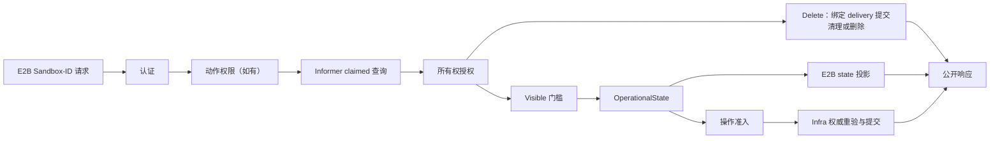

# Sandbox 查询、运行状态与 E2B 可见性边界

## 摘要

本提案把 Sandbox-ID 请求时需要回答的问题拆成三个互不替代的事实：点查与 owner 回答“对象是否
存在、属于谁”，`GetVisibility()` 回答“当前用户交付是否仍可见”，`GetOperationalState()` 回答
“底层 Sandbox 现在处于哪种运行或转换状态”。Manager 点查不再接受 state；E2B API 只有在完成
owner 授权并确认 `Visible=true` 后，才投影公开 state 或判断受限操作能否执行。Delete 不受 Visible
门槛限制：同 owner 的隐藏对象也必须提交清理或持久化删除；不存在、歧义 ID 和其他 owner 统一
返回无副作用的 `204`。

每次用户交付仍以 `agents.kruise.io/lock` 作为 epoch，并以匹配的
`agents.kruise.io/delivered-lock` 作为持久化完成标记。启用新交付流程后，Create 的第一次写入把该
标记置为哨兵值以保持交付不可见，并用 `ShutdownTime` 限制交付时间；全部后处理成功后，Manager 通过 Infra 条件
Patch 原子提交交付和最终生命周期时间，并对良性 resourceVersion 冲突重读重验后重试。标记完全
缺失的 legacy delivery 按已交付兼容处理，包括升级前对象和写入开关关闭时产生的对象。新交付
流程中的 Create，以及 Resume 和 Connect，受统一的 10 分钟服务端请求上限约束。

发布沿用 short-id 的方式：同一个版本先在默认关闭的新交付写入开关下完成兼容部署，再滚动开启。
开关只控制新 Claim/Clone 的 marker、临时 deadline 和 delivery commit；读取、操作保护和 recycle
清理始终识别 marker。关闭开关不改变已有 delivery，也不取消其在途提交。滚动升级不得引入功能
退化，不增加两套 Getter、endpoint 状态机、数据迁移或版本协商。跨资源副作用隔离机制仍待闭合，
因此本文暂不作为 `implementable` 基线。

`GetOperationalState()` 返回协议中立的类型值：`Provisioning`、`Serving`、`Pausing`、`Paused`、
`Resuming`、`Upgrading`、`Recycling`、`Terminating`、`Completed`、`Unavailable` 或 `Unknown`。
它不是存在性、可见性、配额、池候选或 Route 的完整读取面。`Unavailable` 表示已经识别当前运行
阶段，但已知不能正常服务；`Unknown` 表示当前观测无法被可靠解释。

E2B 只公开 `running` 和 `paused`：可见且 `Serving` 的 Sandbox 映射为 `running`，其他所有可见
OperationalState 统一映射为 `paused`。Pause、Resume、Connect 等操作使用明确的状态机；Manager
负责协议中立的操作策略，Infra 在底层操作提交前对同一 delivery 作权威重验。一次 Getter
观测不是操作锁。

Route state、Route Store 及 deletion fence 保持现有独立协议，不与 OperationalState 相互转换。
迁移计划按消费者职责拆分：API 和 Manager 退出聚合 `GetState()`、原始 Phase 与 Sandbox CR 业务
事实，quota、pool、wait 和 recycle 分别使用自己的中立合同。迁移终态不要求
`GetSandboxState` 从仓库彻底消失，但它不能再进入 API、Manager 或中立 `infra.Sandbox` 边界。

## 背景

现有领取和克隆流程在等待 Ready、初始化 runtime、处理凭证、执行 CSI mount 和创建 E2B
TrafficPolicy 之前，就已经持久化 owner、Sandbox ID 和 lock。只凭 claimed 或 lock 判断公开存在，
会让一次尚未完成、最终可能失败的交付提前出现在 List、Describe 或其他 Sandbox-ID 操作中。

另一方面，Manager 点查目前还会按调用方传入的 state 集合筛选对象。对象已经存在且属于当前用户，
但因 Ready 波动、到期或状态转换不符合某个 endpoint 的集合时，筛选失败可能被映射成 `404`。
Sandbox route 缓存也不能作为对象存在性的依据：route 缺失可能只是运行状态或投影结果，不能证明
informer 中没有对应的已领取 Sandbox。

这些问题需要不同的事实：

1. 查询回答指定 Sandbox ID 对应的已领取对象是否存在，以及它属于谁。
2. delivery 提交回答该 epoch 是否已经完整交付。
3. Visible 回答该交付现在是否仍处于 E2B 操作范围。
4. OperationalState 回答底层当前运行状况。
5. endpoint 策略与 Infra capability 共同回答当前操作是否能够执行并安全提交。

`pkg/utils.GetSandboxState` 是聚合兼容状态，不是持久化存在性或稳定的操作合同。它会因删除、
ShutdownTime 到期、终态 Phase 或 Running 但未 Ready 等不同原因返回 `dead`，也会把多个转换阶段
压缩为 `paused`。因此，本提案既不把 `dead` 等同于对象不存在，也不再让聚合 state 决定
not-found 或操作能力。

新的 OperationalState 只标准化底层运行事实。它有意不携带 owner、Visible reason、Pod IP、
Route 凭证、配额占用、池身份、generation 或条件 reason。这些事实由各自的查询、快照或 capability
负责，避免再次形成一个同时回答所有问题的聚合状态。

[上游 E2B OpenAPI](https://github.com/e2b-dev/E2B/blob/f0facc5dbcf93067326745e1597b05311c0174ea/spec/openapi.yml)
只允许 `running` 和 `paused` 作为公开 Sandbox state，并为 Create、Resume 和 Connect 声明了
`504 Backend timeout`。本提案对上游已定义的 endpoint 只使用其已声明的 response，不扩展上游
合同。Browser 与 traffic-token refresh 不在上游 spec 中，它们是本仓自建 endpoint，其状态码由
本仓自行选择，本提案为它们选择与最接近的原生 endpoint 一致的码值。

本提案区分两类授权拒绝。**无权**表示调用方对动作本身没有权限，例如 team-scoped API key 请求
admin-only 动作；只要该判断不读取目标对象，并对任意 Sandbox ID 都给出相同结果，它不会额外透露
对象存在性，可以使用 `401`。**越权**表示调用方本可执行该动作，但目标属于其他用户；若它与实际
不存在返回不同响应，就会确认该 ID 存在。Sandbox-ID owner mismatch 与不存在使用相同响应：
Delete 为无副作用的 `204`，其他 endpoint 为 `404`。

同 owner 对象的 Visible 结束不属于上述两类，它表示该 delivery 已经离开 E2B 操作范围。对调用方
而言这与对象不存在是同一件事——沙箱不再可用——因此它同样使用 `404`，而不是会被 SDK 归类为认证
异常的 `401`。这条响应只有 owner 能触达，用 `404` 表达它不会额外泄漏任何存在性，同时保持了
现有的 not-found 查询合同。Delete 例外：不可见不证明删除已提交，仍按下文生命周期合同处理。
同 owner 的操作准入失败则不同：它描述“对象仍在，但现在不能执行这个动作”，按对应 endpoint 的
既有 response 表达。

### 范围

- 将 Manager 的 Sandbox 点查收窄为 informer 中的 claimed 身份、namespace、Sandbox ID 和 owner
  查询，不再接收或读取预期 state。
- 为 Claim 和 Clone 共用的 Create 交付增加 epoch 匹配的持久化完成标记。
- 为缺失该标记的 legacy delivery 定义兼容判定、滚动启用边界和可验证的退出条件。
- 为 `infra.Sandbox` 增加协议中立的 Visible 观测，并将其作为除 Delete 外所有 Sandbox-ID
  endpoint 的共同前提。
- 为 `infra.Sandbox` 增加 typed OperationalState 观测，由 Infra 将底层事实统一投影为稳定状态。
- 统一 List、Describe 和其他 Sandbox-ID endpoint 的动作权限、查询、所有权、Visible、
  OperationalState 与操作判断顺序，并以是否披露对象存在性作为 `401` 与 `404` 的边界。
- 定义 Pause、Resume、Connect、Network、Set timeout、Snapshot、Browser 和 traffic-token refresh
  的状态准入，以及操作提交前的权威重验边界。
- 为 E2B 业务请求设定一个集中定义的 10 分钟服务端硬上限，并在上游合同允许时映射为 `504`；
  Create/Clone 的新上限随新交付写入一起启用。
- 保留 Controller 的 ShutdownTime 删除与 recycle 清理职责，但不让 Manager 的删除成功依赖
  Controller 已经完成 recycle。
- 原生 E2B 路径和定制前缀路径遵循相同合同。
- 定义从聚合 `GetState()` 迁移到职责专用合同的策略和最终边界。

### 非目标

- 改变 Route state 的值、投影规则、Store 顺序、deletion fence 或流量转发协议。
- 让 OperationalState 承担 owner、Visible、配额、池候选、Route、endpoint 地址或完整诊断读取面。
- 要求 Sandbox Controller 或其他独立 Controller 依赖 sandbox-manager Infra；Controller 继续直接
  维护自己拥有的 CR 状态机。
- 增加 `DeliveryDeadline` CR 字段；临时 delivery 截止时间复用 `ShutdownTime`。
- 重新定义 gateway route、代理流量准入或 Controller 对 workload 健康度的判断。
- 为 informer 延迟、时钟偏差或跨副本一致性增加协调协议。本提案以每个副本当前 informer 观测为准，
  接受跨副本的短暂不一致。
- 使用 APIReader List 或用 route Store 代替 informer Sandbox 查询。
- 改变 Infra 点查已有的 route polling hint 或 APIReader Get freshness fallback；它们不能成为
  Sandbox 存在性或 owner 的权威，但是否保留其内部刷新机制不属于本提案。
- 自动删除或回收处于 `Succeeded`、`Failed` 的 Sandbox。
- 设计旧 delivery 数据迁移或另一种 Infra 后端。缺失 delivered-lock 的 legacy 对象由兼容性边界
  处理，不按经过的版本数推断其已经消失。
- 改变现有歧义 Sandbox ID 失败即隐藏的查询行为。
- 对 cache 作与本提案状态迁移无关的全面重构；只迁出当前由 cache 解释的 Sandbox 业务状态判断。

## 设计终态

### 职责边界

| 决策 | 责任方 | 合同 |
|---|---|---|
| 认证请求 | E2B API | 验证调用方身份，不以 route 是否存在推断 Sandbox 是否存在 |
| 验证动作权限 | E2B API | 在 endpoint 需要时作与目标对象无关的权限判断；拒绝时使用 `401` |
| 查询已领取 Sandbox | Infra | 从 informer 匹配 namespace 和公开 Sandbox ID，区分不存在、歧义和内部失败 |
| 验证所有权 | Manager | 使用 Sandbox owner metadata；不读取 state 或 Visible；API 将 mismatch 与不存在统一隐藏，Delete 为 `204`，其他 endpoint 为 `404` |
| 持久化 delivery | Manager 与 Infra capability | 以 lock epoch 和条件 Patch 提交完整交付 |
| 计算 Visible | Infra Sandbox | 从协议中立的持久化事实返回布尔值和稳定 reason |
| 计算 OperationalState | Infra Sandbox | 将底层运行事实投影为 typed 状态，不泄漏 Sandbox CR 模型 |
| 编排生命周期操作 | Manager | 使用 OperationalState 表达协议中立策略，把底层原子读写交给 Infra |
| 映射 HTTP 与 E2B state | E2B API | 读取和受限操作先应用 Visible，再按 OperationalState 作投影和准入；Delete 使用独立的删除提交合同 |
| 提交底层操作 | Infra capability | 在最新观测上重验 delivery 身份和运行状态，再执行、join 或拒绝操作 |
| 维护 Route 协议 | Sandbox Route | 保持现有 Route state、Store 顺序与 deletion fence，不消费 OperationalState |
| 处理超时与 recycle | Sandbox Controller | 删除到期 Sandbox，完成 recycle 并清除上一 delivery 的数据 |

Sandbox-ID 认证中间件只认证调用方，不再通过本地 Route Store 预判 Sandbox 是否存在或验证 owner；
所有 Sandbox-ID handler 都由共同的 claimed lookup 与 owner 检查承接该职责。Route Store 可以继续
服务 gateway 和路由投影，但 route 缺失、`dead` route 或尚未同步的 route 都不能抢先把一个
Sandbox-ID 请求判为 not-found。

### Manager 点查合同

`SandboxManager.GetSandbox` 接收 context、请求用户和协议中立的查询选项。成功结果只表示：

> informer 中存在与 namespace 和 Sandbox ID 匹配的已领取 Sandbox，并且它属于请求用户。

它不表示 Sandbox 已完成交付、仍然 Visible、健康、Ready 或允许当前操作。点查遵循以下规则：

1. 空用户在查询前被拒绝。
2. Infra 只选择 claimed 且匹配 namespace 与 Sandbox ID 的对象。
3. 明确不存在映射为 Manager not-found；歧义 ID 对外同样隐藏为 not-found，但保留内部 cause；
   其他查询失败映射为 internal error。
4. Manager 在查询成功后验证 owner；不匹配返回内部 not-allowed，E2B API 将其与实际不存在映射为
   相同隐藏响应：Delete 为 `204`，其他 endpoint 为 `404`；歧义 ID 同样遵循此映射。
5. Manager 不读取、不记录、不筛选 OperationalState、聚合 `GetState()` 或 Visible reason，直接返回
   `infra.Sandbox`。

认证和点查不能依赖本地 Route Store 的 owner 映射。E2B 在取得已授权 Sandbox 后才读取 Visible 和
其他内部诊断，因此其他用户无法通过错误差异探测对象。动作权限检查若存在，必须只依赖调用方、
endpoint 和不读取 Sandbox 的请求事实；一旦需要解析目标对象，就属于 owner 或操作准入，不能用
前置 `401` 绕过隐藏规则。

### Delivery epoch 与提交标记

每次 Claim 或 Clone delivery 使用一个非空 lock string。该值在领取时生成并标识本次 delivery。
lock 不要求全局唯一：无配额准入的内部重试会复用同一个 lock，而重试若走 Create 分支会新建 CR，
因此同一个 lock 可能出现在多个对象上；Controller 缩容同样在一次 reconcile 的整批对象上复用一个
lock。epoch 判断只在**同一个对象内部**比较 lock 与 delivered-lock，从不跨对象比较，所以上述
复用不影响判断，也不需要为 delivery 生成第二套 epoch。

| 持久化事实 | 含义 |
|---|---|
| `agents.kruise.io/lock` | 当前 delivery epoch |
| `agents.kruise.io/delivered-lock` | 交付标记；等于 lock 表示本次 epoch 已交付 |
| `agents.kruise.io/cleanup=true` | 当前 delivery 已提交清理，不可逆地结束 Visible |
| `Spec.ShutdownTime` | delivery 期间的硬截止时间，交付后则是正常生命周期截止时间 |
| `Spec.PauseTime` | 只在交付完成时提交的正常 auto-pause 截止时间 |

`delivered-lock` 是系统拥有的 annotation，不能由 E2B metadata 输入设置。仅有 claimed、owner、
Sandbox ID 或 lock 都不表示 delivery 已完成。它的取值分四种情况：

| 取值 | 判定 | 出现场景 |
|---|---|---|
| 等于 lock | 已交付 | 提交成功 |
| 哨兵值 `pending`，或存在但为空 | 未交付 | 本次交付进行中，或提交失败后残留 |
| 非空、非哨兵且不等于 lock | 未交付 | 上一 epoch 的残留标记，例如 recycle 未清理干净 |
| 完全缺失 | 按已交付兼容处理 | 升级前对象，或新交付写入开关关闭时产生的 legacy delivery |

“完全缺失即视为已交付”保留 legacy delivery 的交付兼容性，不豁免其他 Visible 条件。它不需要
backfill，也不按创建时间或运行状态推测交付是否成功。**启用新交付流程的首次持久化写必须写入
哨兵值**；开关关闭的 Claim/Clone 则不进入该流程。因此缺失 marker 不只发生在升级前，也可能来自
兼容部署、滚动启用或关闭开关后的新请求。legacy delivery 不享受提交前不可见保证。

该规则在 marker 判定上默认放行，必须验证启用路径的每次首次写入均携带哨兵值。只有确认所有
受支持写入方及回滚版本不再产生无 marker delivery，且此类存量已经清零，才能删除兼容分支；
never-timeout 对象可以无限期保留，经过一个版本或日志中暂未出现该 reason 都不是清零证据。
实现时以 `known-limit:` 注释记录这一边界和退出条件，不引入迁移任务。

新交付流程由 E2B Claim/Clone 的请求选项启用。SandboxClaim controller 不启用该选项，也不承担
E2B delivery-commit；它不需要写入哨兵或补交付提交，其领取对象仍受既有 owner 隔离。

#### 第一次持久化写：领取但不交付

启用新交付流程时，Claim 的 Update/Create 和 Clone 的 Create 在同一次持久化写中：

- 写入本次 lock epoch、owner、claimed 身份和 Sandbox ID；
- 把 `delivered-lock` 写为哨兵值 `pending`，并删除来自上一 delivery 的 `cleanup`；该写入不能省略，
  它保证启用路径不会被误认为 legacy delivery；
- 将 `PauseTime` 置空（取代当前 auto-pause 请求在首次写入即提交 `PauseTime` 的行为，保证交付
  完成前不会触发自动暂停）；
- 将本次 API 请求的绝对截止时间写入 `ShutdownTime`；
- 保持 `Visible=false`。

同一 epoch 的内部重试不得把该临时 `ShutdownTime` 向后延长。只有开始新的 delivery、生成新的
lock epoch 时，才能建立新的 10 分钟截止时间。

#### 后处理与最终交付

Create 的 delivery 完成条件包括成功返回前所需的全部工作：等待 Sandbox Ready、runtime 初始化、
交付所需的凭证与 token 处理、CSI mount、安全规则和网络配置，以及需要时创建 TrafficPolicy。任一
步骤失败，都不能写入 `delivered-lock` 或返回成功。

全部后处理完成后，E2B API 调用 Manager 的 delivery-commit use case；Manager 再通过协议中立的
Infra capability 对同一 Sandbox 执行带 resourceVersion 乐观锁的条件 Patch。TrafficPolicy 仍是
Create 成功前的 API 层后处理，不下移到 Manager 或 Infra；API 也不直接写 Sandbox CR。该提交要求
对象仍是同一 epoch、没有开始删除或 cleanup，并在一次原子写中：

- 写入 `delivered-lock = lock`；
- 把临时 `ShutdownTime` 替换为从实际交付时刻计算的最终生命周期值；
- 写入对应的最终 `PauseTime`；
- 对 never-timeout delivery 清除临时 `ShutdownTime`，并按请求保持最终 deadline 为空。

Create 只在该 Patch 成功后返回 `201`。Patch 只覆盖 `delivered-lock`、`ShutdownTime` 和
`PauseTime` 三个字段，并带 resourceVersion 乐观锁，因此不会覆盖 Controller 或其他并发写入。
resourceVersion 冲突是**可预期的良性结果**——Sandbox controller 恰好在此刻频繁写 status，例如
`RuntimeInitialized` 转 `True`、Ready 与 phase 更新——它不表示任何不变量被破坏。因此 capability
必须重读对象、重新校验交付不变量，并在请求 deadline 内重试，不得把一次冲突直接判为交付失败。
重试只需重放这三个字段，不重放其他变更。

以下情况结束提交重试；良性 resourceVersion 冲突按上述规则重读重验后重试：

| 终态失败 | 含义 | 映射 |
|---|---|---|
| 对象已从 API server 消失 | 临时 deadline 到期后被 Controller 删除 | `504`，见下文 message |
| 请求 deadline 到期 | 后处理或重试耗尽 10 分钟预算 | `504` |
| UID 或 lock epoch 已改变 | 对象已被替换或重新领取，本次交付作废 | Create 已声明的 `500` |
| 对象仍存在但已开始持久化删除 | 当前 delivery 已不能提交 | Create 已声明的 `500` |
| `cleanup=true` 已提交 | 该 delivery 已被删除请求接受 | Create 已声明的 `500` |

以上都不得返回 `201` 或 `404`；无法归类的持久化失败同样使用 `500`。

乐观锁同时保护 `delivered-lock`、`ShutdownTime` 和 `PauseTime`。旧请求即使不能用旧 lock 使
后继 delivery 提前可见，也可能覆盖其已提交 marker，使成功交付的对象重新隐藏；覆盖 deadline
则会破坏其生命周期。提交条件必须同时包含 UID 与 epoch，不能只看 UID 或依赖 marker 不匹配。

启用新交付流程时，Create 失败后为排障保留的 reserved-failed Sandbox 不具有特殊的存在性语义。它没有成功提交本次
delivery，因此哨兵标记仍在或 Phase 已终态，直接得到 `Visible=false`；
`agents.kruise.io/reserved-failed-sandbox` label 本身不得再触发 `404`。

#### Controller 删除优先

临时 `ShutdownTime` 到期后，Controller 可以直接删除尚未交付的 Sandbox，不需要识别额外的
DeliveryDeadline。若 Controller 在最终 Patch 前成功删除对象，Patch 必须失败，Create 以 Manager
`ErrorTimeout` 返回 `504`，公开 message 为：

> sandbox creation timed out; the sandbox was deleted before it became available

API 不把该失败伪装成 `404`，也不返回一个未提交的 Sandbox。Controller 对 `Succeeded` 和
`Failed` Phase 保持现有行为：它们可以不因 ShutdownTime 自动删除，但始终 `Visible=false`。

### 统一 API 请求上限

E2B API 层使用一个集中定义的 `MaxAPIRequestDuration = 10m` 作为业务请求的服务端硬上限。
Create/Clone 仅在启用新交付流程时使用该新上限；关闭时保留既有创建时限和生命周期写入方式。
其他业务请求不由新交付写入开关控制。适用该上限的每个请求在入口建立一个绝对 deadline；
已有更早 deadline 时使用更早值，内部步骤不得逐段重新获得完整
10 分钟。

- Create 使用该 deadline 作为 delivery timeout 和第一次写入的临时 `ShutdownTime`。
- Resume 与 Connect 从请求 context 继承同一上限，Manager 和 Infra 不依赖 API 常量。
- 已有更短的操作级 timeout 继续生效。
- 客户端扩展指定的更长阶段 timeout 不能把整个请求延长到 10 分钟以后。该上限同时取代当前实现中
  用于表示“服务端不设阶段上限”的内部默认值（约 100 年），因此 Create 与 Clone 的默认行为由实质
  无上限变为 10 分钟，属于一次需要声明的兼容性变更。
- health、Prometheus metrics 和进程 shutdown 不属于该业务请求上限。

Create、Resume 和 Connect 的硬超时映射为其 OpenAPI 已声明的 `504`。其他 endpoint 若未声明
`504`，硬超时映射为已声明的 `500`，不增加新的 response code。

### Visible 合同

`infra.Sandbox.GetVisibility()` 返回 `(visible bool, reason string)`。它只读取当前
`infra.Sandbox` 已携带的单次 Sandbox 观测和当前时间，不执行 Kubernetes 读写。点查内部如何取得
或刷新该观测保持现状；Visible 不发起第二次读取。调用方按照下列优先级取得唯一 reason：

| 优先级 | 条件 | Visible | reason |
|---:|---|---:|---|
| 1 | `DeletionTimestamp` 已设置 | false | `DeletionStarted` |
| 2 | `agents.kruise.io/cleanup` 精确等于 `"true"` | false | `CleanupCommitted` |
| 3 | 当前时间已越过非空 `ShutdownTime` | false | `ShutdownTimeReached` |
| 4 | Phase 为 `Succeeded` | false | `ResourceSucceeded` |
| 5 | Phase 为 `Failed` | false | `ResourceFailed` |
| 6 | Phase 为 `Terminating` | false | `ResourceTerminating` |
| 7 | lock 缺失或为空 | false | `DeliveryEpochMissing` |
| 8 | delivered-lock 等于哨兵值 `pending`，或存在但为空 | false | `DeliveryNotCommitted` |
| 9 | delivered-lock 非空、非哨兵且不等于 lock | false | `DeliveryEpochMismatch` |
| 10 | delivered-lock 完全缺失 | true | `DeliveryMarkerAbsent` |
| 11 | delivered-lock 等于 lock | true | `Delivered` |

`DeliveryMarkerAbsent` 与 `Delivered` 使用不同 reason，使兼容分支可观测；退出条件仍以受支持
写入方和存量对象的完整核验为准，不能仅凭日志中暂未出现该 reason 删除兼容规则。

`cleanup-enabled` 不参与计算；它从 SandboxSet 模板继承而来，只标记该 Sandbox 是否支持 recycle。
任何受信任内部写入一旦提交 `cleanup=true`，当前 delivery 就立即且不可逆地结束 Visible，无论
Controller 是否启用、开始或完成 recycle。其他 cleanup 值不结束 Visible。现有消费者（Controller
的 recycle 触发判定、配额 live 判定）以 `cleanup=true` 与 `cleanup-enabled=true` 双条件为准，而
Visible 只看前者。今天不存在只写 `cleanup=true` 而不带 `cleanup-enabled` 的路径，此处的单条件
判定是有意选择的更严格边界。

优先级 1、2、4、5、6 是不可逆的：删除已开始、清理已提交或已进入终态之后，当前 delivery 不会再
恢复可见。优先级 3 不同——ShutdownTime 到期会结束 Visible，但它不是不可逆终点：在启用
paused-retention 的场景下，Controller 会跳过到期删除、先执行自动暂停并顺延 `ShutdownTime`，于是
同一个 Sandbox 可能从不可见翻回可见。本提案接受这个短暂窗口，实现不得把 Visible 当作单调量缓存
或断言。

Ready、`PauseTime` 和其他 Phase 不参与 Visible。Visible reason 只用于授权后的结构化日志和内部
审计，不进入公开 response，也不得记录 lock 或 delivered-lock 的实际值。每个 Sandbox-ID endpoint
在所有权授权后记录一次结果；List 逐对象过滤时不产生逐对象日志。

### OperationalState 合同

`infra.Sandbox.GetOperationalState()` 返回一个 `OperationalState` 类型值。它只解释当前
`infra.Sandbox` 已携带的单次底层观测，不执行 Kubernetes 读写，也不返回 backend reason。状态名称
描述“现在发生了什么”，不编码 E2B state、HTTP status 或某个操作是否允许。

| OperationalState | 含义 |
|---|---|
| `Provisioning` | 底层资源尚未进入可服务的运行阶段 |
| `Serving` | Sandbox 已满足正常对外服务所需的运行、Ready、地址和 runtime 初始化条件 |
| `Pausing` | Pause 已成为目标，但底层尚未稳定暂停 |
| `Paused` | 底层已稳定暂停 |
| `Resuming` | Resume 已成为目标，但底层尚未恢复到 `Serving` |
| `Upgrading` | 正在执行 recreate、in-place 或其他已识别的升级过程 |
| `Recycling` | 正在清理上一 delivery，并准备返回池中 |
| `Terminating` | 持久化删除已经开始，或底层已进入终止阶段 |
| `Completed` | 底层已明确成功结束或失败结束，不会继续提供当前服务 |
| `Unavailable` | 当前阶段能够被识别，但已知至少一个服务前提不满足 |
| `Unknown` | 当前观测不属于任何已支持组合，无法可靠判断底层正在做什么 |

`Unavailable` 与 `Unknown` 不合并。前者确认这是一个已识别的运行态观测，例如 Running 但未 Ready、
缺少 endpoint 或 runtime 初始化未完成；后者表示出现了新 Phase、矛盾事实或当前映射不认识的组合。
两者都对操作失败即关闭，但区分后可以让上层判断“暂时不可服务”和“状态解释能力不足”。

Sandbox CR Infra 按以下顺序应用第一条匹配规则，保证每次观测只产生一个结果：

| 优先级 | Sandbox CR 观测 | OperationalState |
|---:|---|---|
| 1 | `DeletionTimestamp` 已设置，或 Phase 为 `Terminating` | `Terminating` |
| 2 | Phase 为 `Succeeded` 或 `Failed` | `Completed` |
| 3 | Phase 为 `Recycling` | `Recycling` |
| 4 | Phase 为 `Upgrading`，或 in-place update 明确处于进行中 | `Upgrading` |
| 5 | Phase 为空或为 `Pending` | `Provisioning` |
| 6 | Phase 为 `Paused`，但 Paused condition 尚未为 `True` | `Pausing` |
| 7 | Phase 为 `Paused`、Paused condition 为 `True`，且 `Spec.Paused=true` | `Paused` |
| 8 | Phase 为 `Paused`、Paused condition 为 `True`，且 `Spec.Paused=false`；或 Phase 为 `Resuming` | `Resuming` |
| 9 | Phase 为 `Running`，且 `Spec.Paused=true` | `Pausing` |
| 10 | Phase 为 `Running`、`Spec.Paused=false`，且已识别为 resume 后 runtime 初始化仍在等待 | `Resuming` |
| 11 | Phase 为 `Running`、`Spec.Paused=false`，Ready 为 `True`、endpoint 非空，并且所需 runtime 初始化不存在或已成功 | `Serving` |
| 12 | 其他 Phase 为 `Running` 的观测 | `Unavailable` |
| 13 | 其他未支持或相互矛盾的观测 | `Unknown` |

表中的 Ready 和 Paused condition 分别绑定条件类型 `Ready` 和 `SandboxPaused`。“endpoint 非空”
指能从本次观测解析出运行时地址：优先 `agents.kruise.io/runtime-url`，其次遗留键
`e2b.agents.kruise.io/envd-url`，最后回退到 `Status.PodInfo.PodIP`；三者均不可用时视为
endpoint 为空。

“resume 后 runtime 初始化仍在等待”要求存在本次 resume 已完成的明确事实，同时
`RuntimeInitialized=False` 且 reason 为已识别的 Pending。`RuntimeInitialized` 缺失只对不发布该
条件的 backend 或历史对象视为中性；一旦 backend 发布该条件，只有 `True` 才满足 `Serving`。

OperationalState 是观测，不是操作锁。Manager 可以用它选择操作策略或提前拒绝明显冲突，但真正
改变底层状态的 Infra capability 必须在提交前重新确认：对象仍是同一 UID 和 delivery epoch、
对受限操作还要求 Visible 仍未结束，并且最新运行状态仍允许该动作；Delete 按删除提交合同校验，
delivery commit 则要求本次交付仍可提交，而不要求提交前 Visible。同一动作已经进行时加入现有
等待；已经到达目标状态时幂等成功；相反动作或不允许的状态返回 typed conflict。等待过程也必须绑定 UID 和 delivery
epoch，不能只用 namespace/name 识别对象。

### E2B 查询、state 与操作

除 Delete 使用下文独立生命周期合同外，Sandbox-ID endpoint 使用相同的判断顺序：

1. 认证调用方；
2. endpoint 如有动作级权限，先作与 Sandbox 存在性无关的检查；
3. 从 informer-backed Infra 点查 claimed Sandbox；
4. 验证 owner；
5. 要求 `Visible=true`；
6. 读取同一次 Sandbox 观测的 OperationalState；
7. 进行 E2B state 投影，或执行 endpoint 专用准入和底层 capability。

Visible 与 OperationalState 互不替代。Visible 决定当前 delivery 是否仍在 E2B 操作范围，
OperationalState 描述底层运行状况，endpoint 策略决定当前动作是否允许，Infra capability 则保证
动作提交时仍然安全。

不读取 Sandbox 的语法校验可以在点查前完成，因为其响应不随 ID 是否存在而变化。动作权限拒绝也
必须满足该条件；否则必须先完成 lookup 和 owner 隐藏，再读取 Visible 或操作事实。

#### List 与 Describe

List 和 Describe 共用一个简单、完整的公开投影：

| 前提 | OperationalState | E2B state |
|---|---|---|
| `Visible=true` | `Serving` | `running` |
| `Visible=true` | 其他任意 OperationalState | `paused` |

这里的 E2B `paused` 是兼容值，表示 Sandbox 当前不能正常对外服务；它不保证底层字面上已经暂停。
因此，`Pausing`、`Resuming`、`Upgrading`、`Unavailable` 和 `Unknown` 等状态都不会泄漏给客户端，
也不会被错误报告为 `running`。

Describe 对 owner 匹配且 `Visible=true` 的对象总能得到上述投影，不再因 OperationalState 返回
not-found 或“不支持的 state”。List 先排除 `Visible=false` 的对象，再计算公开 state，然后执行
state 和 metadata 过滤，最后分页。page limit 和 next token 因而只描述客户端实际可见的结果集。

#### 操作准入矩阵

下表定义 owner 已匹配后的条件；除 Delete 外均先要求 `Visible=true`。拒绝码对上游已定义的 endpoint 只使用其
已声明的 response；Browser 与 traffic-token refresh 由本仓自行定义，取与其语义最接近的原生
endpoint 一致的码值：

| Endpoint | 操作准入合同 | 条件不满足 |
|---|---|---:|
| Describe | 不增加操作门槛；使用公共 E2B state 投影 | — |
| Delete | 不受 Visible 或 OperationalState 门槛限制；按删除提交合同处理 | — |
| Pause | `Serving` 开始 Pause；`Pausing` 加入等待；`Paused` 幂等成功 | `409` |
| Resume | `Paused` 开始 Resume；`Resuming` 加入等待；`Serving` 幂等成功 | `409` |
| Connect | `Serving` 直接连接并返回 `200`；`Paused` 开始 Resume，`Resuming` 加入等待，恢复到 `Serving` 后返回 `201` | `409` |
| Network | 允许 `Serving`、`Pausing`、`Paused`、`Resuming`、`Upgrading` | `409` |
| Set timeout | 仅允许 `Serving` | `401` |
| Snapshot | 仅允许 `Serving` | `400` |
| Browser | 仅允许 `Serving` | `401` |
| traffic-token refresh | 允许 `Serving`、`Pausing`、`Paused`、`Resuming`、`Upgrading`，且 Sandbox 要求 traffic auth | `409` |

除 Describe 和 Delete 外，未在某行列出的状态一律拒绝。特别是 `Provisioning`、`Recycling`、
`Terminating`、`Completed`、`Unavailable` 和 `Unknown` 不能执行表中的状态受限操作。它们仍可能在
`Visible=true` 时被 List 或 Describe 兼容投影为 `paused`，但“可读取”不等于“可操作”。

不能把这些组合一概视为不可达。例如 legacy delivery 可能已有 lock、Phase 为 `Pending` 且没有
marker，因而同时为 `Visible=true` 与 `Provisioning`；该组合必须按上述完整矩阵处理。终态受
Visible 的终态规则排除，但其他组合必须从各自持久化前提证明，不能仅凭新交付的成功路径排除。

traffic-token 在初次授权后、实际签发前保留一次新的 Infra Sandbox 校验，以防 recycle/reclaim
竞态。该校验再次按 owner、Visible、OperationalState、`RequireTrafficAuth` 和 delivery 身份的顺序
执行：owner 已变化返回隐藏 `404`，同 owner 但 Visible 已结束同样返回 `404`，state 或 capability
冲突返回 `409`。这里的 route 是从该次 Sandbox 观测投影出的 capability，不是本地 Route Store 的
存在性或 owner 权威。

Pause、Resume 和 Connect 只操作已经 Visible 的当前 delivery，不建立新的 epoch，也不修改 lock
或 delivered-lock。Manager 的状态机决定开始、join、幂等或冲突；Infra 对最新 backend 观测作
相同方向的权威校验，防止一次过期 Getter 观测直接驱动写入。

#### Delete 与 recycle

Delete 不要求 `Visible=true`，也不设置 OperationalState 门槛。认证和与对象无关的动作权限检查
仍然适用；随后执行 claimed lookup 与 owner 授权：

- 不存在、没有匹配的 claimed delivery、歧义 ID 或其他 owner，统一返回相同的空响应 `204`，
  不修改 Sandbox、Route 或 quota；歧义时不能选择任一对象，其他 owner 必须严格 no-op。
- 查询内部失败仍返回 `500`，不能伪装成幂等成功。
- 对已授权且仍存在的 delivery，只有已经存在不可逆清理提交或持久化删除事实时，才可无写入地
  幂等返回 `204`。仅仅到期、未交付或 Phase 终态导致的 `Visible=false` 不满足该条件。

Manager 对仍需删除的对象调用协议中立的 recycle 尝试 capability。该 capability 绑定原 UID 和
lock epoch，在最新 backend 观测上判断当前 Sandbox 是否支持并能够进入 recycle；只有 Controller
确实承担该对象的 recycle-or-delete 责任时，写入 `cleanup=true` 才构成有效的清理提交。不能通过
给无法处理的终态对象补一个 cleanup annotation 来报告成功。

不能进入 recycle 时发起持久化删除；recycle trigger 写入失败后的 Kill fallback 也必须继续绑定
原 UID 和 epoch。若身份已经变化，旧请求不得删除后继 delivery，也不得修改其 Route 或 quota。
确认原 delivery 已退出后可按不存在返回 `204`，不能把未分类错误当作身份退出。

成功提交清理或持久化删除后返回 `204`，不等待异步资源释放。Route 与 quota 后处理只属于已授权
且已接受的原 delivery，重复请求不得对后继 delivery 产生副作用。同 owner 的到期、未交付、
`Succeeded`、`Failed` 或 reserved-failed 对象均使用此合同。Delete 的成功依据是持久化生命周期
承诺，不是某一时刻的 Visible；到期窗口内成功 Delete 后，paused-retention 不得让原 delivery
重新可见。自动清理这些隐藏对象仍不属于本提案新增职责。

Controller 成功 recycle 时清除上一 delivery 的 lock、delivered-lock、owner、Sandbox ID、
claim-scoped metadata、`PauseTime`、`ShutdownTime` 和 TrafficPolicy，然后才把 CR 返回池中。
这些清理防止下一次 Claim 继承旧 epoch，但 Manager 的删除语义不依赖清理是否完成。下一次交付
必须使用新的 lock；启用新交付流程时重新完成 delivery commit，关闭时走 legacy 交付。关闭路径
也必须在新 delivery 的首次写入中清除旧 marker，不能清除仍在使用中的 delivery 的 marker。
claimed 身份和旧 Sandbox ID 被清除后，即使可复用 CR 仍在 informer 中，旧 delivery 的后续查询
也属于实际不存在。

其中“清除 TrafficPolicy”是本设计依赖的**预期正确状态**，当前实现尚未做到：TrafficPolicy 以
Sandbox CR 为 OwnerReference 并按 Sandbox 名选择，因此 CR 被回收复用时它不会被删除，上一位用户
的出网策略会残留到下一次交付。这是一个独立于本提案的既存缺陷，需要单独修复；实现本提案时以修复
后的行为为准，不得按现状行为编写测试或补偿逻辑。

清理已有 TrafficPolicy 还不足以隔离迟到副作用：旧请求在 Sandbox 重验通过后，仍可能在 recycle
和下一次 Claim 之后创建旧策略。Network、runtime 调用及其他跨资源操作必须保证旧 delivery 的
迟到副作用不能作用于后继 delivery；只作前置重读、事后清理或增加发布开关都不能证明该保证。
其具体机制见“待闭合事项”，不能把这个窗口归入允许的 informer 短暂不一致。

### HTTP 错误与信息披露

`401` 与 `404` 不按“是否发生授权失败”机械划分，而按响应是否会额外确认目标对象存在来划分。
所有原生和定制 Sandbox-ID endpoint 使用以下公共分类：

| 条件 | HTTP status | 公开语义 |
|---|---:|---|
| API key 无效或缺失 | 401 | 认证失败 |
| 调用方对动作本身无权，且判断与任何 Sandbox 是否存在无关 | 401 | 明确拒绝该动作，不透露对象事实 |
| claimed 点查没有匹配的 Sandbox | Delete 204；其他 404 | 实际不存在；Delete 无副作用 |
| 多个 claimed Sandbox 匹配同一 ID | Delete 204；其他 404 | 隐藏歧义，不选择或修改任一对象 |
| Sandbox 存在但 owner 不匹配，即对象级越权 | Delete 204；其他 404 | 与不存在使用相同响应；Delete 严格无副作用 |
| Sandbox 属于当前用户但 `Visible=false` | Delete 按删除提交合同；其他 404 | Delete 必须提交清理或删除，或确认已有不可逆提交，不能仅凭不可见返回成功 |
| Visible 但 Pause、Resume、Connect、Network 或 traffic-token 准入冲突 | 409 | endpoint 已声明的冲突 |
| Visible 但 Snapshot 的 OperationalState 不允许 | 400 | endpoint 已声明的 bad request |
| Visible 但 Set timeout 或 Browser 的 OperationalState 不允许 | 401 | 这两个 endpoint 没有 400 或 409 可用，只能复用 `401` |
| claimed 点查无法确定或内部失败 | 500 | 服务端失败，不降级为 404 |
| Create 最终 delivery commit 因非超时冲突或持久化失败 | 500 | Create 已声明的服务端失败 |
| Create、Resume 或 Connect 达到服务端硬上限 | 504 | Backend timeout |
| 其他 endpoint 达到服务端硬上限 | 500 | 该 endpoint 已声明的服务端错误 |

Delete 将不存在、歧义 ID 和其他 owner 统一为相同的空响应 `204`，不得附加 Sandbox resource
context 或 metadata。其他 Sandbox-ID endpoint 的 owner mismatch 固定为 `404`。其 `404` 共有
四类：实际不存在、歧义 ID 失败即
隐藏、隐藏其他 owner，以及同 owner 但 Visible 已结束。前三类必须使用完全相同的 status、公开
message 和 response shape，且不附加 Sandbox resource context 或 metadata——它们的作用正是彼此
不可区分。第四类只有对象的 owner 能够触达，因此可以使用自己的公开 message，但同样不得包含
lock、delivered-lock 的实际值或内部 reason。

除上述四类外，任何 OperationalState、Ready、route 或操作准入失败都不得产生 `404`。动作级无权的
`401` message 也不包含 Sandbox 事实。当前 owner 的 Visible reason、OperationalState 和歧义 cause
只写入内部日志。

### 不变量

- 启用新交付流程的 Create 在 delivery commit 成功前绝不返回成功，List 和公开读取也不返回该
  delivery；经过授权的 Delete 仍可提交取消该交付的清理或删除。
- `delivered-lock == lock` 只证明当前 epoch 已交付；上一 epoch 的 marker 不能使新 delivery
  Visible。标记完全缺失按 legacy 交付兼容处理，覆盖升级前对象和写入开关关闭时产生的对象。
- `cleanup=true`、删除开始和三个明确终态不可逆地结束 Visible；ShutdownTime 到期同样结束 Visible，
  但它可被 Controller 的 paused-retention 顺延，因此不是不可逆终点。
- 一个 informer 中仍存在且属于当前用户的 Sandbox，不会因 OperationalState 或操作准入失败返回
  not-found；除 Delete 外，Visible 结束是唯一与实际不存在共用 `404` 的对象级情形。Delete 必须
  验证实际不存在或不可逆生命周期提交，不能将所有 `Visible=false` 折叠为成功。
- 动作级无权只有在判断不读取目标 Sandbox、因而不泄漏其存在性时才返回 `401`；owner mismatch
  始终与不存在返回相同响应：Delete 为无副作用的 `204`，其他 endpoint 为 `404`。
- 受限操作先满足 Visible，再执行 OperationalState 与 capability 准入；Delete 和 delivery commit
  分别遵循自己的生命周期提交条件。
- Manager 点查不接受 E2B state，也不读取 OperationalState、聚合 `GetState()` 或 Sandbox CR 状态。
- List 与 Describe 只公开 `running` 和 `paused`：`Serving` 为 `running`，其他可见状态为 `paused`，
  并在分页前过滤。
- OperationalState Getter 只返回一次观测；改变底层状态的 capability 必须重新确认 UID、delivery
  epoch 及该操作要求的最新事实，并保证迟到副作用不能影响后继 delivery。
- `Unavailable` 表示已识别但不能服务，`Unknown` 表示无法可靠解释；二者都不能放行受限操作。
- Route state 与 OperationalState 是两个独立协议，不能相互推导或替代。
- 最终 delivery Patch 不能覆盖 Controller 赢得的删除或更新。
- 适用统一请求上限的请求最多获得一次 10 分钟预算；内部重试不会重置该预算。
- 新交付写入开关不控制已有 marker 的读取、操作保护或 recycle 清理，也不取消在途 delivery commit。
- 读取和公开投影使用点查返回的一次 Sandbox 观测；Visible 与 OperationalState Getter 都不另行
  读取。操作 capability 的权威重验不改变这一读取合同。不同副本仍可以在短时间内给出不同结果。

### 兼容性边界

缺少 `delivered-lock` 的 legacy delivery 按已交付兼容处理，来源和退出条件见“Delivery epoch
与提交标记”。关闭新交付写入开关不会撤销已有 marker，也不会要求重建现存 Sandbox。

#### 新交付写入开关

采用与 [short-id 发布合同](20260711-short-sandbox-id.md#rollout-and-rollback)相同的“读取始终
兼容、写入单独启用”方式。同一二进制版本提供一个默认关闭的新交付写入配置，通过既有 options
传递，在每个 Claim/Clone 请求开始时固定该请求的选择，不引入包级可变状态或动态热加载机制。

| 配置 | 新 Claim/Clone | 已有 delivery |
|---|---|---|
| 关闭 | 不写新 marker，保留 legacy 创建时限和生命周期写入；新 epoch 的首次写入清除残留 marker | 始终识别已持久化 marker，保留对应操作保护和在途 commit |
| 开启 | `pending`、临时 deadline、最终生命周期提交与 delivery commit 一起启用 | 使用相同的 Getter、endpoint 状态机和清理合同 |

开关不能只控制 annotation 而让临时 deadline 单独生效。Getter、owner 校验、Delete、其他操作的
marker 保护、Controller recycle 清理和 delivery fencing 始终生效；它不切换两套状态模型。
SandboxClaim controller 不消费该 E2B 写入配置。这里需要部署级写入配置，是因为单个请求选项
无法证明集群中其他副本已经认识新数据；运行时仍以该请求固定的中立选项表达，不引入版本协商、
新的 CR 字段、数据迁移任务或通用开关框架。

#### 滚动启用与回滚

1. 所有 Manager 以写入关闭的方式滚动部署兼容版本；Controller 同时具备 marker 清理能力。
   混合旧版本期间不产生新协议数据，不要求停止 API 服务或清空现存 Sandbox。
2. 确认所有不认识 marker 的副本退出、其在途请求和延迟副作用已结束，相关 informer 已同步，
   Controller 清理与所需 delivery fencing 已具备后，才允许开启写入。不能只检查 Deployment 镜像。
3. 通过滚动更新配置开启新写入。尚未开启的兼容副本继续产生 legacy delivery，但必须正确读取和
   操作已启用副本产生的对象。所有写入方启用后，后续 E2B delivery 才全部适用新交付保证。
4. 关闭开关只停止后续新请求进入该流程，不删除已有 marker，不撤销在途请求已固定的交付选择。
   已产生新 marker 后只支持回退到理解该协议的兼容版本，不支持回退到完全不认识 marker 的版本。

两阶段使用同一功能版本，无需维护两套二进制实现。兼容分支的删除是另一次有存量证据支持的变更，
不能以开关关闭或经过一个版本替代数据核验。升级期间允许 legacy delivery 保持旧交付行为，
但不得引入升级特有的功能退化：Create 已成功却因旧 marker 永久隐藏、deadline 被旧请求覆盖、
Delete 误伤后继 delivery 或新旧请求串用网络策略均不属于可接受的过渡现象。short-id 文档对
短暂缺失或陈旧 Route 的让步不在这里复用；本提案也不增加协调协议来掩盖这些错误。

必须覆盖关闭状态的新旧副本共存、开启与关闭的兼容副本共存、带 marker 对象的 recycle/reclaim、
在途 commit 时关闭开关、never-timeout 存量以及回退到兼容版本。公开 `paused` 但不可 Resume、
状态拒绝被 SDK 分类为认证异常和创建时限变化还需通过实际 SDK 调用验收，不能仅检查 response
code 枚举；客户端的重试应有边界，不能把所有 `409` 都理解为最终必然成功。

本提案还会改变以下客户端可见行为，全部为有意变更：

| 行为 | 现状 | 变更后 |
|---|---|---|
| Running 但未 Ready 的公开 state | 刻意改写为 `running` | `paused`（非 `Serving` 一律 `paused`） |
| Set timeout 遇到状态不允许 | `409` | `401`（该 endpoint 无 400/409 可用） |
| Browser 遇到状态不允许 | `404` | `401`（与 Set timeout 保持一致） |
| Network 遇到状态不允许 | `404` | `409` |
| Describe 一个 ShutdownTime 已过期的沙箱 | 返回上游枚举之外的 `dead` | `404` |
| Create、Clone 的默认服务端时限 | 实质无上限 | 新交付写入开启后为 10 分钟，超时返回 `504`；关闭时保留既有创建时限 |

其中“Running 但未 Ready 投影为 `paused`”需要客户端注意：这类沙箱的 OperationalState 是
`Unavailable`，对它调用 Resume 会得到 `409`。客户端不能把 `paused` 理解为“一定可以 resume”，而
不能把 `409` 当作必然可以恢复的承诺，重试应有次数或时间边界。同理，`Upgrading` 也会被投影为
`paused` 且拒绝 Resume，这与现状一致。

启用新交付流程后，正常生命周期的 timeout 从 delivery commit 的实际时刻开始计算，而不是从首次
领取写入开始；因此交付后可用时长保持请求值，Sandbox 从首次领取到最终结束的总时长可能增加。任何更长的客户端阶段
timeout 都仍受单个 10 分钟 API 硬上限约束。

E2B 的 `paused` 保持上游兼容值，但含义扩展为“当前不能正常提供服务”。客户端不能据此判断底层
究竟处于 Paused、Pausing、Resuming、Upgrading、Unavailable 还是 Unknown；需要执行动作时必须以
对应 endpoint 的响应为准。

Route 继续使用自己的 state 和 deletion fence。为了保持现有 gateway、peer 和 Controller 合同，
Route 投影或 Controller 自有逻辑可以继续使用其现有 Sandbox CR 映射；这些兼容读取不会重新进入
`infra.Sandbox` 的中立业务接口，也不能被 API 或 Manager 当作存在性、Visible 或操作权威。

上游 [JavaScript SDK](https://github.com/e2b-dev/E2B/blob/f0facc5dbcf93067326745e1597b05311c0174ea/packages/js-sdk/src/api/index.ts#L24-L29)
和 [Python SDK](https://github.com/e2b-dev/E2B/blob/f0facc5dbcf93067326745e1597b05311c0174ea/packages/python-sdk/e2b/api/__init__.py#L151-L155)
都会把 `401` 分类为 authentication exception。同 owner 的 Visible 拒绝已改用 `404`，因此不再落入
这一类；仍复用 `401` 的只有认证失败、动作级无权，以及 Set timeout 与 Browser 的状态拒绝——这两个
endpoint 没有 `400`/`409` 可用。对它们而言 SDK 的异常类型不够精确，这是已接受的兼容性代价，公开
message 也不得以泄漏对象事实来弥补该限制。

## 迁移策略与终态

迁移计划以责任边界为单位，为不同消费者选择职责专用合同，而不把聚合 `GetSandboxState` 的映射
全局改造成 OperationalState。Route、Controller、quota、pool 和 E2B 对它提出的是不同问题；统一
改变共享映射会把一次边界重构变成多个协议同时变更。

### 迁移计划

| 领域 | 阶段 | 迁移方向 |
|---|---|---|
| 中立运行状态 | 本次 | `GetOperationalState()` 由 Sandbox CR Infra 统一投影；旧聚合状态在过渡期只服务尚未迁移的兼容消费者，不再承载新的业务判断 |
| 点查与公开读取 | 本次 | Manager 点查退出 state 过滤；E2B 以 Visible 和 OperationalState 完成统一的 List/Describe 投影 |
| 生命周期操作 | 本次 | Manager 使用 OperationalState 表达 Pause、Resume 等协议中立策略；Infra capability 在最新观测上重验并提交操作 |
| endpoint 操作 | 本次 | Connect、Network、Set timeout、Snapshot、Browser 和 traffic-token refresh 使用各自明确的状态集合，不再复用 lookup state 集合 |
| Delete 与 recycle | 本次 | Manager 不再读取原始 Phase；一个协议中立的 recycle 尝试 capability 在最新观测上决定是否接受，未接受或失败时再走持久化删除 |
| wait | 后续 | cache 只提供通用等待、事件与 double-check 机制；Sandbox CR adapter 注入 pause、resume 和 delivery-ready 判断 |
| quota | 后续 | cache 只提供 owner 范围的原始枚举；Sandbox CR Infra 负责 quota live 过滤和中立 quota snapshot，不能用 `Serving` 推断配额占用 |
| pool 与 claim count | 后续 | pool 候选由 Sandbox CR Infra 根据 pool 身份、revision、claim、endpoint 和创建时间判断；claim count 由拥有该合同的 Controller 判断，不使用 OperationalState |
| Route 与 Controller | 不迁移 | 保留现有 Route state、deletion fence 和 Controller 自有 CR 状态机；它们不迁移到 Manager Infra Getter |

本次前置项不依赖后续阶段。API 与 Manager 对 `pkg/utils.GetSandboxState` 没有直接调用，它们只经过
`infra.Sandbox.GetState()` 消费聚合状态；而 cache、pool、route 和 Controller 都直接调用该函数，
不经过中立接口。因此收窄 `infra.Sandbox` 只影响 API、Manager 与 `sandboxcr` 实现，不需要先重构
cache，也不应把后续阶段当作本次的前置条件。

旧接口只在替代合同已经覆盖其业务消费者后退出。迁移期间不得在 API 或 Manager 重新解析 Phase、
Condition、Ready、Pod IP 或其他 Sandbox CR 字段作为临时兜底，也不得把 Route state 反向转换成
OperationalState。

### 迁移终态

| 层或组件 | 最终边界 |
|---|---|
| E2B API | 不读取 Sandbox CR；使用 Manager 点查、`GetVisibility()`、`GetOperationalState()` 和中立 capability，负责公开 state 与 HTTP 映射 |
| Manager | 点查只回答 claimed 身份与 owner；生命周期策略只消费中立观测，不依赖聚合 `GetState()`、原始 Phase 或 backend reason |
| Infra Sandbox 接口 | 保留 `GetVisibility()`、`GetOperationalState()` 和必要的具体 capability；摘掉 `GetState()`、`Phase()` 与 `IsRecycleEnabled()`，后两者由 recycle 尝试 capability 一并替代，不再要求调用方先查询再决定 |
| Sandbox CR Infra | 独占 CR 到 OperationalState 的映射，并在 mutation 前绑定 UID、delivery epoch 和最新状态；不同业务事实转换为各自的中立 snapshot 或 capability |
| cache | 在本提案涉及的范围内只提供 informer 读取、索引、事件、wait 和 health 机制，不直接解释 Sandbox 业务状态 |
| quota、pool、wait、claim count | 各自保留独立合同；OperationalState 可以作为局部输入，但不能替代其 identity、generation、resource、endpoint 或 desired-state 事实 |
| Sandbox Route | 继续使用现有 Route state 协议、Store 顺序和 deletion fence，不生产或消费 OperationalState |
| Sandbox 及其他 Controller | 继续作为 CR 状态生产者和各自 reconciliation 合同的 owner，不依赖 sandbox-manager Infra |

迁移完成的判断不是仓库中彻底消失 `GetSandboxState`，而是它不再出现在 API、Manager 或
`infra.Sandbox` 的中立业务边界。Route 或 Controller 为维持自身协议而保留的映射必须留在对应责任
范围内，不能再次成为跨层共享的操作判断。

## 备选方案

### 继续使用聚合 GetState 或增加 Healthy Getter

聚合 `GetState()` 同时压缩存在性、到期、Ready 和转换事实，无法可靠支持操作状态机。单一
`Healthy` 布尔值又会把 Ready 波动、状态转换和 E2B 公开策略混在一起，既不能解释为什么不可用，
也不能区分 join、幂等和冲突。本提案采用 typed OperationalState，并让 Visible 与业务专用事实
继续独立。

### 让 Route state 成为共同运行状态

Route state 服务路由发布、peer 同步、resourceVersion 顺序和 deletion fence，生产者与生命周期也
不同于 Sandbox-ID API。让 API 或 Manager 依赖 Route 会重新混合存在性、流量与运行状态，并扩大
本提案明确排除的 Route 变更。因此 Route 保持独立协议。

### 在第一次 lock 写入时直接标记已交付

这会让 Ready、runtime、凭证、CSI 或 TrafficPolicy 后处理失败的 Sandbox 提前可见，无法满足
Create 成功与公开交付一致的合同。

### 用一次性 backfill 处理存量对象

在 manager 启动时扫描存量对象并补写 `delivered-lock`，可以让“缺失”始终意味着未交付，全程保持
失败即隐藏。代价是需要一套只用一次的迁移代码、primary 选举，以及对全部存量对象的写入。“缺失即
已交付”用零写入达到了同样的升级效果，只是把该项判断的默认方向换成失败即放行，并要求回归测试和
删除计划来约束它。

### 增加 DeliveryDeadline 字段

单独字段会扩大 CRD 合同，而 `ShutdownTime` 已能为不可见 delivery 提供 Controller 删除上限，
最终 Patch 又会把它替换成正常生命周期 deadline。

### 等待 Controller 完成 recycle 才结束 Visible

这会把 API 删除成功依赖异步 Controller 收敛。以 `cleanup=true` 作为不可逆提交点可以立即结束
当前 delivery，同时仍允许 Controller 在后台完成资源清理。

### 在 Manager 点查中继续筛选 state

这会继续把存在性与操作准入混合，并使属于当前用户的现有对象因 state 不匹配产生 not-found。

## 风险

- 带 resourceVersion 的最终 delivery Patch 会与 Controller 的并发写冲突。冲突本身通过重读重验重试
  吸收，但重试耗尽请求 deadline 后仍会失败；这是 Controller 与并发生命周期写优先于 Create 成功的
  刻意取舍。
- `Succeeded`、`Failed` Sandbox 可以持久存在且对 E2B 不可见，并可能继续占用现有资源或配额；
  启用新流程但未提交交付的对象与 reserved-failed 对象也可能隐藏并占用配额。同 owner 可以通过
  Delete 真正提交清理或删除。本提案不增加 janitor，也不保证 ShutdownTime 删除所有这些对象；
  已有 Controller 对其管理对象的清理职责不变。
- Visible 依赖本地时间与 informer 观测。时钟偏差和副本缓存进度可能导致短暂差异，本提案明确接受。
- “缺失 delivered-lock 即视为已交付”这条兼容规则在 marker 判定上默认放行：任何启用路径忘记在
  首次写入哨兵值，都会让未交付的对象默认可见。必须验证启用路径；写入开关仍可能关闭或长期存量
  未清零时不能删除兼容分支，也不能仅凭该开关推断所有副本已满足启用前置条件。
- E2B 把所有可见的非 `Serving` 状态统一公开为 `paused`。这满足上游枚举，但客户端无法仅凭读取
  结果区分稳定暂停、转换、升级、不可服务或未知状态。
- OperationalState 是一次观测，可能在调用方作出判断后变化。若 Infra capability 未在 mutation 前
  绑定同一 UID、delivery epoch 并重验最新状态，仍可能对错误对象或错误阶段执行操作。
- 新 backend Phase 或新的条件组合会得到 `Unknown`。读取仍兼容投影为 `paused`，受限操作则失败即
  关闭；这可能暂时降低可操作性，但不会把未知状态误放行为可服务。
- Gateway route 仍有自己的投影与同步生命周期。Sandbox-ID API 不再以 route 缺失判定不存在，但
  本提案不保证 API Visible、E2B `running/paused` 与 Route 流量可达性在每个瞬间完全相同。

## 待闭合事项

Delete 公开语义、同 owner 隐藏对象清理权限，以及默认关闭的窄写入开关和滚动发布边界已确认。
跨资源副作用隔离还需给出可证明的具体机制：覆盖旧 Network/runtime 请求完成重验后，与
Delete、recycle、reclaim 交错的情况，包括清理结束后的迟到写入。前置重验和已有策略清理不能
单独满足该条件。该项闭合前保持 `provisional`，不能将发布方式确认等同于整个提案可直接实现。
兼容验收还必须核对 legacy 失败保留对象：关闭写入时可能没有 marker，不能仅凭标记缺失把原本
被隐藏的失败对象公开；这一分支与现有过滤行为的对应关系需在实施前明确。
