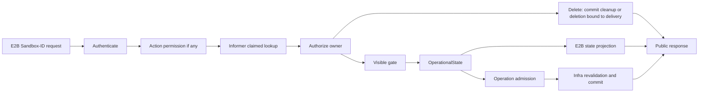

# Sandbox Lookup, Operational State, and E2B Visibility Boundary

## Summary

This proposal separates three request-time facts that every Sandbox-ID request needs but that must
not replace one another. Point lookup and owner answer whether the object exists and who owns it.
`GetVisibility()` answers whether the current user delivery is still visible.
`GetOperationalState()` answers what the underlying Sandbox is doing now. Manager lookup no longer
accepts state. The E2B API projects public state or admits a restricted operation only after owner
authorization and `Visible=true`. Delete has no Visible gate: an owned invisible object must still
receive a cleanup or persistent deletion commit; absence, ambiguous IDs, and another owner all
return a side-effect-free `204`.

Each user delivery continues to use `agents.kruise.io/lock` as its epoch and a matching
`agents.kruise.io/delivered-lock` as the persisted completion marker. When the new delivery flow is
enabled, the first Create write sets that marker to a sentinel to keep the delivery invisible and
bounds delivery time with `ShutdownTime`. After all post-processing succeeds, Manager uses an Infra
conditional Patch to atomically commit delivery and the final lifecycle times, retrying benign
resourceVersion conflicts after re-reading and revalidating. A legacy delivery with a fully absent
marker is treated as delivered, including pre-upgrade objects and objects created with writing
disabled. Create in the new delivery flow, together with Resume and Connect, shares a ten-minute
server request limit.

Rollout follows the short-id approach: deploy compatibility using the same version with a
default-off new-delivery writer option, then enable it through a rolling update. The option controls
only the marker, temporary deadline, and delivery commit for new Claim/Clone requests; reads,
operation protection, and recycle cleanup always recognize markers. Disabling writing does not
change existing deliveries or cancel their in-flight commits. Rolling upgrades must introduce no
functional regression and add no duplicate Getters, endpoint state machines, data migration, or
version negotiation. The mechanism for isolating cross-resource side effects remains unresolved,
so this document is not yet an `implementable` baseline.

`GetOperationalState()` returns one protocol-neutral typed value: `Provisioning`, `Serving`,
`Pausing`, `Paused`, `Resuming`, `Upgrading`, `Recycling`, `Terminating`, `Completed`,
`Unavailable`, or `Unknown`. It is not a complete read surface for existence, visibility, quota,
pool eligibility, or Route. `Unavailable` means that the current lifecycle stage is understood but
the Sandbox is known not to be serviceable. `Unknown` means that the observation cannot be
interpreted reliably.

E2B still exposes only `running` and `paused`. A visible `Serving` Sandbox projects to `running`;
every other visible OperationalState projects to `paused`. Pause, Resume, Connect, and other
operations use explicit state machines. Manager owns protocol-neutral operation policy, while
Infra authoritatively revalidates the same delivery before committing backend work. A Getter
observation is not an operation lock.

Route state, the Route Store, and the deletion fence remain an independent protocol with no
conversion to or from OperationalState. The migration plan is divided by consumer responsibility:
API and Manager leave aggregate `GetState()`, raw Phase, and Sandbox CR business facts, while quota,
pool, wait, and recycle use their own neutral contracts. The end state does not require
`GetSandboxState` to disappear from the repository, but it cannot remain in API, Manager, or the
neutral `infra.Sandbox` boundary.

## Background

The current claim and clone flows persist owner, Sandbox ID, and lock before they wait for Ready,
initialize the runtime, process credentials, perform CSI mounts, and create the E2B TrafficPolicy.
Treating claimed or lock alone as public existence can expose a delivery that has not completed
and may ultimately fail through List, Describe, or another Sandbox-ID operation.

Manager point lookup also filters objects against a caller-supplied state set. An object can exist
and be owned by the requester, yet a Ready fluctuation, expiry, or transition that falls outside
one endpoint's set can make the failure surface as `404`. The Sandbox route cache cannot be the
authority for existence either: a missing route may only reflect runtime state or route
projection, not the absence of a claimed Sandbox from the informer.

These concerns require distinct facts:

1. Lookup answers whether the claimed object for a Sandbox ID exists and who owns it.
2. Delivery commit answers whether that epoch was fully delivered.
3. Visible answers whether the delivery remains in the E2B operation surface.
4. OperationalState describes the current backend runtime condition.
5. Endpoint policy and an Infra capability together decide whether an operation may proceed and be
   committed safely.

`pkg/utils.GetSandboxState` is an aggregate compatibility state, not persisted existence or a
stable operation contract. It returns `dead` for different facts, including deletion,
ShutdownTime expiry, terminal phases, and a Running Sandbox that is not Ready, and it collapses
several transitions into `paused`. This proposal therefore neither equates `dead` with absence nor
lets aggregate state decide not-found or operation capability.

OperationalState standardizes only backend runtime facts. It deliberately carries no owner,
Visible reason, Pod IP, Route credential, quota occupancy, pool identity, generation, or condition
reason. Those facts remain in their own lookup, snapshot, or capability so the new state does not
become another answer to every question.

The
[upstream E2B OpenAPI](https://github.com/e2b-dev/E2B/blob/f0facc5dbcf93067326745e1597b05311c0174ea/spec/openapi.yml)
permits only `running` and `paused` as public Sandbox states and declares
`504 Backend timeout` for Create, Resume, and Connect. For every upstream-defined endpoint this
proposal uses only its declared responses and does not extend the upstream contract. Browser and
traffic-token refresh are absent from the upstream spec: they are repo-defined endpoints whose
status codes this repository chooses, and this proposal aligns them with the closest native
endpoint.

This proposal distinguishes two kinds of authorization denial. **No permission** means that the
caller cannot perform the action itself, such as a team-scoped API key requesting an admin-only
action. When that decision does not read a target object and produces the same result for every
Sandbox ID, it reveals no additional existence information and may use `401`. **Overreach** means
that the caller could perform the action, but the target belongs to another user. A response that
differs from actual absence would confirm that the ID exists. Sandbox-ID owner mismatch therefore
uses the same response as absence: a side-effect-free `204` for Delete and `404` for other endpoints.

A Visible denial for an owned object is neither case: it means the delivery has left the E2B
operation surface. To the caller that is the same fact as absence — the sandbox is no longer
usable — so it also uses `404` rather than a `401` that SDKs classify as an authentication
exception. Only the owner can reach that response, so expressing it as `404` leaks no additional
existence information and preserves the established not-found lookup contract. Delete is an
exception: invisibility does not prove deletion was committed, so it follows the lifecycle contract
below. An operation
admission failure for an owned object is different: it says the object is still there but the
action cannot run now, and it uses that endpoint's declared response.

### Scope

- Narrow Manager Sandbox lookup to claimed identity, namespace, Sandbox ID, and owner from the
  informer, without accepting or reading an expected state.
- Add an epoch-matched persisted completion marker to Create deliveries shared by Claim and Clone.
- Define compatibility for legacy deliveries without that marker, rolling enablement boundaries,
  and verifiable exit conditions.
- Add a protocol-neutral Visible observation to `infra.Sandbox` and make it a common prerequisite
  for every Sandbox-ID endpoint except Delete.
- Add a typed OperationalState observation to `infra.Sandbox`, with Infra providing the single
  projection from backend facts.
- Give List, Describe, and every other Sandbox-ID endpoint one ordering for action permission,
  lookup, ownership, Visible, OperationalState, and operation decisions, using object disclosure
  as the boundary between `401` and `404`.
- Define state admission for Pause, Resume, Connect, Network, Set timeout, Snapshot, Browser, and
  traffic-token refresh, plus authoritative revalidation before an operation commits.
- Define one centralized ten-minute server hard limit for E2B business requests and map it to
  `504` when the upstream endpoint contract allows it; the new Create/Clone limit is enabled
  together with new-delivery writing.
- Retain Controller responsibility for ShutdownTime deletion and recycle cleanup without making
  Manager delete success depend on recycle completion.
- Apply the same contract to native E2B paths and customized-prefix paths.
- Define the migration from aggregate `GetState()` to responsibility-specific contracts and its
  final boundary.

### Non-goals

- Changing Route state values, projection rules, Store ordering, the deletion fence, or the
  forwarding protocol.
- Making OperationalState carry owner, Visible, quota, pool eligibility, Route, endpoint address,
  or complete diagnostic data.
- Making Sandbox Controller or another independent Controller depend on sandbox-manager Infra.
  Controllers continue to own and reconcile their CR state machines directly.
- Adding a `DeliveryDeadline` CR field; temporary delivery expiry reuses `ShutdownTime`.
- Redefining gateway route projection, proxy traffic admission, or Controller workload health.
- Adding a coordination protocol for informer delay, clock skew, or cross-replica consistency.
  Each replica uses its current informer observation, and brief cross-replica disagreement is
  accepted.
- Using APIReader List or substituting the route Store for informer-backed Sandbox lookup.
- Changing the existing route polling hint or APIReader Get freshness fallback inside Infra point
  lookup. Neither may become the authority for Sandbox existence or ownership, but retaining their
  internal refresh behavior is outside this proposal.
- Automatically deleting or recycling Sandboxes in `Succeeded` or `Failed`.
- Designing migration for old delivery data or another Infra backend. Legacy objects without
  delivered-lock are handled by the compatibility boundary; elapsed releases do not prove their
  disappearance.
- Changing the existing fail-closed lookup behavior for an ambiguous Sandbox ID.
- Refactoring cache beyond the state migration in this proposal. Only Sandbox business-state
  interpretation involved in this boundary moves out.

## Target Design

### Responsibility boundaries

| Decision | Owner | Contract |
|---|---|---|
| Authenticate the request | E2B API | Verify caller identity without inferring Sandbox existence from a route |
| Authorize the action | E2B API | When an endpoint requires it, make an object-independent permission decision; reject with `401` |
| Resolve a claimed Sandbox | Infra | Match namespace and public Sandbox ID from the informer; distinguish absence, ambiguity, and internal failure |
| Authorize ownership | Manager | Use Sandbox owner metadata without reading state or Visible; the API conceals mismatch and absence identically: `204` for Delete, `404` for other endpoints |
| Persist delivery | Manager and Infra capability | Commit complete delivery with a lock epoch and conditional Patch |
| Calculate Visible | Infra Sandbox | Return a boolean and stable reason from protocol-neutral persisted facts |
| Calculate OperationalState | Infra Sandbox | Project backend runtime facts into a typed state without exposing the Sandbox CR model |
| Orchestrate lifecycle operations | Manager | Express protocol-neutral policy with OperationalState and delegate atomic backend work to Infra |
| Map HTTP and E2B state | E2B API | For reads and restricted operations, apply Visible before OperationalState projection and admission; Delete uses its separate deletion-commit contract |
| Commit backend operations | Infra capability | Revalidate delivery identity and runtime state on the latest observation, then execute, join, or reject |
| Maintain the Route protocol | Sandbox Route | Preserve current Route state, Store ordering, and the deletion fence without consuming OperationalState |
| Handle timeouts and recycle | Sandbox Controller | Delete expired Sandboxes, complete recycle, and clear prior-delivery data |

Sandbox-ID authentication middleware authenticates only the caller. It no longer uses the local
Route Store to pre-classify Sandbox existence or authorize the owner; the common claimed lookup and
owner check perform that work for every Sandbox-ID handler. The Route Store may continue to serve
gateway routing and projection, but a missing route, a `dead` route, or a route that has not
synchronized cannot preemptively classify a Sandbox-ID request as not-found.

### Manager point-lookup contract

`SandboxManager.GetSandbox` accepts a context, requesting user, and protocol-neutral lookup
options. A successful result means only:

> A claimed Sandbox matching the namespace and Sandbox ID exists in the informer and is owned by
> the requesting user.

It does not imply completed delivery, Visible, health, Ready, or eligibility for an operation.
Lookup follows these rules:

1. An empty user is rejected before lookup.
2. Infra selects only a claimed object matching namespace and Sandbox ID.
3. Definitive absence maps to Manager not-found. An ambiguous ID is also hidden as not-found
   externally while retaining its internal cause. Other lookup failures map to internal error.
4. Manager verifies owner after successful lookup. A mismatch returns internal not-allowed, which
   the E2B API maps to the same concealed response as actual absence: `204` for Delete and `404` for
   other endpoints. An ambiguous ID follows the same mapping.
5. Manager returns `infra.Sandbox` without reading, logging, or filtering OperationalState,
   aggregate `GetState()`, or a Visible reason.

Authentication and point lookup cannot depend on the local Route Store owner mapping. E2B reads
Visible and other internal diagnostics only after it receives an authorized Sandbox, preventing
another user from probing an object through error differences. When an action-permission check
exists, it can depend only on the caller, endpoint, and request facts that do not read a Sandbox.
Once a decision requires resolving the target object, it belongs to owner or operation admission
and cannot use a pre-lookup `401` to bypass concealment.

### Delivery epoch and commit marker

Every Claim or Clone delivery uses a non-empty lock string. The value is generated at claim time and
identifies that delivery. The lock is not required to be globally unique: an internal retry without
quota admission reuses one lock, and a retry that takes the Create branch creates a new CR, so the
same lock can appear on several objects. A Controller scale-down likewise reuses one lock across an
entire reconcile batch. Epoch evaluation compares lock and delivered-lock **within a single
object** and never across objects, so that reuse does not affect the decision and no second epoch
needs to be generated.

| Persisted fact | Meaning |
|---|---|
| `agents.kruise.io/lock` | Current delivery epoch |
| `agents.kruise.io/delivered-lock` | Delivery marker; equal to lock means this epoch was delivered |
| `agents.kruise.io/cleanup=true` | Cleanup is committed for this delivery and irreversibly ends Visible |
| `Spec.ShutdownTime` | Hard delivery deadline before commit; normal lifecycle deadline afterward |
| `Spec.PauseTime` | Normal auto-pause deadline committed only when delivery completes |

`delivered-lock` is a system-owned annotation and cannot be supplied through E2B metadata. Claimed
identity, owner, Sandbox ID, or lock alone does not mean delivery is complete. The annotation has
four cases:

| Value | Decision | When it occurs |
|---|---|---|
| Equal to lock | Delivered | The commit succeeded |
| The sentinel `pending`, or present but empty | Not delivered | Delivery in progress, or left behind by a failed commit |
| Non-empty, not the sentinel, and not equal to lock | Not delivered | A marker left by an earlier epoch, for example an incomplete recycle |
| Fully absent | Treated as delivered | A pre-upgrade object or legacy delivery created with new-delivery writing disabled |

“Fully absent means delivered” preserves legacy delivery compatibility without exempting other
Visible conditions. It needs no backfill and does not infer successful delivery from creation time
or runtime state. **The first persisted write of the enabled new delivery flow must write the
sentinel**; Claim/Clone with writing disabled does not enter that flow. An absent marker can therefore
come from pre-upgrade objects, compatibility deployment, rolling enablement, or new requests after
writing is disabled. Legacy deliveries have no guarantee of invisibility before commit.

This marker check defaults to admitting, so every first write on an enabled path must be verified
to carry the sentinel. Remove the compatibility branch only after confirming that all supported
writers and rollback versions no longer produce markerless deliveries and that all such existing
deliveries are gone. Never-timeout objects may persist indefinitely; neither one elapsed release
nor the temporary absence of this reason in logs proves that none remain. Record this boundary and
exit condition in a `known-limit:` code comment without introducing a migration task.

The new delivery flow is enabled through an E2B Claim/Clone request option. The SandboxClaim
controller neither enables that option nor owns E2B delivery-commit. It need not write the sentinel
or add a delivery commit; its claimed objects retain existing owner isolation.

#### First persisted write: claim without delivery

When the new delivery flow is enabled, Claim Update/Create and Clone Create persist the following
together:

- the delivery lock epoch, owner, claimed identity, and Sandbox ID;
- `delivered-lock` set to the sentinel `pending`, plus removal of `cleanup` left by a prior
  delivery; this write cannot be skipped, because it prevents an enabled path from being mistaken
  for a legacy delivery;
- an empty `PauseTime`, replacing the current behavior where an auto-pause request persists
  `PauseTime` in the first write, so that no automatic pause can fire before delivery commits;
- the current API request's absolute deadline in `ShutdownTime`; and
- `Visible=false`.

Internal retries for the same epoch cannot move the temporary `ShutdownTime` later. Only a new
delivery with a new lock epoch establishes a new ten-minute deadline.

#### Post-processing and final delivery

Create delivery includes every activity required before a successful response: waiting for
Sandbox Ready, runtime initialization, delivery-participating credential and token processing,
CSI mounts, security and network configuration, and TrafficPolicy creation when required. Failure
of any activity prevents both `delivered-lock` and a successful response.

After all post-processing succeeds, the E2B API invokes a Manager delivery-commit use case. Manager
then uses a protocol-neutral Infra capability to perform one resourceVersion-guarded conditional
Patch against the same Sandbox. TrafficPolicy remains API-layer post-processing required before
Create succeeds; it does not move into Manager or Infra, and the API does not write the Sandbox CR
directly. The commit requires the same epoch with no deletion or cleanup in progress, and
atomically:

- writes `delivered-lock = lock`;
- replaces the temporary `ShutdownTime` with the final lifecycle value calculated from actual
  delivery time;
- writes the corresponding final `PauseTime`; and
- for a never-timeout delivery, clears the temporary `ShutdownTime` and leaves the final deadline
  empty as requested.

Create returns `201` only after that Patch succeeds. The Patch covers only `delivered-lock`,
`ShutdownTime`, and `PauseTime`, and carries a resourceVersion optimistic lock, so it cannot
overwrite a Controller or concurrent lifecycle write. A resourceVersion conflict is an **expected,
benign outcome** — the Sandbox controller writes status frequently at exactly this moment, such as
`RuntimeInitialized` turning `True` plus Ready and phase updates — and it does not indicate a broken
invariant. The capability must therefore re-read the object, revalidate the delivery invariants, and
retry within the request deadline instead of treating one conflict as a failed delivery. A retry
replays only those three fields.

The following outcomes end commit retries; benign resourceVersion conflicts are retried after
re-reading and revalidating as described above:

| Terminal failure | Meaning | Mapping |
|---|---|---|
| The object is gone from the API server | The Controller deleted it after the temporary deadline | `504` with the message below |
| The request deadline expired | Post-processing or retries exhausted the ten-minute budget | `504` |
| The UID or lock epoch changed | The object was replaced or re-claimed, voiding this delivery | Create's declared `500` |
| The object still exists but persistent deletion has started | The current delivery can no longer commit | Create's declared `500` |
| `cleanup=true` is committed | A delete request already accepted this delivery | Create's declared `500` |

None of them returns `201` or `404`, and an unclassifiable persistence failure also uses `500`.

The optimistic lock protects `delivered-lock`, `ShutdownTime`, and `PauseTime` together. Even if an
old request cannot use its old lock to make a successor delivery visible prematurely, it can
overwrite the successor's committed marker and hide a successfully delivered object. Overwriting
deadlines corrupts its lifecycle. The commit condition must include both UID and epoch, rather than
checking UID alone or relying on marker mismatch.

With the new delivery flow enabled, a reserved-failed Sandbox retained for investigation after
Create failure has no special existence semantics. Its delivery did not commit, so either the sentinel is still present or its Phase is
terminal, which makes it `Visible=false`. The
`agents.kruise.io/reserved-failed-sandbox` label cannot independently produce `404`.

#### Controller deletion wins

After the temporary `ShutdownTime` expires, the Controller may delete the undelivered Sandbox
without understanding a separate DeliveryDeadline. If the Controller deletes the object before
the final Patch, the Patch must fail. Create returns Manager `ErrorTimeout` as `504` with this
public message:

> sandbox creation timed out; the sandbox was deleted before it became available

The API neither disguises this failure as `404` nor returns an uncommitted Sandbox. The Controller
keeps its current behavior for `Succeeded` and `Failed` phases: they may remain undeleted after
ShutdownTime, but they are always `Visible=false`.

### Common API request limit

The E2B API layer defines one centralized `MaxAPIRequestDuration = 10m` server hard limit for
business requests. Create/Clone uses this new limit only when the new delivery flow is enabled;
otherwise it retains existing creation limits and lifecycle writes. Other business requests are not
controlled by the new-delivery writer option. Each request subject to the limit establishes one
absolute deadline on entry. An existing earlier deadline wins, and internal stages cannot each
acquire a fresh ten-minute window.

- Create uses this deadline as both delivery timeout and the temporary `ShutdownTime` in the first
  persisted write.
- Resume and Connect inherit the same limit from request context; Manager and Infra do not depend
  on the API constant.
- Existing shorter operation-level timeouts continue to apply.
- Longer phase timeouts requested through client extensions cannot extend the whole request beyond
  ten minutes. This limit also replaces the current internal value meaning “no phase-level server
  limit” (about 100 years), so the default behavior of Create and Clone changes from effectively
  unbounded to ten minutes. That is a compatibility change and is declared as such.
- Health, Prometheus metrics, and process shutdown are outside this business-request limit.

A hard timeout maps to the declared `504` response for Create, Resume, and Connect. For another
endpoint that does not declare `504`, it maps to the endpoint's declared `500` instead of adding a
new response code.

### Visible contract

`infra.Sandbox.GetVisibility()` returns `(visible bool, reason string)`. It reads only the single
Sandbox observation already carried by `infra.Sandbox` plus the current time and performs no
Kubernetes read or write. How point lookup obtains or refreshes that observation remains unchanged;
Visible performs no second read. The caller obtains one reason using this precedence:

| Priority | Condition | Visible | Reason |
|---:|---|---:|---|
| 1 | `DeletionTimestamp` is set | false | `DeletionStarted` |
| 2 | `agents.kruise.io/cleanup` exactly equals `"true"` | false | `CleanupCommitted` |
| 3 | The current time has passed a non-empty `ShutdownTime` | false | `ShutdownTimeReached` |
| 4 | Phase is `Succeeded` | false | `ResourceSucceeded` |
| 5 | Phase is `Failed` | false | `ResourceFailed` |
| 6 | Phase is `Terminating` | false | `ResourceTerminating` |
| 7 | lock is absent or empty | false | `DeliveryEpochMissing` |
| 8 | delivered-lock equals the sentinel `pending`, or is present but empty | false | `DeliveryNotCommitted` |
| 9 | delivered-lock is non-empty, not the sentinel, and not equal to lock | false | `DeliveryEpochMismatch` |
| 10 | delivered-lock is fully absent | true | `DeliveryMarkerAbsent` |
| 11 | delivered-lock equals lock | true | `Delivered` |

`DeliveryMarkerAbsent` uses a different reason from `Delivered` to keep the compatibility branch
observable. Exit still requires complete verification of supported writers and existing objects;
the temporary absence of this reason in logs is insufficient to remove compatibility.

`cleanup-enabled` does not participate; inherited from the SandboxSet template, it only marks
whether this Sandbox supports recycle. Once a trusted internal writer commits `cleanup=true`, the
current delivery immediately and irreversibly ends Visible, regardless of whether recycle is
enabled, started, or completed. Other cleanup values do not end Visible. Existing consumers — the
Controller's recycle trigger and the quota live predicate — require both `cleanup=true` and
`cleanup-enabled=true`, while Visible checks only the former. No path writes `cleanup=true` without
`cleanup-enabled` today, so this single-condition check is a deliberately stricter boundary.

Priorities 1, 2, 4, 5, and 6 are irreversible: once deletion has started, cleanup is committed, or a
terminal phase is reached, the current delivery never becomes visible again. Priority 3 differs.
ShutdownTime expiry ends Visible, but it is not an irreversible endpoint: with paused retention
enabled, the Controller skips the expiry deletion, performs the automatic pause first, and extends
`ShutdownTime`, so the same Sandbox can flip from invisible back to visible. This proposal accepts
that brief window, and implementations must not cache or assert Visible as a monotonic value.

Ready, `PauseTime`, and other phases do not participate in Visible. A Visible reason is used only
for structured logs and internal audit after authorization. It is not exposed in a public
response, and actual lock or delivered-lock values are never logged. Each Sandbox-ID endpoint logs
one result after ownership authorization. List produces no per-object log while filtering.

### OperationalState contract

`infra.Sandbox.GetOperationalState()` returns one `OperationalState` typed value. It interprets
only the single backend observation already carried by `infra.Sandbox`, performs no Kubernetes
read or write, and returns no backend reason. A state says what is happening now; it does not encode
an E2B state, an HTTP status, or whether a particular operation is allowed.

| OperationalState | Meaning |
|---|---|
| `Provisioning` | The backend resource has not entered a serviceable runtime stage |
| `Serving` | The Sandbox satisfies the runtime, Ready, address, and runtime-initialization prerequisites for normal external service |
| `Pausing` | Pause is the target, but the backend has not reached a stable pause |
| `Paused` | The backend is stably paused |
| `Resuming` | Resume is the target, but the backend has not returned to `Serving` |
| `Upgrading` | A recognized recreate, in-place, or other upgrade is in progress |
| `Recycling` | The prior delivery is being cleaned before the resource returns to the pool |
| `Terminating` | Persistent deletion has started or the backend is in its termination phase |
| `Completed` | The backend has explicitly succeeded or failed and will not continue serving this delivery |
| `Unavailable` | The lifecycle stage is understood, but at least one known service prerequisite is not satisfied |
| `Unknown` | The observation matches no supported combination and cannot be interpreted reliably |

`Unavailable` and `Unknown` remain distinct. The former confirms a recognized runtime observation,
such as Running without Ready, an endpoint, or completed runtime initialization. The latter means
that a new Phase, contradictory facts, or an unsupported combination exceeds the mapper's
knowledge. Both fail closed for operations, but the distinction lets callers separate temporary
unserviceability from an inability to interpret the state.

Sandbox CR Infra applies the first matching rule in this order, so one observation produces exactly
one result:

| Priority | Sandbox CR observation | OperationalState |
|---:|---|---|
| 1 | `DeletionTimestamp` is set, or Phase is `Terminating` | `Terminating` |
| 2 | Phase is `Succeeded` or `Failed` | `Completed` |
| 3 | Phase is `Recycling` | `Recycling` |
| 4 | Phase is `Upgrading`, or an in-place update is explicitly in progress | `Upgrading` |
| 5 | Phase is empty or `Pending` | `Provisioning` |
| 6 | Phase is `Paused`, but the Paused condition is not yet `True` | `Pausing` |
| 7 | Phase is `Paused`, Paused is `True`, and `Spec.Paused=true` | `Paused` |
| 8 | Phase is `Paused`, Paused is `True`, and `Spec.Paused=false`; or Phase is `Resuming` | `Resuming` |
| 9 | Phase is `Running` and `Spec.Paused=true` | `Pausing` |
| 10 | Phase is `Running`, `Spec.Paused=false`, and recognized post-resume runtime initialization is still pending | `Resuming` |
| 11 | Phase is `Running`, `Spec.Paused=false`, Ready is `True`, the endpoint is non-empty, and required runtime initialization is absent or successful | `Serving` |
| 12 | Any other observation with Phase `Running` | `Unavailable` |
| 13 | Any other unsupported or contradictory observation | `Unknown` |

In the mapping table, Ready and the Paused condition bind to the condition types `Ready` and
`SandboxPaused` respectively. “The endpoint is non-empty” means that a runtime address resolves
from the current observation: prefer `agents.kruise.io/runtime-url`, then the legacy key
`e2b.agents.kruise.io/envd-url`, and finally `Status.PodInfo.PodIP`; when none of them is usable,
the endpoint is empty.

“Recognized post-resume runtime initialization is still pending” requires an explicit fact that the
current resume has completed together with `RuntimeInitialized=False` and a recognized Pending
reason. An absent `RuntimeInitialized` condition is neutral only for a backend or historical object
that does not publish it. Once the backend publishes the condition, only `True` satisfies
`Serving`.

OperationalState is an observation, not an operation lock. Manager may use it to choose policy or
reject an obvious conflict early, but an Infra capability that changes backend state must confirm
before commit that the object still has the same UID and delivery epoch. Restricted operations also
require that Visible has not ended and the latest runtime state still permits the action. Delete
validates its deletion-commit contract; delivery commit requires that this delivery remains
committable, without requiring Visible before commit. An identical action already in progress joins
its wait; an already-reached target succeeds idempotently; an opposite action or disallowed state
returns a typed conflict. A wait is also bound to UID and delivery epoch, never only namespace and
name.

### E2B lookup, state, and operations

Except for Delete, which uses the separate lifecycle contract below, Sandbox-ID endpoints use the
same decision order:

1. authenticate the caller;
2. when the endpoint has action-level permission, check it without consulting Sandbox existence;
3. look up a claimed Sandbox through informer-backed Infra lookup;
4. authorize its owner;
5. require `Visible=true`;
6. read OperationalState from the same Sandbox observation; and
7. project an E2B state or run endpoint-specific admission and the backend capability.

Visible and OperationalState do not replace one another. Visible decides whether the current
delivery remains in the E2B operation surface. OperationalState describes the backend runtime.
Endpoint policy decides whether an action is allowed, and the Infra capability makes the commit
safe.

Syntax validation that does not read a Sandbox may precede lookup because its response does not
vary with ID existence. An action-permission denial must meet the same condition. Otherwise lookup
and owner concealment must complete before reading Visible or operation facts.

#### List and Describe

List and Describe share one complete public projection:

| Prerequisite | OperationalState | E2B state |
|---|---|---|
| `Visible=true` | `Serving` | `running` |
| `Visible=true` | Any other OperationalState | `paused` |

E2B `paused` is a compatibility value meaning that the Sandbox cannot currently provide normal
external service. It does not promise that the backend is literally paused. States such as
`Pausing`, `Resuming`, `Upgrading`, `Unavailable`, and `Unknown` therefore never leak to clients and
are never mislabeled as `running`.

Describe always produces this projection for an owner-matched object with `Visible=true`; it no
longer returns not-found or “unsupported state” because of OperationalState. List first removes
`Visible=false` objects, then computes public state, applies state and metadata filters, and only
then paginates. The page limit and next token therefore describe the actual public result set.

#### Operation admission matrix

The table below defines conditions after the owner matches; every endpoint except Delete first
requires `Visible=true`. For an upstream-defined endpoint each rejection uses only a response that
endpoint declares; Browser and
traffic-token refresh are repo-defined and take the codes of the closest native endpoint:

| Endpoint | Operation admission contract | Response when admission fails |
|---|---|---:|
| Describe | No operation gate; use the common E2B state projection | — |
| Delete | No Visible or OperationalState gate; follow the deletion-commit contract | — |
| Pause | Start from `Serving`; join an existing `Pausing`; succeed idempotently from `Paused` | `409` |
| Resume | Start from `Paused`; join an existing `Resuming`; succeed idempotently from `Serving` | `409` |
| Connect | Connect directly from `Serving` and return `200`; start from `Paused` or join `Resuming`, wait for `Serving`, and return `201` | `409` |
| Network | Allow `Serving`, `Pausing`, `Paused`, `Resuming`, and `Upgrading` | `409` |
| Set timeout | Allow only `Serving` | `401` |
| Snapshot | Allow only `Serving` | `400` |
| Browser | Allow only `Serving` | `401` |
| traffic-token refresh | Allow `Serving`, `Pausing`, `Paused`, `Resuming`, and `Upgrading`, and require traffic authentication | `409` |

Except for Describe and Delete, any state not listed for an endpoint is rejected. In particular,
`Provisioning`, `Recycling`, `Terminating`, `Completed`, `Unavailable`, and `Unknown` cannot perform
the state-restricted operations in the table. They may still compatibility-project to `paused`
while `Visible=true`, but readable does not mean operable.

These combinations cannot all be assumed unreachable. For example, a legacy delivery may have a
lock, Phase `Pending`, and no marker, making it both `Visible=true` and `Provisioning`; that
combination must follow the complete matrix above. Terminal states are excluded by Visible's
terminal-phase rules, but other combinations must be established from their persisted prerequisites,
not excluded solely from the successful path of the new delivery flow.

After initial authorization and before minting a traffic token, token issuance retains one fresh
Infra Sandbox validation to fence a recycle or reclaim race. That validation repeats owner,
Visible, OperationalState, `RequireTrafficAuth`, and delivery identity in that order. A changed
owner is concealed as `404`; an owned delivery that has become invisible also returns `404`; and a
state or capability conflict returns `409`. The route in this validation is a capability projected
from that Sandbox observation, not the local Route Store as an existence or ownership authority.

Pause, Resume, and Connect operate only on an already Visible current delivery. They establish no
new epoch and do not modify lock or delivered-lock. Manager decides start, join, idempotent success,
or conflict. Infra performs the corresponding authoritative check against the latest backend
observation so a stale Getter result cannot directly drive a write.

#### Delete and recycle

Delete requires neither `Visible=true` nor an OperationalState gate. Authentication and
object-independent action permission still apply, followed by claimed lookup and owner authorization:

- Absence, no matching claimed delivery, an ambiguous ID, or another owner all return the same empty
  `204`, without modifying Sandbox, Route, or quota. Ambiguity must not select any object, and
  another owner must be a strict no-op.
- Internal lookup failures still return `500` and cannot masquerade as idempotent success.
- For an authorized delivery that still exists, a write-free idempotent `204` requires an existing
  irreversible cleanup commit or persistent deletion fact. `Visible=false` caused only by expiry,
  uncommitted delivery, or a terminal Phase does not satisfy that condition.

For an object that still requires deletion, Manager invokes a protocol-neutral recycle-attempt
capability. Bound to the original UID and lock epoch, it decides from the latest backend observation
whether this Sandbox supports and can enter recycle. Writing `cleanup=true` is a valid cleanup
commit only when the Controller actually owns recycle-or-delete responsibility for this object.
Adding a cleanup annotation to a terminal object the Controller cannot process cannot count as
success.

When recycle cannot be entered, start persistent deletion. The Kill fallback after a failed
recycle-trigger write must also remain bound to the original UID and epoch. If identity has changed,
the old request must not delete a successor delivery or modify its Route or quota. Once the original
delivery is confirmed to have exited, absence may return `204`; unclassified errors do not prove
that exit.

Return `204` after successfully committing cleanup or persistent deletion, without waiting for
asynchronous resource release. Route and quota post-processing belong only to the authorized and
accepted original delivery; retries must not affect a successor. The same contract covers owned
expired, uncommitted, `Succeeded`, `Failed`, and reserved-failed objects. Delete succeeds on a durable
lifecycle commitment, not an instantaneous Visible observation. After a successful Delete during
an expiry window, paused retention must not make the original delivery visible again. Automatically
cleaning these invisible objects remains outside this proposal's new responsibilities.

On successful recycle, the Controller clears the prior delivery's lock, delivered-lock, owner,
Sandbox ID, claim-scoped metadata, `PauseTime`, `ShutdownTime`, and TrafficPolicy before returning
the CR to the pool. This prevents a later Claim from inheriting the old epoch, but Manager delete
semantics do not depend on cleanup completion. The next delivery uses a new lock and performs a new
delivery commit when the new flow is enabled, or follows legacy delivery when disabled. The disabled
path must also clear a leftover marker in the new delivery's first write; it must not clear the
marker of an active delivery. Once claimed identity and the old Sandbox ID are cleared, a later
lookup of the prior delivery is an actual absence even though the reusable CR remains in the
informer.

Clearing the TrafficPolicy is the **expected-correct state** this design depends on, and the current
implementation does not yet provide it: the TrafficPolicy is owned by the Sandbox CR through an
OwnerReference and selects by Sandbox name, so it survives recycle and reuse and leaks the previous
user's egress policy into the next delivery. That is a pre-existing defect independent of this
proposal and must be fixed separately. Implement this proposal against the fixed behavior; do not
write tests or compensating logic against the current behavior.

Clearing an existing TrafficPolicy is insufficient to isolate late side effects: after passing
Sandbox revalidation, an old request may still create an old policy after recycle and the next
Claim. Network, runtime calls, and other cross-resource operations must ensure that late side
effects of the old delivery cannot affect its successor. A preflight re-read, subsequent cleanup,
or a rollout option alone does not prove that guarantee. The concrete mechanism is covered under
“Open Questions”; this window cannot be classified as accepted brief informer inconsistency.

### HTTP errors and information disclosure

`401` and `404` are not divided mechanically by whether authorization failed. The deciding question
is whether the response would additionally confirm that the target object exists. Every native and
customized Sandbox-ID endpoint uses this public classification:

| Condition | HTTP status | Public meaning |
|---|---:|---|
| API key is missing or invalid | 401 | Authentication failed |
| The caller lacks permission for the action itself, and the decision is independent of every Sandbox's existence | 401 | Explicitly reject the action without revealing object facts |
| Claimed lookup finds no matching Sandbox | Delete 204; others 404 | Actual absence; Delete has no side effects |
| More than one claimed Sandbox matches the same ID | Delete 204; others 404 | Conceal ambiguity without choosing or modifying any object |
| The Sandbox exists but has another owner, which is object-level overreach | Delete 204; others 404 | Match absence; Delete is strictly side-effect-free |
| The Sandbox is owned by the requester but `Visible=false` | Delete follows its deletion-commit contract; others 404 | Delete must commit cleanup or deletion, or confirm an existing irreversible commit; invisibility alone cannot mean success |
| Visible, but Pause, Resume, Connect, Network, or traffic-token admission conflicts | 409 | Conflict declared by the endpoint |
| Visible, but Snapshot does not allow the OperationalState | 400 | Bad request declared by the endpoint |
| Visible, but Set timeout or Browser does not allow the OperationalState | 401 | Neither endpoint has a 400 or 409 available, so `401` is reused |
| Claimed lookup is inconclusive or an internal failure occurs | 500 | Server failure; never downgraded to 404 |
| Final Create delivery commit fails from a non-timeout conflict or persistence failure | 500 | Server failure declared by Create |
| Create, Resume, or Connect reaches the server hard limit | 504 | Backend timeout |
| Another endpoint reaches the server hard limit | 500 | Server error declared by that endpoint |

Delete maps absence, ambiguous IDs, and another owner to the same empty `204`, with no Sandbox
resource context or metadata. Other Sandbox-ID endpoints always use `404` for owner mismatch. Their
four `404` cases are actual absence, fail-closed ID
ambiguity, concealment of another owner, and an owned delivery whose Visible has ended. The first
three must use the same status, public message, and response shape with no Sandbox resource context
or metadata attached — being indistinguishable is precisely their purpose. The fourth can only be
reached by the object's owner, so it may carry its own public message, but it must not include lock
or delivered-lock values or an internal reason.

Apart from those four cases, no OperationalState, Ready, route, or operation admission failure may
produce `404`. A `401` for action-level no permission includes no Sandbox fact. Visible reasons,
OperationalState, and the ambiguity cause are written only to internal logs.

### Invariants

- Create with the new delivery flow enabled never succeeds before delivery commit, and neither
  List nor public reads return that delivery before commit. Authorized Delete can still commit
  cleanup or deletion to cancel that delivery.
- `delivered-lock == lock` proves delivery only for the current epoch; a marker from an earlier
  epoch cannot make a new delivery Visible. A fully absent marker is treated as a legacy delivery,
  covering pre-upgrade objects and objects created with writing disabled.
- `cleanup=true`, deletion start, and the three explicit terminal phases end Visible irreversibly.
  ShutdownTime expiry also ends Visible, but the Controller's paused retention can extend it, so it
  is not an irreversible endpoint.
- A Sandbox that still exists in an informer and is owned by the requester never returns not-found
  because of OperationalState or operation admission. Except for Delete, a Visible denial is the
  one object-level case sharing `404` with actual absence. Delete must verify actual absence or an
  irreversible lifecycle commit; it cannot fold every `Visible=false` into success.
- Action-level no permission returns `401` only when the decision does not read a target Sandbox and
  therefore cannot reveal its existence. Owner mismatch always matches absence: a side-effect-free
  `204` for Delete and `404` for other endpoints.
- Restricted operations require Visible before OperationalState and capability admission. Delete
  and delivery commit each follow their own lifecycle commit conditions.
- Manager point lookup accepts no E2B state and reads neither OperationalState, aggregate
  `GetState()`, nor Sandbox CR state.
- List and Describe expose only `running` and `paused`: `Serving` becomes `running`, every other
  visible state becomes `paused`, and filtering occurs before pagination.
- The OperationalState Getter returns one observation only. A capability that changes backend state
  revalidates UID, delivery epoch, and the latest facts required by that operation, and ensures that
  late side effects cannot affect a successor delivery.
- `Unavailable` means understood but unserviceable, while `Unknown` means uninterpretable. Neither
  admits a restricted operation.
- Route state and OperationalState are independent protocols and cannot derive or replace one
  another.
- The final delivery Patch cannot overwrite deletion or an update won by the Controller.
- A request subject to the common limit receives at most one ten-minute budget; internal retries
  do not reset it.
- The new-delivery writer option controls neither reads of existing markers, operation protection,
  nor recycle cleanup, and does not cancel in-flight delivery commits.
- Reads and public projection use the one Sandbox observation returned by point lookup. Neither
  Visible nor the OperationalState Getter performs a separate read. Authoritative operation
  revalidation does not change that read contract, and replicas may briefly return different
  results.

### Compatibility boundary

Legacy deliveries without delivered-lock are treated as delivered; their sources and exit
conditions are in “Delivery epoch and commit marker”. Disabling new-delivery writing neither
revokes existing markers nor requires existing Sandboxes to be recreated.

#### New-delivery writer option

Use the same “always-compatible reads, separately enabled writes” approach as the
[short-id rollout contract](20260711-short-sandbox-id.md#rollout-and-rollback). The same binary
version provides one default-off new-delivery writer configuration through existing options. Each
Claim/Clone request pins its choice at request start, without package-level mutable state or dynamic
hot reload.

| Configuration | New Claim/Clone | Existing deliveries |
|---|---|---|
| Off | Write no new marker; retain legacy creation limits and lifecycle writes; clear leftover markers in the new epoch's first write | Always recognize persisted markers and preserve their operation protection and in-flight commits |
| On | Enable `pending`, the temporary deadline, final lifecycle commit, and delivery commit together | Use the same Getters, endpoint state machines, and cleanup contract |

The option cannot gate only the annotation while leaving the temporary deadline independently
active. Getters, owner validation, Delete, marker protection for other operations, Controller recycle
cleanup, and delivery fencing always apply; it does not switch between two state models. The
SandboxClaim controller does not consume this E2B writer configuration. Deployment-level writer
configuration is necessary because a per-request option cannot prove that other cluster replicas
understand the new data. At runtime it is still expressed as the neutral option pinned for that
request, without version negotiation, new CR fields, data migration tasks, or a general switch
framework.

#### Rolling enablement and rollback

1. Roll out the compatible version to every Manager with writing disabled, together with Controller
   marker cleanup support. No new protocol data is produced while old versions coexist; API service
   need not stop and existing Sandboxes need not be drained.
2. Enable writing only after confirming that all replicas unaware of markers have exited, their
   in-flight requests and delayed side effects have finished, relevant informers have synchronized,
   and Controller cleanup plus required delivery fencing are available. Checking Deployment images
   alone is insufficient.
3. Enable new writes through rolling configuration updates. Compatible replicas still disabled
   continue producing legacy deliveries, but must correctly read and operate on objects from enabled
   replicas. Only after every writer is enabled do all subsequent E2B deliveries receive the new
   guarantees.
4. Disabling the option only stops later new requests from entering the flow. It removes no existing
   marker and does not revoke the delivery choice pinned by an in-flight request. Once new markers
   exist, rollback is supported only to a compatible version that understands the protocol, never
   to a version completely unaware of markers.

Both stages use the same functional version without maintaining two binary implementations.
Removing compatibility is a separate change backed by evidence about existing objects; disabling
the option or waiting one release cannot replace data verification. Legacy deliveries may retain
old delivery behavior during upgrades, but no upgrade-specific functional regression is acceptable:
a successful Create permanently hidden by an old marker, an old request overwriting a deadline,
Delete harming a successor delivery, or old and new requests sharing the wrong network policy.
The short-id document's allowance for briefly missing or stale Routes does not apply here, and
this proposal adds no coordination protocol to conceal these errors.

Validation must cover disabled old and new replicas coexisting, enabled and disabled compatible
replicas coexisting, recycle/reclaim of marked objects, disabling during an in-flight commit,
existing never-timeout objects, and rollback to a compatible version. Public `paused` objects that
cannot Resume, state rejections classified as authentication exceptions by SDKs, and changed
creation limits also require acceptance through actual SDK calls, not just response-code enums.
Client retries must be bounded; not every `409` promises eventual success.

This proposal also changes the following client-visible behavior. All of them are intentional:

| Behavior | Today | After |
|---|---|---|
| Public state of Running but not Ready | Deliberately rewritten to `running` | `paused`, because anything but `Serving` is `paused` |
| Set timeout with a disallowed state | `409` | `401`, since that endpoint has no 400 or 409 |
| Browser with a disallowed state | `404` | `401`, matching Set timeout |
| Network with a disallowed state | `404` | `409` |
| Describe of a Sandbox past its ShutdownTime | Returns `dead`, outside the upstream enum | `404` |
| Default server-side limit for Create and Clone | Effectively unbounded | Ten minutes, then `504`, with new-delivery writing enabled; retain existing creation limits when disabled |

Clients should note the first row: such a Sandbox has OperationalState `Unavailable`, and calling
Resume on it returns `409`. A client cannot read `paused` as “resume will work” or `409` as a promise
of eventual recovery; retries need an attempt or time limit. `Upgrading` likewise projects to
`paused` and refuses Resume, which
matches today's behavior.

With the new delivery flow enabled, the normal lifecycle timeout starts at the actual delivery
commit rather than at the first claim write. The requested usable lifetime after delivery is therefore preserved, while total time from
initial claim to final expiry may increase. A longer client phase timeout remains capped by the
single ten-minute API hard limit.

E2B `paused` remains an upstream compatibility value, but now means “cannot currently provide
normal service.” A client cannot infer whether the backend is Paused, Pausing, Resuming, Upgrading,
Unavailable, or Unknown from that value. It must use the response from the operation it attempts.

Route keeps its own state and deletion fence. To preserve current gateway, peer, and Controller
contracts, Route projection or Controller-owned logic may retain their existing Sandbox CR
mapping. Those compatibility reads do not re-enter the neutral `infra.Sandbox` business interface
and cannot become API or Manager authority for existence, Visible, or operations.

The upstream
[JavaScript SDK](https://github.com/e2b-dev/E2B/blob/f0facc5dbcf93067326745e1597b05311c0174ea/packages/js-sdk/src/api/index.ts#L24-L29)
and
[Python SDK](https://github.com/e2b-dev/E2B/blob/f0facc5dbcf93067326745e1597b05311c0174ea/packages/python-sdk/e2b/api/__init__.py#L151-L155)
both classify `401` as an authentication exception. An owned Visible denial now uses `404`, so it no
longer falls into that class. The remaining uses of `401` are authentication failure, action-level no
permission, and the state rejections on Set timeout and Browser, neither of which has a `400` or
`409` available. For those the SDK exception type is imprecise. This is an accepted compatibility
cost, and the public message cannot compensate by revealing object facts.

## Migration Strategy and End State

The migration plan is divided by responsibility and gives each consumer a focused contract instead
of globally redefining aggregate `GetSandboxState` as OperationalState. Route, Controller, quota,
pool, and E2B ask different questions of that mapping; changing it uniformly would turn one boundary
migration into simultaneous changes to several protocols.

### Migration plan

| Area | Phase | Migration direction |
|---|---|---|
| Neutral runtime state | This change | Sandbox CR Infra provides the single `GetOperationalState()` projection; during transition, aggregate state serves only compatibility consumers that have not moved and carries no new business decisions |
| Lookup and public reads | This change | Remove state filtering from Manager lookup; use Visible and OperationalState for the common E2B List/Describe projection |
| Lifecycle operations | This change | Use OperationalState in Manager for protocol-neutral Pause and Resume policy; have the Infra capability revalidate and commit against the latest observation |
| Endpoint operations | This change | Give Connect, Network, Set timeout, Snapshot, Browser, and traffic-token refresh explicit state sets instead of reusing lookup state sets |
| Delete and recycle | This change | Stop reading raw Phase in Manager. Use a protocol-neutral recycle-attempt capability to decide against the latest observation, then persist deletion when recycle is not accepted or fails |
| Wait | Later | Keep generic waiting, events, and double-check in cache; inject pause, resume, and delivery-ready predicates from the Sandbox CR adapter |
| Quota | Later | Let cache enumerate raw objects within the owner scope; let Sandbox CR Infra perform quota-live filtering and produce neutral quota snapshots. `Serving` never determines quota occupancy |
| Pool and claim count | Later | Let Sandbox CR Infra classify pool candidates from pool identity, revision, claim, endpoint, and creation time. Let the owning Controller define claim count instead of using OperationalState |
| Route and Controllers | Not migrated | Preserve current Route state, deletion fence, and Controller-owned CR state machines. They do not migrate to the Manager Infra Getter |

The current phase does not depend on the later ones. API and Manager never call
`pkg/utils.GetSandboxState` directly; they consume aggregate state only through
`infra.Sandbox.GetState()`, while cache, pool, route, and the Controllers call that function
directly and bypass the neutral interface. Narrowing `infra.Sandbox` therefore touches only API,
Manager, and the `sandboxcr` implementation. It does not require refactoring cache first, and the
later phases must not be treated as prerequisites for this one.

An old interface retires only after replacement contracts cover its business consumers. During the
transition, API and Manager cannot re-parse Phase, Condition, Ready, Pod IP, or another Sandbox CR
field as a temporary fallback, and no Route state may be converted back into OperationalState.

### Migration end state

| Layer or component | Final boundary |
|---|---|
| E2B API | Reads no Sandbox CR. It uses Manager lookup, `GetVisibility()`, `GetOperationalState()`, and neutral capabilities, and owns public state and HTTP mapping |
| Manager | Lookup answers only claimed identity and owner. Lifecycle policy consumes neutral observations and depends on neither aggregate `GetState()`, raw Phase, nor backend reasons |
| Infra Sandbox interface | Exposes `GetVisibility()`, `GetOperationalState()`, and necessary focused capabilities. `GetState()`, `Phase()`, and `IsRecycleEnabled()` are removed; the recycle-attempt capability replaces the latter two together, so no caller queries first and decides afterward |
| Sandbox CR Infra | Owns the sole CR-to-OperationalState mapping and binds UID, delivery epoch, and latest state before mutation. Other business facts become their own neutral snapshots or capabilities |
| cache | Within this proposal's scope, provides informer reads, indexes, events, waits, and health without interpreting Sandbox business state |
| quota, pool, wait, and claim count | Keep independent contracts. OperationalState may be a local input but never replaces identity, generation, resource, endpoint, or desired-state facts |
| Sandbox Route | Continues to use the current Route state protocol, Store ordering, and deletion fence and neither produces nor consumes OperationalState |
| Sandbox and other Controllers | Remain CR state producers and owners of their reconciliation contracts without depending on sandbox-manager Infra |

Completion does not require `GetSandboxState` to disappear from the repository. It requires that the
mapping no longer appear in API, Manager, or the neutral `infra.Sandbox` business boundary. Any
Route or Controller mapping retained for its own protocol remains within that owner and cannot
again become a shared cross-layer operation decision.

## Alternatives

### Keep aggregate GetState or add a Healthy getter

Aggregate `GetState()` collapses existence, expiry, Ready, and transition facts and cannot support
a reliable operation state machine. A single `Healthy` boolean would again mix Ready fluctuation,
transitions, and E2B public policy. It would explain neither why service is unavailable nor whether
an operation should join, succeed idempotently, or conflict. This proposal uses typed
OperationalState while keeping Visible and business-specific facts independent.

### Make Route state the common runtime state

Route state serves route publication, peer synchronization, resourceVersion ordering, and the
deletion fence. Its producers and lifecycle differ from the Sandbox-ID API. Depending on Route
from API or Manager would mix existence, traffic, and runtime state again and would expand the
Route changes explicitly excluded here. Route therefore remains an independent protocol.

### Mark delivery in the first lock write

That would expose a Sandbox before Ready, runtime, credentials, CSI, or TrafficPolicy
post-processing succeeds, breaking the alignment between Create success and public delivery.

### Backfill existing objects once at startup

Scanning existing objects at manager startup and backfilling `delivered-lock` would keep “absent”
always meaning undelivered and stay fail-closed throughout. The cost is a single-use migration path,
primary election, and a write to every existing object. “Absent means delivered” achieves the same
upgrade result with zero writes; it only changes the default for that one check to fail-open and
requires a regression test and a removal plan to constrain it.

### Add a DeliveryDeadline field

A separate field would expand the CRD contract even though `ShutdownTime` can already bound an
invisible delivery and the final Patch replaces it with the normal lifecycle deadline.

### Wait for Controller recycle before ending Visible

That would make API delete success depend on asynchronous Controller convergence. Treating
`cleanup=true` as the irreversible commit ends the current delivery immediately while the
Controller continues resource cleanup in the background.

### Keep state filtering in Manager lookup

That would continue to mix existence with operation admission and produce not-found when an owned,
existing object does not match a state.

## Risks

- The resourceVersion-guarded final delivery Patch will conflict with concurrent Controller writes.
  Retrying after a re-read and revalidation absorbs the conflict itself, but the commit still fails
  once retries exhaust the request deadline. This deliberately gives Controller and concurrent
  lifecycle writes priority over Create success.
- `Succeeded` and `Failed` Sandboxes may persist while remaining invisible to E2B and may continue
  consuming existing resources or quota. Uncommitted deliveries in the enabled new flow and
  reserved-failed objects may likewise be invisible and consume quota. The same owner can use
  Delete to actually commit cleanup or deletion. This proposal adds no janitor and does not
  guarantee that ShutdownTime deletes all such objects; existing Controller cleanup duties for
  objects it manages remain unchanged.
- Visible depends on local time and informer observation. Clock skew and replica cache progress can
  cause brief differences, which this proposal explicitly accepts.
- The “absent delivered-lock means delivered” compatibility rule defaults to admitting at the
  marker check: an enabled path that omits the sentinel from its first write makes an undelivered
  object visible by default. Enabled paths must be verified. Compatibility cannot be removed while
  writing can still be disabled or long-lived markerless objects remain, and the option alone does
  not prove that every replica meets the enablement prerequisites.
- E2B projects every visible non-`Serving` state to `paused`. This satisfies the upstream enum, but
  a client cannot distinguish a stable pause, transition, upgrade, unserviceability, or unknown
  state from the read result alone.
- OperationalState is a single observation and may change after a caller makes its decision. If an
  Infra capability does not bind the same UID and delivery epoch and revalidate the latest state
  before mutation, it can still act on the wrong object or lifecycle stage.
- A new backend Phase or condition combination becomes `Unknown`. Reads still compatibility-project
  it to `paused`, while restricted operations fail closed. This may temporarily reduce operability
  but cannot mistake an unknown state for serviceability.
- Gateway routes retain their own projection and synchronization lifecycle. Sandbox-ID APIs no
  longer infer absence from a missing route, but this proposal does not make API Visible, E2B
  `running/paused`, and Route traffic reachability identical at every instant.

## Open Questions

Delete's public semantics, cleanup authority for owned invisible objects, the narrow default-off
writer option, and rolling release boundaries are confirmed. Cross-resource side-effect isolation
still needs a concrete, provable mechanism covering old Network/runtime requests that finish
revalidation before interleaving with Delete, recycle, and reclaim, including late writes after
cleanup completes. Preflight revalidation and cleanup of existing policies alone cannot satisfy
that requirement. Keep this proposal `provisional` until it is resolved; agreement on rollout does
not mean the entire proposal is ready to implement.
Compatibility acceptance must also check legacy objects retained after failure: with writing
disabled they may have no marker, and marker absence alone must not expose failed objects that were
previously hidden. The relationship between this branch and existing filtering must be clarified
before implementation.
