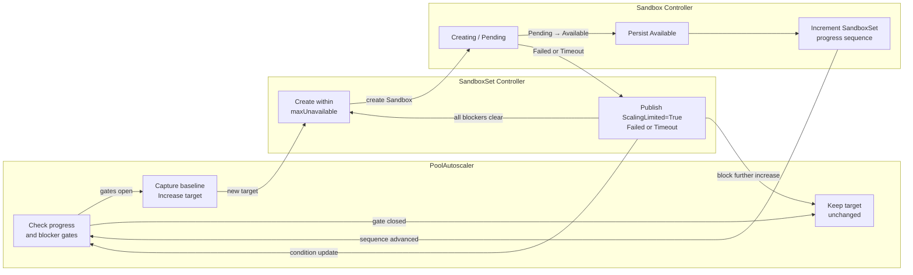

# SandboxSet scale-up execution coordination

## Table of Contents

- [Summary](#summary)
- [Motivation](#motivation)
  - [Goals](#goals)
  - [Non-Goals](#non-goals)
- [Proposal](#proposal)
  - [Controller Responsibilities](#controller-responsibilities)
  - [SandboxSet Creation Limit](#sandboxset-creation-limit)
  - [In-Memory Ready Progress Tracker](#in-memory-ready-progress-tracker)
  - [Tracker Lifecycle and Concurrency](#tracker-lifecycle-and-concurrency)
  - [ScalingLimited Condition](#scalinglimited-condition)
  - [PoolAutoscaler Gate](#poolautoscaler-gate)
  - [State Transitions](#state-transitions)
  - [Observation Window Interaction](#observation-window-interaction)
- [Risks and Mitigations](#risks-and-mitigations)
- [Alternatives](#alternatives)
- [Test Plan](#test-plan)
- [Implementation History](#implementation-history)

## Summary

This proposal defines the execution coordination between PoolAutoscaler, Sandbox controller, and
SandboxSet during scale-up. PoolAutoscaler remains responsible for selecting a desired capacity
target, SandboxSet limits physical creation and reports startup blockers through `ScalingLimited`,
and Sandbox controller records Pending-to-Available progress in a process-local shared tracker.

The tracker prevents repeated target increases when Sandbox creation has made no progress. Recording
the transition in Sandbox controller also preserves healthy high-throughput replenishment when a
Sandbox becomes Available and is claimed immediately. `ScalingLimited` reuses
`SandboxSet.status.conditions`; the progress tracker does not add API fields, replica counters,
blocker lists, timestamps, or claim-tracking fields.

The PoolAutoscaler policies and capacity calculations are defined in
[SandboxSet supports autoscaler](./20260106-sandboxset-autoscaler.md).

## Motivation

Target selection and target execution belong to different controller layers. A capacity policy may
recommend a much larger target while SandboxSet is still creating Sandboxes under
`maxUnavailable`, or while startup is blocked by an existing failure or a prolonged Pending state.
If PoolAutoscaler treats every observation-window expiry as permission to increase the target again,
the desired replica count can continue growing without execution progress.

PoolAutoscaler must not duplicate SandboxSet execution logic by interpreting `maxUnavailable`,
listing Sandboxes, or inspecting Pods. Because PoolAutoscaler and Sandbox controller run in the same
controller-manager process, Sandbox controller can publish Ready progress through a shared in-memory
tracker. SandboxSet separately publishes startup blockage as an aggregate condition.

### Goals

- Keep desired-capacity calculation in PoolAutoscaler and physical creation control in SandboxSet.
- Detect Pending-to-Available progress in Sandbox controller before another capacity-driven target
  increase.
- Prevent Capacity and Cron target growth while known startup blockers exist.
- Aggregate startup blockers without adding new Sandbox failure reasons.
- Reuse the existing conditions field for blockers and keep Ready progress in process memory.

### Non-Goals

- Tracking claimed Sandboxes or returning them to the warm pool.
- Replacing failed Sandboxes or changing Sandbox restart behavior.
- Adding Pod-derived failure reasons such as `PodUnschedulable` or
  `ContainerStartupBlocked`.
- Letting PoolAutoscaler calculate Pending age, creation concurrency, or blocker counts.
- Treating observation-window expiry or `maxUnavailable` saturation as a failure.
- Persisting or reconstructing an outstanding Ready-progress wait across controller-manager restart.

## Proposal

### Controller Responsibilities

Responsibilities are split across three controllers running in the same controller-manager process:

- Sandbox controller manages one Sandbox. After successfully persisting a Pending-to-Available
  transition, it increments a process-local progress sequence for the owning SandboxSet.
- SandboxSet controller executes `spec.replicas`, owns `maxUnavailable`, and publishes the aggregate
  `ScalingLimited` condition.
- PoolAutoscaler computes the desired target, snapshots the progress sequence before increasing the
  target, and waits for that sequence to advance before another capacity-driven increase. It does
  not list Sandboxes or Pods and does not interpret `maxUnavailable`.

The tracker is keyed by SandboxSet UID, not name, so deletion and recreation of a same-named
SandboxSet cannot inherit progress. Sampling history, cooldown timestamps, the per-SandboxSet
progress sequence, and the active scale-up baseline all remain in controller memory. Only
`ScalingLimited` is persisted as an aggregate condition.

### SandboxSet Creation Limit

SandboxSet retains its existing in-flight calculation:

```text
inFlightUnavailable = max(status.replicas - status.availableReplicas, 0)
```

`status.replicas` includes Creating and Available Sandboxes. Existing expectation accounting also
includes successful create requests that are not visible through the informer yet (`dirtyCreate`).
Therefore, `inFlightUnavailable` represents observed Creating Sandboxes plus `dirtyCreate`.

SandboxSet resolves `spec.scaleStrategy.maxUnavailable` solely to limit physical create operations.
An absent value preserves unlimited scale-up behavior. Absolute values are used directly;
percentages are rounded up and resolved against the observed pool size rather than a newly enlarged
desired target:

```text
executionBase = max(status.replicas, 1)
maxConcurrent = resolve(spec.scaleStrategy.maxUnavailable,
                        executionBase, default=unlimited)
createHeadroom = max(maxConcurrent - inFlightUnavailable, 0)
```

SandboxSet creates toward `spec.replicas` while `createHeadroom > 0`. Reaching the limit stops new
create requests until a slot opens, but it is normal flow control rather than a startup failure.

### In-Memory Ready Progress Tracker

Sandbox controller detects progress by comparing the persisted Sandbox status loaded at the start of
reconciliation with the newly calculated status. It records progress only after the status patch has
succeeded and only when both of the following are true:

1. The old Sandbox state is Creating, including ordinary Pending startup.
2. The new Sandbox state is Available and the Sandbox has a SandboxSet controller owner reference.

The shared tracker maintains a monotonically increasing sequence for each SandboxSet UID:

```text
readyProgress[SandboxSetUID] = sequence
```

Sandbox controller updates it after persisting status:

```text
oldState = GetSandboxState(persistedSandbox)
newState = GetSandboxState(sandboxWithNewStatus)

if patchSandboxStatus(sandboxWithNewStatus) succeeded:
    owner = SandboxSetControllerRef(persistedSandbox)
    if owner exists
       and oldState == Creating
       and newState == Available:
        readyProgress.RecordReady(owner.UID)
```

`RecordReady` is deliberately executed after the status patch. A failed or conflicted status write
must not produce progress that other controllers cannot observe.

PoolAutoscaler logically clears Ready progress before every successful target increase by capturing
the current sequence as that scale-up's baseline. A later increase is ready only when:

```text
readyProgress[SandboxSetUID] > scaleUpBaseline[SandboxSetUID]
```

A sequence and baseline are used instead of resetting a boolean. This prevents a concurrent Ready
event from being overwritten by a clear operation. PoolAutoscaler establishes the baseline before
patching `SandboxSet.spec.replicas`; if the patch fails, it cancels that pending baseline. Every
successful target increase, including Cron and initial bounds enforcement, establishes a new baseline
for subsequent capacity-driven scaling.

The tracker records the state transition itself rather than comparing `creationTimestamp`,
`Ready.LastTransitionTime`, or `PoolAutoscaler.status.lastScaleTime`. It therefore does not depend on
clock ordering and also accepts an older Pending Sandbox that becomes Available after the target
increase as valid execution progress.

An already Available Sandbox being claimed does not change its Ready state and does not increment the
sequence. A newly created Sandbox that becomes Available increments the sequence immediately after
its status update; a subsequent immediate claim cannot erase that progress. Claim events therefore
do not require separate handling.

The progress sequence is process-local and intentionally not persisted. After a controller-manager
restart, no outstanding baseline is restored; the next successful target increase establishes a new
baseline and normal gating resumes.

### Tracker Lifecycle and Concurrency

The shared tracker exposes atomic operations equivalent to:

```text
Current(SandboxSetUID) uint64
RecordReady(SandboxSetUID)
Delete(SandboxSetUID)
```

`RecordReady` increments the sequence under synchronization. PoolAutoscaler stores the baseline in
its existing process-local reconciliation state. Because each SandboxSet can have at most one
PoolAutoscaler, one Ready event grants at most one later target increase: immediately before that
increase, PoolAutoscaler replaces the old baseline with the current sequence.

The baseline is captured before patching `spec.replicas`, which defines the start of the new
observation interval and prevents a concurrent Ready transition from being lost. If the patch fails,
the pending baseline is discarded. Scale-down clears any outstanding Ready-progress wait because it
is not gated by startup progress. Tracker state is removed when the SandboxSet or its PoolAutoscaler
is deleted. Both the sequence and baseline disappear together on process restart.

### ScalingLimited Condition

`ScalingLimited` is an orthogonal current-state condition. It is `True` while one or more owned
Sandboxes are blocked from completing startup and returns to `False` when all blockers clear. It is
not sticky.

SandboxSet derives exactly two aggregate categories from existing Sandbox state:

- `Failed`: an owned Sandbox reports an existing startup failure through its `Ready=False`
  condition. Existing reasons such as `PodCreateFailed` and `StartContainerFailed` contribute to the
  single aggregate category and are not exposed as separate counts.
- `Timeout`: an owned Sandbox remains `ResourcePending` longer than
  `--sandboxset-pending-timeout`, which defaults to one minute.

This design does not change Sandbox controller behavior or add Sandbox failure reasons. States that
are not already classified as failures remain ordinary Creating or Pending states until the timeout.
SandboxSet derives the counts from its existing owned-Sandbox list and does not inspect Pods.

When blockers exist, SandboxSet publishes:

```yaml
status:
  conditions:
    - type: ScalingLimited
      status: "True"
      reason: StartupBlocked
      observedGeneration: 12
      message: "3 Sandboxes are blocked from starting: Timeout=2, Failed=1"
```

When no blocker remains, it publishes `ScalingLimited=False/ScalingAllowed`. Counts and a bounded
summary belong only in the condition message, Events, logs, and metrics; no UID list or counter is
added to the API. `LastTransitionTime` changes only when status changes, and a Warning Event is
emitted only on transition to `True`.

The earliest incomplete Pending deadline supplies `RequeueAfter`. Timeout state is derived from the
Sandbox `creationTimestamp`, so it can be reconstructed after a controller restart without a
persisted timer.

SandboxSet calculates the aggregate condition during reconciliation:

```text
failed = 0
timeout = 0
nextDeadline = none

for sandbox in ownedSandboxes:
    if sandbox.Ready == False
       and sandbox.Ready.reason is an existing startup-failure reason:
        failed++
        continue

    if GetSandboxState(sandbox) == Creating
       and stateReason == ResourcePending:
        deadline = sandbox.creationTimestamp + pendingTimeout
        if now >= deadline:
            timeout++
        else:
            nextDeadline = min(nextDeadline, deadline)

if failed + timeout > 0:
    ScalingLimited = True / StartupBlocked
else:
    ScalingLimited = False / ScalingAllowed

requeueAfter = max(nextDeadline - now, 0)
```

Only `Failed` and `Timeout` are externally aggregated. `dirtyCreate` participates in creation
concurrency but is not an observed Sandbox and therefore does not contribute to either blocker count.

`ScalingLimited=True` does not delete or replace Sandboxes and does not stop SandboxSet from
reconciling its already-declared target within `maxUnavailable`. It only prevents PoolAutoscaler from
publishing another scale-up target.

### PoolAutoscaler Gate

Before a capacity-driven target increase, PoolAutoscaler requires:

1. `SandboxSet.status.observedGeneration >= SandboxSet.metadata.generation`.
2. `ScalingLimited=False` for the current SandboxSet generation.
3. Either no target increase is awaiting progress, or the SandboxSet progress sequence is greater
   than the baseline captured for the previous target increase.
4. A freshly recomputed Capacity recommendation greater than current `spec.replicas`.
5. The scale-up cooldown, when configured, to have elapsed.

If `ScalingLimited` is missing, stale, or `Unknown`, the blocker gate remains closed. PoolAutoscaler
does not parse its reason or message.

The initial bounds-enforcement action may bootstrap `minReplicas` without prior Ready progress or
prior `ScalingLimited=False`, allowing an empty pool to establish observable startup state. Cron
targets bypass the previous-progress wait and capacity cooldown because they represent explicit
scheduled intent, but they still require current-generation `ScalingLimited=False`. Scale-down is not
blocked by either gate. SandboxSet always applies its physical creation limit.

Before any successful target increase, PoolAutoscaler captures the current tracker sequence as the
new baseline. It then waits for a sequence increment, a `ScalingLimited` condition update, or a
timer-driven reconciliation. On every evaluation it reads fresh SandboxSet status and recomputes the
recommendation. If Ready progress has restored available capacity, the recommendation naturally
keeps the current target. If demand remains high, the advanced sequence allows the next increase.

The Capacity gate can be expressed as:

```text
function reconcileCapacityScaleUp(poolAutoscaler, sandboxSet):
    policyDesired = calculateCapacityPolicy()
    policyDesired = clamp(policyDesired, minReplicas, maxReplicas)

    if policyDesired <= sandboxSet.spec.replicas:
        return keepOrScaleDown(policyDesired)

    if sandboxSet.status.observedGeneration < sandboxSet.metadata.generation:
        return keepCurrentTarget()

    limited = currentCondition(sandboxSet, ScalingLimited)
    if limited is missing
       or limited.observedGeneration < sandboxSet.metadata.generation
       or limited.status != False:
        return keepCurrentTarget()

    baseline, waiting = scaleUpBaseline.Load(sandboxSet.UID)
    currentSequence = readyProgress.Current(sandboxSet.UID)
    if waiting and currentSequence <= baseline:
        return keepCurrentTarget()

    if scaleUpCooldownNotElapsed():
        return requeueWhenCooldownExpires()

    refresh sandboxSet and recompute policyDesired
    if policyDesired <= sandboxSet.spec.replicas:
        return keepCurrentTarget()

    nextBaseline = readyProgress.Current(sandboxSet.UID)
    if patch sandboxSet.spec.replicas = policyDesired succeeds:
        scaleUpBaseline.Store(sandboxSet.UID, nextBaseline)
    else:
        return retryWithoutChangingBaseline()
```

The second sequence read immediately before the target patch is important. It consumes all Ready
progress observed before this target increase and makes only a later transition eligible to unlock
the next increase.

Cron and initial bootstrap use the following exceptions:

```text
Cron increase:
    bypass previous-progress wait and capacity cooldown
    require current ScalingLimited=False
    capture a new baseline when the target patch succeeds

initial minReplicas bootstrap:
    may bypass previous-progress and ScalingLimited initialization
    capture a new baseline when the target patch succeeds

scale-down:
    never blocked by Ready progress or ScalingLimited
    clear any outstanding scale-up baseline after a successful patch
```

### State Transitions

The following diagram shows only the new execution-coordination logic:



The in-process handshake is:

```text
PoolAutoscaler captures the current progress sequence and increases the target
→ SandboxSet creates within maxUnavailable
→ Sandbox controller persists one Pending-to-Available transition
→ Sandbox controller increments the owning SandboxSet's progress sequence
→ PoolAutoscaler may evaluate the next capacity-driven increase
```

### Observation Window Interaction

The observation window continues to collect capacity samples as defined by the PoolAutoscaler
proposal. Its expiry only schedules another evaluation. It does not advance the Ready progress
sequence, clear `ScalingLimited`, classify a Sandbox as failed, or replace the one-minute Pending
timeout.

A Pending-to-Available transition advances the sequence. PoolAutoscaler's normal sampling requeue
observes the new value without requiring Sandbox controller to address or enqueue a PoolAutoscaler
directly. A `ScalingLimited` condition change can trigger earlier re-evaluation through the existing
SandboxSet watch. PoolAutoscaler checks the current baseline, sequence, SandboxSet generation, and
condition again before deciding whether to increase the target.

## Risks and Mitigations

- **Repeated growth without execution progress**: require the process-local sequence to advance past
  the previous target increase's baseline.
- **Lost Ready event while clearing state**: use a monotonically increasing sequence and capture a
  baseline instead of resetting a boolean.
- **Growth while startup is blocked**: require current-generation `ScalingLimited=False` for Capacity
  and Cron increases.
- **Stale blocker observations**: compare `ScalingLimited.observedGeneration` and SandboxSet
  `status.observedGeneration` with `metadata.generation`.
- **Controller-manager restart**: outstanding progress state is intentionally not reconstructed; the
  next target increase establishes a new baseline.
- **API growth and high-cardinality status**: keep Ready progress in memory, reuse
  `status.conditions` for blockers, and keep object identifiers and counters out of the API.
- **Missed Pending timeout without Pod events**: derive the nearest deadline from
  `creationTimestamp` and set `RequeueAfter`.

## Alternatives

- **Let PoolAutoscaler interpret `maxUnavailable`**: rejected because it duplicates SandboxSet
  execution policy and couples target selection to create concurrency.
- **Let PoolAutoscaler count Pending Sandboxes**: rejected because it requires listing execution
  objects and duplicates SandboxSet lifecycle knowledge.
- **Persist a `ScaleUpReady` condition**: rejected because PoolAutoscaler and Sandbox controller run
  in the same process, so short-lived progress can be coordinated without expanding persisted API
  semantics.
- **Compare `creationTimestamp` or `Ready.LastTransitionTime` with `lastScaleTime`**: rejected because
  the timestamps come from different lifecycle stages and potentially different clocks; direct
  transition observation is unambiguous.
- **Gate on claim events**: rejected because an already Available Sandbox being claimed is demand, not
  scale-up execution progress. A new Sandbox records its Ready transition before an immediate claim.
- **Treat observation-window expiry as progress or failure**: rejected because timer expiry provides
  no evidence about Sandbox startup.
- **Add detailed Sandbox or Pod failure reasons**: rejected for this version; `ScalingLimited`
  consumes only failure reasons already published by Sandbox controller and aggregates them as
  `Failed`.

## Test Plan

### Sandbox Controller and Tracker Unit Tests

- Verify only Creating-to-Available transitions increment the owning SandboxSet sequence.
- Verify progress is recorded only after the Sandbox status patch succeeds.
- Verify an already Available Sandbox being claimed does not increment the sequence.
- Verify an immediately claimed newly Available Sandbox retains the recorded progress.
- Verify concurrent baseline capture and Ready updates cannot lose a sequence increment.
- Verify a failed target patch discards its pending baseline and scale-down clears an outstanding
  progress wait.
- Verify tracker entries are isolated by SandboxSet UID and cleaned up when no longer needed.

### SandboxSet Unit Tests

- Verify absolute and percentage `maxUnavailable` creation limits, including `dirtyCreate`.
- Verify `ScalingLimited` aggregates exactly `Failed` and `Timeout`.
- Verify other Creating and Pending states remain unclassified before timeout.
- Verify the condition clears when all blockers resolve.
- Verify timeout requeue and restart reconstruction from `creationTimestamp`.
- Verify condition messages are bounded and Warning Events occur only on transition to `True`.

### PoolAutoscaler Unit Tests

- Verify Capacity increase waits until the sequence advances beyond the previous baseline and
  requires current-generation `ScalingLimited=False`.
- Verify baseline capture happens before the target patch and a failed patch cancels the pending
  baseline.
- Verify Capacity and Cron increases stop for missing, stale, `Unknown`, or `True`
  `ScalingLimited`.
- Verify Cron bypasses the previous-progress wait and cooldown but not `ScalingLimited`, and starts a
  new baseline after increasing the target.
- Verify initial `minReplicas` bootstrap and scale-down retain their exceptions.
- Verify observation-window expiry re-evaluates without advancing progress or opening either gate.
- Verify PoolAutoscaler does not inspect `maxUnavailable`, Pending counts, Pods, or Sandboxes.

### Integration Tests

- Verify healthy sustained demand can increase the target across multiple generations.
- Verify no-demand replenishment restores available capacity and stops further target growth.
- Verify startup failure and Pending timeout block further increases and recovery reopens the gate.
- Verify condition transitions, Events, logs, and metrics provide sufficient diagnostics.

## Implementation History

- [x] 27/08/2026: Initial execution-coordination proposal extracted from the PoolAutoscaler design.
- [x] 27/08/2026: Moved Ready progress detection to a process-local Sandbox controller tracker.
