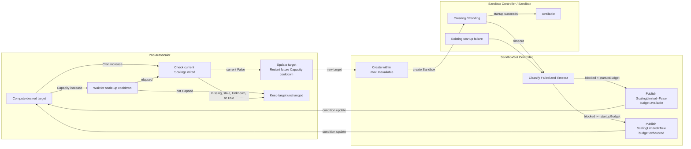

# SandboxSet scale-up execution coordination

## Table of Contents

- [Summary](#summary)
- [Motivation](#motivation)
  - [Goals](#goals)
  - [Non-Goals](#non-goals)
- [Proposal](#proposal)
  - [API Changes](#api-changes)
  - [Controller Responsibilities](#controller-responsibilities)
  - [SandboxSet Creation Limit](#sandboxset-creation-limit)
  - [Scale-Up Cooldown and Sandbox Pending Timeout](#scale-up-cooldown-and-sandbox-pending-timeout)
  - [ScalingLimited Condition](#scalinglimited-condition)
  - [PoolAutoscaler Gate](#poolautoscaler-gate)
  - [User-Visible Scaling Behavior](#user-visible-scaling-behavior)
  - [State Transitions](#state-transitions)
  - [Observation Window Interaction](#observation-window-interaction)
- [Risks and Mitigations](#risks-and-mitigations)
- [Alternatives](#alternatives)
- [Test Plan](#test-plan)

## Summary

This proposal defines the execution coordination between PoolAutoscaler and SandboxSet during
scale-up. PoolAutoscaler remains responsible for selecting a desired capacity target and enforcing a
minimum interval between Capacity-driven target increases. SandboxSet limits physical creation and
reports exhausted startup concurrency through `ScalingLimited`.

No Ready-progress gate, sequence, baseline, timestamp, replica counter, blocker list, or claim-tracking
field is introduced. The design reuses the existing scale-up cooldown and
`SandboxSet.status.conditions`.

The PoolAutoscaler policies and capacity calculations are defined in
[SandboxSet supports autoscaler](./20260106-sandboxset-autoscaler.md). For execution coordination,
this proposal supersedes that document's Ready-progress handshake and zero default scale-up cooldown.

## Motivation

Target selection and target execution belong to different controller layers. A capacity policy may
recommend a much larger target while SandboxSet is still creating Sandboxes under
`maxUnavailable`, or while startup is blocked by an existing failure or a prolonged Pending state.
If PoolAutoscaler treats every observation-window expiry as permission to increase the target again,
the desired replica count can continue growing without execution progress.

PoolAutoscaler must not duplicate SandboxSet execution logic by interpreting `maxUnavailable`,
listing Sandboxes, or inspecting Pods. Instead, Capacity-driven target increases use a scale-up
cooldown that is at least five seconds longer than the process-wide Sandbox Pending timeout. By the
end of that cooldown, SandboxSet has classified prolonged startup and can report whether blocked
Sandboxes have exhausted the configured creation concurrency.

### Goals

- Keep desired-capacity calculation in PoolAutoscaler and physical creation control in SandboxSet.
- Rate-limit successive Capacity-driven target increases with the existing scale-up cooldown.
- Configure Sandbox Pending timeout once in Sandbox controller and inject the effective value into
  SandboxSet and PoolAutoscaler.
- Prevent target growth only when timed-out or failed Sandboxes exhaust `maxUnavailable`.
- Aggregate startup blockers without adding new Sandbox failure reasons or CRD fields.

### Non-Goals

- Tracking claimed Sandboxes or returning them to the warm pool.
- Replacing failed Sandboxes or changing Sandbox restart behavior.
- Adding Pod-derived failure reasons such as `PodUnschedulable` or
  `ContainerStartupBlocked`.
- Letting PoolAutoscaler calculate Pending age, creation concurrency, or blocker counts.
- Treating observation-window expiry or `maxUnavailable` saturation by itself as a failure.
- Tracking individual Ready transitions or reconstructing scale-up progress after restart.

## Proposal

### API Changes

This proposal adds no CRD field. It adds the process-wide `--max-pending-timeout` controller flag,
tightens the validating webhook for `spec.capacityPolicy.{scaleUp,scaleDown}.stabilizationWindowSeconds`,
changes the effective semantics of one existing PoolAutoscaler field, and adds one structured
condition type to the existing SandboxSet conditions list.

#### Sandbox Controller Configuration

`--max-pending-timeout` is a duration-valued process setting that defines how long a Sandbox may
remain `ResourcePending` before it consumes its SandboxSet startup budget:

- The default is `50s`.
- Values below `15s`, including zero and negative values, remain accepted but are normalized to
  `15s` at runtime.
- Values above `3590s` are capped at `3590s`.
- The controller registration layer resolves the value once and injects the same effective duration
  into SandboxSet and PoolAutoscaler.

The `3590s` upper bound ensures the required ten-second safety margin still fits within the
existing `3600`-second maximum for `scaleUp.stabilizationWindowSeconds`.

#### PoolAutoscaler Configuration

`spec.capacityPolicy.scaleUp.stabilizationWindowSeconds` remains the user-facing Capacity scale-up
cooldown. The validating webhook now requires explicit values for both scale-up and scale-down
stabilization windows to fall within `[60, 3600]` seconds; nil values are left unchanged. When the
field is omitted, the PoolAutoscaler controller applies the built-in defaults through the
compile-time constants `defaultScaleUpStabilization = 60s` and `defaultScaleDownStabilization = 300s`.
No controller flag is exposed for either default. The effective scale-up value is:

```text
effectiveScaleUpCooldown = max(configuredOrDefaultCooldown,
                               maxPendingTimeout + 10 seconds)
configuredOrDefaultCooldown = configured value when present,
                              otherwise defaultScaleUpStabilization
```

Explicit values that pass webhook validation (`>= 60s`) but sit below the effective minimum implied
by `maxPendingTimeout + 10s` are still raised at runtime. With the default `50s` Pending timeout and
ten-second safety margin, the default effective cooldown is `60s`. The CRD range now permits
`60` through `3600` seconds for explicit values; omitted fields defer to the constants above. The
cooldown applies only to Capacity-driven target changes; Cron-driven scaling keeps its direct
schedule semantics and bypasses cooldown.

| `--max-pending-timeout` | User cooldown | Effective Capacity cooldown |
| --- | --- | --- |
| omitted (`50s`) | omitted | 60 seconds |
| `50s` | `0` | 60 seconds |
| `50s` | 30 seconds | 60 seconds |
| `50s` | 120 seconds | 120 seconds |
| `120s` | omitted | 130 seconds |
| `3590s` | omitted | 3600 seconds |

Existing PoolAutoscalers require no manifest migration. No timeout value is persisted in the
PoolAutoscaler or SandboxSet API.

#### SandboxSet Condition

The existing `SandboxSet.status.conditions` list gains the `ScalingLimited` condition contract; no
new status field or blocker counter is added.

| Field | Available budget | Exhausted budget |
| --- | --- | --- |
| `type` | `ScalingLimited` | `ScalingLimited` |
| `status` | `False` | `True` |
| `reason` | `StartupBudgetAvailable` | `StartupBudgetExhausted` |
| `observedGeneration` | Current SandboxSet generation | Current SandboxSet generation |
| `message` | Bounded `Failed` and `Timeout` summary | Bounded `Failed` and `Timeout` summary |

`ScalingLimited=True` means `Failed + Timeout >= startupBudget`. A non-zero blocker count below the
budget still publishes `False/StartupBudgetAvailable`. Consumers must use the structured condition
status and reason rather than parse `message`.

There is no `ScaleUpReady` condition or Ready-progress API. Existing Sandbox Ready conditions,
Events, logs, and metrics remain available for individual startup diagnosis.

### Controller Responsibilities

Responsibilities are split across the existing controllers:

- Sandbox controller manages individual Sandbox and Pod lifecycle and owns the process-wide
  `--max-pending-timeout` setting. It adds no Ready-transition tracking or coordination state.
- The controller registration layer resolves the configured timeout once and injects the same value
  into SandboxSet and PoolAutoscaler.
- SandboxSet controller executes `spec.replicas`, owns `maxUnavailable`, classifies Pending timeout,
  and publishes the aggregate `ScalingLimited` condition. It does not list or watch PoolAutoscaler.
- PoolAutoscaler computes the desired target, applies Capacity scale-up cooldown, and consumes
  `ScalingLimited`. It does not list Sandboxes or Pods and does not interpret `maxUnavailable`.

Sampling history and cooldown timestamps remain in PoolAutoscaler's existing process-local state.
Only `ScalingLimited` is persisted as an aggregate condition.

### SandboxSet Creation Limit

SandboxSet limits new creations using the standard unavailable replica count:

```text
unavailable = status.replicas - status.availableReplicas
```

Every non-Available Sandbox, including healthy in-flight creations and `dirtyCreate`, occupies the
scale-up budget until it becomes Available. Existing expectation accounting continues to govern
outstanding create RPCs.

`ScalingLimited` uses a separate, stricter startup-blocker count:

```text
blockedStartups = countStartupBlocked(groups, maxPendingTimeout, now)
                = failed + timeout
```

`failed` counts Sandboxes with `Ready=False` and reason `PodCreateFailed` or
`StartContainerFailed`. The Sandbox controller sets `StartContainerFailed` for the explicit
container Waiting reasons `CreateContainerConfigError`, `CreateContainerError`, `RunContainerError`,
`InvalidImageName`, and `ErrImageNeverPull`. It also treats a non-ready init or app container with at
least five restarts as failed. The monotonic restart count detects repeated failures independently
of whether the sampled container state is `CrashLoopBackOff` or briefly `Running`. Other transient
Waiting reasons do not cause an immediate failure. `timeout` counts Sandboxes still in `Creating`
with reason `ResourcePending` whose `creationTimestamp + maxPendingTimeout` has already elapsed.

SandboxSet resolves `spec.scaleStrategy.maxUnavailable` solely to limit physical create operations.
An absent or invalid value falls back to `100%` (no cap; equivalent to `spec.replicas`). Absolute values are used directly; percentages are
rounded up and resolved against `spec.replicas` so headroom is derived from the declared target
rather than the momentary observed pool size:

```text
maxConcurrent = resolve(spec.scaleStrategy.maxUnavailable,
                        spec.replicas, default=100%)
createHeadroom = max(maxConcurrent - unavailable, 0)
```

SandboxSet creates toward `spec.replicas` while `createHeadroom > 0`. Reaching the limit stops new
create requests until a slot opens, but it is normal flow control rather than a startup failure.

### Scale-Up Cooldown and Sandbox Pending Timeout

Sandbox controller owns the process-wide `--max-pending-timeout` setting. The controller registration
layer normalizes it once and supplies the same effective duration to SandboxSet for timeout
classification and PoolAutoscaler for Capacity cooldown resolution:

```text
minimumPendingTimeout = 15 seconds
maximumPendingTimeout = 3590 seconds
pendingSafetyMargin = 10 seconds
configuredPendingTimeout = --max-pending-timeout, default 50 seconds
pendingTimeout = min(max(configuredPendingTimeout,
                         minimumPendingTimeout),
                     maximumPendingTimeout)
configuredCooldown = scaleUp.stabilizationWindowSeconds
configuredOrDefaultCooldown = defaultScaleUpStabilization (60 seconds) if configuredCooldown is omitted
                              else configuredCooldown
scaleUpCooldown = max(configuredOrDefaultCooldown,
                      pendingTimeout + pendingSafetyMargin)
```

This enforces `scaleUpCooldown >= pendingTimeout + 10 seconds`. The maximum Pending timeout is `3590`
seconds so the effective cooldown never needs to exceed the existing `3600`-second CRD limit. No
timeout lookup is performed during reconciliation, and no timeout value is copied into SandboxSet
status.

The safety margin provides an interval in which Pending deadlines can elapse and `ScalingLimited` can
be published before the next Capacity scale-up decision. If publication is delayed, the missing or
stale condition keeps the gate closed conservatively. Every successful scale action updates existing
`status.lastScaleTime`; the cooldown gates only later Capacity increases. Failed or conflicted target
patches do not update it. Initial bootstrap may perform the first increase immediately, but that
increase starts the Capacity cooldown. Scale-down remains allowed independently of both scale-up
gates.

Cron-driven target changes bypass stabilization cooldown to preserve their explicit schedule
semantics. Cron scale-up still requires a current `ScalingLimited=False` condition, so exhausted
startup budget prevents additional target growth even though no cooldown is applied. A successful
Cron target change still updates `status.lastScaleTime` and therefore restarts the cooldown observed
by a later Capacity increase.

### ScalingLimited Condition

`ScalingLimited` is a current-state condition. It is `True` only when failed and timed-out owned
Sandboxes consume the full startup concurrency budget. It returns to `False` when blocker count falls
below that budget and is not sticky.

SandboxSet derives exactly two aggregate categories from existing Sandbox state:

- `Failed`: an owned Sandbox reports an existing startup failure through its `Ready=False`
  condition. Existing reasons such as `PodCreateFailed` and `StartContainerFailed` contribute to the
  single aggregate category and are not exposed as separate counts.
- `Timeout`: an owned Sandbox remains `ResourcePending` longer than the process-wide
  `pendingTimeout`. The default timeout is 60 seconds.

This design does not change per-Sandbox reconciliation or add Sandbox failure reasons. States that
are not already classified as failures remain ordinary Creating or Pending states until the timeout.
SandboxSet derives the counts from its existing owned-Sandbox list and does not inspect Pods.

When blockers exhaust the startup concurrency budget, SandboxSet publishes:

```yaml
status:
  conditions:
    - type: ScalingLimited
      status: "True"
      reason: StartupBudgetExhausted
      observedGeneration: 12
      message: "3 of 3 startup slots are blocked: Timeout=2, Failed=1"
```

When blocker count is below the budget, SandboxSet publishes
`ScalingLimited=False/StartupBudgetAvailable`, even if one or more blocked Sandboxes remain. Counts
and a bounded summary belong only in the condition message, Events, logs, and metrics; no UID list or
counter is added to the API. `LastTransitionTime` changes only when status changes, and a Warning
Event is emitted only on transition to `True`.

The earliest incomplete Pending deadline supplies `RequeueAfter`. Timeout state is derived from the
Sandbox `creationTimestamp`, so it can be reconstructed after a controller restart without a
persisted timer.

SandboxSet calculates the aggregate condition during reconciliation:

```text
failed = 0
timeout = 0
nextDeadline = none

for sandbox in ownedSandboxes:
    if sandbox.Ready == False
       and sandbox.Ready.reason is an existing startup-failure reason:
        failed++
        continue

    if GetSandboxState(sandbox) == Creating
       and stateReason == ResourcePending:
        deadline = sandbox.creationTimestamp + pendingTimeout
        if now >= deadline:
            timeout++
        else:
            nextDeadline = min(nextDeadline, deadline)

executionBase = max(status.replicas, 1)
maxConcurrent = resolve(spec.scaleStrategy.maxUnavailable,
                        executionBase, default=unlimited)
startupBudget = max(maxConcurrent, 1) if finite else executionBase
blocked = failed + timeout

if blocked >= startupBudget:
    ScalingLimited = True / StartupBudgetExhausted
else:
    ScalingLimited = False / StartupBudgetAvailable

requeueAfter = max(nextDeadline - now, 0)
```

For finite `maxUnavailable`, `startupBudget` is exactly the same resolved value used by physical
creation control. When `maxUnavailable` is absent, creation remains unlimited and the condition uses
the current observed pool size as its diagnostic budget; only an entirely blocked observed pool then
limits another target increase. `startupBudget` is always at least one.

A single failed or timed-out Sandbox therefore does not block another target increase while another
startup slot remains. `dirtyCreate` still governs outstanding create-request concurrency through the
existing expectation accounting, but it is not an observed Sandbox and does not contribute to
`blocked` or to the per-reconcile creation delta.

`ScalingLimited=True` does not delete or replace Sandboxes and does not stop SandboxSet from
reconciling its already-declared target within `maxUnavailable`. It prevents PoolAutoscaler from
publishing another scale-up target until startup budget becomes available.

### PoolAutoscaler Gate

Before a non-bootstrap target increase, PoolAutoscaler requires:

1. `SandboxSet.status.observedGeneration >= SandboxSet.metadata.generation`.
2. `ScalingLimited=False` for the current SandboxSet generation.
3. A freshly computed active-policy target greater than current `spec.replicas`.

Capacity-driven increases additionally require the effective scale-up cooldown to have elapsed.
Because the cooldown is at least five seconds longer than `pendingTimeout`, SandboxSet has an interval
to classify prolonged Pending Sandboxes and publish the current condition before the next Capacity
increase is eligible. If `ScalingLimited` is missing, stale, or `Unknown`, the blocker gate remains
closed. PoolAutoscaler does not parse its reason, message, counts, or `maxUnavailable`.

The initial bounds-enforcement action may bootstrap `minReplicas` immediately without prior
`ScalingLimited=False`, allowing an empty pool to establish observable startup state. Its successful
target patch starts the Capacity cooldown. Cron bypasses cooldown but uses the same current-generation
`ScalingLimited` gate as Capacity. Scale-down is not blocked by either gate, and SandboxSet always
applies its physical creation limit.

At Capacity cooldown expiry, PoolAutoscaler reads fresh SandboxSet status and recomputes the
recommendation. If healthy Sandboxes have restored available capacity, the recommendation naturally
keeps the current target. If demand remains high and the startup budget is not exhausted, another
increase is allowed and starts a new cooldown.

The scale-up gate can be expressed as:

```text
function reconcileScaleUp(poolAutoscaler, sandboxSet):
    desired, source = calculateActivePolicyTarget()
    desired = clamp(desired, minReplicas, maxReplicas)

    if desired <= sandboxSet.spec.replicas:
        return keepOrScaleDown(desired)

    if source == Capacity:
        cooldown = max(configuredOrDefaultCooldown,
                       maxPendingTimeout + 10 seconds)
        if now < status.lastScaleTime + cooldown:
            return requeueAt(status.lastScaleTime + cooldown)

    if sandboxSet.status.observedGeneration < sandboxSet.metadata.generation:
        return keepCurrentTarget()

    limited = currentCondition(sandboxSet, ScalingLimited)
    if limited is missing
       or limited.observedGeneration < sandboxSet.metadata.generation
       or limited.status != False:
        return keepCurrentTarget()

    refresh sandboxSet and recompute desired
    if desired <= sandboxSet.spec.replicas:
        return keepCurrentTarget()

    if patch sandboxSet.spec.replicas = desired succeeds:
        update status.lastScaleTime = now
    else:
        return retryWithoutStartingCooldown()
```

Exceptions are:

```text
initial minReplicas bootstrap:
    may bypass cooldown and ScalingLimited initialization
    start Capacity cooldown when the target patch succeeds

Cron scaling:
    bypass stabilization cooldown
    require current ScalingLimited=False before scale-up
    restart the cooldown observed by a later Capacity scale-up after success

scale-down:
    never blocked by scale-up cooldown or ScalingLimited
    update the existing lastScaleTime after a successful scale-down
    thereby restart the cooldown before a later Capacity scale-up
```

### User-Visible Scaling Behavior

- The first `minReplicas` bootstrap may occur immediately. Each later Capacity increase waits for the
  effective scale-up cooldown; Cron executes on schedule without waiting for cooldown.
- Capacity and Cron scale-up are blocked only by an explicit `ScalingLimited=True`
  observed against the current generation. Missing, stale, and `Unknown` conditions
  fail open: `doScale` bumps `metadata.generation`, so a stale report is the normal
  state immediately after any scale, and failing closed would deadlock scale-up
  whenever the SandboxSet controller lags or is unavailable.
- A failed or timed-out Sandbox does not by itself stop target growth when startup budget remains.
  Scale-up is blocked only when `Failed + Timeout >= startupBudget`.
- Healthy sustained demand may continue increasing the target once per Capacity cooldown interval.
  There is no requirement to observe an individual Sandbox Ready transition between increases.
- SandboxSet still enforces `maxUnavailable` while creating toward the declared target, independently
  of PoolAutoscaler's cooldown.
- Scale-down remains allowed while scale-up is cooling down or limited.

### State Transitions

The following diagram shows only the new execution-coordination logic:



The coordination loop is:

```text
Capacity recommendation increases the target and starts the scale-up cooldown
→ SandboxSet creates within maxUnavailable
→ SandboxSet classifies Failed and Timeout using the configured Pending timeout
→ SandboxSet compares Failed + Timeout with the resolved startup budget
→ after cooldown, Capacity increases again only when ScalingLimited=False

Cron recommendation bypasses cooldown
→ Cron scale-up proceeds only when ScalingLimited=False
```

### Observation Window Interaction

The observation window continues to collect capacity samples as defined by the PoolAutoscaler
proposal. Its expiry only schedules another evaluation. It does not end the Capacity scale-up
cooldown, clear `ScalingLimited`, classify a Sandbox as failed, or replace the configured Pending
timeout.

SandboxSet's timeout `RequeueAfter` and lifecycle watches refresh `ScalingLimited` independently of the
observation window. A condition change can trigger earlier PoolAutoscaler reconciliation through the
existing SandboxSet watch, but another Capacity increase still waits until cooldown expiry. Cron keeps
its cooldown bypass. PoolAutoscaler checks current generation and condition state and recomputes the
recommendation before either source increases the target.

## Risks and Mitigations

- **Repeated Capacity growth while startup is still unresolved**: enforce a cooldown after every
  successful Capacity target increase and ensure it is at least five seconds longer than the Pending
  timeout.
- **Cron growth while startup concurrency is exhausted**: Cron bypasses cooldown but still requires
  current-generation `ScalingLimited=False` before scale-up.
- **One isolated blocker unnecessarily stops growth**: compare `Failed + Timeout` with the resolved
  startup budget instead of treating any blocker as sufficient.
- **Stale blocker observations**: compare `ScalingLimited.observedGeneration` and SandboxSet
  `status.observedGeneration` with `metadata.generation`.
- **Controller-manager restart**: reconstruct Pending timeout state from Sandbox
  `creationTimestamp`; the existing scale timestamp semantics continue to govern cooldown recovery.
- **API growth and high-cardinality status**: reuse `status.conditions`, keep the timeout as one
  process-level Sandbox controller setting, and keep object identifiers and counters out of the API.
- **Missed Pending timeout without Pod events**: derive the nearest deadline from
  `creationTimestamp` and set `RequeueAfter`.
- **Sandbox reuse and accumulated restart counts**: the current failure threshold uses the Pod's
  lifetime `restartCount`, which is valid while a Sandbox has a single startup lifecycle. Before a
  Sandbox can return to the pool and be leased again, the reuse flow must record a restart-count
  baseline for the new lease and classify only the increment since that baseline. Clearing the
  Sandbox Ready condition alone is insufficient because kubelet does not reset `restartCount`.

## Alternatives

- **Let PoolAutoscaler interpret `maxUnavailable`**: rejected because it duplicates SandboxSet
  execution policy and couples target selection to create concurrency.
- **Let PoolAutoscaler count Pending Sandboxes**: rejected because it requires listing execution
  objects and duplicates SandboxSet lifecycle knowledge.
- **Track Ready progress in memory or in a `ScaleUpReady` condition**: deferred for this version. The
  cooldown gives SandboxSet enough time to classify blocked execution without adding a Ready-event
  handshake.
- **Derive Pending timeout from each PoolAutoscaler's cooldown**: rejected because Sandbox startup
  timeout belongs to Sandbox lifecycle configuration and would require SandboxSet to discover and
  query a targeting PoolAutoscaler.
- **Let Cron use scale-up cooldown**: rejected because Cron expresses an explicit scheduled target;
  it bypasses cooldown while retaining the `ScalingLimited` safety gate.
- **Treat any Failed or Timeout Sandbox as limited**: rejected because an isolated blocker does not
  exhaust a larger `maxUnavailable` budget.
- **Treat observation-window expiry as progress or failure**: rejected because timer expiry provides
  no evidence about Sandbox startup.
- **Add detailed Sandbox or Pod failure reasons**: rejected for this version; `ScalingLimited`
  consumes only failure reasons already published by Sandbox controller and aggregates them as
  `Failed`.

## Test Plan

### Sandbox Controller Unit Tests

- Verify `--max-pending-timeout` defaults to 50 seconds, is raised to 15 seconds when lower, and is
  capped at 3590 seconds.

### SandboxSet Unit Tests

- Verify absolute and percentage `maxUnavailable` creation limits, including `dirtyCreate`.
- Verify SandboxSet uses the injected Pending timeout without listing or watching PoolAutoscaler.
- Verify `ScalingLimited` aggregates exactly `Failed` and `Timeout`.
- Verify `ScalingLimited=True` only when `Failed + Timeout >= startupBudget`.
- Verify a blocker count below the budget publishes `False/StartupBudgetAvailable`.
- Verify absent `maxUnavailable` uses observed pool size as the diagnostic budget.
- Verify other Creating and Pending states remain unclassified before timeout.
- Verify timeout requeue and restart reconstruction from `creationTimestamp`.
- Verify condition messages are bounded and Warning Events occur only on transition to `True`.

### PoolAutoscaler Unit Tests

- Verify Capacity scale-up cooldown uses the built-in `defaultScaleUpStabilization` (60 seconds) when
  the field is omitted and is at least the injected Pending timeout plus 10 seconds.
- Verify Capacity scale-down cooldown uses the built-in `defaultScaleDownStabilization` (300 seconds)
  when the field is omitted.
- Verify the validating webhook rejects explicit `stabilizationWindowSeconds` values outside
  `[60, 3600]` for both scale-up and scale-down and accepts nil.
- Verify every successful target change updates the timestamp used by later Capacity cooldown.
- Verify Cron bypasses cooldown while retaining the `ScalingLimited` gate.
- Verify failed or conflicted target patches do not start the cooldown.
- Verify a successful scale-down remains allowed and restarts the interval before a later scale-up.
- Verify another increase is denied before cooldown expiry regardless of condition updates.
- Verify Capacity and Cron increases stop only for an explicit current-generation
  `ScalingLimited=True`; missing, stale, and `Unknown` conditions fail open and
  do not block scale-up.
- Verify initial `minReplicas` bootstrap and scale-down retain their exceptions.
- Verify observation-window expiry re-evaluates without ending cooldown or opening the condition gate.
- Verify PoolAutoscaler does not inspect `maxUnavailable`, Pending counts, Pods, or Sandboxes.

### Integration Tests

- Verify healthy sustained demand can increase the target across multiple generations.
- Verify no-demand replenishment restores available capacity and stops further target growth.
- Verify startup blockers reaching the budget stop further increases after cooldown, and recovery
  reopens the gate.
- Verify a blocker count below the startup budget permits sustained-demand growth after cooldown.
- Verify condition transitions, Events, logs, and metrics provide sufficient diagnostics.
