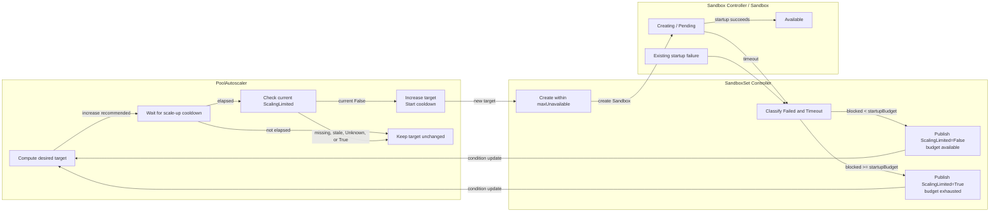

# SandboxSet scale-up execution coordination

## Table of Contents

- [Summary](#summary)
- [Motivation](#motivation)
  - [Goals](#goals)
  - [Non-Goals](#non-goals)
- [Proposal](#proposal)
  - [API Changes](#api-changes)
  - [Controller Responsibilities](#controller-responsibilities)
  - [SandboxSet Creation Limit](#sandboxset-creation-limit)
  - [Scale-Up Cooldown and Derived Pending Timeout](#scale-up-cooldown-and-derived-pending-timeout)
  - [ScalingLimited Condition](#scalinglimited-condition)
  - [PoolAutoscaler Gate](#poolautoscaler-gate)
  - [User-Visible Scaling Behavior](#user-visible-scaling-behavior)
  - [State Transitions](#state-transitions)
  - [Observation Window Interaction](#observation-window-interaction)
- [Risks and Mitigations](#risks-and-mitigations)
- [Alternatives](#alternatives)
- [Test Plan](#test-plan)
- [Implementation History](#implementation-history)

## Summary

This proposal defines the execution coordination between PoolAutoscaler and SandboxSet during
scale-up. PoolAutoscaler remains responsible for selecting a desired capacity target and enforcing a
minimum interval between target increases. SandboxSet limits physical creation and reports exhausted
startup concurrency through `ScalingLimited`.

No Ready-progress gate, sequence, baseline, timestamp, replica counter, blocker list, or claim-tracking
field is introduced. The design reuses the existing scale-up cooldown and
`SandboxSet.status.conditions`.

The PoolAutoscaler policies and capacity calculations are defined in
[SandboxSet supports autoscaler](./20260106-sandboxset-autoscaler.md). For execution coordination,
this proposal supersedes that document's Ready-progress handshake, zero default scale-up cooldown,
and Cron cooldown-bypass behavior.

## Motivation

Target selection and target execution belong to different controller layers. A capacity policy may
recommend a much larger target while SandboxSet is still creating Sandboxes under
`maxUnavailable`, or while startup is blocked by an existing failure or a prolonged Pending state.
If PoolAutoscaler treats every observation-window expiry as permission to increase the target again,
the desired replica count can continue growing without execution progress.

PoolAutoscaler must not duplicate SandboxSet execution logic by interpreting `maxUnavailable`,
listing Sandboxes, or inspecting Pods. Instead, each target increase starts a scale-up cooldown that
is longer than the internally derived Pending timeout. By the end of that cooldown, SandboxSet has
classified prolonged startup and can report whether blocked Sandboxes have exhausted the configured
creation concurrency.

### Goals

- Keep desired-capacity calculation in PoolAutoscaler and physical creation control in SandboxSet.
- Rate-limit successive target increases with the existing scale-up cooldown.
- Derive Pending timeout from that cooldown without exposing another user setting.
- Prevent target growth only when timed-out or failed Sandboxes exhaust `maxUnavailable`.
- Aggregate startup blockers without adding new Sandbox failure reasons or API fields.

### Non-Goals

- Tracking claimed Sandboxes or returning them to the warm pool.
- Replacing failed Sandboxes or changing Sandbox restart behavior.
- Adding Pod-derived failure reasons such as `PodUnschedulable` or
  `ContainerStartupBlocked`.
- Letting PoolAutoscaler calculate Pending age, creation concurrency, or blocker counts.
- Treating observation-window expiry or `maxUnavailable` saturation by itself as a failure.
- Tracking individual Ready transitions or reconstructing scale-up progress after restart.

## Proposal

### API Changes

This proposal adds no CRD field or command-line flag. It changes the effective semantics of one
existing PoolAutoscaler field and adds one structured condition type to the existing SandboxSet
conditions list.

#### PoolAutoscaler Configuration

`spec.capacityPolicy.scaleUp.stabilizationWindowSeconds` remains the user-facing scale-up cooldown:

- When omitted, the effective default is `35` seconds. The previous design used `0` seconds.
- The effective minimum is `15` seconds. Any explicit value below `15`, including `0`, remains valid
  but is normalized to `15` seconds at runtime.
- Values from `15` through the existing maximum of `3600` seconds are used unchanged.
- The resolved value applies to both Capacity-driven and Cron-driven target increases.

Pending timeout is internal and adds no API surface. It is calculated as
`min(resolvedScaleUpCooldown - 5 seconds, 60 seconds)`.

| User configuration | Effective scale-up cooldown | Derived Pending timeout |
| --- | --- | --- |
| omitted | 35 seconds | 30 seconds |
| `0` | 15 seconds | 10 seconds |
| 10 seconds | 15 seconds | 10 seconds |
| 15 seconds | 15 seconds | 10 seconds |
| 30 seconds | 30 seconds | 25 seconds |
| 65 seconds | 65 seconds | 60 seconds |
| 120 seconds | 120 seconds | 60 seconds |

Existing PoolAutoscalers require no manifest migration. Omitted values use the new 35-second default;
explicit values below 15 seconds are normalized to 15 seconds.

#### SandboxSet Condition

The existing `SandboxSet.status.conditions` list gains the `ScalingLimited` condition contract; no
new status field or blocker counter is added.

| Field | Available budget | Exhausted budget |
| --- | --- | --- |
| `type` | `ScalingLimited` | `ScalingLimited` |
| `status` | `False` | `True` |
| `reason` | `StartupBudgetAvailable` | `StartupBudgetExhausted` |
| `observedGeneration` | Current SandboxSet generation | Current SandboxSet generation |
| `message` | Bounded `Failed` and `Timeout` summary | Bounded `Failed` and `Timeout` summary |

`ScalingLimited=True` means `Failed + Timeout >= startupBudget`. A non-zero blocker count below the
budget still publishes `False/StartupBudgetAvailable`. Consumers must use the structured condition
status and reason rather than parse `message`.

There is no `ScaleUpReady` condition or Ready-progress API. Existing Sandbox Ready conditions,
Events, logs, and metrics remain available for individual startup diagnosis.

### Controller Responsibilities

Responsibilities are split across the existing controllers:

- Sandbox controller continues managing individual Sandbox and Pod lifecycle. This proposal adds no
  Ready-transition tracking or coordination responsibility to it.
- SandboxSet controller executes `spec.replicas`, owns `maxUnavailable`, derives the Pending timeout,
  and publishes the aggregate `ScalingLimited` condition.
- PoolAutoscaler computes the desired target, applies the existing scale-up cooldown, and consumes
  `ScalingLimited`. It does not list Sandboxes or Pods and does not interpret `maxUnavailable`.

Sampling history and cooldown timestamps remain in PoolAutoscaler's existing process-local state.
Only `ScalingLimited` is persisted as an aggregate condition.

### SandboxSet Creation Limit

SandboxSet retains its existing in-flight calculation:

```text
inFlightUnavailable = max(status.replicas - status.availableReplicas, 0)
```

`status.replicas` includes Creating and Available Sandboxes. Existing expectation accounting also
includes successful create requests that are not visible through the informer yet (`dirtyCreate`).
Therefore, `inFlightUnavailable` represents observed Creating Sandboxes plus `dirtyCreate`.

SandboxSet resolves `spec.scaleStrategy.maxUnavailable` solely to limit physical create operations.
An absent value preserves unlimited scale-up behavior. Absolute values are used directly;
percentages are rounded up and resolved against the observed pool size rather than a newly enlarged
desired target:

```text
executionBase = max(status.replicas, 1)
maxConcurrent = resolve(spec.scaleStrategy.maxUnavailable,
                        executionBase, default=unlimited)
createHeadroom = max(maxConcurrent - inFlightUnavailable, 0)
```

SandboxSet creates toward `spec.replicas` while `createHeadroom > 0`. Reaching the limit stops new
create requests until a slot opens, but it is normal flow control rather than a startup failure.

### Scale-Up Cooldown and Derived Pending Timeout

The design reuses CapacityPolicy's existing `scaleUp.stabilizationWindowSeconds` as the interval
between successful target increases, whether the selected target originates from Capacity or Cron.
Its effective default is 35 seconds when omitted; the previous design used zero. The effective
cooldown has a 15-second lower bound: any user-configured value below 15 seconds, including zero, is
automatically raised to 15 seconds rather than rejected.

Pending timeout is not exposed as a flag or CRD field. Both controllers use one resolver. The derived
value is capped at 60 seconds:

```text
safetyMargin = 5 seconds
minimumScaleUpCooldown = 15 seconds
maximumPendingTimeout = 60 seconds
configuredCooldown = scaleUp.stabilizationWindowSeconds
scaleUpCooldown = 35 seconds if configuredCooldown is omitted
                  else max(configuredCooldown, minimumScaleUpCooldown)
pendingTimeout = min(scaleUpCooldown - safetyMargin,
                     maximumPendingTimeout)
```

The default Pending timeout is therefore 30 seconds. A configured cooldown above 65 seconds does not
increase the Pending timeout beyond 60 seconds; it only extends the interval before another scale-up.
SandboxSet obtains the CapacityPolicy that targets it through the controller cache and uses the same
resolver; no timeout value is copied into SandboxSet status. If no associated CapacityPolicy is
available, it uses the 35-second default cooldown and 30-second derived timeout for condition
calculation.

The safety margin provides an interval in which Pending deadlines can elapse and `ScalingLimited` can
be published before PoolAutoscaler reaches its next scale-up decision. If publication is delayed, the
missing or stale condition keeps the gate closed conservatively. Every successful scale action updates
existing `status.lastScaleTime`; the cooldown gates only later increases. Failed or conflicted target
patches do not update it. Initial bootstrap may perform the first increase immediately, but that
increase starts the cooldown. Scale-down remains allowed independently of both scale-up gates.

This version applies the cooldown to every later increase, including Cron-driven increases. Allowing
Cron to bypass it would permit another target increase before the derived Pending timeout can report
blocked execution.

### ScalingLimited Condition

`ScalingLimited` is a current-state condition. It is `True` only when failed and timed-out owned
Sandboxes consume the full startup concurrency budget. It returns to `False` when blocker count falls
below that budget and is not sticky.

SandboxSet derives exactly two aggregate categories from existing Sandbox state:

- `Failed`: an owned Sandbox reports an existing startup failure through its `Ready=False`
  condition. Existing reasons such as `PodCreateFailed` and `StartContainerFailed` contribute to the
  single aggregate category and are not exposed as separate counts.
- `Timeout`: an owned Sandbox remains `ResourcePending` longer than the internally derived
  `pendingTimeout`. With the default 35-second scale-up cooldown, this timeout is 30 seconds.

This design does not change Sandbox controller behavior or add Sandbox failure reasons. States that
are not already classified as failures remain ordinary Creating or Pending states until the timeout.
SandboxSet derives the counts from its existing owned-Sandbox list and does not inspect Pods.

When blockers exhaust the startup concurrency budget, SandboxSet publishes:

```yaml
status:
  conditions:
    - type: ScalingLimited
      status: "True"
      reason: StartupBudgetExhausted
      observedGeneration: 12
      message: "3 of 3 startup slots are blocked: Timeout=2, Failed=1"
```

When blocker count is below the budget, SandboxSet publishes
`ScalingLimited=False/StartupBudgetAvailable`, even if one or more blocked Sandboxes remain. Counts
and a bounded summary belong only in the condition message, Events, logs, and metrics; no UID list or
counter is added to the API. `LastTransitionTime` changes only when status changes, and a Warning
Event is emitted only on transition to `True`.

The earliest incomplete Pending deadline supplies `RequeueAfter`. Timeout state is derived from the
Sandbox `creationTimestamp`, so it can be reconstructed after a controller restart without a
persisted timer.

SandboxSet calculates the aggregate condition during reconciliation:

```text
failed = 0
timeout = 0
nextDeadline = none

for sandbox in ownedSandboxes:
    if sandbox.Ready == False
       and sandbox.Ready.reason is an existing startup-failure reason:
        failed++
        continue

    if GetSandboxState(sandbox) == Creating
       and stateReason == ResourcePending:
        deadline = sandbox.creationTimestamp + pendingTimeout
        if now >= deadline:
            timeout++
        else:
            nextDeadline = min(nextDeadline, deadline)

executionBase = max(status.replicas, 1)
maxConcurrent = resolve(spec.scaleStrategy.maxUnavailable,
                        executionBase, default=unlimited)
startupBudget = max(maxConcurrent, 1) if finite else executionBase
blocked = failed + timeout

if blocked >= startupBudget:
    ScalingLimited = True / StartupBudgetExhausted
else:
    ScalingLimited = False / StartupBudgetAvailable

requeueAfter = max(nextDeadline - now, 0)
```

For finite `maxUnavailable`, `startupBudget` is exactly the same resolved value used by physical
creation control. When `maxUnavailable` is absent, creation remains unlimited and the condition uses
the current observed pool size as its diagnostic budget; only an entirely blocked observed pool then
limits another target increase. `startupBudget` is always at least one.

A single failed or timed-out Sandbox therefore does not block another target increase while another
startup slot remains. `dirtyCreate` participates in `inFlightUnavailable` and creation concurrency,
but it is not an observed Sandbox and does not contribute to `blocked`.

`ScalingLimited=True` does not delete or replace Sandboxes and does not stop SandboxSet from
reconciling its already-declared target within `maxUnavailable`. It only prevents PoolAutoscaler from
publishing another scale-up target after cooldown.

### PoolAutoscaler Gate

Before a capacity-driven or Cron-driven target increase, PoolAutoscaler requires:

1. The scale-up cooldown started by the previous successful increase to have elapsed.
2. `SandboxSet.status.observedGeneration >= SandboxSet.metadata.generation`.
3. `ScalingLimited=False` for the current SandboxSet generation.
4. A freshly recomputed recommendation greater than current `spec.replicas`.

The cooldown is checked before the blocker condition. Because `pendingTimeout` is at least five
seconds shorter than the cooldown, SandboxSet has an interval to classify prolonged Pending
Sandboxes and publish the current condition before the next increase is eligible. If
`ScalingLimited` is missing, stale, or `Unknown` at cooldown expiry, the blocker gate remains closed.
PoolAutoscaler does not parse its reason, message, counts, or `maxUnavailable`.

The initial bounds-enforcement action may bootstrap `minReplicas` immediately without prior
`ScalingLimited=False`, allowing an empty pool to establish observable startup state. Its successful
target patch starts the cooldown. Cron follows the same cooldown and condition gate as Capacity in
this version. Scale-down is not blocked by either gate, and SandboxSet always applies its physical
creation limit.

At cooldown expiry, PoolAutoscaler reads fresh SandboxSet status and recomputes the recommendation.
If healthy Sandboxes have restored available capacity, the recommendation naturally keeps the current
target. If demand remains high and the startup budget is not exhausted, another increase is allowed
and starts a new cooldown.

The scale-up gate can be expressed as:

```text
function reconcileScaleUp(poolAutoscaler, sandboxSet):
    desired = calculateActivePolicyTarget()
    desired = clamp(desired, minReplicas, maxReplicas)

    if desired <= sandboxSet.spec.replicas:
        return keepOrScaleDown(desired)

    cooldown = resolveScaleUpCooldown(default=35 seconds,
                                      minimum=15 seconds)
    if now < status.lastScaleTime + cooldown:
        return requeueAt(status.lastScaleTime + cooldown)

    if sandboxSet.status.observedGeneration < sandboxSet.metadata.generation:
        return keepCurrentTarget()

    limited = currentCondition(sandboxSet, ScalingLimited)
    if limited is missing
       or limited.observedGeneration < sandboxSet.metadata.generation
       or limited.status != False:
        return keepCurrentTarget()

    refresh sandboxSet and recompute desired
    if desired <= sandboxSet.spec.replicas:
        return keepCurrentTarget()

    if patch sandboxSet.spec.replicas = desired succeeds:
        update status.lastScaleTime = now
    else:
        return retryWithoutStartingCooldown()
```

Exceptions are limited to bootstrap and scale-down:

```text
initial minReplicas bootstrap:
    may bypass cooldown and ScalingLimited initialization
    start cooldown when the target patch succeeds

scale-down:
    never blocked by scale-up cooldown or ScalingLimited
    update the existing lastScaleTime after a successful scale-down
    thereby restart the cooldown before a later scale-up
```

### User-Visible Scaling Behavior

- The first `minReplicas` bootstrap may occur immediately. Each later Capacity or Cron increase waits
  for the resolved scale-up cooldown.
- A failed or timed-out Sandbox does not by itself stop target growth when startup budget remains.
  Scale-up is blocked only when `Failed + Timeout >= startupBudget`.
- Healthy sustained demand may continue increasing the target once per cooldown interval. There is no
  requirement to observe an individual Sandbox Ready transition between increases.
- SandboxSet still enforces `maxUnavailable` while creating toward the declared target, independently
  of PoolAutoscaler's cooldown.
- Scale-down remains allowed while scale-up is cooling down or limited.

### State Transitions

The following diagram shows only the new execution-coordination logic:



The coordination loop is:

```text
PoolAutoscaler increases the target and starts the scale-up cooldown
→ SandboxSet creates within maxUnavailable
→ SandboxSet classifies Failed and Timeout using the derived Pending timeout
→ SandboxSet compares Failed + Timeout with the resolved startup budget
→ after cooldown, PoolAutoscaler increases again only when ScalingLimited=False
```

### Observation Window Interaction

The observation window continues to collect capacity samples as defined by the PoolAutoscaler
proposal. Its expiry only schedules another evaluation. It does not end the scale-up cooldown, clear
`ScalingLimited`, classify a Sandbox as failed, or replace the derived Pending timeout.

SandboxSet's timeout `RequeueAfter` and lifecycle watches refresh `ScalingLimited` independently of the
observation window. A condition change can trigger earlier PoolAutoscaler reconciliation through the
existing SandboxSet watch, but another increase still waits until cooldown expiry. PoolAutoscaler then
checks current generation and condition state and recomputes the recommendation.

## Risks and Mitigations

- **Repeated growth while startup is still unresolved**: enforce a non-zero cooldown after every
  successful target increase, derive Pending timeout to expire at least five seconds earlier, and cap
  it at 60 seconds.
- **Growth after startup concurrency is exhausted**: require current-generation
  `ScalingLimited=False` for Capacity and Cron increases.
- **One isolated blocker unnecessarily stops growth**: compare `Failed + Timeout` with the resolved
  startup budget instead of treating any blocker as sufficient.
- **Stale blocker observations**: compare `ScalingLimited.observedGeneration` and SandboxSet
  `status.observedGeneration` with `metadata.generation`.
- **Controller-manager restart**: reconstruct Pending timeout state from Sandbox
  `creationTimestamp`; the existing scale timestamp semantics continue to govern cooldown recovery.
- **API growth and high-cardinality status**: reuse `status.conditions`, derive timeout from existing
  policy configuration, and keep object identifiers and counters out of the API.
- **Missed Pending timeout without Pod events**: derive the nearest deadline from
  `creationTimestamp` and set `RequeueAfter`.

## Alternatives

- **Let PoolAutoscaler interpret `maxUnavailable`**: rejected because it duplicates SandboxSet
  execution policy and couples target selection to create concurrency.
- **Let PoolAutoscaler count Pending Sandboxes**: rejected because it requires listing execution
  objects and duplicates SandboxSet lifecycle knowledge.
- **Track Ready progress in memory or in a `ScaleUpReady` condition**: deferred for this version. The
  cooldown gives SandboxSet enough time to classify blocked execution without adding a Ready-event
  handshake.
- **Expose an independent Pending-timeout setting**: rejected because an unsafe combination could let
  cooldown expire before timeout classification. Deriving it from scale-up cooldown preserves the
  ordering by construction.
- **Treat any Failed or Timeout Sandbox as limited**: rejected because an isolated blocker does not
  exhaust a larger `maxUnavailable` budget.
- **Let Cron bypass scale-up cooldown**: rejected because it could increase the target before Pending
  timeout classification completes.
- **Treat observation-window expiry as progress or failure**: rejected because timer expiry provides
  no evidence about Sandbox startup.
- **Add detailed Sandbox or Pod failure reasons**: rejected for this version; `ScalingLimited`
  consumes only failure reasons already published by Sandbox controller and aggregates them as
  `Failed`.

## Test Plan

### SandboxSet Unit Tests

- Verify absolute and percentage `maxUnavailable` creation limits, including `dirtyCreate`.
- Verify Pending timeout is `min(resolvedScaleUpCooldown - 5 seconds, 60 seconds)` and defaults to
  60 seconds.
- Verify `ScalingLimited` aggregates exactly `Failed` and `Timeout`.
- Verify `ScalingLimited=True` only when `Failed + Timeout >= startupBudget`.
- Verify a blocker count below the budget publishes `False/StartupBudgetAvailable`.
- Verify absent `maxUnavailable` uses observed pool size as the diagnostic budget.
- Verify other Creating and Pending states remain unclassified before timeout.
- Verify timeout requeue and restart reconstruction from `creationTimestamp`.
- Verify condition messages are bounded and Warning Events occur only on transition to `True`.

### PoolAutoscaler Unit Tests

- Verify the scale-up cooldown defaults to 35 seconds when omitted and any explicit value below 15
  seconds is normalized to 15 seconds without validation failure.
- Verify every successful Capacity or Cron increase starts the cooldown.
- Verify failed or conflicted target patches do not start the cooldown.
- Verify a successful scale-down remains allowed and restarts the interval before a later scale-up.
- Verify another increase is denied before cooldown expiry regardless of condition updates.
- Verify Capacity and Cron increases stop for missing, stale, `Unknown`, or `True`
  `ScalingLimited` after cooldown expiry.
- Verify initial `minReplicas` bootstrap and scale-down retain their exceptions.
- Verify observation-window expiry re-evaluates without ending cooldown or opening the condition gate.
- Verify PoolAutoscaler does not inspect `maxUnavailable`, Pending counts, Pods, or Sandboxes.

### Integration Tests

- Verify healthy sustained demand can increase the target across multiple generations.
- Verify no-demand replenishment restores available capacity and stops further target growth.
- Verify startup blockers reaching the budget stop further increases after cooldown, and recovery
  reopens the gate.
- Verify a blocker count below the startup budget permits sustained-demand growth after cooldown.
- Verify condition transitions, Events, logs, and metrics provide sufficient diagnostics.

## Implementation History

- [x] 27/08/2026: Initial execution-coordination proposal extracted from the PoolAutoscaler design.
- [x] 27/08/2026: Replaced Ready-progress coordination with cooldown-based startup-budget limiting.
