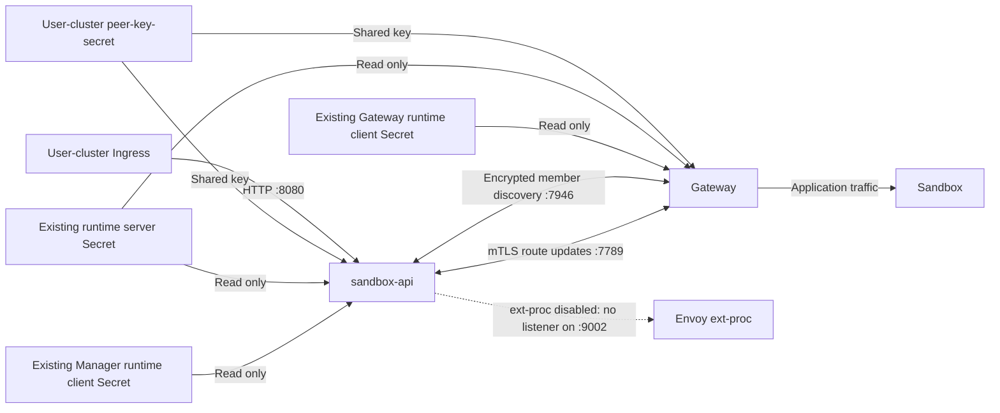

# Sandbox Manager Peer Security and Hosted Data Plane Shutdown

## Summary

Each hosted sandbox-api instance serves one user cluster, disables ext-proc, and retains peer communication. Memberlist shared-key encryption on `7946` and mTLS on `7789` are independent features: Manager uses flags and Gateway uses environment variables, each enabled through its own Secret reference. When a feature is not configured, the corresponding channel retains plaintext communication. Secrets do not carry switches. If configured local credentials are invalid, the entire instance fails to start rather than falling back to plaintext.

Remote Join or synchronization failures are only logged while other peers continue; no circuit breaker or eviction is added. Different mTLS configurations alone do not isolate memberlist groups; Ready does not guarantee remote connectivity. The final hosted deployment requires both protections enabled and compatible configurations. Peer TLS reuses runtime credentials unchanged, keeps loading separate and preserves tenant trust boundaries, and rejects server certificates that can impersonate clients. Credentials are used as startup snapshots; changes take effect through restart. Certificate supply and deployment are outside the open-source delivery scope.

## Background

Sandbox Manager and Sandbox Gateway use two peer channels. Memberlist on `7946/TCP+UDP` discovers processes and maintains membership; route synchronization on `7789/TCP` carries Sandbox state among those processes. Discovering a member does not authenticate its route updates, and protecting route updates does not protect memberlist traffic.

Hosted Sandbox Manager is called sandbox-api. It runs outside the user cluster, serves only one user cluster per hosted instance, and provides the control API through a network interface connected to that user's cluster network. It must retain peer communication without processing user application traffic. Thus, the Envoy external processing service (ext-proc) must be independently disableable without disabling route synchronization.

Runtime request TLS consumes credentials already supplied; Manager and Gateway use their respective client bundle formats. Hosted deployments must reuse these credentials and the existing runtime server bundle unchanged. Certificate issuance and distribution belong to an external supply system, not to a new peer-security capability in the open-source repository.

## Final Design

### Scope and Responsibilities

This document defines peer credentials, memberlist encryption, peer HTTPS/mTLS, local startup validation, remote failure handling, and the startup order in which the Gateway peer receiver precedes memberlist, across open-source Manager, Gateway, and neutral shared capabilities. The contracts for network interface selection and independently disabling ext-proc remain in the [network interface and peer discovery design](20260824-sandbox-manager-network-interface-peer-discovery.md). Hosted settings express external access requirements; they do not mean this change delivers deployment functionality. Memberlist encryption and peer TLS are independent, and peer TLS is also independent of runtime request TLS. Even when they read the same certificate Secret, enabling one does not enable, disable, or reconfigure another.

| Component | Responsibility |
| --- | --- |
| sandbox-api / non-hosted Manager | Provide the control API, maintain local routes, and manage the peer lifecycle permitted by configuration. |
| Gateway | Maintain and serve local routes, receive peer updates, and push updates caused by wakeup operations. |
| Shared peer capabilities | Interpret peer-security inputs and provide member discovery and route transport, without API authorization policy or Sandbox backend dependencies. |
| External user-cluster deployment renderer | Preserve the shared key, configure both features separately for Manager and Gateway, and provide Secret references, data-key names, and read permissions. |
| Hosted deployment configuration | Provide sandbox-api with the user-cluster Secret references and data-key names needed to enable both protections separately, plus the parameter that disables ext-proc. |
| Existing identity service | Continue supplying existing runtime certificates without changes for the hosted workflow. |

Manager owns process coordination and its peer configuration; these are not Sandbox backend capabilities. API protocol behavior stays in the API layer. Shared transport configuration must not import Manager configuration, API models, or runtime business logic. The independent Sandbox controller gains no dependency on Manager, Gateway, or their peer orchestration.

Credential reuse means consuming certificate bytes through a neutral parsing capability and standard TLS. Secret data-key names are startup configuration with defaults taken from names already used in this repository, not inferred from an issuer. Do not add the internal runtime server, certificate distributor, identity-service client, or private feature gate to the open-source dependency closure. Peer components read explicitly referenced user-cluster Secrets; they do not discover the supplier, require a particular issuer implementation, or manage its distribution chain.

This design does not introduce certificate issuance, key rotation, hot reload, new Prometheus metrics, CRDs, Service backend publication, or changes to runtime requests. User application routing, Ingress configuration, certificate supply, and deployment rendering remain with their respective components. How the Gateway host process reaches the owner of peer cleanup is handled by the separate O6; this document only requires the new listener and outbound connections to be releasable through the existing `Stop` path.

Code cost is a design constraint. Reuse the existing route handler, route ordering, bounded push, and peer lifecycle, with the two independent feature configurations as startup inputs to those capabilities; do not create a new configuration framework or service supervisor. Do not introduce an aggregate security switch, Secret enablement annotation, member capability announcement, configuration fingerprint, circuit breaker, or proactive eviction; do not guess other Secret data keys or add certificate formats. Data-key names are explicit startup strings with the defaults below.

The following diagram shows the final hosted deployment with both protections enabled; it does not imply that the two features share a switch.

### Public Configuration

Manager provides the following startup flags. Defaults preserve the behavior of non-hosted installations without peer security configured.

| Flag | Default | Contract |
| --- | --- | --- |
| `--peer-key-secret` | Empty | Exact `namespace/name` reference to the shared-key Secret. Nonempty enables encryption on `7946`; empty uses plaintext memberlist. |
| `--peer-key-secret-key` | `key` | Secret data key for the shared key. Empty uses the default. |
| `--peer-tls-server-secret` | Empty | Exact `namespace/name` reference to the existing runtime server bundle. Enables mTLS on `7789` together with the client reference. |
| `--peer-tls-server-ca-key` | `ca.crt` | Secret data key for the server trust CA. Empty uses the default. |
| `--peer-tls-server-cert-key` | `tls.crt` | Secret data key for the server certificate chain. Empty uses the default. |
| `--peer-tls-server-key-key` | `tls.key` | Secret data key for the server private key. Empty uses the default. |
| `--peer-tls-client-secret` | Empty | Exact `namespace/name` reference to this process's own runtime client bundle. Both TLS references empty use HTTP; configuring only one fails startup. |
| `--peer-tls-client-ca-key` | `ca.crt` | Secret data key for the client trust CA. Empty uses the default. |
| `--peer-tls-client-cert-key` | `client.crt` | Secret data key for the client certificate. Empty uses the default; a deployment reusing Gateway's own bundle must explicitly set this to `tls.crt`. |
| `--peer-tls-client-key-key` | `client.key` | Secret data key for the client private key. Empty uses the default; a deployment reusing Gateway's own bundle must explicitly set this to `tls.key`. |
| `--disable-envoy-ext-proc` | `false` | Skip the `9002` ext-proc listener and processing chain while retaining peer routes and local route ingestion. Hosted sandbox-api sets this to `true`. |

These parameter names form a contract shared by hosted and non-hosted deployment renderers. The ext-proc switch follows the network-interface design; no replacement switch or alias is added. Data-key parameters describe layout, not credentials, and setting them alone enables no security feature. Each feature checks only its own Secret references. An unset or empty data-key parameter uses the default; a nonempty value is used exactly as provided, without trimming, fallback, or guessing a second key name. TLS defaults follow existing names in the repository: the client uses `ca.crt`, `client.crt`, `client.key`; the peer server uses `ca.crt`, `tls.crt`, `tls.key`. The client defaults are globally unique and do not vary by component. A deployment reusing Gateway's own runtime client bundle must explicitly set the two client data keys to `tls.crt` and `tls.key`.

Hosted deployment uses `sandbox-system/peer-key-secret` to hold the shared key. This is an external rendering convention, not a required object name or default lookup location for the open-source process. Empty parameters remain empty, all Secret object names are specified by deployment configuration, and certificate references point to existing user-cluster objects; these parameters neither create nor rename objects. A reference must have exactly one slash, with nonempty namespace and Secret name that satisfy Kubernetes naming requirements. No default namespace is supplied, and whitespace is not automatically corrected.

Gateway runs inside Envoy and receives the same peer configuration through environment variables corresponding to the flags above. Their names remove `--`, convert to uppercase, and replace hyphens with underscores: `PEER_KEY_SECRET`, `PEER_KEY_SECRET_KEY`, `PEER_TLS_SERVER_SECRET`, `PEER_TLS_CLIENT_SECRET`, and the six `PEER_TLS_{SERVER,CLIENT}_{CA,CERT,KEY}_KEY` variables. Defaults, enablement decisions, and read-scope semantics match Manager flags: both TLS references empty retain plaintext peer HTTP, and data keys are read only when the reference on the same side is nonempty. `PEER_TLS_SERVER_CA_KEY` is the inbound trust set that verifies inbound peer client certificates; `PEER_TLS_CLIENT_CA_KEY` is the outbound trust set that verifies outbound peer server certificates. Gateway's client reference points to its own existing runtime client bundle, not Manager's client bundle. Credential values must not be passed in environment variables or startup flags. Gateway peer configuration is process startup configuration, not per-route filter configuration. The ext-proc switch applies only to Manager.

Manager and Gateway each decide both features only from their local startup inputs. Neither reads the other's configuration or passes switches through Secrets. External deployments render each instance's references and data-key names separately. Deployment configuration ensures that both protections are enabled in the final secure hosted deployment; no process-level aggregate switch is added.

### Enabling Through Orchestration

mTLS is enabled only through each instance's own orchestration inputs: process startup flags for Manager and environment variables of the Envoy process hosting Gateway. Orchestration provides references only: credential values must not be passed through flags or environment variables, and Secrets need not be mounted because processes read them by reference. The input forms and orchestration items that must change together after enablement differ between the two orchestrations; the detailed inventories are outside this document's scope.

| Orchestration item | Manager (sandbox-api) | Gateway |
| --- | --- | --- |
| TLS references | Set both `--peer-tls-server-secret` and `--peer-tls-client-secret`. | Set both `PEER_TLS_SERVER_SECRET` and `PEER_TLS_CLIENT_SECRET`. |
| Client credential source | This process's own runtime client bundle, usually referenced by the same Secret as `--runtime-client-cert-secret`, so the default client data keys can be used. | Its own runtime client bundle has the layout `ca.crt`, `tls.crt`, `tls.key`; orchestration must explicitly set `PEER_TLS_CLIENT_CERT_KEY` and `PEER_TLS_CLIENT_KEY_KEY` to `tls.crt` and `tls.key`. Pointing to Manager's client bundle does not satisfy this contract. |
| `7789` receiver after enablement | The TLS handshake requires a client certificate. Unauthenticated peers are dropped during the handshake and never reach route processing. | The TLS handshake allows clients without certificates. `/refresh` requires verification before reading the request body; the two GET health paths are exempt. |
| Probes | Use the control API on `8080` as the basis and do not probe `7789`, allowing the receiver to require certificates at handshake time. | Readiness and the peer receiver share `7789`; the probe must use `scheme: HTTPS`. Kubernetes `httpGet` probes have no `insecureSkipTLSVerify` field; kubelet HTTPS probes already skip certificate verification. |

Setting only one TLS reference causes that instance to fail startup. Orchestration must not treat a "half-configured" instance as serviceable or switch an enabled receiver to plaintext HTTP by removing a reference. References, data keys, and credentials take effect as startup snapshots; changes are applied by restart.

Gateway's probe form is an orchestration item that must change together when mTLS is enabled. Kubelet HTTPS probes do not verify the server certificate or present a client certificate. A plaintext probe sent to an HTTPS-only `7789` fails during the TLS handshake, leaving the replica never Ready. TCP probes to other ports do not perform a TLS handshake and are unaffected. One probe definition cannot suit both plaintext and mTLS; each state has its own orchestration rendering.

Both forms of input affect only the local instance: if one side is not enabled, that side remains plaintext HTTP, and the member group is not thereby isolated (see Compatibility). Deployment ensures configurations are compatible on both sides; processes neither negotiate nor fall back.

### Shared-key Secret and Existing Certificate Inputs

The shared-key Secret has type `Opaque` and this contract:

| Field | Meaning |
| --- | --- |
| `data[configured data key]`, default `data["key"]` | Exactly 32 bytes of raw key material generated by a cryptographically secure random source, independently for each user cluster. |

The process uses bytes from the API representation of Kubernetes-decoded Secret data directly: it does not Base64-decode them again, trim or pad them, or treat Base64 text as the memberlist key. Although memberlist supports 16- and 24-byte keys, this contract does not accept them. Deployment preserves the same key during ordinary changes and restarts. Manager and Gateway must not generate a replacement key after a read or validation failure.

Secrets carry credentials only; enablement annotations are neither required nor interpreted. Certificate Secrets gain no annotations, labels, or data keys for the hosted workflow, and their contents do not change. Changing one instance's configuration does not change switches in other instances.

| Consumer and input | Content read |
| --- | --- |
| Manager and Gateway peer servers | Configured server CA, certificate, and private-key data keys; default `ca.crt`, `tls.crt`, `tls.key`. The certificate chain and private key prove this process is a peer receiver; the CA verifies inbound clients. |
| Manager peer client | This process's runtime client bundle, using configured client data keys; default `ca.crt`, `client.crt`, `client.key`. |
| Gateway peer client | This process's runtime client bundle, using explicitly configured deployment client data keys (`tls.crt`, `tls.key`). Gateway does not obtain Manager's client private key for peer use. |

Peer mTLS requires all three fields in each selected bundle to be nonempty. A missing configured key, empty value, or unparsable PEM causes instance startup to fail. Processes never try another data-key name. Runtime request TLS loaders retain their own fixed names; these peer parameters do not change them.

The server defaults are Kubernetes TLS names already present in this repository. If deployment stores server material under other keys (for example, `server.crt`, `server.key`), setting the three server data-key parameters suffices without copying the Secret. Peer code does not require internal Secret object names, namespaces, mount directories, or Controller distribution mechanisms. Reusing certificate bytes does not bring the external runtime server implementation or authorization policy into this change.

Peer credential references are resolved only in the user cluster. Hosted sandbox-api reads existing objects without changing their supplier; the process still holds a private-key snapshot. Existing certificate distribution is outside this change. Deployment for each component provides its existing client Secret reference; unrelated credentials for accessing the supply service cannot replace it. Enabling peer TLS neither invokes certificate supply nor requires either component to enable runtime request TLS.

| TLS direction | Trust input | Local credentials |
| --- | --- | --- |
| Outbound peer connection | Configured client CA data key, verifying the remote server and fixed server name. | Configured client certificate and private-key data keys. |
| Inbound peer connection | Configured server CA data key, verifying the remote client. | Configured server certificate and private-key data keys. |

The two CA bundles need not be identical; each may contain multiple existing trust roots. At startup, the local server certificate must pass ServerAuth and fixed-name verification against the outbound server trust set, and the local client certificate must pass ClientAuth verification against the inbound client trust set. This ensures that the selected local inputs can serve both sides of TLS without assuming that all runtime client issuers also issue runtime server certificates. If validation fails, the instance fails startup. It does not fix validation by using a discovered CA, operating-system trust roots, a merged bundle, or a replacement certificate.

Startup must also validate that the local server certificate cannot pass ClientAuth verification against the inbound client trust set. By design, the runtime server private key is mounted in the agent-runtime sidecar of every Sandbox Pod, while route updates may carry Sandbox access tokens. If that certificate were also an accepted client credential, any workload that obtained the sidecar private key could push routes to all peers. This validation turns "the server private key cannot send refresh" from a deployment assumption into a property validated at startup; a server certificate accepted for ClientAuth by the inbound trust set causes startup failure. Go X.509 verification treats a certificate with no extended key usage as valid for all usages, so the server certificate must carry an explicit set of usages excluding ClientAuth and any usage. This check performs ClientAuth verification only, includes intermediate certificates from the bundle, and does not specify a hostname, so a name mismatch cannot be mistaken for a ClientAuth validation pass or failure. The check covers only configured local material; it cannot detect other client certificates that the same issuer may have issued to untrusted workloads. That remains a deployment prerequisite below. The client certificate is not prohibited from also carrying ServerAuth. Secret data-key names cannot prove certificate usage; only the certificate's own usages and configured trust sets can.

The two certificate references express TLS purposes, not new component identities. Changing data-key parameters neither reissues certificates nor renames Secret objects.

### Loading and Failure Decisions

The two features load their inputs separately. An empty shared-key reference does not read the memberlist Secret; both TLS references empty do not read peer TLS Secrets. With all references empty, no peer Secret is read and both channels use plaintext. Runtime TLS configuration is not peer input.

Otherwise, peer inputs are resolved at startup using an uncached Kubernetes live client built from the process's user-cluster `rest.Config`, following the peer-client contract in the network-interface design. Secret reads do not go through a shared cache client or `APIReader`. Hosted sandbox-api uses explicit user-cluster configuration and must not fall back to in-cluster configuration pointing to the hosting cluster. Gateway runs inside the user cluster and may use in-cluster configuration.

The peer loading phase performs at most one exact Get per distinct Secret. Even if it references the same Secret as a separately configured runtime TLS loader, peer loading does not share its parsed result. One more Get per process startup costs less than making the peer loader aware of the runtime loader's state, while peer parsing and validation remain a neutral shared capability outside the runtime package. Peer loading takes at most 30 seconds and responds to startup cancellation; it uses no Secret List, Secret informer, or background retry. This Secret-read constraint does not replace the bounded live Pod List used for seed discovery. Sandbox-api holds no platform-cluster client or platform ServiceAccount credentials; read permission is limited to specified user-cluster Secrets.

Every nonempty reference in the table below must be valid and pass credential validation. All four combinations are supported.

| Shared-key reference | Both TLS references | `7946` | `7789` and outbound route push |
| --- | --- | --- | --- |
| Empty | Both empty | Plaintext | HTTP |
| Nonempty | Both empty | Encrypted | HTTP |
| Empty | Both nonempty | Plaintext | HTTPS/mTLS |
| Nonempty | Both nonempty | Encrypted | HTTPS/mTLS |

Providing only one TLS reference, an invalid reference, an unreadable Secret, a missing configured data key, a key other than 32 bytes, or invalid TLS material causes the entire Manager or Gateway instance to fail startup. Decoupling the two features does not mean tolerating a configured feature's local error: the other channel does not start while a degraded instance remains, nor do `8080` or ext-proc continue serving. Not configuring a feature disables that protection and retains plaintext communication. Configuration error is not feature disablement, still less a reason for plaintext fallback.

Configuration and credentials remain fixed as startup snapshots for this process lifecycle. Changes to references, data keys, keys, or certificates take effect through restart; there is no hidden state that automatically enables a feature after a background retry. After successful startup, remote connection or update failures are handled below without reinterpreting local configuration or triggering process exit.

Runtime request TLS retains independent configuration and loading budgets. When `--runtime-client-cert-secret` is configured, a failure from its existing loader still causes startup failure; peer loading cannot swallow or reclassify that error. Conversely, successful runtime loading cannot offset a local peer-validation failure. Configuring only peer TLS does not enable the runtime loader, and the 30-second peer budget does not replace the independent runtime-loading budget.

Invalid control API input, an invalid selected network address, and a failure to bind a listener that should start are also startup errors. Startup cancellation still cancels startup; it must not disguise these errors as remote failures that allow continued operation.

### Memberlist Protection

Secure memberlist uses native encryption with a 32-byte key and requires inbound and outbound traffic over both TCP and UDP to be encrypted. Wrong keys and plaintext messages cannot establish membership. No transition mode allowing plaintext is provided, and the memberlist wire protocol is unchanged. See the [memberlist configuration contract](https://github.com/hashicorp/memberlist/blob/v0.5.4/config.go) for native keys and inbound and outbound validation controls.

When a discovered seed fails Join because of a shared-key or plaintext/encryption incompatibility, log the seed address and a safe failure reason, skip that seed, and try the next. Retain the bounded, cancelable discovery and join lifecycle without protocol downgrade or configuration negotiation.

The final state of a correct deployment should consist of peers with compatible configurations. Instances using encryption and plaintext on `7946`, or using different keys, cannot join each other; differences only on `7789` do not isolate memberlist groups. If `7946` is compatible, those instances can remain in one group. Route-synchronization failure neither evicts members nor changes memberlist liveness decisions. If member communication stays healthy, the other peer may remain in the group indefinitely until an administrator fixes, replaces, or removes it; failure alone does not reveal which side will go offline.

The shared key proves only possession of tenant credentials, not whether a process is Manager or Gateway. Seed selection and user-network access controls continue limiting discovery to the intended members of that user cluster. Different tenants do not share keys, member groups, or credentials. Membership is not control API readiness and cannot replace TLS authentication.

Hosted Manager Pods must still be excluded from seed selection: their Pod IP is not the user-network address to which peers bind. Discovery needs user-cluster seeds reachable through their Pod IPs. Encryption does not change this constraint or the existing bounded live Pod List contract, and adds no peer Pod informer.

### Peer TLS and Request Authentication

When mTLS is enabled, `7789` serves HTTPS only. Manager and Gateway both use runtime server material to receive connections and their respective existing runtime client credentials to send updates. The minimum TLS version is 1.2. Before creating a listener or outbound transport, local validation rejects malformed PEM, mismatched certificates and private keys, invalid certificate chains, invalid validity periods, incorrect certificate usages, and a mismatched server verification name.

Connections go directly to discovered user-network IPs. Clients use the existing runtime TLS name `agentruntime.sandbox.agents.kruise.io` as the SNI and server verification name. Reused runtime server certificates must cover that name. No IP SAN or new peer DNS name is needed, and connecting does not rely on DNS resolution of the TLS name. Name coverage is an input requirement validated at startup, not a requirement to change certificate issuance.

Standard TLS validation checks the corresponding explicitly configured runtime trust set for this tenant, validity period, TLS usage, and possession of the private key; clients also check the fixed server name. All peer servers use the same name. Server certificate verification uses standard TLS, with no custom certificate-chain or hostname verifier and no way to skip security verification. It accepts the fixed runtime name, not arbitrary server names under the same CA. Verification follows standard [X.509 rules](https://pkg.go.dev/crypto/x509#VerifyOptions).

Client-certificate verification and permission to send route updates are separate decisions. Peer uses a tenant-level authorization contract: a credential that passes ClientAuth verification against the configured client trust set may send route updates, whether its holder is Manager, Gateway, or another accepted credential holder. The external runtime's client-name allowlist does not implicitly become part of the public peer contract. Peer authorization does not depend on internal CN or DNS SAN values and adds no configurable allowlist; runtime request authorization retains existing behavior.

| Receiver and path | Authentication with mTLS enabled | Successful behavior |
| --- | --- | --- |
| Manager, including `POST /refresh` | The TLS handshake must present a client certificate validated against this tenant's runtime server client trust set. | After tenant-level authentication, valid updates enter the shared route contract. |
| Gateway `POST /refresh` | TLS uses `VerifyClientCertIfGiven`; the HTTP handler additionally requires a verified client certificate before reading the request body or changing routes. | After tenant-level authentication, valid updates enter the same shared route contract. |
| Gateway `GET /healthz` | HTTPS allows no client certificate; any presented certificate must be valid. | Returns `200` while the listener is serving. |
| Gateway `GET /readyz` | Uses the same TLS policy as `/healthz`. | Returns `200` only when Gateway's existing readiness checks pass: the local route registry is synchronized and the existing JWT verifier is initialized; otherwise returns `503`. Peer TLS adds no readiness input beyond the listener itself. |

The difference between mandatory and optional client certificates follows [Go client-authentication policies](https://pkg.go.dev/crypto/tls#ClientAuthType). Gateway returns `403` for `POST /refresh` without a certificate and does not change routes. Presented but invalid certificates fail at the TLS stage, including on health paths. Forwarded headers, API Keys, source IPs, and successful health probes cannot substitute for a verified client certificate. The no-certificate exception applies only to the two GET health paths; it does not authorize other paths or methods. Unsupported methods cannot change routes.

Manager's `7789` with mTLS enabled has no certificate-free health exception. Manager readiness and startup probes use the control API on `8080`, not `7789`; this replaces the hosted `7789` probe requirement in the network-interface design. Gateway readiness continues to use `GET /readyz` on `7789`, over HTTP or certificate-free HTTPS according to this instance's configuration. Kubelet HTTPS probes do not verify server certificates. Neither adds member count, successful Join, or successful remote mTLS as a readiness condition. Invalid local inputs cause startup failure and prevent Ready; after successful local startup, existing checks may yield Ready even if the process has not joined the intended group or remote updates keep failing. Detailed probe inventories are outside this document's scope.

Every new TLS handshake validates remote certificates. A rejected remote certificate or unreachable peer fails only the corresponding connection or update; it neither shuts down a locally valid peer nor stops `8080`. This does not promise to revoke credentials when a Secret changes or a certificate later expires, or to immediately terminate existing connections; credentials are startup snapshots.

### Route Sending and Receiving

All producers, including Manager lifecycle operations and Gateway wakeup operations, use the same instance's peer transport decision and outbound client. A process may retain one shared peer owner; callers must not create a second client with an independent security decision. No package-level credential switch is used, runtime request transport is not reused, and a plaintext client must not be implicitly created when secure transport is unavailable.

Updates go only to discovered peer IPs and the route-synchronization port. Transport follows no HTTP redirects and uses no HTTP proxy from the environment in either HTTP or mTLS mode. For HTTP this changes the current default transport behavior and is listed under Compatibility. Transport validates the peer IP before constructing a destination address. It inherits the network-interface design's contract to prefer IPv4 and use IPv6 when IPv4 is unavailable; an IPv6 target must use a bracketed host in the URL authority, rather than joining a bare IPv6 address directly to a port. The target IP is used only for connection, without DNS resolution or a change to the fixed TLS server verification name. After a TLS failure, it neither retries over HTTP nor sends updates to a new address provided by a response.

Pushes to multiple peers remain parallel. One attempt takes at most 100 milliseconds, including connection, TLS, and HTTP response handling; there are at most ten attempts, with a 10-millisecond retry interval. Deterministic HTTP 4xx responses are not retried. TLS failures use the existing bounded retry path with other transport failures; no new retry classification mechanism is added. Cancellation stops new attempts and waits. Failure of one peer cannot prevent other peers from receiving updates, roll back local routes, or change the result of an authoritative Sandbox mutation. The 100-millisecond budget assumes persistent connections: both modes retain idle connections to peers, with TLS handshakes only on connection establishment and after connection loss, not on every attempt. When a new connection, handshake, and response on a hosted path together exceed the budget, retries may be exhausted even with valid credentials. The contract provides no longer hosted timeout and does not guarantee delivery after retries are exhausted. Exit stops later pushes and closes idle outbound connections.

When a remote protocol or trust configuration is incompatible, log the peer address, protocol used, and safe error classification, then keep synchronizing to other peers. No circuit breaker, failure-count threshold, or proactive eviction is added; later updates may make the same bounded attempts to that member and keep failing. Replica counts are small, so repeated failure cost is accepted; administrators diagnose and correct deployment misconfiguration using logs.

Authenticated refreshes use the shared route projection and ordering rules; route payload format and shared processing rules stay unchanged. The request body is at most 1 MiB; an oversized body returns `413`, and invalid route input returns `400`. A successfully applied update, or a safely ignored older or equal version, returns `204`. Rejections must not change storage. Authentication of protected endpoints precedes request-body parsing and route modification.

Namespace/name is the authoritative object identity. Upsert may replace known state only with a strictly newer Kubernetes resource version. Deletion also takes effect at an equal version, because for the same observed object version, deletion is authoritative. Do not reverse-parse opaque Sandbox IDs. A deletion retains a version watermark for ten minutes from its first establishment. Later deletions may advance the version but do not extend that period. While the watermark exists, older observations cannot restore a deleted route; after retention expires, permanent replay protection is not promised. Peer credentials do not grant Sandbox resource write permission or bypass API ownership validation.

### Ext-proc and Lifecycle Isolation

| Manager form | `8080` | Peer channels | `9002` |
| --- | --- | --- | --- |
| Default non-hosted configuration | Control API | Plaintext compatibility | ext-proc enabled |
| Explicitly configured non-hosted instance | Control API | Both protections independent; protocol selected by the startup table | ext-proc enabled by default; may be explicitly disabled |
| Final hosted deployment | Control API | Deployment configures memberlist encryption and mTLS separately | Disabled by `--disable-envoy-ext-proc=true` |

All rows assume valid local startup configuration. Any invalid configured credential causes the entire instance to fail startup.

Follow the existing contract for disabling ext-proc: do not create the `9002` listener, its processing path, or its health service when disabled. An occupied `9002` cannot affect a disabled ext-proc service. Route observation, local storage, `7789`, and route pushes continue according to peer configuration.

Ext-proc and peer TLS share no listener, transport, or TLS configuration. Network-interface selection and peer settings do not automatically modify `--disable-envoy-ext-proc`. After successful startup, remote peer failures do not prevent ext-proc from using local route storage; this does not exempt local credentials from startup validation.

Manager and Gateway both validate local security inputs before creating peer listeners. A route receiver must bind and begin serving before memberlist starts. Initially having no peers and join retries do not block local readiness. If actual peer startup fails, clean up resources already created and report a startup error.

Each started peer service has exactly one exit owner. Exit stops new discovery, join attempts, and outbound updates, then releases services that actually started. An in-progress memberlist Join must return within its network deadline before Leave and Shutdown can run. Leave takes at most five seconds; failure must not skip Shutdown. Services never created need no cleanup; plaintext peer services that started when security features were disabled still require normal cleanup. Manager API drain reaches its peer cleanup owner. Gateway's explicit `Stop` must close the HTTP/TLS listener and idle outbound connections added here, but how the Envoy host process calls that `Stop` belongs to O6. This document adds no goroutine that races to close memberlist.

### Operations and Data Boundaries

The security boundary is a single user cluster controlled by its tenant administrator. Memberlist encryption protects membership communication; mTLS protects route traffic. A channel without an enabled feature does not receive that protection. Tenant administrators and processes granted each credential are trusted within the capabilities that credential grants. This design does not distinguish component roles among holders of the same accepted credential or defend against compromises of those holders. This is the boundary of reusing runtime identity; it does not mean every workload in the user cluster is trusted.

Different tenants must have distinct runtime trust domains and memberlist keys. A trust domain is defined by the credentials actually accepted by configured CA bundles, not by Secret names or namespaces; credentials from other tenants must not authenticate against those bundles. A one-to-one hosted Manager does not merge trust with other tenants or the hosting platform.

Keeping peer credential references in the user cluster avoids a new Secret copy in the platform cluster and avoids adding platform-cluster read credentials to hosted Manager, preserving the one-to-one cluster ownership boundary. The hosted process still needs to hold the selected private key in memory.

Secure use requires external deployments to meet these prerequisites:

| Boundary | Deployment requirement |
| --- | --- |
| Certificate supply | Existing bundles meet the configured data keys, fixed server name, certificate-chain verification, and TLS-usage requirements; issuance and trust are limited to this tenant. Layouts with other Secret field names are adapted by setting data-key parameters, not by copying Secrets. |
| Credential access | Only trusted administrators and intended credential-holding processes can obtain the memberlist key or private keys. Untrusted application workloads cannot obtain them through Secret reads, Pod creation or mounting, container access, or runtime operations. |
| Network access | Member discovery and route updates use the intended user-cluster network path. Peer ports are open only to authorized paths, including the health access specified here; network restrictions supplement credential authentication. |
| Readiness and publication | Manager readiness and startup probes use `8080`, not `7789`. Gateway uses a rolling update that only expands, without shrinking (`maxUnavailable: 0`, `maxSurge` at least 1), retaining serving replicas when new replicas cannot start due to local configuration errors. This does not make remote connectivity a readiness condition or guarantee uninterrupted synchronization during protocol changes. |

The trusted runtime sidecar mounts the server private key. Reuse requirements are met only if untrusted workloads cannot obtain that key. A shared Pod does not itself prove or disprove this isolation. If peer traffic can be directed to a key holder, the runtime server private key can impersonate a peer receiver; since route updates may include Sandbox access tokens, access boundaries for that key protect both route confidentiality and endpoint identity. That key alone cannot grant membership, and the startup validation above guarantees it is not an accepted client credential, so it cannot send an authenticated refresh.

These are explicit deployment prerequisites and limits on shared credentials' capabilities. Startup validation checks configured material but cannot infer cross-tenant issuance policy or audit every path by which a workload might obtain a private key. A deployment that exposes accepted peer client credentials to untrusted workloads does not meet this design's security prerequisites. Isolation from holders of those credentials requires a separately defined identity boundary and exceeds unchanged reuse of runtime credentials. External access must enforce these conditions; they are not dependencies of the open-source implementation and do not indicate any live deployment has been validated.

Diagnose peer failures by channel, configured protocol, local startup failure or remote communication failure, a safe Secret reference, and limited reason classifications. Remote failures include seed or peer addresses without claiming automatic identification of administrator error or replica-replacement direction. Diagnostics for rejected certificates may include subject, issuer, serial number, and validity period, which are needed to distinguish expired certificates from issuer errors. Diagnostics added or modified for peer security must not include Secret data, key material, PEM, tokens, or complete routes in logs, errors, traces, metrics, or debug output. This constraint does not assert that existing route diagnostics are redacted or expand this change into comprehensive log governance.

Correctly configured peers do not mean hosted deployment has been delivered, and `8080` health does not imply peer connectivity. Hosted access requires both protections enabled and actual connectivity among the relevant instances; Ready alone cannot determine this. Specific configuration is outside this document's scope. E2E manifests in the repository do not define production deployment behavior.

### Compatibility

Processes with none of the three peer Secret references set retain plaintext communication, with the following exceptions and boundaries:

- In plaintext mode, outbound route updates no longer follow HTTP redirects or use an HTTP proxy from the environment. Peers connect directly to discovered IPs and never redirect; no supported topology depends on either behavior.
- `--secret-config` now requires an exact `namespace/name` reference. The previous name-only and `/name` forms that filled the namespace from `--system-namespace` are rejected at startup, including when peer security is unset. Deployments that passed `--secret-config=cfg` with `--system-namespace=ns` must use `--secret-config=ns/cfg`. This existing flag shares the peer Secret-reference parser; the new peer parameters were never name-only.
- Gateway's `7789` receiver becomes ready before memberlist starts, so a receiver that is not yet listening is never announced. Wiring host-process exit to `Stop` is delivered separately by O6.
- Gateway reads optional environment variables corresponding to Manager flags: three references, one shared-key data key, and six TLS data keys. When unset, plaintext communication and the data-key defaults above remain.
- Instances with different security configurations may coexist during rolling updates, without guaranteed interoperability: incompatibility on `7946` splits groups, while incompatibility only on `7789` can leave them in one group with failed synchronization. There is no protocol negotiation, plaintext downgrade, or extra member isolation. The final state of a correct deployment consists of peers with compatible configurations.
- Each feature is determined by this instance's references. Removing a shared-key reference disables memberlist encryption at the next startup; removing both TLS references disables mTLS, with plaintext retained on the corresponding channel. Other instances' configuration does not change. Hosted deployment needs both protections, and the relevant user-side peers should not disable required protections while it runs.
- Local readiness does not prove inter-group route synchronization. Fast updates may be missed during mixed configurations; local authoritative observation still works, but zero delay or delivery after exhausted push retries is not promised.
- `--disable-envoy-ext-proc` remains consistent with the network-interface design. No CRDs, HTTP models, route payloads, or memberlist wire protocol are changed.

## Risks

- A mistaken data-key name, like other invalid configured inputs, causes Manager or Gateway startup to fail; processes do not guess a second name. Independent feature enablement does not permit serving despite local configuration errors.
- A server certificate marked for ClientAuth or any usage, or with extended key usage omitted altogether, causes startup failure under the ClientAuth exclusion requirement. Repair requires meeting the certificate-usage and trust validations above, not skipping validation to restore service.
- Simultaneous startup failures from local configuration errors across all Gateway replicas make the data plane unavailable. An expansion-only rolling update protects only the case where new replicas cannot become Ready; whole-fleet restart, node loss, and locally valid but remotely incompatible configurations are outside that guarantee.
- Hosted paths retain the 100-millisecond per-attempt budget. Hosted routes whose new TLS handshakes exceed the budget exhaust retries during connection establishment; persistent connections limit this to the first attempts after connection loss.
- Credentials are startup snapshots. Expiration or rotation without restart causes new handshakes to fail while established connections continue. Restart is the operational remedy; this design does not promise revocation.
- Mixed configurations can interrupt synchronization across groups or cause repeated update failures among members of one group. The cost of existing bounded attempts and logging is accepted, with no circuit breaker or proactive eviction. Reassess this limit if replica counts or failure costs grow substantially.

## Alternatives

- Disable only peer and retain other services after a local credential error: rejected. Explicit configuration errors should fail instance startup, not hide behind passing probes. Remote failures are not local startup errors.
- Accept a server certificate that is also an accepted client credential: rejected, because the server private key resides in the runtime sidecar of every Sandbox Pod and route updates carry access tokens. Separate client and server CAs are not required either: local validation is cheaper and remains compatible with a single issuer that marks usages correctly.
- Reuse material already loaded by the runtime TLS loader: rejected. One additional Secret Get at each startup costs less than coupling the two loaders.
- Peer-specific certificates or issuance chain: rejected. Runtime credentials already define the tenant trust domain and are present in every cluster that enables runtime TLS.
- One aggregate switch, a Secret enablement annotation, or remote configuration negotiation: rejected. Local references express the two features separately; deployment owns final configuration compatibility, without adding cross-instance switch synchronization.
- Hot updates to the shared key or certificates: deferred. Restart-based recovery matches the runtime TLS loader and avoids introducing a reload state machine.
- Guess other Secret data keys or treat `kubernetes.io/tls` and custom layouts as automatic fallbacks: rejected. Each field uses one configured name with a default; a mistake fails startup.
