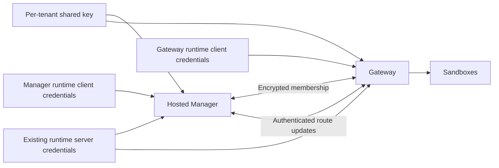

# Securing the Sandbox Manager Peer Mesh for a Hosted Control Plane

A hosted Sandbox Manager, called `sandbox-api`, runs outside a customer cluster but serves exactly one such cluster. It still has to coordinate with the Sandbox Gateways inside that cluster: the processes discover one another, and they exchange the routing state that tells the system where a Sandbox can be reached. At the same time, the hosted Manager does not carry user application traffic, so it has no reason to expose the Envoy external-processing service used in other deployments.

The peer mesh has two separate communication planes. Member discovery maintains the set of participating processes. Route synchronization sends Sandbox routing updates between those processes. Membership does not authenticate a route update, and protecting a route update does not protect membership traffic. Treating the mesh as one channel would therefore leave a security gap.

The design protects each plane independently while keeping the established unprotected mode available to existing installations. Member discovery can use native shared-key encryption, and route synchronization can use mutually authenticated TLS. A hosted deployment is secure only when it enables both protections with compatible credentials on every participating Manager and Gateway. Disabling Envoy external processing is a third, independent decision: it removes the unused application-data-plane service without disabling local routing or peer coordination.

## Roles and communication boundaries

The Manager provides the control API and maintains its view of Sandbox routes. Gateways maintain the routes needed to serve application traffic, accept route updates from peers, and publish changes produced by operations such as waking a Sandbox. Both use the same peer mechanisms, but each process decides how its own inbound and outbound communication is protected.

The deployment system supplies references to credentials stored in the customer cluster. The peer implementation reads those credentials and applies standard memberlist and TLS behavior. It does not issue certificates, discover a certificate provider, copy credentials into the hosting cluster, or change the existing runtime identity service.

The two peer protections deliberately do not share an enablement switch:

| Membership protection | Route protection | Result |
| --- | --- | --- |
| Disabled | Disabled | Existing plaintext membership and route exchange |
| Enabled | Disabled | Encrypted membership, plaintext route exchange |
| Disabled | Enabled | Plaintext membership, mutually authenticated route exchange |
| Enabled | Enabled | Encrypted membership and mutually authenticated route exchange |

This independence supports existing non-hosted deployments and lets operators reason about the two threats separately. It also means that enabling only one protection is not a valid hosted end state. Each process derives its mode solely from explicit local credential references. Credential contents do not act as hidden switches, and peers do not negotiate a mode, advertise capabilities, or fall back to plaintext after a protected connection fails.

## Protecting membership

Member discovery uses memberlist's native encryption with one cryptographically random shared key per customer cluster. The same key protects inbound and outbound membership traffic for that tenant. A process using plaintext or a different key cannot join the protected membership group.

Possession of this key proves only that the holder has the tenant credential needed to attempt to join the peer group; it does not prove that the process has joined, establish whether it is a Manager or a Gateway, or authorize route updates. Seed selection and network controls still have to restrict discovery to the intended customer-cluster processes. Tenants must not share membership keys or discovery groups.

A membership failure affects only the peer being contacted. The process records a safe error and continues trying other seeds rather than negotiating weaker security. A failed join does not prevent the local API or an already-started peer service from becoming ready. Once membership traffic is healthy, memberlist remains the authority on peer liveness.

## Protecting route updates with existing identities

Route synchronization reuses the tenant's existing runtime credentials. Every Manager and Gateway presents runtime server credentials when accepting a peer connection and uses its own runtime client credentials when sending an update. Reuse avoids adding a second certificate-issuance system and preserves the existing tenant trust domain. Runtime and peer services share certificate-material loading, name selection, and PEM parsing in `peersecurity`; they do not share runtime transport behavior or authorization rules.

The Secret data names are fixed. `ca.crt` always supplies the CA bundle. For the certificate and private key, runtime loading and both peer TLS roles prefer the complete `tls.crt` and `tls.key` pair, then consider `client.crt` and `client.key`. Secret-backed loading tries the latter pair only when both preferred values are absent or empty. Directory-backed runtime loading tries it only when both preferred files are absent; two present-but-empty preferred files preserve the established CA-only behavior. If only one preferred value is present, or the selected pair fails PEM parsing or certificate-purpose validation, loading fails without trying another field. It never combines values across pairs. Runtime configuration may contain only `ca.crt`; enabling peer TLS requires complete certificate material. The TLS and memberlist data-key override flags and environment variables are removed. The memberlist Secret always uses the fixed data key `key`.

This precedence changes how a mixed Secret is interpreted: when `tls.*` contains a server certificate and `client.*` contains a client certificate, the outbound peer client now selects `tls.*` and fails the `ClientAuth` check. Put inbound server and outbound client material in separate Secrets in this case.

Peers connect directly to the customer-network address discovered for the remote process. Certificate verification nevertheless uses the established runtime server identity. This lets the same server certificates remain valid without adding an IP identity or a new peer DNS identity. Protected route connections require TLS 1.2 or newer. Standard X.509 chain, lifetime, key-usage, and name checks remain in force; the design adds no custom verifier or option to skip them.

The inbound and outbound trust bundles are separate inputs and need not contain the same roots. At startup, each process proves that its server credential is accepted by the configured outbound server trust and identity checks, and that its client credential is accepted by the configured inbound client trust. This catches a locally inconsistent bundle before the process advertises a service that cannot participate in protected synchronization.

The process also rejects a server certificate that the inbound trust bundle would accept as a client certificate. Runtime server private keys are present in Sandbox runtime sidecars, while route updates can carry Sandbox access tokens. If the same certificate were also an accepted peer client identity, a workload that obtained a sidecar's server key could submit authenticated route updates. Requiring explicitly limited certificate purposes that exclude client authentication and unrestricted use turns the separation between receiving and sending authority into a property checked at startup, without forbidding unrelated purposes that do not grant a peer client identity.

This check has a defined limit. It verifies the local server certificate, but it cannot prove that the same certificate authority has never issued some other accepted client certificate to an untrusted workload. Credential issuance and access controls must still prevent untrusted workloads from obtaining a peer client identity.

Peer authorization is tenant-wide rather than role-based. Any holder of a client certificate accepted by the configured tenant trust may send route updates; the peer service does not infer Manager or Gateway roles from certificate names. This is the main authorization tradeoff of reusing runtime identities. A deployment that needs isolation between accepted credential holders requires a different identity boundary.

Authentication admits a sender to the route-update protocol; it does not grant arbitrary control-plane authority. An accepted update still passes through the existing route identity and ordering rules. A Sandbox's cluster namespace and object name establish its identity. An addition or replacement must be newer than the state already known, while a deletion of the currently observed version remains authoritative. After deletion, the system retains a version watermark for ten minutes from when that watermark was first established, preventing an older observation from restoring the route during that interval. Later deletions may advance the recorded version but do not extend the deadline, and the design makes no permanent replay-protection guarantee after it expires. Peer credentials do not grant permission to write Sandbox resources or bypass the control API's ownership checks.

## Fail closed for local configuration

The deployment passes references to customer-cluster Secrets rather than putting credentials in process arguments or environment variables. A hosted Manager uses its explicit customer-cluster Kubernetes access to read those objects and does not fall back to credentials for the hosting cluster. Gateway reads from the customer cluster in which it runs. Keeping the authoritative objects in that cluster avoids platform-side Secret copies and additional hosting-cluster read privileges, although each running process still holds the selected private keys in memory.

Configured credentials are validated before peer listeners or outbound transports become usable. A malformed reference, unreadable Secret, missing required selected value, invalid shared key, unusable certificate chain, mismatched private key, or incompatible certificate purpose fails the entire process startup. A later candidate pair is considered only under the source-specific absence rules above; after a pair is selected, parse or purpose validation failure does not trigger another-field fallback. The process does not silently disable the broken protection, generate replacement material, or leave the control API running as a partially configured instance. An explicit request for protection is therefore a fail-closed contract.

Not configuring a protection is different from configuring it incorrectly. An absent membership reference deliberately selects plaintext member discovery. An absent pair of TLS references deliberately selects plaintext route exchange. Supplying only half of the TLS material is an error because it cannot define a coherent inbound and outbound identity.

Credentials are a startup snapshot. Secret changes, certificate renewal, or trust changes take effect only after restart. Shared material loading does not share the runtime request transport, authorization, or failure handling. There is no background retry, hot reload, or immediate revocation guarantee: a certificate that expires after startup can break later handshakes while an existing connection remains alive.

## Authentication and health checks

The Manager and Gateway need different inbound TLS policies because their probes reach different services. The hosted Manager's health checks use its control API, so its route receiver can require a valid peer client certificate during the TLS handshake for every request.

Gateway health and readiness checks share the route listener, while the Kubernetes probe cannot present a client certificate. Gateway therefore allows a connection without a certificate to complete the TLS handshake, but permits such a connection to access only the two read-only health checks. A route-changing request must have a certificate that was verified during the handshake, and the handler enforces that requirement before reading the update or touching route state. If a client does send an invalid certificate, TLS rejects it even on a health request. Headers, API keys, source addresses, and successful health probes cannot substitute for a verified client identity.

When route TLS is enabled, Gateway probes must use HTTPS. This is an orchestration change coupled to enablement: a plaintext probe against the protected listener would keep a healthy replica from becoming ready. The Manager's probes remain on its control API.

Readiness intentionally remains local. Valid local credentials and the existing local readiness conditions can make a process ready even when it has not joined the expected membership group or cannot synchronize with a remote peer. This prevents transient remote failures from taking otherwise useful local capacity out of service, but it means readiness alone is not evidence that a hosted deployment is secure or connected. Hosted activation needs a separate check that both protections are enabled and that the intended peers actually interoperate.

## Remote failures remain isolated

After a process has validated its own configuration and started successfully, remote failures do not reinterpret that configuration or terminate the process. Peers continue sending updates to other members in parallel, using the existing bounded retry behavior. One unreachable peer, rejected certificate, or incompatible protocol cannot roll back local route state or change the result of the authoritative Sandbox operation that produced the update.

The design does not add a circuit breaker, failure threshold, or automatic membership eviction. Peer sets are expected to remain small, so repeated bounded failures are accepted in exchange for keeping membership liveness independent from route-transport configuration. Administrators diagnose and correct incompatible deployments from safe error categories and peer addresses.

Those diagnostics may identify a peer and describe a certificate sufficiently to distinguish expiration from the wrong issuer, but they must not expose Secret contents, private material, tokens, or complete route data. This applies to the new peer-security diagnostics; it is not a broader claim that all existing route logging is already sanitized.

That separation produces two distinct mixed-rollout failures. A membership key mismatch divides processes into groups that cannot discover one another. A route-TLS mismatch can leave processes in the same healthy membership group while every route update between them fails. The second case does not make memberlist evict the peer, and readiness does not expose it. Rollouts must therefore converge the local settings across all participants rather than rely on protocol negotiation.

Outbound route updates connect only to discovered peer addresses. They do not follow redirects, use ambient HTTP proxy settings, or retry over plaintext after TLS fails. Direct transport avoids letting a peer response or process environment redirect sensitive route data. Removing redirect and proxy behavior is also a compatibility change for installations that remain in plaintext mode, although no supported peer topology is expected to depend on either behavior.

The existing route delivery budget is intentionally unchanged. Persistent connections normally amortize TLS handshakes, but a new or re-established connection can spend much of the short attempt deadline on the handshake and exhaust its bounded retries even with valid credentials. The design accepts that delivery risk instead of creating a separate hosted timeout policy, and it does not promise eventual delivery after retries are exhausted.

## Hosted deployment boundary

The hosted form disables Envoy external processing because the Manager does not process application traffic. This does not disable its control API, local route observation, membership, route reception, or route publication. Peer security and external-processing enablement do not share listeners, credentials, or lifecycle decisions.

The route receiver must be serving before the process can advertise itself through membership, so another member never learns about a peer that cannot yet receive synchronization. Protected and plaintext peer resources remain part of the same process lifecycle rather than introducing a second service supervisor.

The trust boundary is one customer cluster under its tenant administrator. Each tenant needs distinct membership and runtime trust material; the actual CA bundles define the trust domain, not Secret names or Kubernetes namespaces. Network policy must limit peer reachability, and credential access must be restricted so that untrusted application workloads cannot read Secrets, mount keys, or obtain them through runtime control. These deployment controls complement cryptographic authentication rather than being replaced by it.

The server private key deserves the same access protection even though startup validation prevents it from acting as a peer client identity. A holder that can attract peer traffic can still impersonate a route receiver and observe route updates, including any Sandbox access token they carry. The design prevents that key from authorizing outbound updates; it cannot make disclosure of the key safe.

Certificate issuance, distribution, hot rotation, deployment rendering, and verification of a particular production rollout remain outside the open-source change. A rollout strategy can preserve old serving replicas when a replacement fails local startup validation, but it cannot guarantee uninterrupted synchronization while peers use incompatible membership or TLS modes. Correct local configuration and a healthy control API are necessary conditions for the hosted service; they are not proof that the end-to-end hosted data plane has been delivered or secured.
