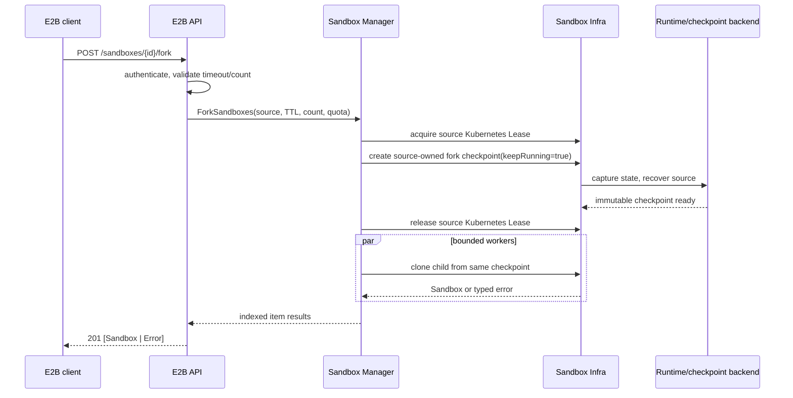

# E2B-Compatible Running Sandbox Fork

## API Changes

This proposal adds E2B-compatible endpoints:

```http
POST /sandboxes/{sandboxID}/fork
POST /kruise/api/sandboxes/{sandboxID}/fork
```

The first is the native E2B path and the second is the customized path. They
MUST be behaviorally identical.

### Request

The request body is optional:

```json
{
  "timeout": 60,
  "count": 2
}
```

| Field | Type | Default | Validation | Meaning |
|---|---:|---:|---|---|
| `timeout` | integer | 15 | `1 <= timeout <= maxTimeout` | Lifetime of each new Sandbox, in seconds. |
| `count` | integer | 1 | `1 <= count <= 100` | Number of forks to attempt from one checkpoint. |

The Go request model MUST use pointers to distinguish omitted fields from
explicit zero values:

```go
type ForkSandboxRequest struct {
    Timeout *int `json:"timeout,omitempty"`
    Count   *int `json:"count,omitempty"`
}
```

`timeout: 0` and `count: 0` are invalid. Fork timeout validation is independent
from the existing create API and MUST NOT silently inherit its 30-second
minimum timeout.

### Success response

The endpoint returns `201 Created` only after the source checkpoint succeeds
and every fork has completed its creation attempt. The result array MUST have
exactly `count` entries in request-slot order and permits partial success:

```json
[
  { "sandbox": { "sandboxID": "sbx-new-a" } },
  { "error": { "code": 429, "message": "sandbox concurrency quota exceeded" } }
]
```

Each result MUST contain exactly one of `sandbox` or `error`:

```go
type ForkSandboxResult struct {
    Sandbox *Sandbox       `json:"sandbox,omitempty"`
    Error   *ForkItemError `json:"error,omitempty"`
}

type ForkItemError struct {
    Code    int    `json:"code"`
    Message string `json:"message"`
}
```

A successful item returns the complete E2B `Sandbox` representation, including
new credentials issued by the existing create/clone contract, not only the
`sandboxID`.

### Request-level errors

| HTTP status | Meaning |
|---:|---|
| 400 | Malformed request body or invalid timeout/count. |
| 401 | Authentication failed. |
| 404 | The source Sandbox is absent, terminal, or belongs to another tenant. Ownership mismatch MUST remain indistinguishable from absence. |
| 409 | The source is Paused, is checkpointing, or conflicts with pause, resume, delete, or another fork. |
| 429 | Request-level rate limiting. |
| 500 | An unexpected control-plane or checkpoint error occurred. |
| 503 | The Runtime checkpoint admission queue or a required backend is unavailable. |

After checkpoint success, individual clone failures are written into the `201`
result array. Quota exhaustion maps to `429`, capacity exhaustion or retry
exhaustion maps to `503`, conflicts map to `409`, and other failures map to
`500`. Fork quota exhaustion MUST NOT reuse the existing create API's `403`
mapping.

## Summary

E2B `Sandbox.fork` is a running-state microVM clone, not an ordinary template
create or a filesystem-only checkpoint restore. It captures one logical point
in time from a running source Sandbox and restores one or more independent
Sandboxes from that point. The source remains available after a brief
checkpoint pause; every fork receives a new Sandbox identity, lifecycle,
credentials, TTL, and quota reservation.

OpenKruise Agents already provides the checkpoint/restore capability required
by this proposal and can create a Sandbox from a Checkpoint. Fork reuses that
capability while adding E2B-specific orchestration: one checkpoint supports a
whole batch, and source-owned fork checkpoints are never exposed as user
Snapshots.

This proposal adds a dedicated Manager-layer fork use case, a source-owned
checkpoint lifecycle, and bounded concurrent clone orchestration. It forbids
implementing fork by composing the existing snapshot and create HTTP handlers.

## Background and Motivation

E2B SDKs expose `fork` through both instance and static entry points. Callers
need to branch an initialized execution environment without repeating expensive
initialization, for example to explore model outputs from an already loaded
workspace. Compatibility is more than accepting a route: all children of one
batch MUST start from the same running-state point.

The current E2B API already provides related capabilities:

- `POST /sandboxes/{sandboxID}/snapshots` calls `Sandbox.CreateCheckpoint` for
  a running Sandbox.
- `POST /sandboxes` accepts a Checkpoint ID and uses the existing Manager clone
  flow.
- `SandboxManager.CloneSandbox` already centralizes short-ID assignment, quota
  admission, create limiting, and route publication.

Directly composing these HTTP paths is unacceptable. It exposes internal fork
artifacts, cannot guarantee a single checkpoint for a batch, leaves cancellation
and source-lifecycle cleanup ownership unclear, and duplicates Manager-owned
quota and lifecycle orchestration in the API layer.

### Goals

- Implement the E2B fork HTTP contract, including defaults, batch results,
  request-level errors, and native/customized path equivalence.
- Ensure all successful children of one request use one immutable checkpoint.
- Preserve source identity, quota reservation, and lifecycle deadline after a
  successful fork.
- Give each child a new Sandbox ID, route identity, credentials, lifecycle,
  quota reservation, and independent writable root filesystem layer.
- Serialize conflicting source Sandbox lifecycle operations.
- Keep fork checkpoints private to their source Sandbox and reclaim successful
  batches immediately while retaining incomplete batches only until their TTL.
- Preserve the `API -> Manager -> Infra` layering.
- Reuse the project's established running-state checkpoint/restore capability
  without changing its backend contract.

### Non-Goals

- Implementing Linux `fork(2)` semantics.
- Guaranteeing that existing TCP, HTTP/2, WebSocket, or other long-lived source
  connections survive checkpointing.
- Duplicating external persistent-volume data.
- Adding an idempotency key not defined by upstream E2B.
- Changing public Snapshot, general Checkpoint retention, or existing create
  API semantics.
- Adding Prometheus metrics.

## Current Implementation Assessment

`CheckpointSpec` declares `keepRunning`, `memory`, and `filesystem`. The
Sandbox controller coordinates Checkpoint CRs for pause and checkpoint-restore
flows; Checkpoint status carries a backend checkpoint ID and Pod template
delta. Fork treats the existing checkpoint/restore implementation as its
established running-state foundation. It adds neither a second checkpoint
backend nor a separate checkpoint-capability validation phase.

The current snapshot implementation creates a Checkpoint and its owned
SandboxTemplate, waits for `CheckpointSucceeded`, and uses
`status.checkpointId` for later clone. A fork checkpoint remains owned by its
source Sandbox, but it is a per-batch artifact: successful batches delete it
after every child reaches Ready. A failed, cancelled, or interrupted batch
leaves its checkpoint to the one-hour `ttlAfterFinished` fallback; source
delete, expiry, and recycle remain final cleanup paths.

The current clone path retries creation. A Kubernetes create timeout may occur
after the Sandbox CR has already persisted, so a retry may leave an orphan.
Fork multiplies this exposure by `count`; it therefore requires a bounded worker
pool and child-orphan recovery through the existing clone lifecycle.

## Proposal

### Checkpoint Reuse and Inheritance

Fork uses the existing checkpoint/restore implementation with
`KeepRunning=true`. Each request creates or refreshes an internal fork
checkpoint owned by the source Sandbox. Every child in that request restores
from the same immutable checkpoint, while the source is restored through the
existing checkpoint lifecycle. A later fork creates a new checkpoint from the
source's current state rather than reusing stale running state.

A fork checkpoint is private and never exposed as a public Snapshot. After all
children in a batch successfully reach Ready, the Manager deletes that batch's
checkpoint by its exact checkpoint ID. A batch with a failed child, cancellation,
or manager crash remains until its one-hour checkpoint TTL expires; source
Sandbox deletion or recycle also removes any remaining fork checkpoints. Generic
checkpoint cleanup and resume selection MUST ignore fork checkpoints.

Each child receives a new Sandbox identity, lifecycle deadline, quota
reservation, runtime credentials, traffic token, and writable root filesystem
layer. A preparation deadline protects the child while it starts; after Ready,
runtime initialization, token issuance, and CSI mounts complete, the Manager
atomically writes the requested lifecycle deadline and restores its inherited
auto-pause policy. Auto-pause children inherit the source's resolved
paused-retention annotation. Source credentials MUST NOT be copied through
Checkpoint annotations, template metadata, or response models.

Network policy, auto-pause/auto-resume, runtime configuration, CSI mount
configuration, resource shape, and workload-identity inputs follow the existing
checkpoint inheritance behavior. Fork documents the effective behavior but does
not redefine the checkpoint backend persistence contract.

External-volume data is excluded from the isolation guarantee. Fork inherits
mount configuration, while whether children access the same external data is
defined by the volume's own semantics.

### Layered Architecture

```text
E2B API
  parse and validate E2B requests; authenticate; map responses
       |
       v
Sandbox Manager
  acquire a source Kubernetes Lease; create a source-owned running checkpoint;
  run bounded concurrent clones; collect item results
       |
       v
Sandbox Infra
  create source-owned checkpoints; precisely clean completed fork batches and
  clean remaining artifacts on source deletion; execute Runtime operations;
  implement clone; operate Kubernetes resources
```

#### API layer

Add `fork.go`, request/result models, and route registration under
`pkg/servers/e2b`. The handler MUST:

1. Parse the optional JSON body and reject unknown fields.
2. Apply E2B defaults and validate timeout/count.
3. Resolve the authenticated user and namespace.
4. Call one Manager method.
5. Convert successful neutral Sandboxes through `convertToE2BSandbox`.
6. Map Manager request and item results to the public E2B contract.

The handler MUST NOT read or write Checkpoint CRs, call an Infra implementation
directly, or internally call the `CreateSnapshot` or `CreateSandbox` handlers.

The API-key middleware continues to establish ownership without exposing a
foreign Sandbox. The fork handler must query a sufficiently broad state set to
distinguish Paused from absent, mapping Paused to `409` rather than allowing a
live-only lookup to collapse it to `404`.

#### Manager layer

Add a protocol-neutral Manager use case:

```go
type ForkSandboxOptions struct {
    Namespace string
    User      string
    SandboxID string
    Timeout   time.Duration
    Count     int
    Quota     *quotaspec.QuotaSpec
}

type ForkSandboxItemResult struct {
    Sandbox infra.Sandbox
    Err     error
}

func (m *SandboxManager) ForkSandboxes(
    ctx context.Context,
    opts ForkSandboxOptions,
) ([]ForkSandboxItemResult, error)
```

The Manager is responsible for:

1. Looking up the source in tenant scope and evaluating its lifecycle state.
2. Acquiring a Kubernetes Lease keyed by the source Sandbox before checkpointing.
   The Lease is owned by the source Sandbox so Kubernetes garbage-collects it
   when that Sandbox is deleted. An active Lease makes a different fork, pause,
   resume, delete, or explicit snapshot request fail with `409`. Concurrent
   requests for the same lifecycle transition retain the existing idempotent
   behavior. The Lease is released after source recovery and before child clones
   run; it expires after a manager crash. The implementation MUST NOT use an
   API-process-local mutex or add a recoverable batch task for fork.
3. Creating or refreshing a source-owned running-state fork checkpoint with
   `KeepRunning=true`.
4. Fanning out child clones through a bounded worker pool. The public batch
   limit is 100; worker count is an internal Manager option protecting Runtime
   and Kubernetes create capacity. E2B Runtime currently launches up to 100
   children with unbounded `errgroup.Go`; bounded scheduling changes only
   internal start concurrency, not the request, response ordering, or partial
   success semantics.
5. Sending every child through the existing clone admission path so it receives
   an independent quota reservation, Sandbox ID, create-limit admission, route,
   and credentials.
6. Preserving result order through stable input indexes.
7. Waiting for all started workers and collecting item results.
8. Releasing the source Kubernetes Lease after checkpoint completion and source
   recovery, before child clones run. Source Sandbox delete/expiry cleans up its
   fork checkpoint.

If the caller cancels before checkpoint completion, the system stops unstarted
work when safe, while source recovery continues in a detached bounded context.
Cancellation after checkpoint success does not prove that no child was created.
The request is not idempotent; callers that receive an uncertain result MUST
inspect existing resources before retrying.

The API layer owns E2B defaults and HTTP mapping. The Manager accepts only
validated neutral duration/count values and returns typed domain errors; it MUST
NOT import E2B request, response, or HTTP types.

#### Infra layer

Add a source-owned fork checkpoint contract on top of the existing checkpoint
and clone capabilities:

```go
type ForkCheckpointOptions struct {
    KeepRunning        bool
    PersistentContents []string
}

type ForkCheckpoint struct {
    ID        string
    Namespace string
    Name      string
}
```

Infra MUST:

- Create and wait for a fork checkpoint for the source Sandbox using the
  existing running-state checkpoint implementation.
- Create children from that checkpoint through the existing neutral clone path.
- Delete a source's fork checkpoint when the source Sandbox is deleted or
  expires.

The implementation may reuse `Checkpoint` CRs and `SandboxTemplate`, but a
fork checkpoint MUST have an internal purpose label and an explicit ownership
relationship to its source Sandbox. It MUST NOT appear in E2B `GET /snapshots`,
be accepted as a user template, or be selected by unrelated pause or upgrade
flows. The label is an implementation selector, not an authorization boundary;
namespace and owner checks remain mandatory.

After every child in a batch succeeds, the Manager MUST delete only that
batch's fork checkpoint, matched by both source UID and checkpoint ID. A failed,
cancelled, or interrupted batch MUST retain its checkpoint for the one-hour
`ttlAfterFinished` fallback. Source deletion or expiry MUST also delete fork
checkpoints and cascade deletion of their owned SandboxTemplates. Successful
recycle MUST delete fork checkpoints for the source UID before the Sandbox
returns to the pool.

### Operation Flow



### State and Failure Semantics

The source fork Lease has these conceptual states:

```text
Absent -> Held for checkpoint -> Released -> Absent
                         \-> Expires after manager crash
```

Fork holds a Kubernetes Lease while creating and recovering the source
checkpoint. Fork, pause, resume, delete, and explicit snapshot requests return
`409` while a different source operation holds the Lease. Concurrent requests
for the same lifecycle transition join the existing idempotent path. The Lease
is released before child clones begin, so child clones do not hold a source
lifecycle lock. The Lease gives atomic coordination across Manager replicas
without an API-process-local mutex. A manager crash lets the Lease expire; it
does not create a recoverable or replayable `ForkOperation`.

| Phase | Failure outcome |
|---|---|
| Before checkpoint | Return a non-201 request error; do not start children. |
| Checkpoint / source recovery | Return a request error. Restore a healthy source; otherwise use existing terminal lifecycle cleanup. |
| Individual clone | Record a typed item error and continue other workers. |
| Source Sandbox deletion or expiry | Delete the source-owned fork checkpoint and its SandboxTemplate. |
| Request cancellation | Stop unstarted children; never abandon source recovery only because the HTTP client disconnected. |
| sandbox-manager restart | Do not resume or replay the old batch. Successfully created children remain; unfinished child results may be unknown. |

#### Client Disconnect and sandbox-manager Restart

On client disconnect, only completion of source checkpointing and source
recovery use a detached bounded context. Child clones continue to use the
request context. Consequently, unstarted children do not begin, while
children whose creation was already submitted may succeed, fail, or have an
unknown result. The server does not turn the whole clone batch into a background
task or deliver a delayed response to a disconnected client.

A sandbox-manager restart has the same request semantics. The old batch is not
resumed or replayed, and the design adds no persistent `ForkOperation`, operation
ID, or idempotency key. The Lease expires after restart; the source-owned
checkpoint remains, and a later fork checkpoints the source's current state
again. Created children remain running and are not
rolled back because other children in their batch were unfinished.

A caller that does not receive the complete `201` response MUST treat the
outcome as unknown and MUST NOT blindly retry. A retry creates a new checkpoint
and a new child set; the caller must first inventory or clean up already-created
Sandboxes.

After checkpoint success, the fork route MUST NOT convert a partially successful
batch into an overall error. This matches E2B semantics and prevents callers
from losing identities of children they need to delete.

### Security and Inheritance Rules

- Tenant lookup, checkpoint creation, clone, and source-deletion cleanup MUST
  all be scoped by namespace and owner.
- A cross-tenant request MUST return `404`, like an absent source Sandbox.
- Each child receives new runtime access credentials and traffic tokens; source
  credentials MUST NOT leak or be copied.
- Identity configuration may be inherited as input configuration, but workload
  identity MUST be derived again for the new Sandbox identity.
- Network, auto-pause, auto-resume, resource shape, and mount configuration
  follow existing checkpoint inheritance rules. Unsupported or unsafe
  configuration MUST fail before checkpoint creation.
- Fork does not make external volumes copy-on-write. This limitation MUST be
  documented in public E2B compatibility documentation.

## Compatibility and Upgrade Strategy

The endpoint is additive. Existing E2B paths, public Snapshots, and create
behavior remain unchanged.

The endpoint directly reuses the project's supported checkpoint/restore path.
Rollback is safe: disabling the fork route stops new requests without changing
existing Sandbox or Checkpoint data.

If fork-checkpoint labels or annotations are added, older controllers may ignore
them. Before rollout, all active controller/backend versions MUST understand the
source-owned checkpoint cleanup and isolation contract.

## Test Plan

### Unit tests

- API defaults and rejection of zero, negative, and out-of-range timeout/count.
- Native and customized route equivalence.
- Request-level mapping for malformed input, absent sources, cross-tenant
  access, Paused sources, and conflicts.
- Result model construction always emits exactly one of `sandbox` or `error`.
- Fork item error mapping, especially quota `429` rather than create `403`.
- Result order remains stable when workers complete out of order.
- A multi-child batch creates exactly one source-owned fork checkpoint.
- Client cancellation restores the source through a detached bounded context
  and does not start unstarted children.
- A sandbox-manager restart does not resume or replay an old batch, and its
  Lease eventually expires to allow a later request.
- Source deletion or expiry submits deletion of its fork checkpoint.

### Integration and End-to-End Tests

The established checkpoint capability is a prerequisite and is not separately
revalidated by this proposal. Fork coverage validates the new orchestration:

- All successful children use the same checkpoint identifier.
- The source retains its Sandbox ID, deadline, route, and quota reservation.
- Every child has a new ID, independent quota reservation, and new credentials.
- Batch quota contention produces a partial-success `201` response.
- Conflicting fork, pause, resume, and delete operations have one winner and
  return `409` for conflicting requests.
- E2B Snapshot listing and template lookup never expose source-owned fork
  checkpoints.
- Source deletion or expiry cleans up fork checkpoints without deleting public
  snapshots.
- `count: 100` respects the worker-pool limit.
- Source and child root filesystem writes do not cross over, and the source is
  usable after fork.
- Child access tokens, traffic tokens, identities, IDs, and TTL start times all
  differ from the source.
- External mounted-volume behavior is documented and matches underlying volume
  semantics.

## Implementation Plan

1. **Infra lifecycle**: add source-owned fork checkpoint creation, internal
   artifact filtering, and cascading cleanup on source Sandbox delete/expiry to
   the existing checkpoint path.
2. **Manager use case**: implement source Kubernetes Lease coordination,
   bounded indexed worker-pool execution, typed item results, and integration
   with existing clone admission.
3. **API surface**: add models, handler, route, status mapping, and
   native/customized compatibility tests.
4. **Rollout**: enable the additive route after the fork orchestration test
   suite passes.

## Implementation History

- 2026-09-28: Initial proposal drafted from E2B fork-contract analysis and the
  current OpenKruise Agents snapshot/clone implementation review.
