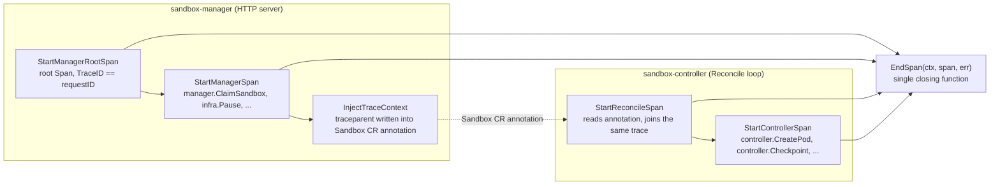

# Tracing Instrumentation API: Manager / Controller Start-Span Split

- **Date**: 2026-07-14
- **Status**: Implemented
- **Related**: `docs/specs/2026-07-02-sandbox-otel-tracing-design.md` (full tracing design),
  `docs/proposals/20260702-sandbox-otel-distributed-tracing.md`,
  `docs/proposals/20260709-request-id-as-traceid.md`

This document is self-contained: it explains how distributed tracing is wired
across sandbox-manager and sandbox-controller, the complete instrumentation
API (**4 Start functions + 1 End function** in `pkg/tracing/`), and why the
former single `StartSpan` was split into component-specific helpers. Reading
this one file is enough to add correct instrumentation to new code.

---

## 1. Background: How a Trace Flows Through the System



Key facts:

1. **The manager originates every trace.** One root Span per HTTP request is
   created in the web framework (`pkg/servers/web/framework.go`). A custom
   `IDGenerator` makes **TraceID == request ID**, so a trace in Jaeger can be
   found directly by the request ID printed in logs.
2. **The controller never originates a trace for manager-driven operations.**
   The manager injects the W3C `traceparent` into the Sandbox CR's annotation;
   each Reconcile extracts it and continues the same trace. Multiple Reconcile
   iterations become sibling Spans under the manager's Spans.
3. **Every operation ends the same way**: `EndSpan(ctx, span, err)` sets the
   Span status (`Ok` / `Error` with message) so failures show up red in Jaeger.

Because the two components play different roles (trace originator vs. trace
continuer), their instrumentation needs differ — which is exactly what the
API split encodes.

---

## 2. Why the Split (Motivation)

Before this change the API was asymmetric:

- Controller code used a generic `tracing.StartSpan(...)`.
- Manager code called the raw OTel API `tracing.Tracer("sandbox-manager").Start(...)`
  directly, with the tracer-scope string repeated at ~16 call sites.
- The HTTP root Span was hand-assembled in `framework.go` (tracer + SpanKind +
  request-ID plumbing spread over several lines).

This caused real bugs: `StartSpan` (which silently returns a **no-op** Span
when there is no parent) was mistakenly used on the manager side, where a
missing parent should instead start a new root trace. It also forced every
contributor to understand OTel internals (`Tracer`, `SpanKind`,
`WithAttributes`) just to add one Span.

After the split, callers only need to pick the right Start function for their
location in the codebase and always finish with `EndSpan`. Tracer-scope names
are private constants inside `pkg/tracing`; no call site touches the raw OTel
tracer API anymore.

---

## 3. API at a Glance

All functions live in `pkg/tracing/reconcile.go`.

| Function | Use it in | Parent-missing behavior | SpanKind | Extras |
|---|---|---|---|---|
| `StartManagerRootSpan(ctx, name, requestID)` | manager HTTP entry point (one call per request, already wired in `framework.go`) | always creates a **root** Span | `Server` | stores requestID in ctx so TraceID == requestID; records `request.id` attribute |
| `StartManagerSpan(ctx, name, attrs...)` | any sandbox-manager operation (`pkg/sandbox-manager/`, `pkg/servers/`, `pkg/proxy/`) | starts a **new root** trace (manager originates traces; background tasks still get traced) | `Internal` | — |
| `StartReconcileSpan(ctx, obj)` | controller Reconcile entry point (one call per Reconcile, after early-return checks) | starts a new root (kubectl-created CRs without annotation) | `Internal` | extracts trace context from CR annotations; installs the write flag; stores TraceID in ctx for log correlation |
| `StartControllerSpan(ctx, name, attrs...)` | any controller-side operation inside a Reconcile (`pkg/controller/`) | returns a **no-op** Span (never creates orphan roots; zero-cost when tracing is off) | `Internal` | names in `writeSpanNames` mark the Reconcile as "did real work" so it is not filtered |
| `EndSpan(ctx, span, err)` | closing **every** Span above | — | — | sets `codes.Ok` / `codes.Error`; tags no-op Reconciles for the filtering processor |

The asymmetry between the two "operation" helpers is intentional:

- **Manager = trace originator** → `StartManagerSpan` has *no* no-op guard.
  An operation without a parent (e.g. a background task) starts a fresh trace
  rather than being silently dropped.
- **Controller = trace continuer** → `StartControllerSpan` refuses to create
  root Spans. Without a valid parent (tracing disabled, or called outside a
  traced Reconcile) it returns a no-op Span, keeping instrumentation
  zero-cost and preventing orphan traces.

---

## 4. Copy-Paste Patterns

### 4.1 Manager operation (most common case)

```go
func (m *SandboxManager) ClaimSandbox(ctx context.Context, ...) (sandbox infra.Sandbox, err error) {
    ctx, span := tracing.StartManagerSpan(ctx, tracing.SpanManagerClaimSandbox)
    defer func() { tracing.EndSpan(ctx, span, err) }()
    // ... business logic using ctx ...
}
```

With attributes (pass them flat, no `trace.WithAttributes` wrapper):

```go
ctx, span := tracing.StartManagerSpan(ctx, tracing.SpanInfraKill,
    attribute.String(tracing.AttrSandboxName, s.Name),
)
defer func() { tracing.EndSpan(ctx, span, err) }()
```

> Note: use a **named return** `err` (or a local `err` variable assigned before
> return) so the deferred `EndSpan` sees the final error.

### 4.2 Controller operation inside a Reconcile

```go
ctx, span := tracing.StartControllerSpan(ctx, tracing.SpanControllerCreatePod,
    attribute.String(tracing.AttrPodName, pod.Name),
)
err := c.Create(ctx, pod)
tracing.EndSpan(ctx, span, err)
```

### 4.3 Controller Reconcile entry point (once per controller)

```go
// AFTER all early-return paths (not found, terminal state, ...):
ctx, span := tracing.StartReconcileSpan(ctx, sandbox)
defer func() { tracing.EndSpan(ctx, span, retErr) }()
```

### 4.4 Manager HTTP entry point (already wired, shown for completeness)

```go
// pkg/servers/web/framework.go — do not duplicate elsewhere.
ctx, rootSpan := tracing.StartManagerRootSpan(ctx, fmt.Sprintf("%s %s", method, path), requestID)
defer func() { tracing.EndSpan(ctx, rootSpan, apiErr) }()
```

---

## 5. Span Names and Attributes

All Span names and attribute keys are constants in `pkg/tracing/spans.go`.
**Never use string literals at call sites** — add a constant instead.

| Constant prefix | Component | Examples |
|---|---|---|
| `SpanManager*` | manager business layer | `manager.ClaimSandbox`, `manager.CreateSnapshot` |
| `SpanInfra*` | manager infra layer (CR operations) | `infra.Pause`, `infra.CreateCheckpoint` |
| `SpanProxy*` | manager proxy layer | `proxy.syncRoute` |
| `SpanController*` | controller | `controller.Reconcile`, `controller.CreatePod` |
| `Attr*` | attribute keys (both sides) | `sandbox.name`, `pod.name`, `checkpoint.duration` |

Naming convention: `{layer}.{OperationName}` for Spans, `{noun}.{field}`
(lowercase, dot-separated) for attributes.

Adding a new instrumented operation:

1. Add a `Span...` constant (and any new `Attr...` keys) to `spans.go`.
2. If it is a **controller write operation** (creates/updates/deletes K8s
   objects), also register it in `writeSpanNames` in `spans.go` — otherwise
   the enclosing Reconcile Span may be dropped as a no-op.
3. Instrument with the matching pattern from Section 4.

---

## 6. Behavior Guarantees (No Functional Change)

The split is a pure API refactor; exported traces are byte-for-byte
equivalent to the previous implementation:

| Concern | Guarantee |
|---|---|
| `StartControllerSpan` | exact rename of the former `StartSpan`; no-op guard, `MarkWrite` logic, tracer scope `sandbox`, `SpanKindInternal` all unchanged |
| `StartManagerSpan` | equivalent to the former raw `Tracer("sandbox-manager").Start(...)`; explicit `SpanKindInternal` equals the OTel default |
| `StartManagerRootSpan` | same three steps `framework.go` previously did inline (`WithRequestID` + `SpanKindServer` + `request.id` attribute), now in one call |
| TraceID == requestID | untouched — implemented by `RequestIDGenerator` in `provider.go`, independent of the Start helpers |
| Reconcile no-op filtering | untouched — write flag installed by `StartReconcileSpan`, checked by `EndSpan`, enforced by `FilteringSpanProcessor` |
| `EndSpan` | deliberately **not** split: closing logic is identical on both sides; two copies would be pure duplication |

---

## 7. Migration Mapping (Old → New)

Applied across ~30 call sites; use this table when rebasing old branches.

| Old code | New code |
|---|---|
| `tracing.StartSpan(ctx, name, attrs...)` (controller) | `tracing.StartControllerSpan(ctx, name, attrs...)` |
| `tracing.Tracer("sandbox-manager").Start(ctx, name)` | `tracing.StartManagerSpan(ctx, name)` |
| `tracing.Tracer("sandbox-manager").Start(ctx, name, trace.WithAttributes(a, b))` | `tracing.StartManagerSpan(ctx, name, a, b)` |
| `tracing.StartSpan(...)` **on the manager side** (bug: silently no-op without parent) | `tracing.StartManagerSpan(...)` |
| `framework.go`: `WithRequestID` + raw `Tracer(...).Start(..., SpanKindServer, request.id attr)` | `tracing.StartManagerRootSpan(ctx, name, requestID)` |

After migration, `go.opentelemetry.io/otel/trace` imports usually disappear
from call-site files; only `attribute` remains where attributes are passed.

---

## 8. FAQ

**Q: Which Start function do I use?**
Decide by directory: under `pkg/controller/` → `StartControllerSpan`;
under `pkg/sandbox-manager/`, `pkg/servers/`, `pkg/proxy/` →
`StartManagerSpan`. The two entry-point functions
(`StartManagerRootSpan`, `StartReconcileSpan`) are already wired and rarely
need new call sites.

**Q: My controller Span never shows up in Jaeger.**
Two common causes: (1) no valid parent — `StartControllerSpan` returned a
no-op Span because the Sandbox CR has no trace annotation or tracing is
disabled; (2) the Reconcile was filtered as no-op — register your Span name
in `writeSpanNames` if it represents a real write.

**Q: Can I call `span.End()` directly?**
No. Always use `EndSpan(ctx, span, err)`; otherwise the Span exports with an
unset status and error filtering/marking breaks.

**Q: What happens when tracing is disabled (`tracing-mode=none`)?**
All Start helpers become zero-cost: the global no-op TracerProvider returns
no-op Spans, and `StartControllerSpan` short-circuits even earlier.
