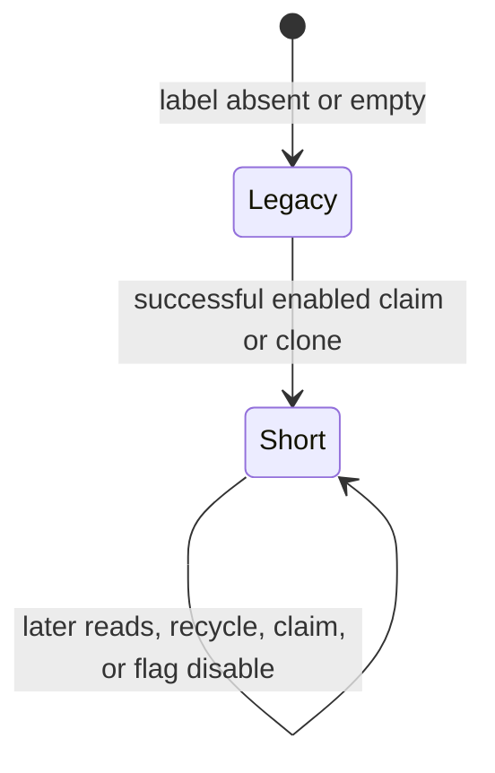
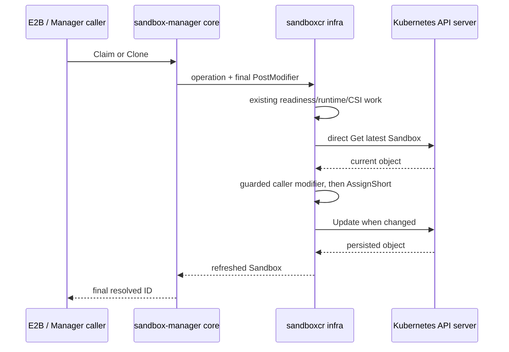
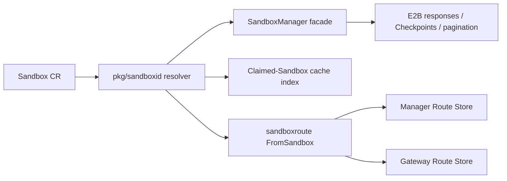

# Short and Stable Sandbox IDs

## Table of Contents

- [Why](#why)
  - [Summary](#summary)
  - [Motivation](#motivation)
    - [Current Problem](#current-problem)
    - [Goals](#goals)
    - [Non-Goals](#non-goals)
- [What Changes](#what-changes)
  - [User Stories](#user-stories)
  - [User-Visible ID Behavior](#user-visible-id-behavior)
  - [Short-ID Encoding](#short-id-encoding)
  - [Persisted State and Label Protection](#persisted-state-and-label-protection)
  - [Assignment Flow](#assignment-flow)
  - [Architecture and Ownership](#architecture-and-ownership)
  - [Cache Lookup](#cache-lookup)
  - [Shared Routing Model](#shared-routing-model)
    - [Store Model](#store-model)
    - [Active ID Index](#active-id-index)
    - [Delete Semantics](#delete-semantics)
    - [Asynchronous Targeted Repair](#asynchronous-targeted-repair)
  - [E2B Diagnostics](#e2b-diagnostics)
  - [Checkpoint and Pagination Semantics](#checkpoint-and-pagination-semantics)
  - [Configuration](#configuration)
- [Capabilities](#capabilities)
- [Impact](#impact)
- [Compatibility and Upgrade Strategy](#compatibility-and-upgrade-strategy)
  - [Initial Rollout](#initial-rollout)
  - [Activation](#activation)
  - [Rollback Boundary](#rollback-boundary)
- [Risks and Mitigations](#risks-and-mitigations)
- [Observability](#observability)
- [Test Plan](#test-plan)
- [Alternatives](#alternatives)
- [Implementation History](#implementation-history)

## Why

### Summary

OpenKruise Agents currently identifies a Sandbox with a readable value derived from its Kubernetes
location:

```text
<namespace>--<sandbox-name>
```

E2B-compatible traffic addresses embed that value in a DNS name, typically as
`<port>-<sandbox-id>.<domain>`. A long namespace combined with a long Sandbox name can therefore
exceed DNS label or domain-length limits, making an otherwise healthy Sandbox unreachable.

This proposal introduces an optional 26-character Sandbox ID derived from the complete 128-bit
Kubernetes Sandbox UID. The selected short ID is persisted in the Sandbox label
`agents.kruise.io/sandbox-id`. A Sandbox without a non-empty label continues using its legacy
`<namespace>--<name>` ID, so existing resources remain compatible without a background migration.

The migration is deliberately one-way and per-Sandbox. The feature flag controls only whether a
new short ID is assigned; all components always honor an existing label. Manager and gateway share
one routing implementation that atomically replaces legacy routes with short routes, supports old
peer payloads during binary rollout, and resolves active IDs through ObjectKey-backed records.

### Motivation

#### Current Problem

The legacy ID has useful operational properties: it is readable, deterministic, and reversible.
Its length, however, grows with two independently variable Kubernetes names. The first label in an
E2B dynamic hostname can easily exceed the DNS limit even though the namespace and Sandbox names
are individually valid Kubernetes names.

The current format is also embedded in multiple internal paths:

- claimed-Sandbox cache indexing and lookup;
- manager proxy and sandbox-gateway route keys;
- peer route synchronization;
- Checkpoint source association;
- E2B responses, logs, and pagination keys.

Changing only the value returned by the create endpoint would leave these consumers inconsistent.
The ID therefore needs a persisted source of truth, a controlled migration, and shared route
replacement semantics.

A short opaque ID also removes the namespace and name that operators currently see in user errors.
The proposal restores that context explicitly in E2B success metadata and authorized error
messages rather than encoding it back into the ID.

#### Goals

- Provide a stable DNS-safe short ID for Sandboxes claimed or cloned after the feature is enabled.
- Preserve legacy behavior for every Sandbox that has no non-empty short-ID label.
- Ensure one Sandbox has at most one active ID in cache and each physical route store.
- Allow an unlabeled recycled Sandbox to transition from legacy to short on a later claim.
- Keep short-ID format and assignment policy in sandbox-manager core, not infra or E2B.
- Allow manager and gateway binaries to roll out in either order while assignment is disabled.
- Make a short ID directly searchable with `kubectl`.
- Restore namespace/name diagnostics without disclosing another tenant's Sandbox location.
- Treat system-generated Sandbox IDs as globally unique within the supported protocol.

#### Non-Goals

- Serving permanent legacy and short aliases for the same Sandbox.
- Migrating every existing Sandbox in a background controller.
- Rewriting IDs stored on existing Checkpoints.
- Making a short ID reversible to namespace/name.
- Removing the existing `--` namespace restriction while legacy IDs remain supported.
- Validating or repairing a non-empty persisted label while reading it.
- Supporting direct writes to the reserved label by cluster administrators or other non-core
  writers. Such writes and any resulting duplicate IDs are outside the supported protocol and have
  undefined behavior.

## What Changes

### User Stories

| Role | Scenario | Expected Behavior |
|---|---|---|
| Sandbox user | Create a Sandbox in a long namespace with a long generated name | The returned short ID fits safely in the E2B dynamic hostname |
| Existing user | Continue using a Sandbox created before activation | The unlabeled Sandbox keeps its legacy ID |
| Platform operator | Locate a Sandbox from an opaque ID in a user report | `kubectl get sbx -A -l agents.kruise.io/sandbox-id=<id>` returns the resource |
| Platform operator | Roll out manager and gateway without a coordinated restart | Both versions interoperate while short assignment remains disabled |
| E2B user | Receive a runtime or lifecycle failure for a short-ID Sandbox | The authorized error includes the Sandbox namespace/name |

### User-Visible ID Behavior

Resolution has exactly two branches:

| Sandbox metadata | Resolved ID |
|---|---|
| `agents.kruise.io/sandbox-id` is non-empty | Return the label unchanged |
| Label is absent or empty | Return `<namespace>--<name>` |

The label is a persisted fact. Readers do not validate its length, alphabet, relationship to UID,
or origin. This rule avoids a split-brain situation in which different binaries disagree about an
already-persisted identity.

The feature flag controls assignment, not resolution:

| Flag | Unlabeled Sandbox | Labeled Sandbox |
|---|---|---|
| Disabled | Remains legacy | Existing label is honored |
| Enabled | Receives a short ID after a successful claim/clone | Existing label is preserved |

The state transition is one-way:



An unlabeled Sandbox may be claimed with a legacy ID, returned to a pool, and receive a short ID on
a later enabled claim. A labeled Sandbox never transitions back to legacy through normal system
behavior.

### Short-ID Encoding

For a Sandbox UID `U`, assignment performs the following steps:

1. Parse `U` as its 16 UUID bytes.
2. Encode all 16 bytes using RFC 4648 Base32.
3. Remove padding.
4. Convert alphabetic characters to lowercase.

The result is 26 characters from `[a-z2-7]`, for example:

```text
n6lyz2y2m5g3fbbq4rq6r5kpte
```

The ID retains all 128 UID bits and is not truncated. With a five-digit port, the dynamic-host
label is at most 32 characters:

```text
<5 digits>-<26-character ID>
```

Generation fails if an unlabeled Sandbox UID cannot be decoded into 16 bytes. This validation is
performed only while creating a new label; readers still trust any existing non-empty value.

### Persisted State and Label Protection

The selected short ID is stored as a Kubernetes label:

```yaml
apiVersion: agents.kruise.io/v1alpha1
kind: Sandbox
metadata:
  labels:
    agents.kruise.io/sandbox-id: n6lyz2y2m5g3fbbq4rq6r5kpte
```

The same qualified string already exists as a Checkpoint annotation containing the source Sandbox
ID. Reuse is intentional: label and annotation maps are separate, and code uses distinct constants
for the two metadata kinds. Sandbox ID resolution reads only the Sandbox label; Checkpoint source
association reads only the Checkpoint annotation.

The label is core-owned metadata. The following boundaries prevent user-controlled assignment:

- E2B rejects the exact `label:agents.kruise.io/sandbox-id` extension key before constructing claim
  or clone options.
- SandboxClaim reconciliation rejects the key before invoking infra.
- SandboxSet and SandboxTemplate materialization continue stripping non-preserved
  `agents.kruise.io/` labels.
- Sandbox-manager guards caller-supplied pre-claim and final metadata modifiers. Adding, changing,
  or deleting the reserved key fails before the modified object is persisted, even when short-ID
  assignment is disabled.
- Claim metadata tracking excludes the key, and recycle independently refuses to delete it even if
  an old or manually crafted cleanup annotation lists it.

The API package exposes only the shared key constant required by validation and recycle code.
Resolution, generation, assignment, and migration policy remain in sandbox-manager.

### Assignment Flow

Short assignment runs at the final successful stage of claim or clone, after readiness, runtime
initialization, and CSI work:



The first read and every update-conflict retry use the direct API reader rather than the informer
cache. The final modifier is deterministic, idempotent, and limited to `metav1.Object` metadata so
it cannot perform external lifecycle side effects during a retry.

The existing broader pre-lock `Modifier` changes to return an error so the reserved-label guard can
stop before the claim/create write. Guard failures are terminal for that operation and are not
retried against another Sandbox.

Clone follows the same finalization flow and derives the ID from the clone's own UID. It never
inherits a sandbox-ID label from its source or template.

When no final modifier is configured, infra performs no extra read or update. With assignment
enabled, the path adds one direct Get; the first assignment adds one Update. A Sandbox that already
has a label skips the Update unless another final metadata modifier changed the object.

Failure in this final stage fails the claim/clone and uses the existing cleanup path. This is an
accepted trade-off: the Sandbox may already be ready, but the create response is not emitted until
its client-visible identity is persisted.

### Architecture and Ownership

The design separates identity policy from neutral consumers:



| Package or layer | Responsibility |
|---|---|
| `pkg/sandboxid` | Persisted-label resolution, legacy fallback decision, Base32 encoding, assignment |
| `pkg/utils` | Existing reversible `<namespace>--<name>` legacy wire codec |
| sandbox-manager core | Feature flag, modifier protection, Checkpoint orchestration, manager route projection |
| `pkg/cache` | Neutral indexed lookup with an injected resolver |
| `pkg/sandboxroute` | Neutral Route type and stateless projection, ObjectKey-backed Store, active ID index, version fencing, targeted Repairer |
| infra | Generic mutation/persistence plus neutral Sandbox event and direct-observation capabilities |
| E2B server | Request validation and response/error presentation |

The backend-neutral `infra.Sandbox` interface no longer exposes `GetSandboxID()` or `GetRoute()`.
Manager wraps `infra.Sandbox` in a manager-owned projection source that resolves the ID and runtime
token without moving either policy into Infra, then passes that source to shared stateless projection.
Infra adds only the format-neutral `GetPodIP()` capability and may retain an opaque Route reader
for its existing cache-staleness check.

Manager route policy, projection, and targeted Repairer ownership move out of `sandboxcr.Infra` into
the sandbox-manager composition root. Manager consumes a required neutral `RouteSandboxSource`,
keyed by `types.NamespacedName` with nil `infra.Sandbox` representing authoritative absence;
the concrete `sandboxcr` source alone owns cache-controller registration, CRD conversion, direct
`APIReader` Gets, and Kubernetes NotFound classification. Gateway keeps its controller adapter.
Both use the same neutral routing implementation, while component-specific state policy remains in
the adapters.

The gateway reconciler passes a lightweight Sandbox CR adapter that owns label-aware Sandbox-ID
resolution and token compatibility to shared `sandboxroute.FromSandbox`, while its local registry wraps the shared Store. For
a present, included, non-deleting Sandbox, the adapter snapshots state once and the shared function
constructs the full Route before it is offered to the Store without deriving a registry key from
the reconcile request. For NotFound or `DeletionTimestamp`, it snapshots the current Route by
ObjectKey and deletes that snapshot. A concurrent replacement or newer update causes requeue and
re-observation rather than unconditional removal. When an equal-RV event meets a deletion fence,
the gateway adapter enqueues the affected ObjectKey for asynchronous direct-reader repair and
completes the current reconcile without waiting for an API call.

### Cache Lookup

The claimed-Sandbox index produces exactly one key per Sandbox using an injected resolver. The
sandbox-manager cache always injects label-aware resolution, regardless of the assignment flag.
Other cache callers keep the legacy resolver by default; a broader cache ownership refactor is out
of scope.

When a label update is observed, the informer index moves the Sandbox from its legacy key to the
short key without retaining an alias. Client IDs remain opaque: cache or API fallbacks never split
an ID on `--` to recover namespace/name.

Lookup requests at most one indexed result. The supported protocol guarantees uniqueness because
short IDs encode the complete cluster-unique UID, legacy IDs encode the ObjectKey in a disjoint
format, and only core assignment may write the reserved label. Direct administrative label writes,
copied labels, forged peer Routes, and cross-cluster delivery have undefined behavior.

### Shared Routing Model

Manager proxy and sandbox-gateway remain separate processes and therefore keep separate in-memory
stores. They share the same `pkg/sandboxroute` Route, `FromSandbox`, Store, and targeted Repairer
implementation.

Each full Route carries:

- opaque Sandbox ID;
- namespace and name;
- UID and resourceVersion;
- existing IP, owner, state, and access-token fields.

Namespace and name are additive JSON fields with `omitempty`. Old receivers ignore them. Every
Route admission uses `sandboxroute.AdmitRoute`: when both fields are absent and ID reversibly
encodes the legacy `<namespace>--<name>` form, admission splits at the first separator, fills the
ObjectKey, and applies ordinary full-Route validation. An opaque/short ID-only Route, a partial
ObjectKey, or a Route missing ID, UID, or resourceVersion is rejected without Store mutation; a
peer request receives `400 Bad Request`. This intentionally means that a reversible ID-only Route
produced by a local projection bug is normalized instead of rejected. Client-facing lookup
continues treating IDs as opaque and never invokes Route admission.

The shared `Route.String()` continues redacting `AccessToken` as `***` in logs.

Every accepted Route producer, including peer refresh, is trusted to project ObjectMeta from the
same Kubernetes cluster. UID is therefore trusted as cluster-lifetime unique. The Store retains UID
fencing between different incarnations at one ObjectKey but does not maintain cross-ObjectKey
duplicate-UID state; cross-cluster, misrouted, forged, or corrupted UID/ObjectKey pairs are outside the
supported protocol.
Kubernetes may reuse namespace/name after deletion; a recreated Sandbox has a new UID, so
same-ObjectKey incarnation fencing remains required.

#### Store Model

The Store maintains one full record per ObjectKey, deletion fences, and an active
SandboxID-to-ObjectKey index under one lock. Complete Routes exist only in the ObjectKey table.
`Get` and `List` resolve ID to ObjectKey and then read the authoritative record under the same read
lock. Record install, ID transition, deletion, and repair update the index incrementally
under the write lock, without materializing a second Route copy or rescanning all records. Every
Route-bearing Store mutation invokes `AdmitRoute` and therefore carries namespace/name, ID, UID, and
RV. Legacy ID-only Routes use the same ordering, deletion, and repair paths as current Routes after
admission normalization; the Store has no compatibility-only record shape or peer-specific path.
ObjectKey-based local deletion adapters snapshot the current Route through `GetByObjectKey`; that
full value contains the access token and must not be serialized directly into logs.

The normal event path applies explicit resource-version rules:

Routes require a well-formed positive-integer RV. Route admission rejects malformed values, and a
malformed peer payload receives `400 Bad Request`. Valid RVs are compared with Kubernetes'
resource-version comparator.

| Current record and event | Decision |
|---|---|
| Same UID and same ID | Accept equal or newer comparable RV |
| Same UID but different ID | Require a strictly newer numeric RV |
| Different UID at the same ObjectKey | Require a strictly newer numeric RV |
| Different UID with equal RV | Ignore as an identity mismatch; supported producers cannot emit this combination |

An accepted legacy-to-short transition removes the old ID and installs the new ID in one Store
transaction. A single Store lookup or snapshot therefore sees old or new, never both. Independent
reads made on opposite sides of the transaction may naturally see old and then new.

Accepted deletes retain an ObjectKey/RV fence: equal or older events cannot resurrect the route,
while a strictly newer lifecycle event can re-establish the same recycled UID or a replacement UID.
Deletion fences are not routes and never appear in ID lookup. After the bounded confirmation delay,
the Store queues one targeted observation and prunes the fence only after a generation-matched
authoritative absence; a present observation repairs the full Route instead.

#### Active ID Index

The active index contains the current ObjectKey for each supported ID. A legacy-to-short update
atomically removes the legacy index entry, updates the ObjectKey record, and installs the short
entry. An impossible equal-RV/different-UID event is ignored and cannot deactivate the current
route.

Peer endpoint behavior is:

| Event | HTTP result |
|---|---|
| Malformed or partial Route | `400 Bad Request` |
| Well-formed stale or identity-mismatched event | `204 No Content` no-op |

#### Delete Semantics

The Store exposes one `Delete(Route)`. After admission, ObjectKey and UID must match the current
record and the delete RV must be equal or newer. ID is deliberately not part of deletion matching
because it is a mutable alias; index cleanup uses the current stored ID. This prevents a delayed
delete for UID A from deleting recreated UID B while allowing a same-object legacy snapshot to
remove the current short-ID record.

Local NotFound/deletion/exclusion paths snapshot the current Route by ObjectKey and call the same
Delete operation. Stale or replacement-UID snapshot results cause gateway requeue or manager
reconcile retry. The manager's fire-and-forget post-delete synchronization attempts at most three
immediate snapshots while its context remains active, then logs and relies on informer convergence
without failing the completed lifecycle operation. This is an intentional authority change from
unconditional current-record deletion to re-observation.

Peer stale and identity-mismatched deletes remain successful `204 No Content` no-ops and are not
retried. A record and its deletion fence never coexist; record install removes the fence, and an
accepted delete installs the fence and removes the record and current ID in one Store transaction.

#### Asynchronous Targeted Repair

Normal event adapters never block on direct API reads. When an event has the same RV as an existing
deletion fence, the Store keeps the route absent and returns the ObjectKey that requires
authoritative verification. The adapter enqueues that key into a deduplicated, rate-limited repair
queue and immediately completes normal event processing. Deletion fences are also queued for
delayed confirmation when no equal-RV event arrives.

The shared Repairer reads only queued ObjectKeys outside the Store lock. Gateway uses its direct API
reader; Manager obtains a backend-neutral observation from Infra, whose `sandboxcr` implementation
performs the direct Get. A present, included, non-deleting Sandbox is projected into a full Route;
NotFound, deleting, or excluded objects produce an authoritative ObjectKey deletion. The Store
applies the observation only when the affected record or fence has not advanced beyond the mutation
generation captured for the repair. Stale results are ignored, while transient read errors are
retried with rate-limited backoff.

There is no periodic direct API-server List. Normal route population and missed-event recovery rely
on informer initial synchronization, List/Watch reconnects, and existing reconcile retries. The
targeted queue bounds direct API traffic by the number of pending deletion-fence confirmations
rather than the total number of Sandboxes, and its fixed concurrency and QPS limits prevent an
event burst from blocking event delivery or overloading the API server.

### E2B Diagnostics

Opaque IDs remove the namespace/name information previously visible to users. Successful E2B
responses that expose Sandbox metadata add one protected response-only entry:

```text
e2b.agents.kruise.io/sandbox-resource: <namespace>/<name>
```

After a Sandbox is found and ownership authorization succeeds, downstream error messages append:

```text
sandboxResource=<namespace>/<name>
```

Not-found and unauthorized/owner-mismatch responses do not include the resource location. Ordinary
metadata is filtered first; the protected response key is generated last from the authorized
Sandbox. E2B rejects user attempts to persist either the sandbox-ID label or the response-only
resource key through `label:` extensions.

### Checkpoint and Pagination Semantics

Checkpoint persists the final Sandbox ID visible when the Checkpoint is created. E2B calls
sandbox-manager core, which resolves and supplies the ID explicitly to infra. Infra validates only
that the value is non-empty and does not know whether it is legacy or short.

If a recycled Sandbox later transitions from legacy to short, existing Checkpoints keep their
legacy source ID and later Checkpoints use the short ID. No historical Checkpoint migration is
performed.

Sandbox pagination continues using the resolved ID as its existing uniqueness/tie-break component.
The value is opaque and may change between list calls if the Sandbox transitions, like other mutable
list state.

### Configuration

Sandbox-manager adds:

```text
--enable-short-sandbox-id=false
```

The default preserves current behavior. Enabling the flag assigns labels only during successful
claim/clone finalization. Disabling it later stops new assignments but does not change or remove any
existing label.

## Capabilities

### New Capabilities

- `short-sandbox-id`: This proposal introduces an optional 26-character Sandbox ID derived from the complete 128-bit Kubernetes Sandbox UID.

### Modified Capabilities

None.

## Impact

The current format is also embedded in multiple internal paths:

- claimed-Sandbox cache indexing and lookup;
- manager proxy and sandbox-gateway route keys;
- peer route synchronization;
- Checkpoint source association;
- E2B responses, logs, and pagination keys.

## Compatibility and Upgrade Strategy

### Initial Rollout

Strict adherence to this rollout protocol is a trusted correctness precondition. Before enabling
short assignment, all old manager/gateway replicas and their in-flight or retry peer traffic must
be terminated. After any short ID is assigned, old binaries must never run or receive traffic
again, including through rollback. Admission-normalized legacy updates use the ordinary Store
upsert path; violating this precondition is unsupported and may temporarily replace a short route
until a strictly newer authoritative event arrives.

The first rollout also assumes no Sandbox already carries a short-ID label.

1. Deploy new sandbox-manager and sandbox-gateway binaries with short assignment disabled.
2. Manager and gateway may roll out in either order.
3. New senders include namespace/name; old receivers ignore the additive fields.
4. New receivers normalize reversible legacy ID-only messages to full Routes through `AdmitRoute`.
5. Wait for all old replicas and their retry traffic to terminate before enabling assignment.
6. Confirm informer caches are synchronized and targeted repair queues are drained.

### Activation

Before enabling assignment, operators must verify:

- all live manager and gateway replicas understand label resolution;
- targeted repair queues are drained and cache lookup health is normal.

Short assignment can then be enabled on sandbox-manager. Mixed enabled/disabled manager replicas are
safe: each Sandbox persists whichever identity was selected by its successful operation, and every
new binary honors that persisted state.

### Rollback Boundary

Before any label is assigned, manager and gateway binaries can be rolled back independently.

After the first short label is assigned, rolling back to a binary that ignores the label is unsafe:
the old binary would reconstruct a legacy ID and disagree with persisted state. Turning the new
flag off is safe for stopping further assignments, but it is not a data rollback:

- existing labeled Sandboxes stay short;
- unlabeled Sandboxes stay legacy;
- labels are not removed automatically.

Legacy ID resolution for unlabeled Sandboxes remains supported. Legacy Route admission
normalization may be removed separately after operators confirm no supported old sender remains.

## Risks and Mitigations

| Risk | Mitigation |
|---|---|
| Final assignment adds API traffic and a new failure point | Disabled by default; one direct Get per enabled operation, one Update only on first assignment; retain operation-stage timing and error logs |
| Client receives short ID before every informer sees the label | Return only after persistence; keep existing eventual-consistency retries; do not create a second alias |
| Late peer events delete or revive a newer route | Full Route UID/RV fencing, deletion fences, and targeted authoritative repair |
| Deletion-fence confirmations accumulate faster than they can be verified | Deduplicate by ObjectKey, bound repair concurrency/QPS, retry with backoff, and expose queue health |
| An event is missed without producing a deletion fence | Rely on informer initial synchronization, List/Watch reconnects, and existing reconcile retries; do not add an unbounded full-list repair path |
| Cluster administrator writes or copies the reserved label | Outside the supported protocol and explicitly undefined; only core assignment may write the label |
| Opaque ID makes incidents harder to diagnose | Add protected E2B namespace/name metadata and authorized error context |
| Sandbox CR is reused by another claim over time | Treat ID as CR identity only; never infer tenant/session ownership from ID |
| Route type moves to a shared package | Preserve the custom `String()` implementation so access tokens remain redacted |

## Observability

Short-ID identity events do not add dedicated Prometheus series for legacy resolution or assignment
success/failure. Shared Store mutations, peer compatibility, and repair queue state do not emit
dedicated short-ID route Prometheus series. Assignment error reasons, route and repair
outcomes/retries, reserved-label validation failures, and PostModifier details remain in structured
logs or existing claim/clone operation-stage timings. The Store simplification removes its dedicated
Store/peer/repair metrics.

Structured logs include namespace/name for internal assignment and route-repair
diagnostics. Successful assignment is debug-level to avoid per-Sandbox info-log volume. E2B-visible
errors include resource context only after authorization.

## Test Plan

Tests follow the repository's existing-table-first policy. Existing table-driven tests are extended
with small case fields where practical; new focused tables are added only for new packages or
concurrency harnesses.

| Area | Required Coverage |
|---|---|
| Encoding and resolution | Legacy fallback, existing-label trust, deterministic 26-character encoding, invalid UID, idempotent assignment |
| Mutation boundaries | E2B/SandboxClaim rejection, modifier add/change/delete protection, feature-disabled protection |
| Recycle | User metadata tracking excludes the key; crafted cleanup metadata cannot delete it |
| Cache | Resolver injection, legacy-to-short index move, unique opaque lookup |
| Route Store | Atomic ID switch, ID-to-ObjectKey-to-record lookup, same/different UID RV fencing, and deletion fences |
| Deletes and compatibility | Old UID/RV deletes, ID-change-tolerant matching, legacy Route admission, local snapshot retries, peer no-op semantics, old/new Route JSON compatibility, HTTP result mapping |
| Targeted repair | Non-blocking enqueue, ObjectKey deduplication, direct Get outcomes, backoff, and per-record generation guards |
| Layer boundaries | No ID/Route policy in infra; Manager route code consumes only the required neutral source and never CRDs, concrete Cache, or Kubernetes readers |
| E2B and Checkpoint | Protected metadata, authorized error context, no disclosure, historical Checkpoint IDs, opaque pagination |

Error tables use `expectError string`, with non-empty values asserted as substrings. Focused Go tests
run only for changed packages under `pkg/`; E2E tests under `test/` are not part of this unit-test
verification. Final verification builds sandbox-manager and sandbox-gateway binaries.

## Alternatives

| Alternative | Reason Not Selected |
|---|---|
| Use textual Kubernetes UID | Stable but 36 characters; Base32 represents the same 128 bits in 26 DNS-safe characters |
| Truncate UID or hash | Introduces an avoidable collision budget and collision-allocation policy |
| Generate a random persisted ID | Requires randomness and collision handling when UID already provides stable identity |
| Global format switch without persisted state | The same Sandbox could change identity during configuration or rolling upgrade |
| Permanent legacy and short aliases | Violates one-ID semantics and complicates cleanup, authorization reasoning, and eventual legacy removal |
| Validate labels on every read | Different readers could disagree about already-persisted state; recovery behavior becomes ambiguous |
| Use a different label key | The chosen label and existing Checkpoint annotation both represent Sandbox ID and are safely separated by metadata kind |
| Keep separate manager/gateway route implementations | Duplicates the hardest version-skew, fencing, deletion, and repair logic |
| Periodically List all Sandboxes through the direct reader | Cost scales with all Sandboxes and every manager/gateway replica even when no deletion fence needs confirmation |
| Use an informer-backed scan as authoritative | Cached absence may be stale; normal informer state remains the event source but cannot authorize deletion-fence confirmation |
| Keep `infra.Sandbox.GetRoute()` with injected policy | Leaves route and ID ownership hidden behind infra rather than making manager composition explicit |

## Implementation History

- [x] 2026-07-10: Initial design discussion and written specification.
- [x] 2026-07-11: Review hardening for reserved labels, route version skew, authoritative sweep, and layer ownership.
- [x] 2026-07-14: Replace full-list sweep with asynchronous targeted repair for large clusters.
- [ ] 2026-07-11: Proposal technical review.
